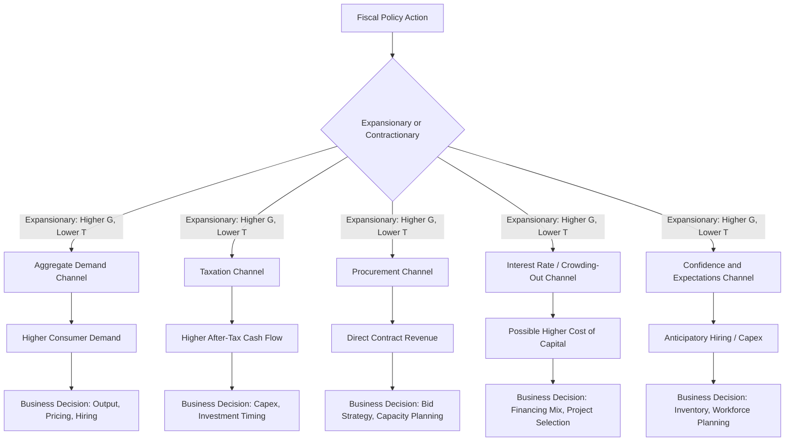

## Fiscal Policy Effects on Business Decisions

### Overview

Fiscal policy refers to the use of government spending and taxation to influence aggregate demand, output, and employment in the economy. For managers, fiscal policy is a critical component of the macroeconomic environment because it directly and indirectly reshapes the incentive structures, cost bases, and demand conditions under which firms operate. Unlike monetary policy, which operates through interest rates and money supply via the central bank, fiscal policy is enacted by the legislative and executive branches of government and operates through the budget: taxation, transfer payments, and direct expenditure.

Managerial economics treats fiscal policy not as an abstract macro variable but as an exogenous shock or shift parameter that alters demand curves, cost curves, and the risk-adjusted return on investment projects. A firm that understands the transmission channels of fiscal policy can better time capital expenditure, adjust pricing strategy, manage working capital, and lobby effectively for favorable regulatory treatment.

### Core Instruments of Fiscal Policy

**Key Points**

- **Government spending (G)**: Direct purchases of goods/services, infrastructure investment, defense procurement, and transfer payments (unemployment benefits, subsidies, social security).
- **Taxation (T)**: Corporate income tax, personal income tax, payroll tax, value-added tax (VAT)/sales tax, tariffs, and excise duties.
- **Budget balance**: The difference $G - T$ determines whether fiscal policy is expansionary (deficit, $G > T$) or contractionary (surplus, $G < T$).
- **Automatic stabilizers**: Progressive tax systems and unemployment insurance that adjust automatically with the business cycle without new legislation.
- **Discretionary fiscal policy**: Deliberate, legislated changes to spending or tax rates in response to economic conditions (e.g., stimulus packages, tax cuts).

### Expansionary vs. Contractionary Fiscal Policy

| Dimension | Expansionary Fiscal Policy | Contractionary Fiscal Policy |
| --- | --- | --- |
| Typical trigger | Recession, high unemployment, output gap | Overheating, high inflation, unsustainable debt |
| Government spending | Increases | Decreases |
| Taxation | Decreases | Increases |
| Effect on aggregate demand | Increases | Decreases |
| Effect on budget deficit | Widens | Narrows (or surplus grows) |
| Typical business impact | Higher consumer demand, easier credit access, increased public contracts | Reduced disposable income, tighter budgets, fewer public contracts |
| Interest rate pressure (via crowding out) | Upward pressure, [Inference] contingent on how the deficit is financed and central bank stance | Downward pressure |

### Transmission Channels to Business Decisions

Fiscal policy does not affect firms uniformly or instantaneously. It operates through several distinct channels, each with different timing and magnitude.

#### 1. Aggregate Demand Channel

Government spending is a direct component of GDP:

$$Y = C + I + G + (X - M)$$

An increase in $G$ mechanically raises $Y$, and through the multiplier effect, induces further rounds of consumption spending ($C$). The fiscal multiplier is:

$$k = \frac{1}{1 - MPC(1-t)}$$

where $MPC$ is the marginal propensity to consume and $t$ is the marginal tax rate. A higher $MPC$ and lower $t$ produce a larger multiplier, meaning government spending injections have a greater knock-on effect on business revenues, particularly for firms selling consumer discretionary goods.

**Business implication**: Firms in cyclical sectors (retail, construction, durable goods, hospitality) experience amplified revenue swings relative to the initial fiscal impulse.

#### 2. Taxation Channel

Changes in corporate and personal tax rates affect firms through two distinct paths:

- **Corporate tax rate changes** directly alter after-tax profitability and the hurdle rate for investment decisions. A cut in the corporate tax rate raises the after-tax net present value (NPV) of projects:

$$NPV = \sum_{t=0}^{n} \frac{CF_t (1 - \tau)}{(1+r)^t} - I_0$$

where $\tau$ is the corporate tax rate. A lower $\tau$ increases after-tax cash flow $CF_t(1-\tau)$, raising NPV and making previously marginal projects viable.

- **Personal income tax changes** affect disposable income and thus consumer spending, indirectly shifting demand curves faced by firms.

**Business implication**: Corporate tax cuts tend to accelerate capital expenditure cycles; tax increases tend to defer or cancel marginal investment projects.

#### 3. Government Procurement Channel

Direct government purchases (infrastructure, defense, healthcare, education) create demand for specific industries. Firms that are government contractors or subcontractors see revenue directly tied to budget allocations, appropriations cycles, and procurement policy.

**Business implication**: Firms dependent on government contracts must monitor budget cycles, continuing resolutions, and political risk around appropriations as a core part of revenue forecasting.

#### 4. Interest Rate and Crowding-Out Channel

When government deficits are financed by issuing debt, increased borrowing can raise the demand for loanable funds, pushing up interest rates (absent full monetary accommodation). This is the **crowding-out effect**: higher government borrowing costs can crowd out private investment by raising the cost of capital for firms competing for the same pool of savings.

$$\text{Crowding-out} \Rightarrow \Delta I_{private} < 0 \text{ as } \Delta G > 0, \text{ via } \Delta r > 0$$

**Business implication**: [Inference] The magnitude of crowding out is contested in economic literature and depends on the output gap, monetary policy stance, and whether the economy is at or below full employment; during a liquidity trap or significant slack, crowding out tends to be minimal, while near full capacity it can be more pronounced.

#### 5. Business Confidence and Expectations Channel

Fiscal policy signals government intent regarding future economic conditions. Large deficits may raise concerns about future tax increases ("Ricardian equivalence" effects) or sovereign credit risk, while credible stimulus can boost business and consumer confidence, accelerating spending ahead of the actual disbursement of funds.

**Business implication**: Anticipatory effects mean firms may adjust behavior (inventory building, hiring, capex) before fiscal measures are formally implemented, based on legislative signals alone.

#### 6. Exchange Rate Channel (Open Economy)

Expansionary fiscal policy, particularly when it raises domestic interest rates, can attract foreign capital inflows, appreciating the domestic currency. This makes exports less competitive and imports cheaper.

**Business implication**: Export-oriented firms may face margin compression from currency appreciation linked to fiscal expansion, while import-dependent firms benefit from cheaper input costs.

### Transmission Mechanism Diagram

### Impact on Specific Business Decisions

#### Capital Investment Decisions

Fiscal policy alters the NPV calculus for capital projects through tax depreciation schedules, investment tax credits, and after-tax discount rates.

- **Accelerated depreciation / bonus depreciation**: Allows firms to write off capital expenditures faster, improving near-term cash flow and effectively lowering the after-tax cost of investment.
- **Investment tax credits (ITC)**: Directly reduce the tax liability associated with qualifying investment, functioning as a direct subsidy to capex.

**Example**: A manufacturing firm evaluating a $10 million equipment purchase with a 10-year useful life will see a materially different NPV under a regime allowing full first-year expensing (bonus depreciation) versus straight-line depreciation over 10 years, because the present value of the tax shield is front-loaded in the former case.

#### Pricing and Output Decisions

Expansionary fiscal policy that raises aggregate demand shifts the firm's demand curve outward, allowing for either higher output at existing prices or higher prices at existing output, depending on the elasticity of demand and the firm's market structure (monopolistic competition, oligopoly, perfect competition).

Contractionary fiscal policy (e.g., austerity, tax hikes) compresses disposable income, shifting demand curves inward and compelling firms to either cut prices to maintain volume or reduce output to protect margins.

#### Hiring and Labor Decisions

Payroll tax changes directly affect the marginal cost of labor. An increase in employer-side payroll tax raises the effective cost of each additional worker:

$$MC_L = w(1 + \tau_{payroll})$$

where $w$ is the wage rate and $\tau_{payroll}$ is the payroll tax rate. Firms respond to payroll tax increases by reducing headcount growth, substituting capital for labor, or passing costs to consumers/workers depending on labor supply elasticity.

#### Financing and Capital Structure Decisions

Fiscal deficits financed through government bond issuance compete with corporate bonds for investor capital. If government borrowing raises the risk-free rate, the weighted average cost of capital (WACC) for firms rises correspondingly:

$$WACC = \frac{E}{V}r_e + \frac{D}{V}r_d(1-\tau)$$

A higher risk-free rate raises both $r_e$ (via the Capital Asset Pricing Model) and $r_d$ (cost of debt), tightening the set of projects that clear the firm's hurdle rate.

#### Inventory and Supply Chain Decisions

Anticipated fiscal stimulus (e.g., announced infrastructure spending, consumer stimulus checks) can lead firms to build inventory ahead of expected demand increases. Conversely, anticipated austerity or expiring tax incentives can trigger inventory drawdowns and reduced ordering.

### Sector-Differentiated Effects

**Key Points**

- **Cyclical/consumer discretionary sectors** (retail, autos, travel): High sensitivity to fiscal stimulus via disposable income channels.
- **Government contractors** (defense, construction, healthcare IT): Directly tied to appropriations and procurement budgets.
- **Capital-intensive/interest-rate-sensitive sectors** (real estate, utilities, industrials): Sensitive to crowding-out effects and cost-of-capital shifts.
- **Export-oriented sectors**: Sensitive to currency appreciation from fiscal-driven capital inflows.
- **Defensive/staples sectors** (utilities, consumer staples, healthcare): Relatively insulated from short-run fiscal swings due to inelastic demand.

### Time Lags in Fiscal Policy

Fiscal policy is subject to well-documented lags that managers must account for in scenario planning:

- **Recognition lag**: Time to identify that an economic problem requires intervention.
- **Decision/legislative lag**: Time for legislation to be debated, amended, and passed—often the longest lag in fiscal policy compared to monetary policy.
- **Implementation lag**: Time for approved spending to translate into actual disbursement and economic activity (e.g., infrastructure projects take years to break ground).
- **Impact lag**: Time for the spending or tax change to work through the economy and affect output, employment, and prices.

**Business implication**: Because legislative and implementation lags can span 12–36 months, firms basing near-term operational decisions purely on announced fiscal policy risk timing mismatches; strategic planning should incorporate probability-weighted scenarios rather than point-estimate assumptions about when fiscal effects will materialize.

### Fiscal Policy and the Business Cycle

| Business Cycle Phase | Typical Fiscal Stance | Business Strategy Implication |
| --- | --- | --- |
| Trough / Recession | Expansionary (stimulus, tax cuts, automatic stabilizers active) | Position for demand recovery; evaluate expansion projects benefiting from tax incentives |
| Expansion | Neutral to mildly contractionary (stabilizers reduce deficit automatically) | Monitor for policy shifts as output gap closes |
| Peak | Contractionary (inflation control, deficit reduction) | Prepare for tighter credit conditions and reduced public spending |
| Contraction | Shift toward expansionary as automatic stabilizers activate | Anticipate stimulus-driven demand recovery signals |

### Worked Example: Corporate Tax Cut Analysis

**Example**

A firm is evaluating a project with the following characteristics:

- Initial investment: $5,000,000
- Annual pre-tax cash flow: $1,200,000 for 6 years
- Discount rate: 8%
- Current corporate tax rate: 30%
- Proposed fiscal policy change: corporate tax rate reduced to 21%

**Before tax cut** (annual after-tax CF = $1,200,000 \times (1-0.30) = \$840,000$):

$$NPV_{before} = -5{,}000{,}000 + 840{,}000 \times \left[\frac{1-(1.08)^{-6}}{0.08}\right]$$

$$NPV_{before} = -5{,}000{,}000 + 840{,}000 \times 4.6229 \approx -5{,}000{,}000 + 3{,}883{,}236 = -\$1{,}116{,}764$$

**After tax cut** (annual after-tax CF = $1,200,000 \times (1-0.21) = \$948,000$):

$$NPV_{after} = -5{,}000{,}000 + 948{,}000 \times 4.6229 \approx -5{,}000{,}000 + 4{,}382{,}509 = -\$617{,}491$$

**Output**: The tax cut improves project NPV by approximately $499,273, though the project remains NPV-negative at this discount rate and cash flow profile. This illustrates that fiscal policy changes can shift investment viability without single-handedly guaranteeing project approval — other value drivers (revenue growth, cost reduction, strategic fit) must still be assessed.

### Business Response Strategies to Fiscal Policy Shifts

**Key Points**

- **Scenario planning**: Model business performance under multiple fiscal policy scenarios (status quo, stimulus, austerity) rather than a single base case.
- **Timing flexibility**: Structure capital expenditure with optionality (phased investment, modular capacity) to respond to confirmed rather than anticipated fiscal changes.
- **Tax planning**: Engage in legitimate tax optimization (accelerated depreciation elections, credits, jurisdictional structuring) to capture available fiscal incentives.
- **Political and regulatory monitoring**: Track budget cycles, appropriations bills, and election cycles as inputs to strategic planning, particularly for government-dependent revenue streams.
- **Diversification**: Reduce concentration risk in fiscal-sensitive revenue streams (e.g., balancing government contracts with private-sector clients).
- **Lobbying and industry association engagement**: [Inference] Larger firms and industry groups often engage in policy advocacy to shape fiscal outcomes favorable to their sector, though the effectiveness and ethical considerations of this vary by jurisdiction and context.

### Fiscal vs. Monetary Policy: A Comparative Note

| Dimension | Fiscal Policy | Monetary Policy |
| --- | --- | --- |
| Controlled by | Legislature/executive branch | Central bank |
| Primary tools | Spending, taxation | Interest rates, money supply, reserve requirements |
| Speed of implementation | Slow (legislative lag) | Faster (central bank can act between meetings) |
| Distributional effects | Often targeted (sector/demographic specific) | Broad-based (economy-wide interest rate effects) |
| Direct business relevance | Tax liability, contract revenue, demand shifts | Cost of capital, currency, credit availability |

### Common Misconceptions

**Key Points**

- Fiscal expansion does not uniformly benefit all firms; crowding-out and currency effects can disadvantage capital-intensive or export-oriented firms even during "stimulus" periods.
- Tax cuts do not automatically translate into proportional investment increases; the response depends on existing capacity utilization, demand expectations, and the marginal efficiency of capital.
- Fiscal multipliers are not fixed constants; empirical estimates vary substantially by country, time period, and whether the economy is at full employment or has slack. [Unverified] Precise multiplier values cited in specific policy debates should be treated as context-dependent estimates rather than universal constants.

### Conclusion

Fiscal policy shapes the operating environment for businesses through multiple, often simultaneous channels: aggregate demand shifts, tax-driven changes in project economics, direct procurement revenue, interest rate effects on the cost of capital, business confidence, and currency valuation. Effective managerial response requires understanding not just the direction of fiscal policy (expansionary or contractionary) but also its transmission lags, sector-specific incidence, and interaction with monetary policy. Firms that build fiscal-policy scenario analysis into capital budgeting, pricing, and workforce planning processes are better positioned to convert macroeconomic shifts into competitive advantage rather than being purely reactive to them.

**Related Topics**

- Monetary policy transmission mechanisms and business cost of capital
- Automatic stabilizers and their firm-level effects
- Crowding-out vs. crowding-in effects in open economies
- Corporate tax planning and effective tax rate management
- Government procurement strategy and contract bidding
- Business cycle forecasting and leading economic indicators
- Ricardian equivalence and consumer behavior under fiscal deficits
- Exchange rate exposure management for export-oriented firms
- Capital budgeting under policy uncertainty
- Political risk analysis in corporate strategy