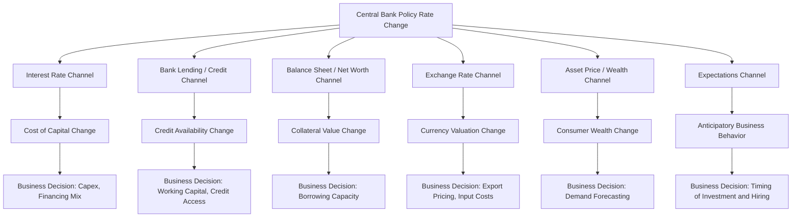

## Monetary Policy Transmission to Business Activity

### Overview

Monetary policy transmission refers to the process by which central bank actions — primarily changes in the policy interest rate, open market operations, and balance sheet policies — propagate through the financial system to ultimately affect real economic variables such as investment, consumption, output, employment, and inflation. For managers, understanding this transmission chain is essential because monetary policy operates with variable lags and through multiple, sometimes offsetting, channels that differentially affect firms depending on their capital structure, sector, and exposure to credit and exchange rate conditions.

Unlike fiscal policy, which is legislated and often slow to implement, monetary policy is administered by an independent or quasi-independent central bank (e.g., the U.S. Federal Reserve, European Central Bank, Bangko Sentral ng Pilipinas) and can be adjusted relatively quickly, making it a more immediately responsive — but also more indirect — lever on business conditions.

### Core Instruments of Monetary Policy

**Key Points**

- **Policy interest rate**: The central bank's target rate (e.g., federal funds rate, overnight reverse repo rate) that anchors short-term borrowing costs economy-wide.
- **Open market operations (OMO)**: Buying/selling government securities to inject or withdraw liquidity from the banking system.
- **Reserve requirements**: Mandated minimum reserves banks must hold, affecting the money multiplier and lending capacity.
- **Discount rate / standing facilities**: The rate at which banks borrow directly from the central bank.
- **Quantitative easing/tightening (QE/QT)**: Large-scale asset purchases or balance sheet reduction affecting longer-term yields and liquidity.
- **Forward guidance**: Central bank communication about future policy intentions, shaping market expectations ahead of actual rate changes.

### The Monetary Transmission Mechanism: Conceptual Chain

$$\text{Policy Rate} \rightarrow \text{Market Rates} \rightarrow \text{Asset Prices, Credit, Exchange Rate} \rightarrow \text{Aggregate Demand} \rightarrow \text{Output, Employment, Inflation}$$

This chain is not instantaneous; central banks and economists generally describe monetary policy as operating with "long and variable lags," often estimated at 12–24 months for the full effect on output and inflation to materialize. [Inference] The precise lag length varies by economy, financial system structure, and the specific channel in question, and is a subject of ongoing empirical debate among macroeconomists.

### Transmission Channels to Business Activity

#### 1. Interest Rate Channel

The most direct channel: changes in the policy rate influence the cost of capital for firms through the entire yield curve.

$$WACC = \frac{E}{V}r_e + \frac{D}{V}r_d(1-\tau)$$

A rise in the policy rate raises $r_d$ (cost of debt) directly through higher borrowing rates on loans and bonds, and raises $r_e$ (cost of equity) indirectly via the risk-free rate component of the Capital Asset Pricing Model:

$$r_e = r_f + \beta(r_m - r_f)$$

**Business implication**: Higher policy rates raise the discount rate applied to future cash flows, reducing the NPV of capital projects and increasing the hurdle rate for investment approval. Firms with high leverage or floating-rate debt see immediate increases in debt service costs.

#### 2. Credit Availability (Bank Lending) Channel

Monetary tightening reduces bank reserves and liquidity, constraining banks' capacity and willingness to extend credit — particularly to small and medium enterprises (SMEs) that rely heavily on bank financing rather than capital markets.

**Business implication**: SMEs and firms without access to public debt or equity markets are disproportionately affected by tightening cycles, facing both higher rates and reduced credit availability (credit rationing), independent of their creditworthiness.

#### 3. Balance Sheet / Firm Net Worth Channel

Rising interest rates depress asset values (real estate, equities, bonds held as collateral), weakening the balance sheets of both firms and their customers. This reduces collateral value available to secure loans, amplifying the credit contraction beyond what the interest rate channel alone would predict — a dynamic known as the **financial accelerator**.

**Business implication**: Firms holding significant collateralizable assets may find borrowing capacity shrinking during tightening cycles even if their operating cash flows remain stable, because collateral valuations decline.

#### 4. Exchange Rate Channel

Higher domestic interest rates (relative to foreign rates) attract capital inflows seeking higher yield, increasing demand for the domestic currency and causing appreciation. This is closely linked to **uncovered interest rate parity**:

$$\frac{E_{t+1}^e - E_t}{E_t} \approx i_{domestic} - i_{foreign}$$

**Business implication**: Currency appreciation from monetary tightening raises the relative price of exports (hurting export-oriented firms) while lowering the cost of imported inputs (benefiting import-dependent firms). This effect can offset or compound fiscal-driven exchange rate movements.

#### 5. Asset Price / Wealth Channel

Changes in interest rates affect equity and real estate valuations through discount rate effects on the present value of future cash flows or rents. Rising asset prices increase household wealth, boosting consumption (the wealth effect); falling asset prices do the reverse.

**Business implication**: Consumer discretionary and luxury goods firms are particularly sensitive to wealth-effect-driven demand swings tied to monetary policy shifts affecting equity and housing markets.

#### 6. Expectations and Confidence Channel

Central bank communication (forward guidance) shapes business and consumer expectations about future borrowing costs and economic conditions, influencing spending and investment decisions ahead of actual policy changes.

**Business implication**: Firms often adjust capex and hiring plans based on anticipated rate paths (e.g., signaled by central bank statements or dot plots) rather than waiting for rate changes to be realized.

### Transmission Mechanism Diagram

### Impact on Specific Business Decisions

#### Capital Investment and Capex Timing

The discount rate used in NPV analysis is directly tied to the policy rate environment. A monetary tightening cycle raises the hurdle rate, shrinking the set of value-accretive projects:

$$NPV = \sum_{t=0}^{n} \frac{CF_t}{(1+r)^t} - I_0$$

As $r$ rises (driven by policy rate increases feeding into $WACC$), $NPV$ falls for any given cash flow stream, particularly for long-duration projects where cash flows are concentrated in later years (these are more discount-rate-sensitive due to the compounding effect in the denominator).

**Example**: A firm evaluating a 15-year infrastructure project with cash flows weighted toward years 10–15 will see NPV compress far more severely from a 200-basis-point rate increase than a firm evaluating a 2-year project with front-loaded cash flows, because long-duration cash flows are discounted over more compounding periods.

#### Working Capital and Short-Term Financing

Firms relying on revolving credit facilities, commercial paper, or short-term bank loans for working capital face immediate cost increases when the policy rate rises, since these instruments are typically priced off short-term benchmark rates (e.g., SOFR-linked facilities).

**Business implication**: Rising rates increase the carrying cost of inventory and receivables financed via short-term debt, incentivizing firms to tighten inventory management and accelerate receivables collection during tightening cycles.

#### Capital Structure and Debt Issuance Timing

Firms often accelerate debt issuance ahead of anticipated rate hikes (locking in lower fixed rates) and may shift toward variable-rate instruments or delay issuance when rate cuts are anticipated.

**Business implication**: Treasury and corporate finance functions must actively monitor central bank communication to optimize debt issuance timing and maturity structure.

#### Hiring and Workforce Planning

Monetary tightening that slows aggregate demand growth typically leads firms to moderate hiring plans, as revenue growth expectations are revised downward. Conversely, monetary easing that stimulates demand tends to accelerate hiring, particularly in interest-rate-sensitive sectors like construction and durable goods manufacturing.

#### Mergers, Acquisitions, and Corporate Restructuring

Lower rates reduce the cost of acquisition financing (leveraged buyouts, debt-financed M&A), often correlating with higher M&A activity. Higher rates raise financing costs and can compress valuation multiples (since higher discount rates lower the present value of target firm cash flows), typically dampening M&A volume.

### Sector-Differentiated Sensitivity to Monetary Policy

| Sector | Sensitivity to Rate Changes | Primary Channel |
| --- | --- | --- |
| Real estate / construction | Very high | Interest rate, credit availability |
| Banking / financials | High (but complex — net interest margin effects can be positive or negative) | Interest rate, credit channel |
| Utilities | High | Interest rate (discount rate on stable cash flows and dividend yield comparison) |
| Consumer discretionary | Moderate-high | Wealth effect, credit availability (consumer credit) |
| Technology / growth firms | High | Interest rate (long-duration cash flow discounting) |
| Consumer staples | Low | Relatively insulated due to inelastic demand |
| Export manufacturing | Moderate-high | Exchange rate channel |
| Small/medium enterprises (SMEs) | High | Bank lending channel, limited capital market access |

### Worked Example: Rate Change and Investment Hurdle Rate

**Example**

A firm is evaluating a project with:

- Initial investment: $8,000,000
- Expected annual after-tax cash flow: $1,500,000 for 10 years
- Current WACC: 9% (reflecting a policy rate environment with $r_f = 3\%$)

**Scenario A — Current rate environment (WACC = 9%)**:

$$NPV_A = -8{,}000{,}000 + 1{,}500{,}000 \times \left[\frac{1-(1.09)^{-10}}{0.09}\right] = -8{,}000{,}000 + 1{,}500{,}000 \times 6.4177 \approx \$1{,}626{,}550$$

**Scenario B — Tightening cycle raises $r_f$ by 150 bps, WACC rises to 10.5%**:

$$NPV_B = -8{,}000{,}000 + 1{,}500{,}000 \times \left[\frac{1-(1.105)^{-10}}{0.105}\right] = -8{,}000{,}000 + 1{,}500{,}000 \times 6.0652 \approx \$1{,}097{,}800$$

**Output**: A 150-basis-point tightening reduces project NPV by approximately $528,750 — roughly a 32% decline — without any change to the underlying operating cash flows. This illustrates how monetary policy alone can shift a project from a "must approve" to a "marginal" classification purely through discount rate effects.

### Monetary Policy and the Business Cycle

| Business Cycle Phase | Typical Monetary Stance | Business Strategy Implication |
| --- | --- | --- |
| Trough / Recession | Easing (rate cuts, QE) | Lower cost of capital enables refinancing and opportunistic investment |
| Early expansion | Accommodative, gradually normalizing | Favorable financing conditions for growth capex |
| Late expansion / Peak | Tightening (rate hikes, QT) to control inflation | Rising cost of capital; reassess project hurdle rates and leverage |
| Contraction | Shift toward easing as growth slows | Anticipate eventual rate relief; manage near-term liquidity carefully |

### Transmission Lags and Business Planning Implications

**Key Points**

- **Recognition and decision lag**: Central banks require time to assess incoming data before acting, though generally shorter than fiscal legislative lags.
- **Transmission lag**: Changes in the policy rate take time to fully pass through to market rates, especially longer-term rates influenced by term premia and expectations.
- **Impact lag**: The full effect on investment, hiring, and output typically takes several quarters to materialize as firms revise capital budgets and financing plans.

**Business implication**: Because of these lags, firms should treat the *current* policy rate as only one input; the *expected path* of rates (as reflected in yield curves, forward guidance, and futures markets) is often more relevant for multi-year capital budgeting decisions than the spot rate alone.

### Monetary Policy Transmission in Open vs. Closed Economies

In open economies with flexible exchange rates and free capital mobility, the exchange rate channel tends to be more prominent, and monetary policy effectiveness on domestic demand may be partially offset by currency-driven trade effects (a dynamic related to the Mundell-Fleming model). In economies with capital controls or managed exchange rates, the interest rate and credit channels tend to dominate, as the exchange rate channel is muted by policy design.

[Inference] The relative strength of each channel is empirically debated and varies substantially by country, financial market depth, and the degree of capital account openness — managers operating across multiple jurisdictions should treat channel strength as market-specific rather than universal.

### Common Misconceptions

**Key Points**

- Monetary policy does not affect all firms equally; the interaction of leverage, sector, duration of cash flows, and access to capital markets creates highly differentiated exposure.
- A rate cut does not guarantee increased business investment; if demand expectations remain weak or capacity utilization is low, firms may not respond to lower financing costs (a phenomenon associated with liquidity trap conditions).
- Quantitative easing and conventional rate cuts operate through overlapping but distinct channels (QE emphasizes portfolio rebalancing and long-term yield compression, while conventional policy emphasizes the short-term policy rate); their relative effectiveness is [Unverified] and remains an active area of macroeconomic research, particularly regarding QE's effect on real economic activity versus asset prices.

### Conclusion

Monetary policy transmits to business activity through a multi-channel process encompassing direct interest rate effects on the cost of capital, credit availability through the banking system, balance sheet and collateral effects, exchange rate movements, asset price wealth effects, and forward-looking expectations. These channels operate with variable lags, meaning the full business impact of a policy change may not be observed for many quarters. Firms that incorporate expected policy rate paths — rather than only current rates — into capital budgeting, financing, and working capital decisions are better positioned to navigate monetary policy cycles proactively rather than reactively.

**Related Topics**

- Fiscal policy effects on business decisions
- Yield curve analysis and business cycle forecasting
- Cost of capital and WACC estimation under changing rate regimes
- Credit rationing and SME financing constraints
- Exchange rate risk management and hedging strategies
- Quantitative easing and its effects on asset valuations
- Inflation targeting frameworks and central bank credibility
- Capital budgeting sensitivity analysis under discount rate uncertainty
- Financial accelerator theory and balance sheet effects
- Mundell-Fleming model and open economy policy interactions