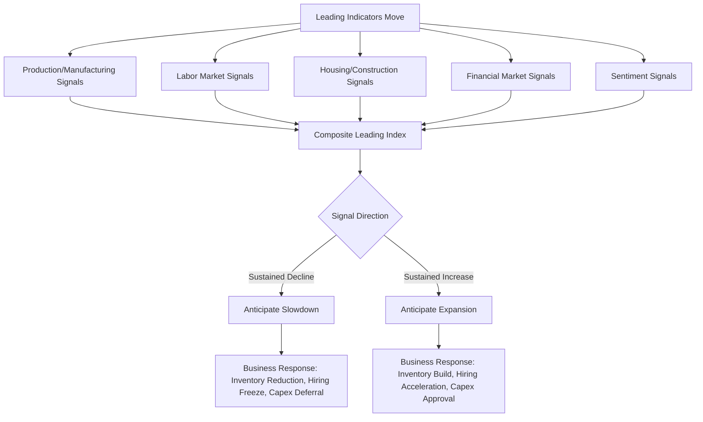

## Leading Economic Indicators for Business Forecasting

### Overview

Leading economic indicators are statistical measures that tend to change direction *before* the broader economy does, making them valuable tools for anticipating turning points in the business cycle — expansions, peaks, contractions, and troughs — ahead of confirmation in lagging measures like GDP or unemployment. For managers, leading indicators serve as an early-warning system that informs strategic decisions on inventory, hiring, capital expenditure, and pricing well before the effects of a cyclical shift show up in the firm's own financial statements.

Economic indicators are conventionally classified into three categories based on their timing relative to the business cycle: **leading**, **coincident**, and **lagging**. Managerial economics focuses primarily on leading indicators because they offer decision-relevant lead time, though coincident and lagging indicators remain important for confirming and validating signals.

### Classification of Economic Indicators

| Type | Definition | Typical Lead/Lag | Example |
| --- | --- | --- | --- |
| Leading | Changes before the economy as a whole changes | Leads by several months | Stock market indices, building permits, new orders |
| Coincident | Changes at approximately the same time as the economy | Concurrent | Industrial production, personal income, employment |
| Lagging | Changes after the economy has already changed | Lags by several months to a year | Unemployment rate, corporate profits, CPI (in some frameworks) |

### The Composite Index of Leading Economic Indicators (LEI)

Many countries' statistical or private-sector agencies (e.g., The Conference Board in the U.S.) compile a composite Leading Economic Index combining multiple individual indicators into a single weighted measure, designed to smooth out noise from any single component and provide a more reliable early signal.

**Key Points — Common Components of a Leading Economic Index**

- **Average weekly hours, manufacturing**: Employers typically adjust hours before hiring/firing, making this an early signal of labor demand shifts.
- **Average weekly initial claims for unemployment insurance**: Rising claims signal labor market deterioration ahead of the official unemployment rate.
- **Manufacturers' new orders for consumer goods and materials**: Signals future production activity.
- **ISM Index of New Orders (Purchasing Managers' Index component)**: A survey-based measure of manufacturing sector expectations.
- **Manufacturers' new orders for nondefense capital goods**: A proxy for business investment intentions.
- **Building permits for new private housing units**: Leads residential construction activity by several months.
- **Stock prices (broad equity index)**: Reflects forward-looking investor expectations about corporate earnings and economic conditions.
- **Leading Credit Index**: Reflects credit market conditions and financial system health.
- **Interest rate spread (10-year Treasury minus federal funds rate)**: The yield curve slope, discussed in detail below.
- **Average consumer expectations for business conditions**: Survey-based measure of household sentiment.

### The Yield Curve as a Leading Indicator

One of the most closely studied leading indicators is the slope of the yield curve, typically measured as the spread between long-term and short-term government bond yields:

$$\text{Term Spread} = y_{10yr} - y_{3mo} \quad \text{or} \quad y_{10yr} - y_{2yr}$$

**Key Points**

- A **positive, steep spread** typically signals expectations of economic growth (normal curve).
- A **flat spread** signals uncertainty or a transition point in the cycle.
- An **inverted spread** ($y_{10yr} < y_{short-term}$) has historically preceded recessions in many developed economies, as it reflects market expectations that the central bank will need to cut short-term rates in the future due to anticipated economic weakness.

[Inference] While yield curve inversion has preceded most post-war U.S. recessions, the lead time between inversion and recession onset has varied considerably (historically ranging from roughly 6 to 24 months), and false positives have occurred; it should be treated as a probabilistic signal rather than a deterministic predictor.

### Business-Relevant Leading Indicators by Category

#### Production and Manufacturing Indicators

- **Purchasing Managers' Index (PMI)**: A diffusion index derived from surveys of purchasing managers regarding new orders, production, employment, supplier deliveries, and inventories. A reading above 50 indicates expansion; below 50 indicates contraction.

$$PMI = (P_1 \times 1) + (P_2 \times 0.5) + (P_3 \times 0)$$

where $P_1$ is the percentage of respondents reporting improvement, $P_2$ the percentage reporting no change, and $P_3$ the percentage reporting decline.

- **New orders / order backlogs**: Rising new orders relative to existing capacity signal future production increases and potential capacity expansion needs.
- **Inventory-to-sales ratios**: A rising ratio may signal weakening demand (unplanned inventory accumulation) or, alternatively, anticipatory stocking ahead of expected demand.

#### Labor Market Indicators

- **Initial unemployment insurance claims**: A high-frequency (weekly) measure that often leads changes in the broader unemployment rate.
- **Average weekly hours worked**: Firms adjust hours before headcount, making this an early signal in both directions.
- **Job openings (vacancy data)**: Rising vacancies relative to unemployed workers (the vacancy-to-unemployment ratio) signals labor market tightness.

#### Housing and Construction Indicators

- **Building permits**: Issued before construction begins, permits lead actual construction activity by roughly 1–6 months.
- **Housing starts**: A coincident-to-slightly-leading measure of construction sector activity, with broad implications for materials, appliances, furniture, and related durable goods sectors.

#### Financial Market Indicators

- **Equity market indices**: Forward-looking by design, as stock prices reflect discounted expectations of future corporate earnings.
- **Credit spreads** (corporate bond yields minus risk-free rate): Widening spreads signal rising perceived default risk and tightening financial conditions.
- **Money supply growth (M2 and related aggregates)**: [Inference] The relationship between money supply growth and future economic activity has weakened in predictive reliability in many advanced economies since the 1980s, and should be interpreted cautiously as a standalone indicator.

#### Consumer and Business Sentiment Indicators

- **Consumer confidence/sentiment indices**: Survey-based measures capturing household expectations about future income, employment, and spending intentions.
- **Business confidence surveys**: Capture firm-level expectations regarding future sales, investment, and hiring plans.

### Leading Indicator Transmission to Forecasting Diagram

### Using Leading Indicators in Business Forecasting: Methodology

#### Step 1: Identify Sector-Relevant Indicators

Not all leading indicators are equally relevant to every business. A construction firm should weight building permits and housing starts heavily; an export manufacturer should weight exchange rates and global PMI data; a consumer retailer should weight consumer confidence and initial claims.

#### Step 2: Monitor Diffusion and Breadth, Not Single Data Points

A single month's data point is often noisy. Analysts typically look for **sustained directional movement across multiple indicators** (breadth) rather than reacting to one data release, to reduce the risk of false signals from statistical noise or one-off events.

#### Step 3: Apply Lead-Time Adjustment

Each indicator has a historically observed average lead time before its signal shows up in business-relevant coincident measures (e.g., firm revenue, industry shipments). Firms often construct internal correlation studies between specific leading indicators and their own historical revenue/order data to calibrate an appropriate lead-time assumption.

**Example**: If a firm's historical data shows that new orders for nondefense capital goods lead its own order book by approximately 3 months with a correlation coefficient of 0.7, a sustained 10% decline in that national indicator might be treated as an early signal to begin moderating near-term production planning, subject to the firm's own confirming data.

#### Step 4: Cross-Validate with Coincident and Lagging Indicators

Leading indicators should not be used in isolation. Coincident indicators (industrial production, personal income, retail sales) confirm whether an anticipated shift is materializing, while lagging indicators (unemployment rate, CPI) confirm the shift has fully taken hold — useful for validating that a downturn or recovery, once signaled, is actually occurring.

### Diffusion Index Interpretation Example

**Example**

A firm tracks the national manufacturing PMI over six months:

| Month | PMI Reading |
| --- | --- |
| 1 | 52.1 |
| 2 | 51.4 |
| 3 | 49.8 |
| 4 | 48.6 |
| 5 | 47.9 |
| 6 | 47.2 |

**Output**: The sustained decline below the 50 threshold from Month 3 onward, combined with a consistent downward trend, signals a manufacturing sector contraction. A firm supplying industrial inputs would interpret this as a leading signal to moderate production schedules, tighten inventory targets, and reassess near-term capex commitments — while continuing to monitor coincident indicators (industrial production, factory orders) for confirmation before making major structural changes such as headcount reductions.

### Limitations and Pitfalls of Leading Indicators

**Key Points**

- **False positives**: Not every inversion, dip, or spike in a leading indicator precedes an actual cyclical turn; indicators can generate false signals, particularly during periods of unusual monetary policy or structural economic change.
- **Revision risk**: Many economic data series are subject to revision after initial release, meaning the first reported value may differ from the finalized figure.
- **Structural breaks**: Historical relationships between indicators and outcomes can weaken or break down due to structural economic changes (e.g., globalization, shifts in monetary policy frameworks, technological disruption), meaning past correlations are not guaranteed to hold in the future. [Inference] This is a genuine and ongoing limitation acknowledged broadly in economic forecasting literature.
- **Aggregation bias**: National or even international composite indices may not reflect regional or sector-specific conditions relevant to a particular business.
- **Lead-time variability**: The lead time between an indicator's signal and the actual economic turning point is not fixed and has varied historically across cycles, limiting precision for exact timing decisions.

### Integrating Leading Indicators into Business Decision Frameworks

| Business Function | Relevant Leading Indicators | Decision Application |
| --- | --- | --- |
| Inventory management | PMI new orders, inventory-to-sales ratio | Adjust reorder points and safety stock levels |
| Hiring / workforce planning | Initial claims, average weekly hours, job openings | Time hiring freezes or acceleration |
| Capital expenditure | Nondefense capital goods orders, yield curve, business confidence | Time approval/deferral of major projects |
| Pricing strategy | Consumer confidence, PMI prices paid | Anticipate demand elasticity shifts |
| Credit and treasury management | Credit spreads, yield curve, Leading Credit Index | Time debt issuance, adjust credit terms to customers |
| Supply chain planning | Supplier delivery times (PMI component), building permits | Adjust supplier contracts and lead-time buffers |

### Regional and International Considerations

**Key Points**

- Composite leading indices are compiled by national statistical agencies or private organizations and are **not directly comparable across countries** without adjustment for differing component methodologies.
- Multinational firms should monitor leading indicators specific to each significant market of operation, since business cycles across countries are not perfectly synchronized (though global cycles have shown increasing correlation, [Inference] particularly since the 2008 financial crisis, reflecting greater trade and financial integration).
- Emerging market indicators may carry higher volatility and lower historical reliability due to less mature statistical infrastructure and greater susceptibility to capital flow shocks.

### Common Misconceptions

**Key Points**

- Leading indicators predict *direction and likelihood* of cyclical turns, not precise magnitude or exact timing; treating them as precise forecasting tools rather than probabilistic signals is a common analytical error.
- A single leading indicator moving contrary to the broader trend does not necessarily invalidate the overall signal; composite and breadth-based analysis is generally more reliable than reliance on any single series.
- Leading indicators are macroeconomic in scope and do not substitute for firm-specific demand forecasting; they should complement, not replace, internal sales pipeline and order-book analysis.

### Conclusion

Leading economic indicators provide managers with an early-warning framework for anticipating shifts in the business cycle, enabling proactive rather than reactive decision-making across inventory, hiring, capital expenditure, pricing, and financing functions. Effective use requires selecting sector-relevant indicators, focusing on sustained directional trends and breadth across multiple series rather than single data points, calibrating lead-time assumptions against a firm's own historical data, and cross-validating signals with coincident and lagging indicators. While leading indicators are not infallible predictors, disciplined integration into forecasting processes materially improves a firm's ability to navigate business cycle transitions ahead of competitors relying solely on lagging financial performance data.

**Related Topics**

- Fiscal policy effects on business decisions
- Monetary policy transmission to business activity
- Business cycle phases and strategic positioning
- Purchasing Managers' Index (PMI) methodology and interpretation
- Yield curve inversion and recession forecasting
- Demand forecasting techniques for inventory and production planning
- Composite index construction and diffusion index methodology
- Coincident and lagging indicators for cycle confirmation
- Sector-specific economic indicator selection
- Scenario planning and probabilistic forecasting in managerial economics