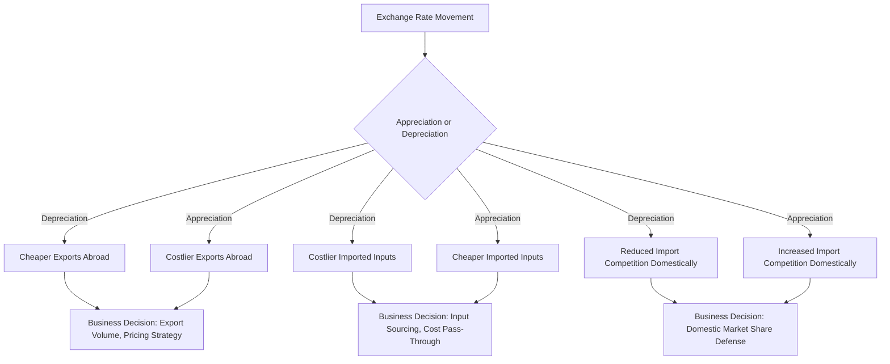

## Exchange Rates and Their Effect on Domestic Business

### Overview

Exchange rates — the price of one currency expressed in terms of another — sit at the intersection of macroeconomic policy, international trade, and firm-level competitiveness. Even businesses that never directly transact in foreign currency are exposed to exchange rate movements through import-dependent supply chains, competition from foreign firms, and the pricing behavior of customers and suppliers who do trade internationally. For managers, exchange rate analysis is essential to pricing strategy, input cost forecasting, competitive positioning, and financial risk management.

This topic examines how exchange rate regimes are determined, the channels through which currency movements affect domestic businesses (both exporters/importers and purely domestic firms), and the strategic and financial tools available to manage exchange rate exposure.

### Exchange Rate Fundamentals

**Key Points**

- **Exchange rate**: The price of one currency in terms of another (e.g., PHP/USD, or how many Philippine pesos are needed to buy one U.S. dollar).
- **Appreciation**: An increase in a currency's value relative to another currency (fewer units of domestic currency needed to buy foreign currency).
- **Depreciation**: A decrease in a currency's value relative to another currency (more units of domestic currency needed to buy foreign currency).
- **Nominal exchange rate**: The straightforward market price of one currency in terms of another, unadjusted for inflation differentials.
- **Real exchange rate**: The nominal rate adjusted for relative price levels between countries, reflecting the actual purchasing power comparison:

$$RER = NER \times \frac{P_{domestic}}{P_{foreign}}$$

- **Effective exchange rate**: A trade-weighted index measuring a currency's value against a basket of trading-partner currencies, rather than a single bilateral rate.

### Exchange Rate Determination Regimes

| Regime | Description | Business Implication |
| --- | --- | --- |
| Floating (flexible) | Determined by market supply and demand with no official target | Higher volatility; greater need for active hedging |
| Fixed (pegged) | Central bank maintains a fixed rate against a reference currency | Lower short-term volatility; risk of sudden devaluation/revaluation |
| Managed float ("dirty float") | Market-determined but with periodic central bank intervention | Moderate volatility; intervention risk adds uncertainty |
| Currency union | Multiple countries share a single currency (e.g., the Eurozone) | Eliminates intra-union exchange rate risk; cross-border rate risk remains vs. non-member currencies |

### Theoretical Frameworks for Exchange Rate Determination

#### Purchasing Power Parity (PPP)

PPP theory holds that, in the long run, exchange rates adjust so that identical goods cost the same across countries when priced in a common currency:

$$E = \frac{P_{domestic}}{P_{foreign}}$$

**Relative PPP** (more commonly applied) relates the rate of exchange rate change to inflation differentials:

$$\frac{\Delta E}{E} \approx \pi_{domestic} - \pi_{foreign}$$

A country with persistently higher inflation than its trading partners should see its currency depreciate over time to maintain relative purchasing power. [Inference] PPP holds reasonably well over long horizons (years to decades) for tradable goods but is frequently violated in the short-to-medium term due to transaction costs, non-tradable goods, and capital flow dynamics.

#### Interest Rate Parity (IRP)

Covered interest rate parity links exchange rates and interest rate differentials through arbitrage-free forward pricing:

$$F = S \times \frac{(1+i_{domestic})}{(1+i_{foreign})}$$

where $F$ is the forward rate, $S$ is the spot rate, and $i_{domestic}$, $i_{foreign}$ are the respective interest rates. This relationship underpins currency forward and futures pricing used in corporate hedging.

#### Balance of Payments Approach

Exchange rates also respond to the flow of funds captured in the balance of payments — the current account (trade in goods/services) and capital/financial account (investment flows). A current account deficit financed by capital inflows can sustain currency stability, but persistent deficits without offsetting inflows tend to pressure the currency toward depreciation.

### Transmission Channels to Domestic Business

#### 1. Export Competitiveness Channel

A **depreciation** of the domestic currency makes exports cheaper in foreign-currency terms, potentially increasing foreign demand for domestic goods (assuming demand is sufficiently price-elastic — see the Marshall-Lerner condition below). An **appreciation** has the opposite effect, raising the foreign-currency price of exports and potentially reducing competitiveness.

$$\text{Marshall-Lerner Condition: } |\epsilon_x| + |\epsilon_m| > 1$$

where $\epsilon_x$ and $\epsilon_m$ are the price elasticities of export and import demand. If this condition holds, currency depreciation improves the trade balance; if not, depreciation can worsen it (at least initially — the **J-curve effect**, where the trade balance initially deteriorates before improving as quantity effects catch up with price effects).

#### 2. Import Cost Channel

Currency depreciation raises the domestic-currency cost of imported inputs (raw materials, components, machinery), directly compressing margins for firms reliant on imported goods — a highly relevant channel for firms with globally sourced supply chains. Currency appreciation has the reverse effect, lowering import costs.

**Business implication**: Firms with significant imported input content in their cost structure (e.g., electronics assembly, pharmaceuticals reliant on imported active ingredients) are directly exposed to depreciation risk even if they never sell internationally.

#### 3. Domestic Competition Channel

Even purely domestic-selling firms are exposed to exchange rate movements through import-competing dynamics: currency appreciation makes imported substitute goods cheaper, intensifying competitive pressure on domestic producers of tradable goods (e.g., domestic furniture manufacturers competing against cheaper imported furniture when the domestic currency strengthens).

#### 4. Translation and Transaction Exposure Channel (Multinational and Trading Firms)

- **Transaction exposure**: Risk arising from foreign-currency-denominated contracts (receivables, payables) whose domestic-currency value fluctuates with exchange rates before settlement.
- **Translation exposure**: Risk arising when consolidating foreign subsidiary financial statements into the parent company's reporting currency, causing reported earnings/equity to fluctuate with exchange rates even absent any underlying cash flow change.
- **Economic exposure**: The broader, longer-term risk that exchange rate movements affect a firm's competitive position and the present value of future cash flows, regardless of whether specific contracts are currency-denominated.

#### 5. Capital Flow and Financing Cost Channel

Exchange rate expectations influence foreign investor appetite for domestic assets. Expected depreciation can deter foreign capital inflows or raise the risk premium demanded on domestic-currency debt, indirectly raising financing costs for domestic firms seeking foreign capital.

#### 6. Input and Commodity Pricing Channel

Many globally traded commodities (oil, metals, agricultural inputs) are priced in a dominant international currency (historically the U.S. dollar for most commodities). Depreciation of the domestic currency against that pricing currency raises domestic commodity input costs even when the underlying global commodity price is unchanged.

### Exchange Rate Transmission Diagram

### Impact on Specific Business Decisions

#### Pricing Strategy

Firms selling internationally must choose between:

- **Pricing-to-market (PTM)**: Adjusting local-currency prices in each market to maintain competitive positioning, absorbing exchange rate fluctuations into margins.
- **Producer-currency pricing**: Maintaining fixed prices in the home currency, passing exchange rate risk fully to foreign customers via fluctuating foreign-currency prices.

The choice depends on competitive intensity, price elasticity of demand in each market, and the firm's risk tolerance for margin volatility versus volume volatility.

#### Sourcing and Supply Chain Decisions

Persistent currency trends influence sourcing strategy: sustained depreciation of a supplier country's currency can make offshoring/outsourcing to that country more cost-attractive, while sustained appreciation can erode the cost advantage of previously cheap sourcing destinations, prompting supply chain diversification or reshoring evaluation.

#### Capital Investment and Foreign Direct Investment (FDI) Decisions

Firms evaluating foreign investment must incorporate expected exchange rate paths into NPV analysis, since project cash flows earned in foreign currency must be converted back to the reporting currency:

$$NPV_{domestic} = \sum_{t=0}^{n} \frac{CF_t^{foreign} \times E_t}{(1+r)^t} - I_0$$

where $E_t$ is the expected exchange rate at time $t$. Uncertainty in $E_t$ adds a layer of risk beyond standard project risk, often addressed through scenario analysis or risk-adjusted discount rates.

#### Financial Hedging Decisions

**Key Points — Common Hedging Instruments**

- **Forward contracts**: Lock in an exchange rate for a future transaction, eliminating transaction exposure for that specific cash flow but forgoing potential favorable movements.
- **Currency futures**: Exchange-traded, standardized equivalents of forward contracts, offering liquidity but less customization.
- **Currency options**: Provide the right (not obligation) to exchange currency at a specified rate, allowing firms to hedge downside risk while retaining upside participation, at the cost of an upfront premium.
- **Natural hedging**: Matching foreign-currency revenues with foreign-currency costs (e.g., sourcing inputs in the same currency as export sales) to reduce net exposure without financial instruments.
- **Money market hedges**: Using borrowing and lending in different currencies to synthetically replicate a forward contract's payoff.

**Example**: A domestic firm expects to receive USD 2,000,000 in 90 days from an export sale, with the current spot rate at PHP 56.00/USD and a 90-day forward rate of PHP 56.40/USD. By entering a forward contract to sell USD 2,000,000 at PHP 56.40/USD, the firm locks in PHP 112,800,000 in proceeds regardless of where the spot rate moves over the next 90 days, eliminating transaction exposure on that specific receivable — though the firm forgoes any additional peso proceeds if the peso weakens beyond PHP 56.40 by settlement.

### Sector-Differentiated Exposure to Exchange Rates

| Sector | Exposure Type | Primary Concern |
| --- | --- | --- |
| Export manufacturing | Transaction, economic | Depreciation is generally favorable; appreciation erodes competitiveness |
| Import-dependent retail/electronics | Transaction, input cost | Depreciation raises input costs |
| Domestic services (non-tradable) | Indirect, second-order | Limited direct exposure; affected via input costs and macro demand |
| Multinational corporations | Translation, transaction, economic | Full spectrum of exposure across all three types |
| Tourism and hospitality | Economic (inbound), input cost | Domestic currency depreciation can boost inbound tourism demand |
| Commodity-dependent industries | Input cost, economic | Exposure compounded by commodity pricing typically denominated in a foreign reference currency |

### Worked Example: Import Cost Impact of Depreciation

**Example**

A domestic manufacturer imports components priced at USD 500,000 per shipment, received quarterly.

**Scenario A — Spot rate PHP 55.00/USD**: Cost = PHP 27,500,000 per shipment.

**Scenario B — Currency depreciates 8% to PHP 59.40/USD**: Cost = PHP 29,700,000 per shipment.

**Output**: The 8% currency depreciation increases quarterly input costs by PHP 2,200,000 with no change in the underlying USD price of the components. Absent cost pass-through to customers or hedging, this directly compresses gross margin. A firm facing this exposure might respond by negotiating peso-denominated supplier contracts, seeking domestic substitute suppliers, implementing a forward-hedging program, or adjusting selling prices — each with different trade-offs regarding cost, complexity, and competitive positioning.

### Exchange Rates and Monetary/Fiscal Policy Interaction

Exchange rates are not independent of monetary and fiscal policy; they form part of the broader transmission mechanisms discussed in related chapter topics. Higher domestic interest rates (monetary tightening) tend to attract capital inflows and appreciate the currency; expansionary fiscal policy financed by external borrowing can pressure the currency depending on investor confidence and current account dynamics. Firms should therefore analyze exchange rate movements not in isolation but as one node within the broader macroeconomic policy environment.

### Common Misconceptions

**Key Points**

- Currency depreciation does not automatically or immediately improve the trade balance; the Marshall-Lerner condition and J-curve dynamics mean the relationship is elasticity-dependent and time-lagged.
- Firms without direct foreign transactions are not necessarily insulated from exchange rate risk; import-competing dynamics and input cost pass-through create indirect exposure.
- Hedging exchange rate risk does not eliminate all currency-related business risk; it typically addresses transaction exposure on specific, identified cash flows, while economic exposure (longer-term competitive positioning effects) is harder to fully hedge and often requires structural/strategic responses (diversified sourcing, market diversification) rather than financial instruments alone.

### Conclusion

Exchange rate movements affect domestic businesses through export competitiveness, import cost pass-through, domestic competitive pressure from import substitutes, financial statement translation effects, capital flow and financing cost dynamics, and globally-priced commodity input costs. These effects extend well beyond firms that directly trade internationally, touching nearly any business with import-dependent inputs or import-competing products. Effective managerial response requires distinguishing between transaction, translation, and economic exposure; applying appropriate hedging instruments matched to the exposure type; and incorporating exchange rate scenarios into pricing, sourcing, and capital investment decisions rather than treating currency risk as a peripheral financial consideration.

**Related Topics**

- Fiscal policy effects on business decisions
- Monetary policy transmission to business activity
- Leading economic indicators for business forecasting
- Purchasing power parity and interest rate parity in depth
- Currency hedging instrument mechanics (forwards, futures, options, swaps)
- Balance of payments analysis and current account dynamics
- Foreign direct investment decision frameworks
- Global supply chain risk management
- Country risk and sovereign credit analysis
- Multinational capital budgeting under currency uncertainty