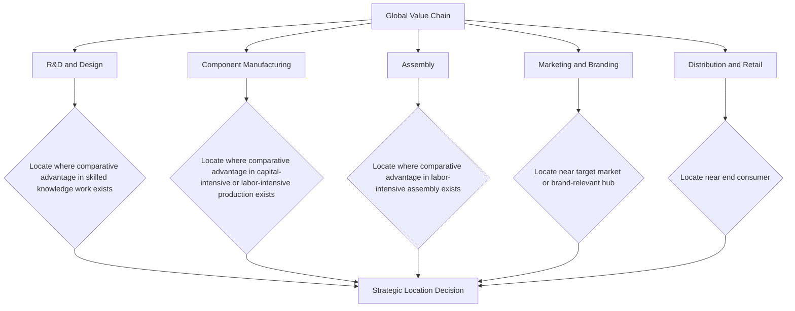

## Comparative Advantage and Global Business Strategy

### Overview

Comparative advantage is the foundational principle of international trade theory, originally articulated by David Ricardo, holding that mutually beneficial trade can occur between two parties even when one party is absolutely more efficient at producing every good, as long as relative (opportunity cost) efficiencies differ. For managers, comparative advantage is not merely an academic trade theory — it is a strategic lens for decisions on where to locate production, which markets to enter, how to structure global supply chains, and how to position a firm against foreign competitors.

This topic covers the theoretical foundation of comparative advantage, its extension into modern trade and strategy frameworks, and its direct application to global business decision-making including offshoring, market entry, and supply chain design.

### Absolute vs. Comparative Advantage

**Key Points**

- **Absolute advantage**: A producer (country or firm) can produce a good using fewer resources (or at lower cost) than another producer.
- **Comparative advantage**: A producer can produce a good at a *lower opportunity cost* relative to their own production of other goods, even if they lack an absolute advantage in any good.
- The critical strategic insight: absolute advantage is irrelevant to whether trade is mutually beneficial; only relative (comparative) opportunity costs determine gains from trade.

### The Ricardian Model of Comparative Advantage

Consider two countries (A and B) producing two goods (X and Y) using labor as the only input, with differing labor productivity.

$$\text{Opportunity Cost of } X \text{ in Country A} = \frac{\text{Labor required per unit } X}{\text{Labor required per unit } Y}$$

A country has a comparative advantage in producing the good for which its opportunity cost (relative to the other good) is lower than that of its trading partner.

**Example**

Consider two countries producing electronics (X) and textiles (Y), with the following labor-hours required per unit:

| Country | Hours per unit X (electronics) | Hours per unit Y (textiles) |
| --- | --- | --- |
| Country A | 4 | 2 |
| Country B | 10 | 8 |

**Opportunity costs**:

- Country A: 1 unit X costs $4/2 = 2$ units Y forgone; 1 unit Y costs $2/4 = 0.5$ units X forgone.
- Country B: 1 unit X costs $10/8 = 1.25$ units Y forgone; 1 unit Y costs $8/10 = 0.8$ units X forgone.

**Output**: Country A has an absolute advantage in *both* goods (fewer hours required for each). However, Country B has a *comparative* advantage in electronics (1.25 units Y forgone vs. Country A's 2 units Y forgone), while Country A has a comparative advantage in textiles (0.5 units X forgone vs. Country B's 0.8 units X forgone). Despite Country A being absolutely more efficient at producing everything, both countries gain from specializing according to comparative advantage and trading — Country A should specialize in textiles, Country B in electronics.

### Terms of Trade and Gains from Trade

For trade to be mutually beneficial, the exchange ratio (terms of trade) must fall between the two countries' domestic opportunity cost ratios:

$$OC_A(X) < \text{Terms of Trade} < OC_B(X)$$

Using the example above: $0.5 < \text{ToT (Y per X)} < 1.25$ — any exchange rate for X in terms of Y within this range benefits both countries relative to producing both goods domestically without trade.

### Extensions Beyond the Simple Ricardian Model

**Key Points**

- **Heckscher-Ohlin model**: Extends comparative advantage to factor endowments, predicting that countries export goods intensive in their relatively abundant factor of production (labor-abundant countries export labor-intensive goods; capital-abundant countries export capital-intensive goods).
- **Factor price equalization**: Under certain assumptions, free trade tends to equalize factor prices (wages, returns to capital) across trading countries over time, though [Inference] this prediction is heavily qualified in practice by trade barriers, factor immobility, and differentiated goods.
- **New Trade Theory (Krugman)**: Incorporates economies of scale and product differentiation, explaining intra-industry trade (countries trading similar but differentiated goods within the same industry) that classical comparative advantage alone does not fully explain.
- **Porter's theory of national competitive advantage**: Shifts focus from static factor endowments to dynamic determinants of competitiveness — factor conditions, demand conditions, related/supporting industries, and firm strategy/rivalry (the "Diamond Model") — providing a more strategy-oriented complement to classical trade theory.

### From Trade Theory to Firm Strategy

Comparative advantage operates at the country level in classical theory, but managers apply the underlying logic at the **firm and value-chain level** to decide:

- Where to locate specific stages of production (not the whole firm, but individual activities)
- Which markets to enter and which to avoid
- How to structure global sourcing and outsourcing arrangements
- How to respond to foreign competitors entering the domestic market

This translation from country-level to firm/activity-level analysis is central to modern global business strategy and is often termed the **application of comparative advantage to value chain disaggregation**.

### Comparative Advantage and Global Value Chain Diagram

### Application to Offshoring and Outsourcing Decisions

Firms apply comparative advantage logic when deciding whether to produce a component domestically or source it internationally, comparing the **opportunity cost of domestic resources** used in that activity against alternative uses of those same resources.

$$\text{Offshore if: } OC_{domestic}(\text{component}) > \text{Landed Cost}_{foreign}(\text{component}) + \text{Coordination/Risk Premium}$$

**Business implication**: The decision is not simply "is it cheaper abroad" but "what is the domestic opportunity cost of the resources (labor, capital, management attention) that would otherwise be devoted to this activity, and does offshoring free those resources for higher-value use domestically?" This reframes offshoring as a resource-reallocation decision grounded in comparative advantage logic rather than a pure cost-minimization exercise.

### Application to Market Entry Strategy

Comparative advantage informs which markets a firm should prioritize for entry, and in what form:

| Entry Mode | When Favored by Comparative Advantage Logic |
| --- | --- |
| Exporting | Firm retains strong comparative advantage in domestic production (e.g., specialized know-how, scale economies) with low local production benefit |
| Licensing/Franchising | Local partner has comparative advantage in market-specific knowledge, distribution, or regulatory navigation |
| Joint venture | Complementary comparative advantages exist (e.g., foreign firm has technology advantage, local firm has market access/distribution advantage) |
| Foreign direct investment (wholly owned) | Firm's comparative advantage is transferable and proprietary (brand, technology, process) and best protected/exploited through direct control |

### Dynamic and Created Comparative Advantage

Classical comparative advantage assumes largely fixed factor endowments (labor, land, natural resources). Modern strategic thinking recognizes that firms and nations can *create* comparative advantage through:

- **Investment in human capital and education**: Shifting a workforce's relative productivity profile over time.
- **Infrastructure investment**: Reducing transaction and logistics costs, effectively lowering opportunity costs in targeted sectors.
- **Technology and innovation policy**: Building capabilities in knowledge-intensive sectors that did not previously exist as a comparative strength.
- **Industrial clustering**: Co-locating related firms and suppliers to generate agglomeration economies, a dynamic emphasized in Porter's Diamond Model.

**Business implication**: Firms should not treat comparative advantage as static; strategic investment (in-house or via government partnership/incentive programs) can shift a location's relative attractiveness over a multi-year horizon, meaning sourcing and location decisions should incorporate expected trajectory, not just current-state cost comparisons.

### Worked Example: Value Chain Location Decision

**Example**

A firm manufactures a consumer electronics product with two key stages: component fabrication (capital- and skill-intensive) and assembly (labor-intensive). The firm evaluates two countries:

| Country | Opportunity cost — Fabrication (relative to assembly) | Opportunity cost — Assembly (relative to fabrication) |
| --- | --- | --- |
| Country M (higher skill base, higher capital availability) | Low | High |
| Country N (lower skill base, abundant low-cost labor) | High | Low |

**Output**: Applying comparative advantage logic at the value-chain-stage level (rather than treating the whole product as a single location decision), the firm should locate component fabrication in Country M (where the opportunity cost of skilled/capital-intensive work is comparatively lower) and assembly in Country N (where the opportunity cost of labor-intensive work is comparatively lower) — a disaggregated global value chain structure rather than a single-country "make or buy" decision. This mirrors the real-world pattern observed in industries such as semiconductors and consumer electronics, where design/fabrication and final assembly are frequently split across countries with differing factor endowments.

### Comparative Advantage vs. Competitive Advantage

| Dimension | Comparative Advantage (Ricardian/trade theory) | Competitive Advantage (Porter, firm strategy) |
| --- | --- | --- |
| Level of analysis | Country (or region) | Firm |
| Basis | Relative opportunity cost in production | Differentiation, cost leadership, or focus versus rivals |
| Source | Factor endowments, relative productivity | Value chain activities, resources, capabilities, strategic positioning |
| Static or dynamic | Traditionally static in classical models; extended to dynamic in modern trade theory | Inherently dynamic and firm-specific |
| Business application | Where to locate/source production | How to win against specific competitors in a chosen market |

[Inference] These two concepts are complementary rather than substitutes: a firm's competitive advantage is often built in part on exploiting the comparative advantage of the locations in which it chooses to operate.

### Limitations and Critiques of Classical Comparative Advantage

**Key Points**

- **Factor immobility assumption**: Classical models assume labor and capital are mobile within a country but immobile across countries; in reality, some capital (and increasingly, remote-capable labor) is internationally mobile, complicating the simple model.
- **Transportation and transaction costs**: Not accounted for in the basic Ricardian framework; these can offset theoretical opportunity-cost advantages, particularly for bulky, low-value goods.
- **Non-tradable goods and services**: The model applies most cleanly to tradable goods; many services remain non-tradable or only partially tradable, limiting direct applicability.
- **Distributional effects**: Comparative advantage predicts aggregate (national) gains from trade but does not guarantee that gains are evenly distributed; specific factors of production or industries may lose out even as the country overall gains, a dynamic central to trade policy debates. [Inference] This distributional tension is a well-established finding in trade economics and a primary driver of political controversy around trade liberalization.
- **Strategic trade policy considerations**: In industries with significant economies of scale or first-mover advantages, some economists argue government intervention can shift comparative advantage in a country's favor — a proposition that remains contested and is generally treated as an exception to, rather than a refutation of, free-trade-based comparative advantage logic.

### Common Misconceptions

**Key Points**

- Comparative advantage does not require a country (or firm) to be the "best" at anything in absolute terms; it is a relative concept, and even the least absolutely efficient producer has *some* comparative advantage in something.
- Comparative advantage does not imply that trade benefits every individual or every industry within a country equally; aggregate national gains can coexist with sector-specific losses.
- "Cheap labor" is not synonymous with comparative advantage; comparative advantage depends on *relative* productivity and opportunity cost, not absolute wage levels alone — a country can have low wages and still lack comparative advantage in a given activity if its relative productivity in that activity is also proportionally low.

### Conclusion

Comparative advantage provides the theoretical foundation for understanding why international trade and cross-border business activity generate mutual gains, even between parties of vastly different absolute productivity levels. For global business strategy, the principle extends beyond country-level trade patterns into firm-level decisions on value chain disaggregation, offshoring, market entry mode selection, and long-term investment in building (rather than merely exploiting) comparative advantage. Managers who apply comparative advantage thinking at the level of specific value chain activities — rather than treating "where to locate the whole business" as a single monolithic decision — are better positioned to construct globally optimized, resilient operating models.

**Related Topics**

- Exchange rates and their effect on domestic business
- Heckscher-Ohlin model and factor endowment trade theory
- Porter's Diamond Model of national competitive advantage
- Global value chain disaggregation and offshoring strategy
- Foreign direct investment decision frameworks
- Trade policy, tariffs, and non-tariff barriers
- New Trade Theory and intra-industry trade
- Multinational enterprise location theory
- Strategic trade policy and industrial policy debates
- Market entry mode selection frameworks