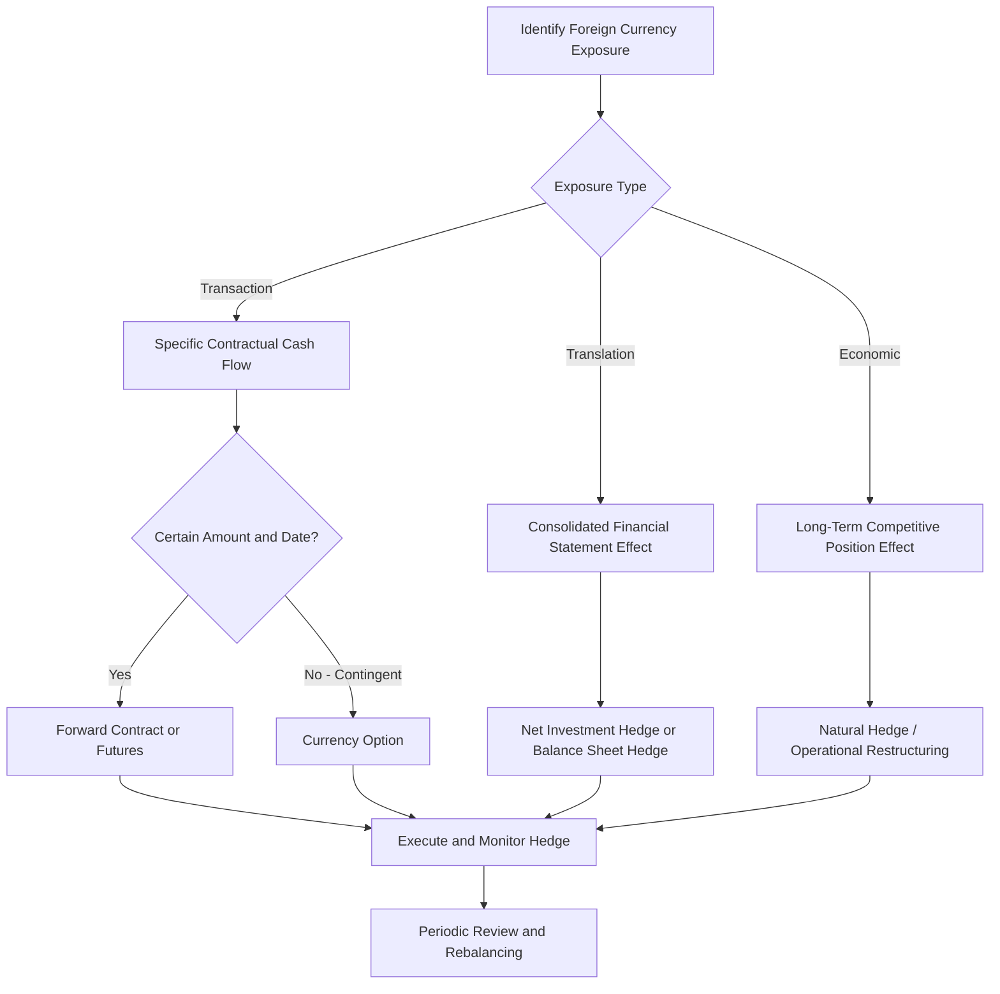

## Exchange Rate Risk and Hedging Decisions

### Overview

Exchange rate risk (currency risk) is the potential for financial loss arising from unfavorable movements in exchange rates between the time a foreign-currency-denominated obligation or asset is created and the time it is settled or realized. For firms operating internationally — whether through direct exports/imports, foreign subsidiaries, or foreign-currency financing — exchange rate risk is a core financial risk requiring deliberate identification, measurement, and management. This topic builds on the general exchange rate transmission concepts covered elsewhere in this curriculum by focusing specifically on the *risk management and hedging decision framework* that treasury and finance functions apply.

Unlike operational exposure discussed in broader exchange rate topics, this content focuses on the financial risk management toolkit: exposure classification, quantification methods, hedging instrument mechanics, and the strategic decision of how much exposure to hedge.

### Classification of Exchange Rate Exposure

**Key Points**

- **Transaction exposure**: Risk on specific, contractually fixed foreign-currency cash flows (receivables, payables, loan repayments) between contract date and settlement date.
- **Translation exposure (accounting exposure)**: Risk arising when consolidating foreign subsidiary balance sheets/income statements into the parent's reporting currency, affecting reported financial results without necessarily affecting actual cash flows.
- **Economic exposure (operating exposure)**: The broader, longer-term risk that exchange rate movements affect the present value of a firm's future cash flows through their effect on competitive position, sales volume, and cost structure — present even absent any specific contractual foreign-currency exposure.

| Exposure Type | Time Horizon | Measurable via | Hedgeable via Financial Instruments |
| --- | --- | --- | --- |
| Transaction | Short-term (days to ~1-2 years) | Specific contract cash flow schedules | Highly hedgeable (forwards, options, futures) |
| Translation | Periodic (quarterly/annual reporting) | Consolidated financial statement sensitivity | Partially hedgeable (net investment hedges) |
| Economic | Long-term (multi-year) | Scenario/sensitivity analysis of cash flow present value | Difficult to hedge financially; addressed structurally |

### Quantifying Transaction Exposure

**Net transaction exposure** for a given currency and settlement period is calculated as:

$$\text{Net Exposure} = \sum \text{Foreign-currency receivables} - \sum \text{Foreign-currency payables}$$

A positive net exposure (net receivable position) creates risk of loss from currency **depreciation** (foreign currency weakening against the reporting currency before conversion). A negative net exposure (net payable position) creates risk of loss from currency **appreciation** (foreign currency strengthening, making the payable more expensive in domestic terms).

**Example**

A firm has the following USD-denominated exposures settling in 90 days:

- Export receivable: USD 3,000,000
- Import payable: USD 1,200,000

Net exposure = USD 3,000,000 − USD 1,200,000 = **USD 1,800,000 net receivable position**, exposing the firm to loss if the USD depreciates against its reporting currency before settlement.

### Quantifying Economic Exposure: Regression-Based Approach

A common empirical method for estimating a firm's economic exposure is regressing firm value (or stock returns) against exchange rate changes:

$$R_{firm} = \alpha + \beta \cdot \Delta E + \epsilon$$

where $R_{firm}$ is the firm's stock return, $\Delta E$ is the percentage change in the relevant exchange rate, and $\beta$ (the **exposure coefficient**) measures the sensitivity of firm value to currency movements. A statistically significant $\beta$ indicates measurable economic exposure, with the sign indicating direction (positive $\beta$: firm value rises with currency depreciation, typical of net exporters; negative $\beta$: firm value falls with depreciation, typical of net importers).

[Inference] This regression approach is a standard technique in corporate finance for estimating economic exposure, though its explanatory power varies considerably by firm and is often lower than transaction exposure estimates due to the many confounding variables affecting stock returns.

### The Hedging Decision Framework

#### Step 1: Identify and Classify Exposure

Treasury functions maintain a currency exposure register cataloging all foreign-currency receivables, payables, committed but not-yet-invoiced transactions (anticipated exposure), and translation exposure from foreign subsidiaries.

#### Step 2: Determine Hedging Policy and Risk Appetite

Firms establish a hedging policy specifying:

- **Hedge ratio**: The percentage of identified exposure to be hedged (commonly ranging from 0% for firms accepting full currency risk to 100% for firms seeking complete certainty, with many firms adopting partial hedge ratios in the 50–80% range for near-term exposures).
- **Hedging horizon**: How far into the future exposures are hedged (e.g., rolling 12-month hedge programs are common for transaction exposure).
- **Instrument selection criteria**: Which instruments (forwards, options, swaps) are approved for use, often governed by board-level treasury policy.

#### Step 3: Select and Execute Hedging Instruments

#### Step 4: Monitor, Report, and Rebalance

Hedge positions require ongoing mark-to-market monitoring, effectiveness testing (particularly for hedge accounting treatment under relevant accounting standards), and rebalancing as underlying exposures change.

### Hedging Instrument Mechanics

#### Forward Contracts

A forward contract is a customized, over-the-counter (OTC) agreement to exchange a specified amount of currency at a specified rate on a specified future date.

$$F = S \times \frac{(1+i_{domestic} \times \frac{t}{360})}{(1+i_{foreign} \times \frac{t}{360})}$$

**Advantages**: Fully customizable amount and date; no upfront premium; complete rate certainty.

**Disadvantages**: Binding obligation (no upside participation if the rate moves favorably); counterparty credit risk; typically requires banking relationship and may require collateral/credit lines.

#### Currency Futures

Exchange-traded, standardized equivalents of forward contracts with fixed contract sizes and settlement dates, cleared through a central clearinghouse.

**Advantages**: Lower counterparty risk (clearinghouse guarantee); liquid secondary market; transparent pricing.

**Disadvantages**: Standardization may create basis risk (imperfect match to the firm's actual exposure amount/date); daily mark-to-market margin requirements affect cash flow.

#### Currency Options

A currency option provides the right, but not the obligation, to exchange currency at a specified strike rate before or at expiration, in exchange for an upfront premium.

$$\text{Payoff (Call option, buyer)} = \max(S_T - K, 0) - \text{Premium}$$

**Advantages**: Retains upside participation if the exchange rate moves favorably; defines maximum loss (the premium); flexible for uncertain/contingent exposures (e.g., a bid on a foreign contract not yet won).

**Disadvantages**: Upfront premium cost (unlike forwards); premium cost can be significant for volatile currency pairs or longer maturities.

#### Currency Swaps

An agreement to exchange principal and/or interest payments in different currencies over an extended period, commonly used to hedge longer-term foreign-currency debt or translation exposure from foreign subsidiaries.

**Advantages**: Suited to long-term, recurring exposure (e.g., multi-year foreign-currency loan); can combine interest rate and currency risk management.

**Disadvantages**: More complex structuring; typically requires strong banking relationships; longer-term counterparty risk.

#### Natural Hedging (Operational Hedging)

Rather than using financial instruments, firms can structurally reduce exposure by matching foreign-currency revenues with foreign-currency costs — for example, sourcing inputs in the same currency as export sales, or financing foreign operations with foreign-currency-denominated debt serviced by foreign-currency revenues.

**Advantages**: No transaction costs or counterparty risk; addresses economic exposure more durably than financial hedges.

**Disadvantages**: Constrained by operational flexibility (cannot always relocate sourcing or sales to match currencies); slower to implement than financial hedges.

### Hedging Decision Flow Diagram

### Worked Example: Forward vs. Option Hedge Comparison

**Example**

A firm expects to pay a foreign supplier EUR 1,000,000 in 6 months. Current spot rate: 1 EUR = USD 1.08. Six-month forward rate: 1 EUR = USD 1.10. A 6-month EUR call option (right to buy EUR) at strike USD 1.09 costs a premium of USD 20,000.

**Forward hedge**: Locks in cost at USD 1,100,000 (1,000,000 × 1.10) regardless of the spot rate at settlement.

**Option hedge**:

- If spot at settlement > USD 1.09: exercise option, pay USD 1,090,000 + USD 20,000 premium = USD 1,110,000 total.
- If spot at settlement < USD 1.09: let option lapse, buy EUR at the lower spot rate, total cost = (spot rate × 1,000,000) + USD 20,000 premium.

**Output**: The forward guarantees a fixed cost of USD 1,100,000 with no additional upside or downside. The option caps the maximum cost at USD 1,110,000 (strike plus premium) while allowing the firm to benefit if the euro weakens below the strike rate before settlement — at the cost of the USD 20,000 premium paid regardless of outcome. The choice between the two reflects the firm's view on likely currency movement and its risk tolerance: firms prioritizing cost certainty favor forwards; firms wanting to retain some upside while capping downside favor options, and are willing to pay the premium for that flexibility.

### To Hedge or Not to Hedge: The Strategic Debate

**Key Points**

- **Modigliani-Miller-adjacent argument against hedging**: In perfect capital markets, hedging at the firm level may not add value, since shareholders could diversify currency risk themselves through their own portfolios. [Inference] This argument is frequently cited in academic corporate finance but is heavily qualified by real-world market imperfections.
- **Practical arguments for corporate hedging** (addressing market imperfections):
  - Reduces the probability of financial distress from adverse currency swings, particularly relevant for highly leveraged firms.
  - Stabilizes cash flows, supporting more reliable capital budgeting and dividend policy.
  - Reduces information asymmetry costs — external investors and lenders often lack visibility into a firm's natural hedges and may apply a risk discount absent explicit hedging.
  - Many individual shareholders cannot efficiently replicate firm-specific operational currency exposure through personal portfolio hedging.
  - Tax convexity: In some tax regimes, stabilized (less volatile) pre-tax income can reduce expected tax liability under progressive tax structures.
- **Arguments for a partial/selective hedging approach**: Full hedging eliminates both downside risk and upside potential; many treasury functions adopt policies (e.g., hedge 50-75% of near-term exposure) balancing certainty with retained flexibility, particularly when management has some informed view on likely currency direction — though [Inference] deliberately taking unhedged speculative currency positions based on directional views is generally considered outside the scope of prudent corporate risk management by most treasury governance frameworks, which typically emphasize hedging for risk reduction rather than profit generation.

### Hedge Accounting Considerations

**Key Points**

- Hedge accounting treatment (under standards such as IFRS 9 or ASC 815 in relevant jurisdictions) allows firms to match the timing of gains/losses on a hedging instrument with the underlying hedged item in financial statements, reducing reported earnings volatility from the hedge itself.
- To qualify for hedge accounting, firms generally must document the hedging relationship, demonstrate hedge effectiveness, and meet ongoing effectiveness testing requirements.
- [Unverified] Specific hedge accounting rules and effectiveness thresholds vary by accounting standard and jurisdiction and are subject to periodic standard-setter revision; firms should confirm current requirements with qualified accounting professionals rather than relying on generalized treatment.

### Common Misconceptions

**Key Points**

- Hedging is not "speculation"; a properly designed hedge reduces the variance of outcomes around an expected value, whereas speculation involves taking on additional directional currency risk to profit from an anticipated movement.
- A 100% hedge ratio is not automatically optimal; it eliminates unfavorable currency movements but equally eliminates favorable ones, and carries direct costs (premiums, bid-ask spreads, administrative overhead) that must be weighed against risk reduction benefits.
- Natural hedges and financial hedges are not mutually exclusive; most sophisticated treasury functions use natural hedging to reduce the *base* exposure first, then apply financial instruments to hedge the *residual* exposure that cannot be structurally offset.

### Conclusion

Exchange rate risk management requires firms to first classify exposure into transaction, translation, and economic categories, each demanding different measurement approaches and hedging responses. Transaction exposure is the most directly hedgeable through forwards, futures, options, and swaps, each instrument offering distinct trade-offs between cost certainty, upside participation, premium cost, and counterparty risk. Economic exposure, being longer-term and structural, is generally better addressed through natural hedging and operational flexibility than financial instruments alone. Effective hedging decisions require a clearly articulated corporate policy on hedge ratios and risk appetite, grounded in the recognition that hedging aims to reduce cash flow and earnings volatility — supporting more reliable capital budgeting and reduced financial distress risk — rather than to speculate on currency direction.

**Related Topics**

- Exchange rates and their effect on domestic business
- Comparative advantage and global business strategy
- Interest rate parity and forward rate pricing
- Multinational capital budgeting under currency uncertainty
- Corporate treasury risk management frameworks
- Hedge accounting standards and effectiveness testing
- Country risk and political risk in international finance
- Working capital management for multinational firms
- Derivatives pricing fundamentals (forwards, futures, options, swaps)
- Foreign direct investment decision frameworks