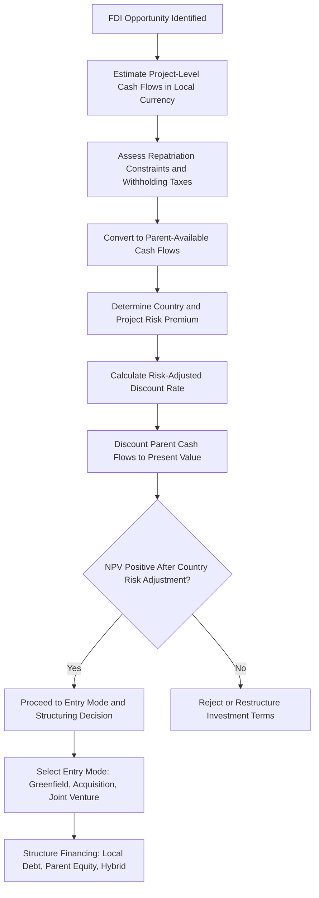

## Foreign Direct Investment Decision Analysis

### Overview

Foreign direct investment (FDI) refers to a firm establishing a lasting interest and significant degree of influence or control in a business enterprise located in a foreign country, typically through equity ownership, greenfield investment, or acquisition. FDI decision analysis is the managerial economics framework for evaluating whether, where, and how a firm should commit capital to foreign operations — integrating capital budgeting techniques with the additional layers of complexity introduced by cross-border risk: currency uncertainty, political risk, differing tax regimes, and repatriation constraints.

This topic builds on capital budgeting fundamentals and extends them to the multinational context, while also drawing on comparative advantage and exchange rate risk concepts covered elsewhere in this curriculum.

### FDI vs. Other International Business Modes

| Mode | Capital Commitment | Control Level | Risk Exposure |
| --- | --- | --- | --- |
| Exporting | Low | Low (arm's length) | Primarily transaction/currency risk |
| Licensing | Low | Low (contractual) | Limited; dependent on licensee performance |
| Joint venture | Moderate | Shared | Moderate; partner-dependent risk added |
| Greenfield FDI | High | Full (new entity) | Highest; full operational, political, currency exposure |
| Acquisition (Brownfield FDI) | High | Full (existing entity) | High; includes integration risk plus operational/political/currency exposure |

### Motives for FDI

**Key Points**

- **Market-seeking FDI**: Establishing local presence to access a foreign market directly, often to overcome trade barriers, transportation costs, or to respond to local demand characteristics.
- **Resource-seeking FDI**: Securing access to natural resources, raw materials, or specific factor inputs not available (or not competitively available) domestically.
- **Efficiency-seeking FDI**: Reorganizing production across borders to exploit comparative cost advantages, consistent with comparative-advantage-driven value chain disaggregation.
- **Strategic asset-seeking FDI**: Acquiring technology, brands, or capabilities through foreign investment to enhance long-term competitive position.

### The FDI Capital Budgeting Framework

FDI evaluation extends standard NPV analysis to explicitly account for currency conversion and cross-border cash flow complications:

$$NPV_{parent} = \sum_{t=0}^{n} \frac{CF_t^{foreign} \times E_t \times (1 - \text{repatriation friction}_t)}{(1+r_{parent})^t} - I_0$$

**Key distinguishing elements from domestic capital budgeting**:

#### 1. Project Cash Flows vs. Parent Cash Flows

A critical distinction in FDI analysis is between cash flows generated by the foreign project itself and cash flows actually available to (repatriable to) the parent company, which may differ due to:

- **Capital controls or repatriation restrictions**: Some countries limit the amount or timing of profit repatriation.
- **Withholding taxes on dividends/royalties**: Reducing the net amount received by the parent.
- **Blocked funds**: Funds legally restricted from repatriation that may still have value if usable for local reinvestment or through transfer pricing mechanisms.

[Inference] The appropriate discount rate and NPV analysis should generally be applied to *parent-available* cash flows rather than total project cash flows, since parent shareholders' wealth depends on what the parent company can actually access — though project-level cash flows remain relevant for assessing the standalone viability and negotiating position of the foreign operation.

#### 2. Discount Rate Selection

The discount rate for FDI evaluation must reflect the risk profile of the specific foreign investment, which typically differs from the parent's domestic WACC:

$$r_{project} = r_f + \beta_{project}(r_m - r_f) + \text{Country Risk Premium}$$

**Country risk premium** components commonly include:

- Political risk (expropriation, regulatory instability, civil unrest)
- Sovereign credit risk (reflected in sovereign bond yield spreads)
- Currency convertibility and transfer risk
- Legal system reliability and contract enforcement quality

#### 3. Terminal Value and Exit Considerations

FDI projects require explicit consideration of exit strategy and terminal value realization, which may be complicated by:

- Limited buyer pools in less-developed capital markets
- Regulatory approval requirements for foreign divestiture
- Currency conversion risk on the terminal value itself

### FDI Decision Analysis Flow Diagram

### Country Risk Assessment Methods

**Key Points**

- **Qualitative political risk assessment**: Structured analysis of government stability, regulatory predictability, expropriation history, and bilateral investment treaty coverage.
- **Sovereign credit ratings**: Ratings from agencies (e.g., Moody's, S&P, Fitch) provide a standardized, though imperfect, proxy for country risk, reflected in sovereign bond spreads over risk-free benchmarks.
- **Political risk insurance**: Available through multilateral institutions (e.g., the Multilateral Investment Guarantee Agency) and private insurers, covering specific risks such as expropriation, currency inconvertibility, and political violence — the insurance premium itself provides a market-based estimate of perceived risk.
- **Country risk premium quantification**: A common practical approach adds the sovereign bond yield spread (foreign sovereign bond yield minus a comparable-maturity risk-free benchmark) to the base project discount rate, though [Inference] this method is a simplifying approximation and does not perfectly capture project-specific political risk exposure, which can vary by industry and asset type even within the same country.

### Worked Example: FDI NPV with Country Risk and Repatriation Friction

**Example**

A firm evaluates a greenfield manufacturing investment:

- Initial investment: USD 15,000,000
- Expected local-currency project cash flow: equivalent to USD 3,500,000/year (at current exchange rate) for 8 years
- Base parent WACC: 8%
- Country risk premium: 4%
- Withholding tax on repatriated dividends: 10%
- Assume no further currency movement for simplicity (illustrative only)

**Risk-adjusted discount rate**: $8\% + 4\% = 12\%$

**Parent-available annual cash flow**: $3,500,000 \times (1 - 0.10) = \$3,150,000$

$$NPV = -15{,}000{,}000 + 3{,}150{,}000 \times \left[\frac{1-(1.12)^{-8}}{0.12}\right]$$

$$NPV = -15{,}000{,}000 + 3{,}150{,}000 \times 4.9676 \approx -15{,}000{,}000 + 15{,}647{,}940 = \$647{,}940$$

**Output**: The project generates a modestly positive NPV of approximately $647,940 after incorporating both the country risk premium (raising the discount rate from 8% to 12%) and the repatriation friction from withholding tax (reducing available cash flow by 10%). This illustrates how country-specific adjustments can materially affect project viability — the same project evaluated at the base domestic 8% WACC without the withholding tax adjustment would show a substantially higher (and potentially misleading) NPV of approximately $5.1 million, underscoring the importance of applying FDI-specific adjustments rather than domestic capital budgeting assumptions.

### Entry Mode Decision: Greenfield vs. Acquisition vs. Joint Venture

| Factor | Favors Greenfield | Favors Acquisition | Favors Joint Venture |
| --- | --- | --- | --- |
| Speed to market | Slower (build from scratch) | Faster (existing operations) | Moderate (dependent on partner readiness) |
| Control | Full | Full | Shared |
| Local market knowledge | Requires separate acquisition of knowledge | Inherited from target | Inherited from partner |
| Integration risk | None (new entity) | High (cultural, systems, personnel integration) | Moderate (governance complexity) |
| Regulatory approval complexity | Generally lower | Often higher (antitrust/foreign investment review) | Variable, often lower with local partner |
| Capital intensity | Front-loaded, full amount | Often front-loaded, full amount, plus premium over book value | Shared with partner |

### Financing Structure for FDI

**Key Points**

- **Parent equity financing**: Fully funded by the parent company, maximizing control but concentrating currency and country risk on the parent's balance sheet.
- **Local currency debt financing**: Borrowing in the host country's currency creates a natural hedge, since local-currency debt service is matched against local-currency revenues, reducing net currency exposure.
- **Project finance structures**: Non-recourse or limited-recourse financing secured against the specific project's assets and cash flows, isolating risk from the parent's broader balance sheet — commonly used for large infrastructure or resource-extraction FDI.
- **Tax-efficient capital structuring**: [Inference] Multinational firms often structure financing to optimize the global effective tax rate across jurisdictions, though this area is subject to extensive and evolving international tax regulation (e.g., transfer pricing rules, thin capitalization limits, and anti-base-erosion provisions), and specific structuring approaches should be evaluated with qualified international tax counsel rather than treated as a standardized formula.

### Sensitivity and Scenario Analysis for FDI

Given the layered uncertainty in FDI (currency, political risk, repatriation policy, operational execution), disciplined FDI analysis typically incorporates:

- **Scenario analysis**: Evaluating NPV under distinct discrete scenarios (e.g., base case, currency depreciation case, adverse regulatory change case).
- **Sensitivity analysis**: Testing NPV sensitivity to individual variables (exchange rate assumptions, discount rate, terminal value) to identify which assumptions most heavily drive the investment decision.
- **Break-even analysis**: Determining the threshold values (e.g., minimum exchange rate, maximum country risk premium) at which the project NPV turns negative, providing decision-makers with explicit risk tolerance boundaries.

### Real Options in FDI Decisions

**Key Points**

- FDI decisions often contain embedded **real options** not captured in standard NPV analysis: the option to expand (if initial results are favorable), the option to delay (waiting for more information before full commitment), the option to abandon (exiting if conditions deteriorate), and the option to switch (changing product mix or sourcing in response to local conditions).
- A staged/phased FDI approach (e.g., starting with a smaller pilot investment or joint venture before full-scale greenfield commitment) can be structured explicitly to preserve these real options, potentially justifying an investment that shows a marginal or slightly negative NPV under simple discounted cash flow analysis alone. [Inference] Real options valuation is a more advanced and less standardized technique than traditional NPV, and its application in practice varies in rigor across firms.

### Common Misconceptions

**Key Points**

- FDI decision analysis is not simply domestic capital budgeting with currency conversion applied at the end; country risk premiums, repatriation frictions, and financing structure interact with cash flows throughout the analysis, not just at the discounting step.
- A positive project-level NPV in local currency does not guarantee a positive parent-level NPV; repatriation restrictions, withholding taxes, and currency risk can materially erode value available to the parent even when the local operation itself is profitable.
- Political risk is not limited to expropriation or nationalization; more commonly encountered forms include regulatory changes, currency control tightening, contract renegotiation pressure, and bureaucratic delay, all of which can erode project value without outright asset seizure.

### Conclusion

Foreign direct investment decision analysis extends standard capital budgeting to address the distinctive risks of cross-border investment: the gap between project-level and parent-available cash flows, country-specific risk premiums, financing structure choices that can create natural currency hedges, and entry mode selection trade-offs between speed, control, and risk. Rigorous FDI analysis requires explicit adjustment for repatriation frictions and political/country risk in both cash flow estimation and discount rate selection, complemented by scenario and sensitivity analysis given the compounded uncertainty inherent in multinational investment. Firms that integrate these adjustments systematically — rather than applying domestic capital budgeting assumptions to foreign projects — make more reliable cross-border investment decisions.

**Related Topics**

- Comparative advantage and global business strategy
- Exchange rate risk and hedging decisions
- Exchange rates and their effect on domestic business
- Country risk assessment and political risk insurance
- Capital budgeting techniques and NPV/IRR analysis
- International tax planning and transfer pricing
- Real options analysis in strategic investment decisions
- Multinational capital structure and financing decisions
- Market entry mode selection frameworks
- Sovereign credit risk and bond spread analysis