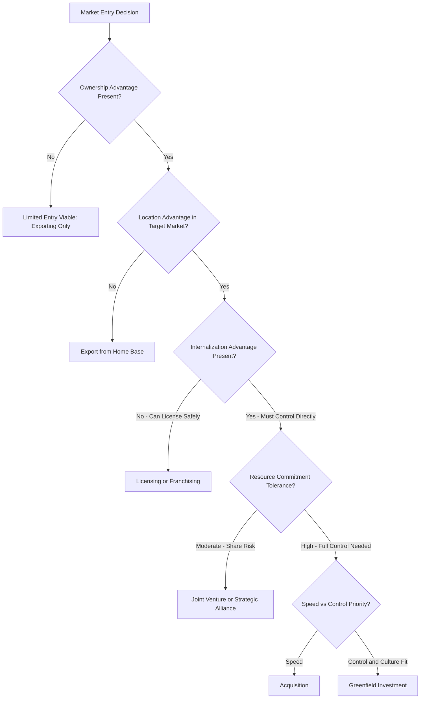

## Global Market Entry Mode Selection

### Overview

Market entry mode selection is the strategic decision framework a firm uses to determine *how* it enters a foreign market — the specific organizational and contractual structure through which it delivers products or services abroad. This decision sits downstream of the prior decision of *whether and where* to enter a foreign market (informed by comparative advantage and FDI analysis covered elsewhere in this curriculum) and determines the firm's resource commitment, control level, risk exposure, and speed of market access.

Entry mode selection is one of the most consequential decisions in international managerial economics because it is costly to reverse: switching from one mode to another (e.g., exiting a joint venture to establish a wholly owned subsidiary) typically involves significant transaction costs, relationship costs, and potential reputational effects.

### The Spectrum of Entry Modes

Entry modes exist on a continuum from lowest to highest resource commitment and control:

$$\text{Exporting} \rightarrow \text{Licensing/Franchising} \rightarrow \text{Joint Venture} \rightarrow \text{Wholly Owned Subsidiary (Greenfield or Acquisition)}$$

| Entry Mode | Resource Commitment | Control | Risk | Flexibility to Exit |
| --- | --- | --- | --- | --- |
| Exporting (direct/indirect) | Low | Low | Low (primarily transaction/currency risk) | High |
| Licensing | Low | Low | Low-moderate (dependent on licensee) | Moderate |
| Franchising | Low-moderate | Low-moderate (brand standards control) | Moderate (brand reputation risk) | Moderate |
| Contract manufacturing | Low-moderate | Low (production only) | Moderate (quality/IP risk) | High |
| Management contracts | Low | Moderate (operational control without ownership) | Low-moderate | High |
| Joint venture | Moderate-high | Shared | Moderate-high (partner/governance risk) | Low-moderate |
| Strategic alliance | Variable | Shared/negotiated | Variable | Moderate |
| Acquisition (wholly owned) | High | Full | High (integration + operational + political) | Low |
| Greenfield investment (wholly owned) | High | Full | Highest (full operational + political + currency) | Low |

### Theoretical Frameworks for Entry Mode Decisions

#### Transaction Cost Economics (TCE)

Rooted in the work of Coase and Williamson, TCE argues that firms choose entry modes that minimize the total transaction costs of exchanging value across a market interface — including search costs, negotiation costs, contracting costs, and monitoring/enforcement costs.

**Key Points**

- **High asset specificity** (specialized technology, proprietary processes) favors internalization (wholly owned modes) because contracting with external partners risks opportunistic behavior or knowledge leakage that is costly to prevent contractually.
- **High uncertainty** (market, behavioral, or environmental) tends to favor either full control (to retain flexibility) or minimal commitment (to preserve exit optionality), depending on the source of uncertainty.
- **Frequency of transactions**: Higher-frequency, ongoing relationships can justify the fixed costs of establishing internal (owned) structures over repeated market contracting.

#### The Eclectic (OLI) Paradigm

Developed by John Dunning, the OLI framework identifies three conditions that jointly determine whether a firm will pursue FDI versus alternative entry modes:

- **Ownership advantages (O)**: Firm-specific assets (proprietary technology, brand, managerial expertise) that provide a competitive edge transferable across borders.
- **Location advantages (L)**: Host-country-specific factors (factor costs, market size, infrastructure, regulatory environment) that make production or sales in that location attractive.
- **Internalization advantages (I)**: Benefits of the firm directly controlling and exploiting its ownership advantages internally rather than licensing or selling them to external parties (e.g., avoiding knowledge dissipation, maintaining quality control).

$$\text{FDI is favored when: O, L, and I advantages are simultaneously present}$$

If a firm has ownership advantages but lacks internalization advantages (e.g., the technology can be effectively protected and licensed), licensing becomes more attractive than direct investment. If location advantages are weak, exporting from the home base may dominate any form of local presence.

#### Resource-Based View (RBV)

The RBV frames entry mode choice around whether the firm's valuable, rare, and difficult-to-imitate resources and capabilities can be effectively transferred and protected under a given entry mode. Modes requiring less control (licensing, franchising) risk erosion of the resource-based competitive advantage if local partners can appropriate or replicate the underlying capability.

#### Institutional Theory

Host-country institutional environment — regulatory quality, legal enforcement reliability, cultural distance, and normative business practices — shapes which entry modes are both feasible and advisable. In institutionally weak or highly uncertain environments, firms often favor modes that reduce exposure (exporting, licensing, joint ventures with well-connected local partners) over high-commitment wholly owned investment.

### Entry Mode Decision Framework Diagram

### Key Decision Variables in Entry Mode Selection

#### 1. Market Size and Growth Potential

Larger, faster-growing markets generally justify higher resource commitment (joint ventures, wholly owned subsidiaries), since the potential returns justify the higher fixed costs and risk of deeper commitment. Smaller or uncertain markets often favor lower-commitment modes (exporting, licensing) that preserve flexibility.

#### 2. Cultural and Institutional Distance

**Key Points**

- Greater cultural distance (differences in language, business norms, consumer preferences) increases the value of local partner knowledge, favoring joint ventures or licensing arrangements over wholly owned entry.
- Greater institutional distance (differences in legal systems, regulatory transparency, property rights enforcement) increases the risk premium associated with direct investment, often favoring modes with lower asset exposure.
- [Inference] Empirical research on the relationship between cultural distance and entry mode choice shows a generally consistent but not universal pattern, since firm-specific factors (prior international experience, industry characteristics) can moderate or override the general tendency.

#### 3. Regulatory and Political Environment

Host-country restrictions on foreign ownership (e.g., mandatory local partner requirements in specific sectors, foreign investment screening regimes, sector-specific ownership caps) can directly constrain available entry modes regardless of the firm's preferred approach based on other factors.

#### 4. Competitive Dynamics

**First-mover considerations**: Entering ahead of competitors may favor faster modes (exporting, acquisition) to establish market position before rivals. **Follower strategy**: Firms entering after competitors have established market presence may benefit from observing competitors' entry mode outcomes and calibrating their own approach accordingly.

#### 5. Intellectual Property Protection Strength

Weak IP enforcement in the host market increases the risk of licensing or joint venture arrangements (technology or process knowledge leakage to local partners who may become competitors), often favoring wholly owned modes or, alternatively, avoiding the market for IP-sensitive activities altogether.

#### 6. Firm's International Experience

Firms with limited prior international experience often follow an **incremental internationalization pattern** (consistent with the Uppsala Model), starting with lower-commitment modes (exporting) in psychically/culturally close markets and progressively increasing commitment (licensing, joint ventures, wholly owned subsidiaries) as organizational learning and market knowledge accumulate. Firms with extensive international experience may bypass incremental stages and enter directly via higher-commitment modes when justified by strategic considerations.

### The Uppsala Internationalization Model

$$\text{Export} \rightarrow \text{Export via Agent} \rightarrow \text{Sales Subsidiary} \rightarrow \text{Production/Full Subsidiary}$$

This model proposes that firms internationalize incrementally, first entering psychically close markets (similar language, culture, business practices) before venturing into more distant markets, with commitment level increasing as experiential knowledge accumulates. [Inference] The Uppsala Model has faced substantial critique for not explaining the increasingly common phenomenon of "born global" firms that internationalize rapidly from inception, particularly in technology-intensive and digitally-enabled sectors, suggesting the model applies more reliably to traditional manufacturing and resource-based industries than to modern digitally-native businesses.

### Worked Example: Entry Mode Scoring Matrix

**Example**

A firm is evaluating entry into a new market and scores three candidate entry modes against weighted decision criteria (scale: 1 = poor fit, 5 = excellent fit):

| Criterion | Weight | Licensing | Joint Venture | Wholly Owned Subsidiary |
| --- | --- | --- | --- | --- |
| Speed to market | 0.20 | 5 | 3 | 2 |
| Control over operations | 0.25 | 1 | 3 | 5 |
| IP protection | 0.20 | 2 | 3 | 5 |
| Capital requirement (lower = better fit for constrained capital) | 0.15 | 5 | 3 | 1 |
| Local market knowledge access | 0.20 | 2 | 5 | 2 |

**Weighted scores**:

- Licensing: $(5 \times 0.20) + (1 \times 0.25) + (2 \times 0.20) + (5 \times 0.15) + (2 \times 0.20) = 1.00 + 0.25 + 0.40 + 0.75 + 0.40 = 2.80$
- Joint Venture: $(3 \times 0.20) + (3 \times 0.25) + (3 \times 0.20) + (3 \times 0.15) + (5 \times 0.20) = 0.60 + 0.75 + 0.60 + 0.45 + 1.00 = 3.40$
- Wholly Owned Subsidiary: $(2 \times 0.20) + (5 \times 0.25) + (5 \times 0.20) + (1 \times 0.15) + (2 \times 0.20) = 0.40 + 1.25 + 1.00 + 0.15 + 0.40 = 3.20$

**Output**: Under this firm's specific weighting of criteria — which places heavy emphasis on local market knowledge access and moderate emphasis on control — the joint venture scores highest (3.40), narrowly ahead of the wholly owned subsidiary (3.20), with licensing scoring lowest (2.80) primarily due to weak control and IP protection. This illustrates how a structured, weighted scoring approach makes the trade-offs between competing entry mode criteria explicit, though the firm should still stress-test the outcome against qualitative factors (partner availability and quality, regulatory constraints) not fully captured in the numerical weighting.

### Hybrid and Emerging Entry Modes

**Key Points**

- **Strategic alliances**: Non-equity or minority-equity collaborative arrangements short of full joint ventures, often used for specific functions (R&D collaboration, distribution partnerships) rather than full market entry.
- **Build-Operate-Transfer (BOT) arrangements**: Common in infrastructure and large-scale project entry, where a firm builds and operates a facility for a contracted period before transferring ownership to a local entity or government.
- **E-commerce/digital entry**: Increasingly allows firms to reach foreign consumers with minimal physical presence, though this mode still requires navigating local payment systems, logistics/fulfillment partnerships, consumer protection regulation, and data localization requirements — meaning "digital-only" entry is rarely entirely free of local operational considerations.
- **Franchise master agreements**: A hybrid combining licensing-like IP/brand transfer with more extensive operational standards control than pure licensing, common in food service and retail internationalization.

### Common Misconceptions

**Key Points**

- Higher control is not universally the optimal objective; the "best" entry mode depends on the specific combination of ownership, location, and internalization advantages present, and high-control modes carry correspondingly higher resource commitment and risk that may not be justified in every market.
- Entry mode decisions are not one-time, permanent choices; firms frequently evolve their entry mode over time as market conditions, firm capabilities, and risk tolerance change (e.g., converting a joint venture to a wholly owned subsidiary after building sufficient local market knowledge and trust).
- Cultural distance alone does not determine entry mode; it interacts with institutional, competitive, and firm-specific factors, and firms with strong prior experience in similarly distant markets may successfully use higher-commitment modes despite significant cultural distance.

### Conclusion

Global market entry mode selection requires firms to weigh resource commitment, control, and risk against market opportunity, institutional environment, and the firm's own ownership and internalization advantages. Frameworks such as transaction cost economics, the OLI (eclectic) paradigm, the resource-based view, and institutional theory provide complementary lenses for structuring the decision, while the Uppsala model captures the incremental learning pattern many firms follow — albeit with growing exceptions among digitally-enabled, rapidly internationalizing firms. Because entry mode decisions are costly to reverse and shape a firm's subsequent strategic options in a market, disciplined application of these frameworks, ideally supported by structured decision tools such as weighted scoring matrices, improves the quality and defensibility of the entry mode choice.

**Related Topics**

- Comparative advantage and global business strategy
- Foreign direct investment decision analysis
- Exchange rate risk and hedging decisions
- Transaction cost economics and the theory of the firm
- Cross-cultural management in international business
- Country risk assessment and political risk insurance
- Intellectual property protection strategy in international markets
- The Uppsala model and incremental internationalization
- Strategic alliance governance and partner selection
- Digital/e-commerce internationalization strategy