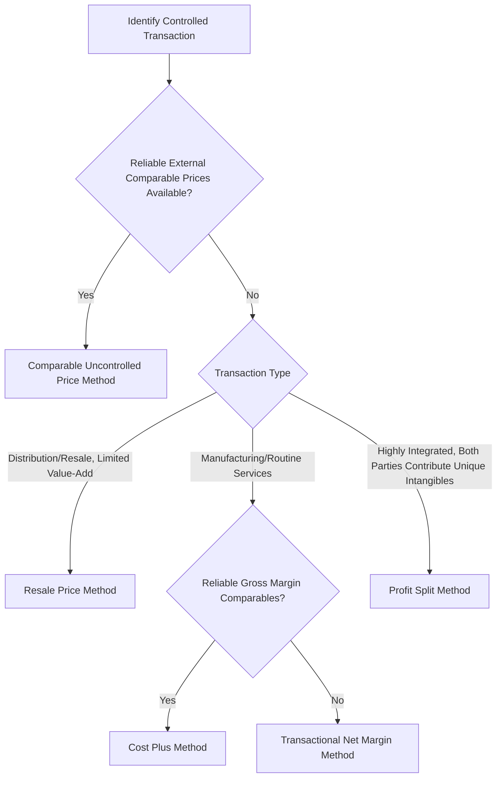

## Multinational Transfer Pricing Considerations

### Overview

Transfer pricing refers to the pricing of goods, services, intangible assets, and financing transactions exchanged between related entities within a multinational enterprise (MNE) — for example, a parent company selling components to its foreign subsidiary, or a subsidiary licensing intellectual property from its parent. Because these transactions occur between commonly controlled entities rather than independent market participants, transfer prices directly influence where profits are reported across jurisdictions with differing tax rates, making transfer pricing simultaneously a managerial accounting tool, a tax compliance obligation, and a strategic lever in global operations.

This topic covers the economic rationale for transfer pricing, the arm's length principle that governs regulatory compliance internationally, common transfer pricing methods, and the strategic and risk management considerations multinational firms must navigate.

### Why Transfer Pricing Matters

**Key Points**

- **Profit allocation across jurisdictions**: Transfer prices determine how much profit is recognized in each country where an MNE operates, directly affecting the firm's global effective tax rate.
- **Performance measurement**: Internal transfer prices affect how individual business units' profitability is measured, influencing capital allocation and management incentive decisions within the firm.
- **Resource allocation signaling**: Properly set transfer prices can replicate market-based decision signals internally, helping business units make economically efficient make-or-buy and capacity decisions even when transacting with sister units rather than external markets.
- **Regulatory and reputational risk**: Transfer pricing is one of the most heavily scrutinized areas of international tax compliance, with significant penalty exposure and reputational risk from perceived profit-shifting practices.

### The Arm's Length Principle

The foundational international standard for transfer pricing, endorsed by the OECD and adopted into most countries' domestic tax law, holds that transactions between related entities should be priced as if the parties were unrelated, independent entities transacting under comparable market conditions.

$$\text{Transfer Price}_{related} \approx \text{Price}_{unrelated, comparable transaction}$$

**Business implication**: Firms cannot set transfer prices purely to minimize global tax liability; prices must be defensible as approximating what independent parties would have agreed to under comparable circumstances, requiring documented economic analysis (a "transfer pricing study") to support the chosen methodology.

### Core Transfer Pricing Methods (OECD Framework)

#### 1. Comparable Uncontrolled Price (CUP) Method

Compares the price charged in the controlled (related-party) transaction to the price charged in comparable transactions between unrelated parties.

$$\text{Arm's Length Price} = \text{Price of comparable uncontrolled transaction}$$

**Best suited for**: Commodity products or standardized goods/services with readily observable market prices.

**Limitation**: Requires genuinely comparable uncontrolled transactions, which are often difficult to identify for specialized or unique products, particularly intangibles.

#### 2. Resale Price Method (RPM)

Starts from the price at which a product purchased from a related party is resold to an independent party, then subtracts an appropriate gross margin to arrive at the arm's length transfer price.

$$\text{Arm's Length Price} = \text{Resale Price} \times (1 - \text{Comparable Gross Margin \%})$$

**Best suited for**: Distribution/resale activities where the reseller adds limited value (e.g., simple distribution without significant processing or branding).

#### 3. Cost Plus Method

Starts from the cost incurred by the supplying related party, then adds an appropriate markup based on comparable uncontrolled transactions.

$$\text{Arm's Length Price} = \text{Cost} \times (1 + \text{Comparable Markup \%})$$

**Best suited for**: Manufacturing or service arrangements where the supplying entity performs routine functions and comparable cost-plus arrangements exist in the market.

#### 4. Transactional Net Margin Method (TNMM)

Examines the net profit margin (relative to an appropriate base such as costs, sales, or assets) realized by a party in a controlled transaction and compares it to the net margins earned by comparable independent enterprises engaged in similar transactions.

$$\text{Tested Party Net Margin} \approx \text{Comparable Independent Enterprises' Net Margin}$$

**Best suited for**: Situations where reliable gross margin or price comparables are unavailable, but broader net margin comparables (at the operating profit level) can be identified — this is among the most commonly applied methods in practice for routine manufacturing, distribution, and service functions. [Inference] TNMM's popularity in practice stems partly from the relative availability of net-margin-level comparable company data (e.g., from commercial databases) compared to the more granular price or gross-margin data required by CUP or RPM.

#### 5. Profit Split Method

Allocates combined profits from a controlled transaction between related parties based on the relative value of contributions (functions performed, assets used, risks assumed) each party brings to the transaction.

**Best suited for**: Highly integrated operations where both related parties contribute unique and valuable intangible assets, making it difficult to reliably benchmark either party separately using one-sided methods (CUP, RPM, cost plus, TNMM).

### Transfer Pricing Method Selection Framework

### Functional Analysis: The Foundation of Transfer Pricing

Before applying any pricing method, firms must conduct a **functional analysis** documenting each related party's:

- **Functions performed**: Manufacturing, R&D, marketing, distribution, risk management
- **Assets employed**: Tangible assets, intangible assets (patents, trademarks, know-how), and their relative value contribution
- **Risks assumed**: Market risk, inventory risk, credit risk, foreign exchange risk, product liability risk

This analysis (often summarized as the "FAR analysis" — Functions, Assets, Risks) determines which entity should be characterized as the higher-risk, higher-reward "entrepreneur" versus the lower-risk, more routine "limited-risk" entity, which in turn shapes the appropriate profit allocation and pricing method.

**Business implication**: Entities bearing greater functions, contributing more valuable assets, and assuming more risk are generally entitled (under the arm's length principle) to a greater share of residual profit; entities performing routine functions with limited risk typically earn a more modest, stable return regardless of the overall transaction's profitability.

### Worked Example: Cost Plus Method Application

**Example**

A parent company's manufacturing subsidiary in Country A produces components sold to a related distribution subsidiary in Country B. The manufacturing subsidiary's full cost per unit is $40. Comparable independent contract manufacturers in similar industries earn a gross markup of 15% on cost for similar routine manufacturing functions.

**Arm's length transfer price**:

$$\$40 \times (1 + 0.15) = \$46.00 \text{ per unit}$$

**Output**: The manufacturing subsidiary should transfer the components to the distribution subsidiary at $46.00 per unit to be consistent with the arm's length principle, based on the 15% markup earned by comparable independent contract manufacturers. If the firm instead set the transfer price at, say, $60.00 per unit to shift additional profit into Country A (perhaps due to a lower tax rate there), this would exceed the arm's length range established by comparable transactions and would be vulnerable to challenge and adjustment by Country A's or Country B's tax authorities upon audit, along with associated interest and penalty exposure.

### Transfer Pricing and Tax Risk Management

**Key Points**

- **Contemporaneous documentation**: Most jurisdictions require firms to prepare and maintain transfer pricing documentation (a "transfer pricing study" or "local file/master file" under OECD Base Erosion and Profit Shifting, BEPS, standards) at or near the time transactions occur, not retroactively when challenged.
- **Advance Pricing Agreements (APAs)**: Formal agreements negotiated in advance with one or more tax authorities, confirming that a specified transfer pricing methodology will be accepted for a defined period, reducing audit risk and providing planning certainty at the cost of upfront negotiation time and disclosure.
- **Double taxation risk**: If two countries' tax authorities disagree on the appropriate transfer price, the same income can effectively be taxed twice (once in each jurisdiction); mutual agreement procedures under bilateral tax treaties exist to resolve such disputes, though [Inference] resolution can be a lengthy process and outcomes are not guaranteed.
- **BEPS and global minimum tax developments**: The OECD's Base Erosion and Profit Shifting initiative and subsequent global minimum tax framework (Pillar Two) have introduced additional layers of complexity and disclosure requirements affecting transfer pricing strategy for large multinationals. [Unverified] Specific implementation details, thresholds, and country-by-country adoption status continue to evolve and should be verified against current guidance rather than treated as static, given the pace of international tax policy development in this area.

### Strategic Considerations Beyond Tax Compliance

#### Performance Measurement Distortion

If transfer prices are set primarily to optimize tax outcomes rather than to reflect genuine internal economic value, they can distort internal performance metrics — a subsidiary manager evaluated on profit margin may appear to underperform or overperform based on transfer pricing policy rather than genuine operational effectiveness. Firms often address this by using separate "management" transfer prices for internal performance evaluation purposes distinct from the "tax" transfer prices used for external reporting, provided this dual-pricing approach is implemented transparently and does not itself create compliance risk.

#### Tariff and Customs Valuation Interaction

Transfer prices used for income tax purposes also typically serve as the customs valuation basis for cross-border goods movements, meaning transfer pricing decisions can simultaneously affect income tax liability and import duty/tariff exposure — sometimes creating tension, since a lower transfer price may reduce customs duty but could also reduce the profit reported in a higher-value-added jurisdiction, requiring firms to evaluate the combined effect rather than optimizing for tax alone.

#### Currency and Exchange Rate Interaction

Transfer prices denominated in a specific currency create exposure similar to other intercompany transactions; firms must decide the invoicing currency for intercompany transactions, which interacts with the broader currency hedging considerations covered in related exchange rate risk topics.

### Common Misconceptions

**Key Points**

- Transfer pricing is not simply "internal accounting" with no external consequence; it is directly subject to tax authority audit and adjustment in virtually all jurisdictions with meaningful cross-border trade, carrying real financial and compliance risk.
- Minimizing global tax liability is not, by itself, a defensible transfer pricing objective; the arm's length principle requires prices to reflect what independent parties would have agreed to, regardless of the tax-minimizing intent behind the pricing choice.
- No single transfer pricing method is universally "correct"; method selection depends on the availability of reliable comparable data and the specific functional profile of the transaction, and tax authorities in different jurisdictions may have differing preferences or requirements regarding acceptable methods.

### Conclusion

Multinational transfer pricing sits at the intersection of managerial accounting, international tax compliance, and global operating strategy. The arm's length principle requires related-party transactions to be priced as if between independent parties, supported by functional analysis and one of several recognized methods (CUP, resale price, cost plus, TNMM, or profit split) depending on the transaction type and comparable data availability. Beyond tax compliance, transfer pricing decisions affect internal performance measurement, customs duty exposure, and currency risk management, making disciplined, well-documented transfer pricing policy a material component of overall multinational financial strategy rather than a narrow technical tax compliance exercise.

**Related Topics**

- Foreign direct investment decision analysis
- Global market entry mode selection
- Exchange rate risk and hedging decisions
- International tax planning and effective tax rate management
- OECD Base Erosion and Profit Shifting (BEPS) framework
- Customs valuation and tariff strategy
- Multinational performance measurement and management control systems
- Advance Pricing Agreements and dispute resolution mechanisms
- Intangible asset valuation in cross-border transactions
- Global minimum tax (Pillar Two) implications for multinational structuring