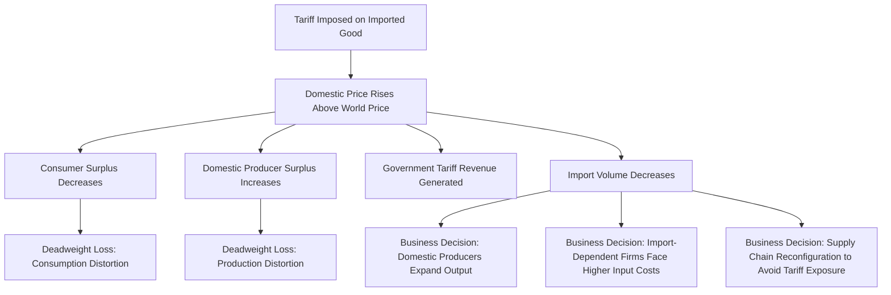

## Trade Policy, Tariffs, and Their Business Implications

### Overview

Trade policy encompasses the set of government instruments — tariffs, quotas, subsidies, non-tariff barriers, and trade agreements — that regulate the flow of goods and services across national borders. For managers, trade policy is a direct determinant of input costs, competitive positioning, market access, and supply chain design. This topic examines the economic mechanics of tariffs and other trade instruments, their welfare and business effects, and the strategic responses firms deploy to navigate an evolving trade policy landscape.

Trade policy analysis complements the comparative advantage framework covered elsewhere in this curriculum: while comparative advantage explains why trade generates mutual gains, trade policy instruments are the primary tools governments use to alter or restrict that trade for economic, political, or strategic reasons.

### Core Trade Policy Instruments

**Key Points**

- **Tariffs**: Taxes imposed on imported (or, less commonly, exported) goods, either as a fixed amount per unit (specific tariff) or a percentage of value (ad valorem tariff).
- **Quotas**: Quantitative limits restricting the volume of a good that can be imported (or exported) within a given period.
- **Subsidies**: Government payments or tax benefits to domestic producers, lowering their effective costs and improving competitiveness against imports or in export markets.
- **Non-tariff barriers (NTBs)**: Regulatory measures (technical standards, sanitary/phytosanitary requirements, licensing requirements, local content rules) that restrict trade without directly taxing it.
- **Voluntary export restraints (VERs)**: Agreements where an exporting country voluntarily limits exports to a specific market, often negotiated to preempt more restrictive unilateral action by the importing country.
- **Trade agreements**: Bilateral or multilateral arrangements (free trade agreements, customs unions, common markets) that reduce or eliminate trade barriers among member countries.

### The Economics of a Tariff: Partial Equilibrium Analysis

A tariff on an imported good raises its domestic price above the world price, with effects distributed across consumers, producers, and government revenue.

$$P_{domestic} = P_{world} + \text{Tariff}$$

**Welfare effects of a tariff** (in a small-country model where the importing country cannot influence the world price):

- **Consumer surplus**: Decreases, as domestic consumers pay a higher price and consume less of the good.
- **Producer surplus**: Increases, as domestic producers benefit from the higher protected price and expand output.
- **Government revenue**: Increases, equal to the tariff rate multiplied by the quantity of imports after the tariff.
- **Deadweight loss**: Arises from two sources — the **production distortion** (domestic resources shifted into less efficient production that would not be competitive at the world price) and the **consumption distortion** (consumers forgoing purchases they would have made at the lower world price).

$$\text{Net Welfare Effect} = \Delta CS + \Delta PS + \Delta \text{Government Revenue} = -\text{Deadweight Loss}$$

[Inference] In the small-country case, a tariff unambiguously reduces national welfare, since the country cannot extract better terms of trade from foreign suppliers to offset the deadweight loss; this result differs in the large-country case, discussed below.

### Tariff Effects Diagram

### The Large-Country Case: Optimal Tariff Theory

If a country is large enough to influence world prices through its import demand (a "large country" in trade theory terms), a tariff can, in principle, improve the country's terms of trade by reducing import demand enough to lower the world price paid to foreign suppliers, partially offsetting the domestic deadweight loss with a terms-of-trade gain.

$$\text{National Welfare Change} = \text{Terms-of-Trade Gain} - \text{Deadweight Loss}$$

An "optimal tariff" in this framework is the rate that maximizes net national welfare by balancing these two effects. [Inference] This result is a standard finding in international trade theory, but it assumes the exporting country does not retaliate; in practice, retaliation risk (discussed below) substantially undermines the practical case for deliberately pursuing an optimal tariff strategy, and most mainstream trade economists view retaliation-adjusted outcomes as generally welfare-reducing for both parties.

### Non-Tariff Barriers and Their Business Effects

| Instrument | Mechanism | Primary Business Impact |
| --- | --- | --- |
| Technical/product standards | Requires compliance with specific safety, quality, or technical specifications | Compliance cost; potential redesign of products for specific markets |
| Sanitary and phytosanitary (SPS) measures | Health/safety requirements for agricultural and food products | Testing, certification, and inspection costs; potential market exclusion |
| Import licensing requirements | Requires government authorization prior to importation | Administrative delay; potential quota-like restriction if licenses are limited |
| Local content requirements | Mandates a minimum percentage of domestic-sourced components | Forces supply chain localization; may increase production costs if local suppliers are less competitive |
| Government procurement preferences | Favors domestic suppliers in public sector purchasing | Excludes or disadvantages foreign firms from public contract bidding |
| Rules of origin | Determines which country a good is deemed to originate from for tariff/trade agreement purposes | Affects eligibility for preferential tariff treatment under trade agreements; can require supply chain restructuring |

### Trade Agreements and Preferential Trade Areas

**Key Points**

- **Free trade agreement (FTA)**: Member countries eliminate tariffs and most trade barriers among themselves while maintaining independent trade policy toward non-members.
- **Customs union**: An FTA plus a common external tariff applied uniformly by all members toward non-member countries.
- **Common market**: A customs union plus free movement of factors of production (labor and capital) among members.
- **Economic union**: A common market plus harmonized economic policies (monetary, fiscal) among members.
- **Rules of origin** are critical in FTAs (but not customs unions, which share a common external tariff) to prevent "trade deflection" — routing goods through the lowest-tariff member country before re-exporting to a higher-tariff member.

**Business implication**: Firms operating across FTA member countries can achieve significant cost advantages by structuring supply chains to qualify for preferential tariff treatment under applicable rules of origin, but this requires careful documentation and compliance to avoid retroactive duty assessment and penalties if origin claims are challenged.

### Business Response Strategies to Trade Policy Changes

#### Supply Chain Reconfiguration ("Tariff Engineering" and Diversification)

Firms facing new or increased tariffs on specific input sourcing countries often respond by:

- **Supplier diversification**: Shifting sourcing to countries not subject to the tariff, though this may involve transition costs, quality risk, and potentially less efficient production relative to comparative advantage.
- **Tariff engineering**: Legally modifying product design, assembly location, or classification to qualify for a lower tariff rate or different tariff classification, provided the modification reflects genuine economic substance rather than artificial restructuring designed solely to circumvent duties (which can trigger anti-circumvention enforcement).
- **Final assembly relocation**: Shifting final assembly (which often determines "substantial transformation" for origin purposes) to a location outside the tariff's scope, even while intermediate components continue to be sourced from the originally tariffed country.

#### Pricing and Margin Absorption Decisions

Firms facing tariff-driven cost increases must decide the extent to which they:

- **Pass through costs to customers**: Raising prices to offset the tariff, with the pass-through rate depending on price elasticity of demand and competitive intensity.
- **Absorb costs into margin**: Maintaining prices and accepting reduced margins, typically favored when demand is highly price-elastic or competitive pressure is intense.
- **Blend approaches**: Partial pass-through combined with cost reduction efforts elsewhere in the value chain.

#### Lobbying and Trade Remedy Petitions

**Key Points**

- Firms and industry associations may engage in lobbying to influence trade policy formation, seeking tariff relief, exclusions, or the imposition of protective measures against foreign competitors.
- **Antidumping duties**: Additional tariffs imposed when a foreign producer is found to be selling in the domestic market below its home-market price or cost of production ("dumping"), causing material injury to domestic industry.
- **Countervailing duties**: Additional tariffs imposed to offset foreign government subsidies found to unfairly benefit foreign producers competing in the domestic market.
- Both antidumping and countervailing duty processes typically require formal petition, investigation, and determination by designated government trade authorities, and represent a formal legal/administrative channel (distinct from general lobbying) through which domestic firms can seek relief from perceived unfair foreign competition.

### Retaliation and Trade War Dynamics

When one country imposes tariffs, affected trading partners frequently respond with retaliatory tariffs on the imposing country's exports, creating an escalation dynamic sometimes termed a "trade war." Game-theoretic analysis of tariff retaliation typically models this as a scenario with characteristics resembling a prisoner's dilemma: both countries may be worse off under mutual tariff escalation than under mutual free trade, yet each retains an individual incentive to impose tariffs if it expects the other to do so (or to retaliate if tariffs are imposed against it), making sustained mutual liberalization dependent on credible, typically institutionalized cooperation mechanisms (e.g., World Trade Organization dispute settlement, binding trade agreements).

**Business implication**: Firms operating in industries subject to retaliatory tariff risk (agriculture, autos, and technology hardware/components have historically been common retaliation targets in various trade disputes) should incorporate trade policy escalation scenarios into supply chain and market diversification planning, given that retaliation can affect entirely different products/sectors than those targeted by the original tariff action.

### Worked Example: Tariff Cost Pass-Through Decision

**Example**

A firm imports a component subject to a newly imposed 25% tariff, previously landed at $80 per unit. Post-tariff landed cost: $100 per unit. The firm sells the finished product at $150, with the component representing the primary variable cost driver. Estimated price elasticity of demand for the finished product: −1.8 (relatively elastic).

**Full pass-through scenario**: Raise price by $20 to $170 (assuming a 1:1 cost pass-through on the component increase) — but given elasticity of −1.8, this roughly 13.3% price increase could reduce quantity demanded by approximately 24%, given by $\%\Delta Q \approx \epsilon \times \%\Delta P = -1.8 \times 13.3\% \approx -24\%$.

**Partial absorption scenario**: Raise price by only $10 (to $160, a 6.7% increase), absorbing the remaining $10 into margin, resulting in an estimated quantity decline of approximately $-1.8 \times 6.7\% \approx -12\%$.

**Output**: Given the relatively elastic demand for this product, full cost pass-through risks a substantially larger volume decline than partial absorption. The firm must weigh the revenue and market share impact of full pass-through against the margin compression of partial absorption — a decision that also depends on competitors' pass-through behavior (if competitors face the same tariff and pass through fully, the firm's relative competitive position may be unaffected by matching that pass-through) and the expected duration of the tariff (temporary tariffs may favor margin absorption to preserve customer relationships, while long-term/permanent tariffs more often necessitate full or partial pass-through and structural supply chain adjustment).

### Sector-Differentiated Exposure to Trade Policy

| Sector | Typical Trade Policy Exposure |
| --- | --- |
| Manufacturing (import-dependent inputs) | High exposure to input tariff costs; frequent target of tariff engineering strategies |
| Agriculture | High exposure to both tariffs and non-tariff barriers (SPS measures); common target of retaliatory tariffs |
| Technology/electronics | High exposure to both input tariffs and retaliatory export market tariffs; significant rules-of-origin complexity in globally distributed supply chains |
| Domestic import-competing industries | Beneficiary of protective tariffs; risk of complacency reducing long-term competitiveness |
| Export-oriented industries | Exposure to retaliatory tariffs imposed by trading partners in response to home-country trade actions |
| Services | Generally lower direct tariff exposure (tariffs primarily apply to goods) but subject to non-tariff barriers such as licensing and regulatory restrictions |

### Common Misconceptions

**Key Points**

- Tariffs do not exclusively harm foreign producers; the economic incidence of a tariff (who actually bears the cost) is shared between foreign producers (if they lower prices to remain competitive), domestic consumers/importers (through higher prices), and is influenced by relative demand and supply elasticities, not simply assigned entirely to the foreign exporting country.
- Protective tariffs benefiting a specific domestic industry do not represent a net gain for the broader economy; the welfare analysis shows that protected producers and government revenue gains are generally outweighed by losses to consumers and the deadweight loss from resource misallocation, except in the qualified large-country optimal tariff case (which itself assumes no retaliation).
- Trade agreements do not eliminate all trade friction; non-tariff barriers, rules of origin compliance costs, and remaining sector-specific exceptions often continue to create meaningful business complexity even under comprehensive free trade agreements.

### Conclusion

Trade policy instruments — tariffs, quotas, subsidies, and non-tariff barriers — directly reshape the cost structures, competitive dynamics, and supply chain economics facing businesses engaged in international trade, and increasingly affect purely domestic firms through import-competing and input-cost channels. Understanding the welfare mechanics of tariffs, the strategic dynamics of retaliation, and the available business response tools (supply chain reconfiguration, pricing pass-through decisions, trade remedy petitions, and trade agreement utilization) allows managers to respond proactively to an increasingly volatile global trade policy environment rather than treating tariff and trade policy shifts as unmanageable external shocks.

**Related Topics**

- Comparative advantage and global business strategy
- Exchange rates and their effect on domestic business
- Global market entry mode selection
- Multinational transfer pricing considerations
- World Trade Organization dispute settlement mechanisms
- Antidumping and countervailing duty investigation processes
- Supply chain risk management and diversification strategy
- Rules of origin and preferential trade agreement compliance
- Game theory and strategic trade policy interactions
- Non-tariff barrier compliance and international regulatory strategy