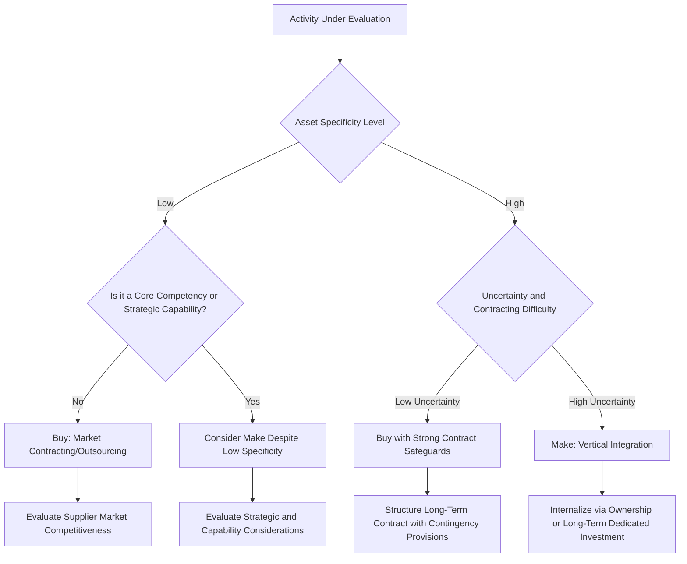

## Make-or-Buy and Outsourcing Decisions

### Overview

The make-or-buy decision is a foundational problem in organizational economics: should a firm produce a given input, component, or service internally (integration/"make"), or procure it from an external supplier through market contracting ("buy"/outsourcing)? This decision sits at the heart of the **theory of the firm**, addressing the fundamental question of why firms exist at all as an alternative to pure market coordination, and provides managers with a rigorous economic framework for structuring vertical integration, outsourcing, and supply chain boundary decisions.

This topic covers the transaction cost economics foundation of the make-or-buy decision, complementary frameworks (resource-based view, agency theory), practical financial and qualitative decision criteria, and common pitfalls in outsourcing strategy.

### The Theory of the Firm: Why Boundaries Matter

Ronald Coase's foundational insight, later extended by Oliver Williamson, is that firms exist because using the market carries **transaction costs** — the costs of searching for suppliers, negotiating contracts, monitoring performance, and enforcing agreements — that can sometimes be avoided by bringing an activity inside the firm and coordinating it through managerial authority (hierarchy) instead.

$$\text{Make if: } TC_{market} + P_{market} > C_{internal}$$

$$\text{Buy if: } TC_{market} + P_{market} < C_{internal}$$

where $TC_{market}$ represents transaction costs of using the market, $P_{market}$ is the market price paid to an external supplier, and $C_{internal}$ is the full cost of internal production (including opportunity costs of capital and management attention).

### Transaction Cost Economics (TCE) Framework

**Key Points — Core Determinants of Transaction Costs**

- **Asset specificity**: The degree to which an investment (in equipment, human capital, location, or dedicated relationships) has significantly higher value in its intended use than in alternative uses. Higher asset specificity increases the risk of **hold-up** — a trading partner exploiting the specialized investment's lack of alternative use to extract unfavorable renegotiated terms — favoring internalization (make).
- **Uncertainty**: Greater environmental or behavioral uncertainty increases the cost and difficulty of writing complete contracts that anticipate all future contingencies, favoring internalization when combined with meaningful asset specificity.
- **Frequency**: Transactions that recur frequently can justify the fixed costs of establishing internal governance structures (make), while infrequent transactions may not justify those fixed costs relative to simply contracting in the market each time (buy).
- **Bounded rationality**: The recognition that decision-makers cannot anticipate and contractually specify every possible future contingency, making long-term contracts inherently incomplete and increasing the relative appeal of internal hierarchical governance (which can adapt more flexibly through managerial fiat) for complex, uncertain transactions.
- **Opportunism**: The assumption that trading partners may act in self-interested ways, including strategic misrepresentation, when it is advantageous to do so, reinforcing the hold-up risk associated with high asset specificity.

### Types of Asset Specificity

| Type | Description | Example |
| --- | --- | --- |
| Site specificity | Assets located adjacently to minimize transport/inventory costs | Co-located manufacturing facilities |
| Physical asset specificity | Specialized equipment/tooling designed for a specific transaction | Custom-tooled dies for a single customer's part specifications |
| Human asset specificity | Specialized knowledge or skills developed through a specific relationship | Deep familiarity with a particular client's systems and processes |
| Dedicated asset specificity | Investment made specifically to serve a particular customer, with limited value if that relationship ends | Capacity expansion undertaken solely to supply one buyer |
| Brand name capital specificity | Investments tied to maintaining a specific brand's reputation | Franchise-specific operational standards investment |

### The Make-or-Buy Decision Framework Diagram

### Complementary Frameworks

#### Resource-Based View (RBV) and Core Competency Theory

Beyond pure transaction cost minimization, firms should retain (make) activities that constitute **core competencies** — capabilities that are valuable, rare, difficult to imitate, and organizationally embedded, providing sustainable competitive advantage — even when transaction cost analysis alone might suggest outsourcing could be cost-effective. Conversely, non-core, commodity-like activities are generally strong outsourcing candidates regardless of asset specificity, provided a competitive supplier market exists.

**Business implication**: A firm might retain internal production of a component with only moderate asset specificity if that component embeds proprietary process knowledge central to its competitive differentiation, while outsourcing a higher-specificity but non-differentiating activity (e.g., specialized but replicable facility maintenance) if reliable long-term contracts can adequately mitigate hold-up risk.

#### Agency Theory Considerations

Outsourcing introduces a principal-agent relationship between the firm (principal) and the external supplier (agent), with associated **agency costs**: monitoring costs (verifying supplier performance and quality), bonding costs (supplier investments to credibly signal reliability), and residual loss (imperfect alignment of interests despite monitoring and bonding). These costs must be weighed against the potential efficiency gains from outsourcing (supplier specialization, scale economies, competitive market discipline).

$$\text{Total Outsourcing Cost} = \text{Contract Price} + \text{Monitoring Costs} + \text{Residual Agency Loss}$$

### Financial Analysis Framework for Make-or-Buy

#### Relevant Cost Analysis

The core financial comparison should isolate **relevant costs** — those that differ between the make and buy alternatives — while excluding sunk costs and unavoidable fixed costs that persist regardless of the decision.

$$\text{Make Cost} = \text{Variable Cost} + \text{Avoidable Fixed Cost} + \text{Opportunity Cost of Capacity Used}$$

$$\text{Buy Cost} = \text{Purchase Price} + \text{Transaction/Monitoring Costs} + \text{Transition/Switching Costs (amortized)}$$

**Key Points**

- **Opportunity cost of capacity**: If internal production uses capacity that has an alternative profitable use (e.g., producing a different, higher-margin product), that forgone contribution margin must be included in the "make" cost — a frequently overlooked element that can reverse an otherwise favorable make decision.
- **Avoidable vs. unavoidable fixed costs**: Only fixed costs that would actually be eliminated by outsourcing (e.g., dedicated supervisory staff, equipment that could be sold or repurposed) are relevant; allocated overhead that persists regardless of the decision should be excluded from the comparison.
- **Quality and reliability risk premium**: Outsourcing decisions should incorporate a risk-adjusted cost premium reflecting the potential cost of supplier quality failures, delivery delays, or relationship breakdown, particularly for high-specificity or mission-critical inputs.

### Worked Example: Relevant Cost Make-or-Buy Analysis

**Example**

A firm currently manufactures a component internally at a reported total cost of $18 per unit (50,000 units/year), consisting of:

- Direct materials: $6.00
- Direct labor: $5.00
- Variable overhead: $2.00
- Fixed overhead (allocated): $5.00, of which $3.00 is avoidable if production stops (supervisor salary, dedicated equipment maintenance) and $2.00 is unavoidable allocated corporate overhead

An external supplier offers to supply the component at $14.50 per unit. If production stops, the freed capacity can be used to produce a different product generating $40,000 in additional annual contribution margin.

**Relevant "make" cost per unit**:

$$\$6.00 + \$5.00 + \$2.00 + \$3.00 \text{ (avoidable fixed)} = \$16.00$$

**Relevant "buy" cost per unit**, incorporating the opportunity cost of freed capacity:

$$\$14.50 + \frac{\$40{,}000}{50{,}000 \text{ units}} = \$14.50 + \$0.80 = \$15.30$$

**Output**: Excluding the unavoidable $2.00 of allocated corporate overhead (irrelevant to the decision since it persists regardless), the relevant make cost is $16.00 per unit versus a relevant buy cost of $15.30 per unit once the opportunity cost of the freed capacity is included. The buy option is favorable by $0.70 per unit ($35,000 annually across 50,000 units) on a purely financial basis. However, this result should be weighed against qualitative factors — asset specificity of the component, supplier reliability risk, and whether the component embeds any strategically important process knowledge — before finalizing the decision, since a narrow financial margin can be outweighed by strategic or risk considerations not captured in the relevant cost calculation alone.

### Strategic and Qualitative Considerations

**Key Points**

- **Supplier market competitiveness**: Outsourcing to a monopolistic or highly concentrated supplier market can shift the hold-up risk from the firm to itself, as a dominant supplier may extract unfavorable terms over time — the make-or-buy analysis should consider supplier market structure, not just current pricing.
- **Intellectual property and knowledge leakage risk**: Outsourcing activities that require sharing proprietary designs, processes, or data creates risk of knowledge appropriation, particularly relevant when suppliers also serve competitors.
- **Flexibility and scalability**: Outsourcing can provide flexibility to scale volume up or down without the fixed cost commitment of internal capacity, valuable in volatile demand environments, though this flexibility may come at the cost of reduced control over quality and delivery timing during periods of high supplier demand from multiple customers.
- **Supply chain resilience**: Concentrating sourcing in a single external supplier (whether domestic or foreign) creates single-point-of-failure risk; firms increasingly weigh outsourcing decisions against resilience considerations following notable historical supply chain disruptions, sometimes favoring dual-sourcing or maintained internal backup capability even when pure cost analysis favors full outsourcing.
- **Transition and reversibility costs**: Outsourcing decisions, particularly those involving the sale or decommissioning of internal capacity, can be costly and slow to reverse if the firm later needs to re-internalize the activity ("reshoring"), and this asymmetric reversibility should factor into the decision alongside the static cost comparison.

### Hybrid and Intermediate Governance Structures

Between pure "make" (full vertical integration) and pure "buy" (arm's length market contracting), firms frequently adopt intermediate governance structures that partially address hold-up risk without the full commitment of ownership:

- **Long-term contracts with contingency provisions**: Detailed contracts specifying pricing adjustment mechanisms, quality standards, and dispute resolution procedures to reduce (though not eliminate) contracting incompleteness.
- **Relational contracting**: Reliance on repeated interaction, reputation, and informal trust-based norms to sustain cooperation beyond what formal contracts alone specify, particularly valuable in relationships with high uncertainty where complete contracts are infeasible.
- **Strategic alliances and joint ventures**: Shared ownership or governance structures that align incentives between the firm and its supplier without full vertical integration.
- **Equity stakes in key suppliers**: Taking a minority ownership position in a critical supplier to align incentives and gain some governance influence without full acquisition.

### Outsourcing Risk Categories

| Risk Category | Description | Mitigation Approach |
| --- | --- | --- |
| Quality risk | Supplier fails to meet quality specifications | Robust quality audit processes, contractual quality guarantees |
| Delivery/reliability risk | Supplier fails to deliver on time or in required volume | Dual sourcing, safety stock buffers, penalty clauses |
| Hold-up/opportunism risk | Supplier exploits switching costs to extract unfavorable terms | Long-term contracts, relational governance, maintaining credible alternative supplier options |
| Knowledge leakage risk | Proprietary information appropriated by supplier or leaked to competitors | IP protection clauses, limiting information shared, non-compete provisions where enforceable |
| Reputational risk | Supplier's practices (labor, environmental, quality) reflect negatively on the outsourcing firm | Supplier due diligence, audit rights, codes of conduct |
| Geopolitical/country risk | Supplier location subject to political instability, trade policy shifts, or regulatory change | Geographic diversification, scenario planning (connects to trade policy considerations) |

### Common Misconceptions

**Key Points**

- The make-or-buy decision is not purely a cost-minimization exercise; asset specificity, strategic core competency status, and hold-up risk can justify internalizing an activity even when an external supplier offers a lower current price.
- Outsourcing is not a one-time, permanent decision; firms regularly reassess make-or-buy boundaries as supplier markets evolve, asset specificity changes (e.g., through standardization), and strategic priorities shift, and increasingly some firms have reversed prior outsourcing decisions (reshoring) when hold-up, quality, or resilience risks proved more costly than anticipated.
- Lower supplier price alone does not indicate a sound "buy" decision; the relevant cost comparison must include transaction/monitoring costs, opportunity costs of freed capacity, and risk-adjusted premiums for quality, reliability, and hold-up exposure, not simply the headline price difference.

### Conclusion

The make-or-buy decision is grounded in transaction cost economics, which identifies asset specificity, uncertainty, and transaction frequency as the key determinants of whether market contracting or internal hierarchy more efficiently governs a given economic activity. This framework is complemented by resource-based view considerations (protecting core competencies) and agency theory (accounting for monitoring and residual loss costs inherent in supplier relationships). Sound make-or-buy analysis requires rigorous relevant-cost financial comparison — correctly excluding sunk and unavoidable costs while including opportunity costs of freed capacity — combined with qualitative assessment of hold-up risk, supplier market structure, knowledge leakage exposure, and supply chain resilience, recognizing that intermediate governance structures (long-term contracts, alliances, relational contracting) often provide a more nuanced solution than the binary make-versus-buy framing suggests.

**Related Topics**

- Trade policy, tariffs, and their business implications
- Multinational transfer pricing considerations
- Vertical integration strategy and value chain analysis
- Principal-agent theory and contract design
- Supply chain risk management and diversification strategy
- Core competency and resource-based view of the firm
- Relational contracting and long-term supplier relationship management
- Reshoring and supply chain resilience strategy
- Comparative advantage and global business strategy
- Capital budgeting for outsourcing and capacity decisions