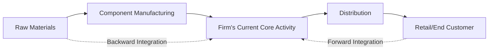
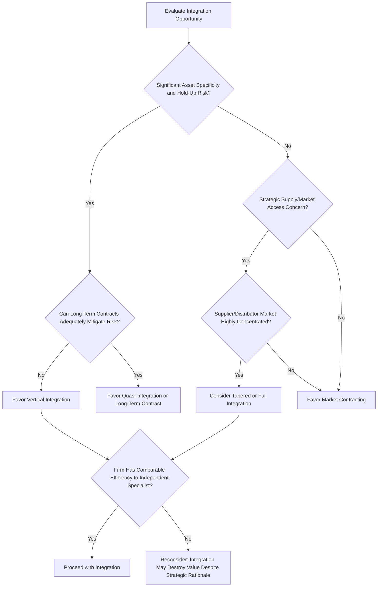

## Vertical Integration and Its Economic Rationale


### Overview

Vertical integration is the strategy of bringing multiple stages of a firm's production and distribution value chain under common ownership and control, rather than relying on independent market transactions with separate upstream suppliers or downstream distributors/retailers. This topic builds directly on the make-or-buy decision framework covered previously, extending the analysis from single-transaction decisions to the broader strategic question of how much of the value chain a firm should own outright, and examines both the economic motivations for integration and the substantial costs and risks that limit its desirability.

### Defining the Direction and Degree of Integration

**Key Points**

- **Backward (upstream) integration**: A firm acquires or develops capability at earlier stages of the value chain — for example, a manufacturer acquiring a raw material supplier or component producer.
- **Forward (downstream) integration**: A firm acquires or develops capability at later stages of the value chain — for example, a manufacturer acquiring distribution channels or retail outlets.
- **Full integration**: The firm owns and internally supplies 100% of its requirements at a given stage, with no reliance on external market transactions for that input or output.
- **Tapered (partial) integration**: The firm owns some internal capacity at a given stage while also sourcing from or selling to external market participants, retaining a market benchmark for internal transfer pricing and performance comparison while hedging against internal capacity constraints or disruptions.
- **Quasi-integration**: Intermediate arrangements (long-term contracts, minority equity stakes, exclusive dealing arrangements) that achieve some benefits of integration without full ownership.

### The Value Chain and Integration Scope



### Economic Rationales for Vertical Integration

#### 1. Mitigating Hold-Up Risk from Asset Specificity

As established in transaction cost economics, when a transaction requires relationship-specific investment (specialized equipment, dedicated facilities, proprietary process knowledge shared with a trading partner), the investing party becomes vulnerable to **hold-up** — the trading partner may attempt to renegotiate terms unfavorably once the specific investment is sunk, since the investing party has limited alternative use for that investment.

$$\text{Integration Incentive} \propto \text{Asset Specificity} \times \text{Contracting Incompleteness}$$

Vertical integration eliminates the hold-up problem by bringing both parties under unified ownership, aligning incentives through common residual claimancy rather than relying on incomplete contracts between independent parties.

#### 2. Reducing Transaction and Coordination Costs

For activities requiring frequent, complex coordination — particularly under significant uncertainty where contracts cannot fully specify contingencies — internal hierarchical coordination (managerial authority, direct communication, shared information systems) can be more efficient than repeated market contracting and renegotiation.

#### 3. Securing Supply or Market Access

Integration can guarantee reliable access to critical inputs (backward integration) or guaranteed market access/shelf space (forward integration), particularly valuable in markets characterized by supplier or distributor concentration, capacity constraints, or where external parties might otherwise prioritize competitors.

#### 4. Capturing Margins Across the Value Chain

Integration allows a firm to capture profit margins that would otherwise accrue to independent upstream or downstream parties, though this rationale alone is generally insufficient justification — the firm must be able to perform the integrated activity at least as efficiently as the independent specialist it replaces, or the margin capture is offset by efficiency losses.

#### 5. Information and Knowledge Advantages

Integration can improve the flow of proprietary information (demand forecasts, quality specifications, process innovations) across value chain stages, particularly valuable when such information is difficult to codify and transfer efficiently through arm's length contracts, or when firms are reluctant to share sensitive information with independent parties who might also serve competitors.

#### 6. Barriers to Entry and Market Power (Strategic Rationale)

**Key Points**

- Vertical integration can raise barriers to entry for potential competitors by requiring them to enter at multiple value chain stages simultaneously to compete effectively, rather than entering at a single stage and relying on market transactions for the others.
- **Raising rivals' costs**: An integrated firm controlling a critical input or distribution channel may restrict or raise the price of access for non-integrated competitors, though such strategies are subject to antitrust scrutiny in many jurisdictions when they substantially lessen competition.
- [Inference] The competitive/exclusionary effects of vertical integration are a genuinely contested area in industrial organization economics and antitrust law; some economic analysis (associated with the Chicago School tradition) argues vertical integration is more often efficiency-driven than anticompetitive, while other analysis emphasizes genuine foreclosure risks in specific market structures — the appropriate antitrust treatment often depends heavily on market concentration and the specific competitive context.

### Vertical Integration Decision Framework Diagram

```plaintext
===MERMAID_DIAGRAM">
```

*(Diagram correction below — malformed tag avoided; proceeding with corrected version)*



### The Costs and Limits of Vertical Integration

**Key Points**

- **Loss of specialization benefits**: Independent specialists often achieve scale economies and deep expertise in their specific stage of the value chain that an integrated internal unit, serving only one customer (the parent firm), cannot easily replicate.
- **Reduced competitive discipline**: Internal suppliers, insulated from the competitive pressure of external market alternatives, may become less cost-efficient or innovative over time — a dynamic sometimes termed the loss of "high-powered market incentives" in favor of "low-powered internal incentives," per Williamson's framework.
- **Increased organizational complexity and bureaucratic cost**: Managing a broader, more diverse set of activities increases coordination complexity, potentially diluting management attention and increasing bureaucratic overhead disproportionate to the benefits gained.
- **Reduced flexibility**: Fixed investment in owned upstream or downstream capacity reduces the firm's ability to quickly adjust sourcing or distribution arrangements in response to changing market conditions, technology shifts, or demand volatility, compared to the flexibility of switching among external market suppliers.
- **Capital intensity**: Integration typically requires substantial capital commitment, increasing financial risk and potentially diverting capital from the firm's core, higher-return activities.
- **Cultural and capability mismatch**: The skills, culture, and management systems required to excel at one value chain stage (e.g., precision manufacturing) often differ substantially from those required at another (e.g., retail/consumer marketing), and firms integrating into unfamiliar stages frequently underestimate this capability gap.

### The "Make-Buy-Ally" Spectrum

Modern organizational economics increasingly frames the integration decision not as a binary choice but as a spectrum incorporating alliance-based intermediate structures:

| Governance Mode | Ownership | Incentive Alignment | Flexibility | Typical Use Case |
| --- | --- | --- | --- | --- |
| Full vertical integration | Complete | High (unified residual claimancy) | Low | Very high asset specificity, strategic core activity |
| Tapered integration | Partial | Moderate-high | Moderate | Hedging capacity risk while retaining market benchmark |
| Joint venture/strategic alliance | Shared | Moderate (negotiated) | Moderate | Complementary capabilities, shared risk, moderate specificity |
| Long-term relational contract | None | Moderate (relationship-based) | Moderate-high | High uncertainty, difficult-to-specify contingencies, valuable but not unique relationship |
| Arm's length spot market contracting | None | Low (price-based only) | High | Low asset specificity, competitive supplier market, standardized inputs |

### Worked Example: Backward Integration Evaluation

**Example**

A consumer electronics manufacturer currently sources a critical semiconductor component from a single external supplier, representing 35% of the component's total value chain cost. The supplier market for this specific component is highly concentrated (effectively two viable global suppliers), and the manufacturer has experienced two significant supply disruptions and one aggressive price renegotiation attempt in the past three years, coinciding with periods of tight global semiconductor capacity.

**Qualitative assessment against the integration framework**:

- **Asset specificity**: High — the component requires manufacturer-specific design specifications and dedicated production line configuration at the supplier.
- **Market concentration**: High — limited alternative suppliers constrain the credibility of a "switch suppliers" threat.
- **Contracting completeness**: Low — global semiconductor market volatility makes long-term price and capacity commitments difficult to specify completely, as evidenced by the prior renegotiation attempt.
- **Strategic importance**: High — component failures or shortages directly halt final product assembly.

**Output**: This combination of high asset specificity, high supplier market concentration, demonstrated hold-up risk (the prior renegotiation attempt), and high strategic importance to final product output represents a textbook case favoring backward integration consideration under transaction cost economics — though the manufacturer must still separately evaluate whether it can achieve semiconductor fabrication capability at a cost and quality level competitive with (or acceptably close to) the specialist supplier market, given the immense capital intensity and specialized expertise required in semiconductor fabrication specifically. [Inference] In practice, given the extraordinarily high capital and technical barriers in semiconductor fabrication specifically, firms facing this exact scenario have more commonly pursued tapered integration (minority equity stakes, long-term capacity reservation agreements, or joint ventures) rather than full backward integration, reflecting the practical limits on integration even when the transaction cost logic strongly favors it.

### Vertical Integration and Antitrust Considerations

**Key Points**

- Vertical mergers and integration are subject to antitrust review in most major jurisdictions, though generally evaluated under a different and often less stringent standard than horizontal mergers (between direct competitors), since vertical integration does not directly reduce the number of competitors at any single value chain stage.
- Antitrust concerns typically center on **foreclosure risk** — whether the integrated firm could use control over a critical input or distribution channel to disadvantage non-integrated rivals — and are more likely to arise in already-concentrated markets.
- [Unverified] Specific antitrust standards, thresholds, and enforcement priorities regarding vertical integration vary significantly by jurisdiction and evolve with changing regulatory philosophy and case law; firms considering significant vertical integration, particularly through acquisition, should obtain current jurisdiction-specific antitrust counsel rather than relying on generalized economic principles alone.

### Common Misconceptions

**Key Points**

- Vertical integration is not inherently superior to market contracting as a governance mode; the transaction cost economics framework is explicitly comparative, and integration is only favored when its benefits (hold-up mitigation, coordination efficiency) exceed its costs (loss of specialization, reduced flexibility, bureaucratic overhead) for the specific activity in question.
- Capturing "the supplier's margin" is not, by itself, sufficient economic rationale for backward integration; if the firm cannot perform the upstream activity as efficiently as the specialist supplier, the apparent margin capture is offset or exceeded by efficiency losses.
- Vertical integration and outsourcing are not permanent, mutually exclusive end-states for a given activity; firms regularly move along the make-buy-ally spectrum as asset specificity, market structure, and strategic priorities evolve, including periodically reversing prior integration decisions through divestiture when the original rationale weakens.

### Conclusion

Vertical integration's economic rationale rests primarily on mitigating hold-up risk arising from asset specificity under incomplete contracting, securing reliable supply or market access in concentrated markets, and improving coordination for complex, uncertain transactions — benefits that must be weighed against the substantial costs of lost specialization, reduced competitive discipline on internal units, increased bureaucratic complexity, and reduced flexibility. The decision is best understood not as a binary make-or-buy choice but as a position along a broader governance spectrum from arm's length market contracting through tapered integration and strategic alliances to full ownership, with the optimal position determined by the specific combination of asset specificity, market concentration, contracting completeness, and strategic importance characterizing each value chain activity.

**Related Topics**

- Make-or-buy and outsourcing decisions
- Trade policy, tariffs, and their business implications
- Multinational transfer pricing considerations
- Horizontal vs. vertical merger antitrust analysis
- Principal-agent theory and contract design
- Supply chain risk management and diversification strategy
- Foreclosure theory and vertical merger enforcement
- Relational contracting and long-term supplier relationship management
- Resource-based view and core competency theory
- Capital budgeting for major integration/divestiture decisions