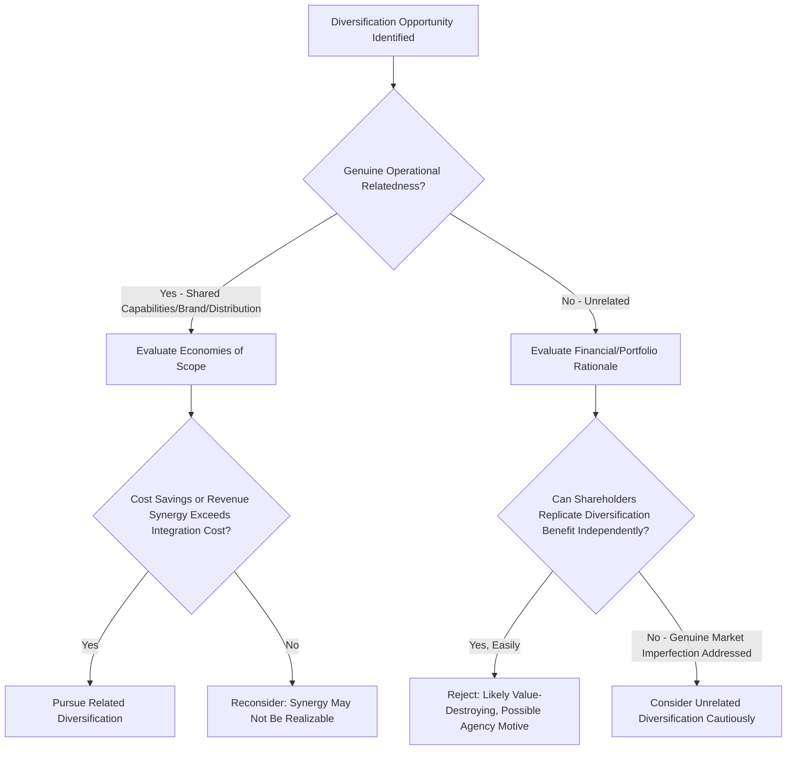

## Diversification Strategy and Economic Analysis

### Overview

Diversification is the corporate strategy of expanding a firm's operations into new products, markets, or industries beyond its current core business. Unlike vertical integration, which extends a firm's ownership along its existing value chain, diversification extends the firm's scope across different, often unrelated, product markets and industries. This topic examines the economic rationales for diversification, the critical distinction between related and unrelated diversification, the empirical evidence on diversification's effect on firm value (including the well-documented "diversification discount"), and the analytical frameworks managers use to evaluate diversification opportunities.

### Types of Diversification

**Key Points**

- **Related diversification**: Expansion into businesses that share meaningful commonalities with the firm's existing operations — common customers, technologies, distribution channels, brand equity, or operational capabilities.
- **Unrelated (conglomerate) diversification**: Expansion into businesses with little or no operational overlap with the firm's existing operations, typically justified primarily by financial or portfolio-level rationales rather than operational synergy.
- **Concentric diversification**: A subtype of related diversification where new products/markets share technological or marketing similarities with existing operations but serve different customer segments.
- **Horizontal diversification**: Adding new, unrelated products aimed at the firm's existing customer base, leveraging existing customer relationships even without operational overlap in production.

### Economic Rationales for Diversification

#### 1. Economies of Scope

Diversification can create value when the firm can produce multiple products more cheaply jointly than the sum of producing them separately, typically arising from shared inputs, shared distribution infrastructure, or shared knowledge/capabilities:

$$\text{Economies of Scope Exist if: } C(Q_1, Q_2) < C(Q_1, 0) + C(0, Q_2)$$

where $C(Q_1, Q_2)$ is the joint cost of producing quantities $Q_1$ and $Q_2$ of two different products, compared to the sum of producing each separately.

**Business implication**: Economies of scope are most credible in related diversification, where shared brand equity, distribution networks, R&D capabilities, or customer relationships genuinely reduce joint costs — the rationale weakens substantially for unrelated diversification, where such sharing is limited or absent.

#### 2. Market Power and Cross-Subsidization

Diversified firms operating in multiple markets simultaneously may gain strategic advantages through cross-market contact — the ability to respond to a competitor's aggressive move in one market with retaliation in a different market where the diversified firm also competes against that same rival, potentially supporting tacit coordination or deterring aggressive competition. [Inference] This "mutual forbearance" hypothesis has moderate empirical support in the strategic management literature but is not considered a universally strong or primary driver of diversification decisions relative to scope economies and other rationales.

#### 3. Risk Reduction and Coinsurance

Diversifying into businesses with imperfectly correlated cash flows can reduce the volatility of the firm's overall cash flows, potentially lowering the probability of financial distress and enabling more debt capacity (the "coinsurance effect").

$$\sigma_{portfolio}^2 = w_1^2\sigma_1^2 + w_2^2\sigma_2^2 + 2w_1w_2\rho_{1,2}\sigma_1\sigma_2$$

where $\rho_{1,2} < 1$ (imperfect correlation between business unit cash flows) reduces overall portfolio variance relative to the weighted sum of individual variances.

**Critical caveat**: [Inference] This rationale is heavily contested in corporate finance theory, since — consistent with a Modigliani-Miller-style argument — individual shareholders can typically achieve the same risk diversification benefit more cheaply by holding a diversified portfolio of separate, focused firms themselves, without the firm needing to diversify operationally. Corporate-level diversification for pure risk-reduction purposes is therefore often viewed as value-destroying from a shareholder perspective unless it also generates genuine operational synergies or addresses market imperfections shareholders cannot replicate on their own (e.g., benefits to other stakeholders like employees or creditors from reduced bankruptcy risk).

#### 4. Internal Capital Market Efficiency

Diversified firms can, in principle, allocate capital across business units through an internal capital market, potentially more efficiently than external capital markets when external financing is costly or informationally constrained (e.g., for a promising but capital-constrained business unit that might struggle to raise external financing independently).

**Critical caveat**: [Inference] Empirical research on internal capital markets is decidedly mixed; while the theoretical efficiency rationale is sound in specific conditions, a substantial body of research has found that internal capital allocation in diversified firms is frequently subject to influence costs, cross-subsidization of underperforming divisions, and agency problems that can result in less efficient capital allocation than well-functioning external capital markets would provide — a dynamic sometimes termed the "dark side" of internal capital markets.

#### 5. Exploiting Underutilized Resources and Capabilities

A firm with excess capacity in a valuable, non-scale-limited resource (proprietary technology, brand reputation, managerial expertise, distribution relationships) may find diversification an efficient way to extract additional value from that resource, consistent with the resource-based view of the firm — particularly when the resource is difficult to sell or license to third parties (e.g., tacit managerial capability), making internal application through diversification more efficient than market transaction.

#### 6. Managerial Motives (Agency-Based Rationale)

**Key Points**

- Diversification can sometimes be driven by managerial self-interest rather than shareholder value maximization — larger, more diversified firms may increase managerial compensation, prestige, job security (through reduced firm-specific risk to the manager's own human capital and career), and entrenchment, independent of whether diversification creates genuine economic value.
- [Inference] This agency-based explanation for diversification is well-established in corporate finance and governance literature and is frequently cited as a contributing factor behind value-destroying diversification observed empirically, particularly in firms with weaker governance and monitoring mechanisms.

### Diversification Rationale Evaluation Diagram

### The Diversification Discount: Empirical Evidence

**Key Points**

- A substantial body of empirical corporate finance research has documented a **diversification discount**: diversified firms (particularly unrelated/conglomerate diversifiers) frequently trade at a lower valuation multiple (e.g., relative to a sum-of-the-parts valuation using comparable focused-firm multiples) than a hypothetical portfolio of comparable focused, single-segment firms.
- Commonly cited explanations for the diversification discount include: inefficient internal capital allocation (cross-subsidization of weak divisions by strong ones), increased organizational complexity and reduced management focus, agency costs from managerial empire-building, and reduced transparency for external investors trying to value a complex, multi-segment business.
- [Unverified] The magnitude, robustness, and even the fundamental existence of the diversification discount as a genuine causal effect (rather than a statistical artifact of selection bias — i.e., firms that diversify may have been lower-quality or lower-growth-prospect firms to begin with, independent of the diversification decision itself) remains a genuinely debated question in the academic corporate finance literature, and findings have varied by time period, methodology, and dataset. Managers should treat the diversification discount as an important empirical pattern warranting caution rather than a universally proven, mechanical certainty applicable to every diversification decision.

### Related vs. Unrelated Diversification: Performance Comparison

| Dimension | Related Diversification | Unrelated Diversification |
| --- | --- | --- |
| Primary value driver | Economies of scope, operational synergy | Financial/portfolio effects, internal capital allocation |
| Empirical performance evidence | [Inference] Generally associated with more favorable performance outcomes on average in much of the strategic management literature, though firm-specific execution matters significantly | More frequently associated with the diversification discount in empirical corporate finance research |
| Integration complexity | Lower to moderate (shared capabilities ease integration) | Higher (distinct operational, cultural, and managerial requirements) |
| Typical governance structure | Often more centralized coordination given shared resources | Often more decentralized, holding-company-style structure |
| Risk of managerial overreach | Lower (capabilities transfer more naturally) | Higher (greater risk of entering markets the firm's management does not genuinely understand) |

### Worked Example: Economies of Scope Assessment

**Example**

A firm currently produces Product A with standalone annual costs of $12,000,000. It is evaluating adding Product B, which if produced standalone by a comparable independent firm would cost $8,000,000 annually. Due to shared distribution infrastructure, common raw material sourcing, and cross-trained production staff, the firm estimates it could produce both products jointly for a combined $17,500,000 annually.

**Economies of scope calculation**:

$$C(Q_1, 0) + C(0, Q_2) = \$12{,}000{,}000 + \$8{,}000{,}000 = \$20{,}000{,}000$$

$$C(Q_1, Q_2) = \$17{,}500{,}000$$

$$\text{Scope Economy} = \$20{,}000{,}000 - \$17{,}500{,}000 = \$2{,}500{,}000 \text{ annually (12.5\% cost reduction)}$$

**Output**: The joint production estimate demonstrates a genuine economy of scope of $2,500,000 annually, providing quantitative support for pursuing this related diversification opportunity, assuming the estimated cost synergies (shared distribution, sourcing, and cross-trained labor) prove realizable in practice. This financial case should still be weighed against integration execution risk and the opportunity cost of management attention required to successfully realize the projected $2,500,000 synergy, since projected synergies in diversification and M&A transactions are — as an empirical pattern well-documented in the corporate finance literature — frequently overestimated relative to what is ultimately realized.

### Diversification via Mergers and Acquisitions vs. Internal Development

**Key Points**

- **Acquisition-based diversification**: Faster market entry, immediate access to existing capabilities/market position, but requires paying an acquisition premium and carries substantial integration risk (cultural, systems, and personnel integration challenges).
- **Internal development (organic diversification)**: Slower and requires building capabilities from scratch, but avoids acquisition premiums and may allow better cultural/strategic fit with the parent organization, at the cost of slower market entry and the risk of underestimating the capability-building challenge.
- **Joint venture-based diversification**: Shares risk and required capability investment with a partner, providing an intermediate path, though subject to the governance complexity of shared control.

### Diversification and Firm Life Cycle Considerations

Diversification rationales and risks vary by the firm's position in its own life cycle and industry maturity: firms in mature, slow-growth core industries with substantial free cash flow may face the strongest agency-based temptation to diversify (since reinvesting exclusively in the core business offers declining returns) — precisely the scenario in which the discipline of the frameworks above (rigorous scope-economy evaluation, skepticism of pure risk-reduction rationales, and honest evaluation of managerial motives) is most important, given that this scenario is also the one most associated empirically with value-destroying "empire-building" diversification.

### Common Misconceptions

**Key Points**

- Diversification does not automatically reduce firm-level risk in a way that benefits shareholders; shareholders can typically diversify their own portfolios more cheaply than the firm can diversify operationally, meaning risk reduction alone is a weak standalone justification for corporate diversification.
- A diversified firm's larger size and broader revenue base do not, by themselves, indicate superior performance or lower risk; the diversification discount evidence suggests diversified firms frequently trade at a valuation discount rather than premium relative to comparable focused firms, on average.
- Related diversification is not automatically successful simply because operational commonalities exist on paper; realizing projected economies of scope requires genuine execution, and integration challenges can still erode or eliminate theoretical synergies even in well-reasoned related diversification cases.

### Conclusion

Diversification strategy requires rigorous economic scrutiny distinguishing between rationales that plausibly create shareholder value — primarily genuine economies of scope in related diversification, and market-imperfection-addressing internal capital allocation in specific circumstances — from rationales that are theoretically weaker or empirically associated with value destruction, particularly pure risk reduction (which shareholders can typically replicate more cheaply themselves) and managerial agency motives. The well-documented diversification discount, while subject to genuine academic debate regarding its causal interpretation, provides an important empirical caution against diversification pursued without a clear, quantifiable synergy rationale. Sound diversification decisions require explicit economies-of-scope analysis, honest assessment of whether financial rationales address genuine market imperfections shareholders cannot replicate independently, and disciplined skepticism toward synergy projections given their well-documented tendency toward overestimation in practice.

**Related Topics**

- Vertical integration and its economic rationale
- Make-or-buy and outsourcing decisions
- Mergers and acquisitions valuation and synergy analysis
- Internal capital markets and capital allocation efficiency
- Agency theory and managerial entrenchment
- Resource-based view and core competency theory
- Corporate governance and shareholder value alignment
- Portfolio theory and risk diversification principles
- Sum-of-the-parts valuation methodology
- Divestiture and corporate refocusing strategy