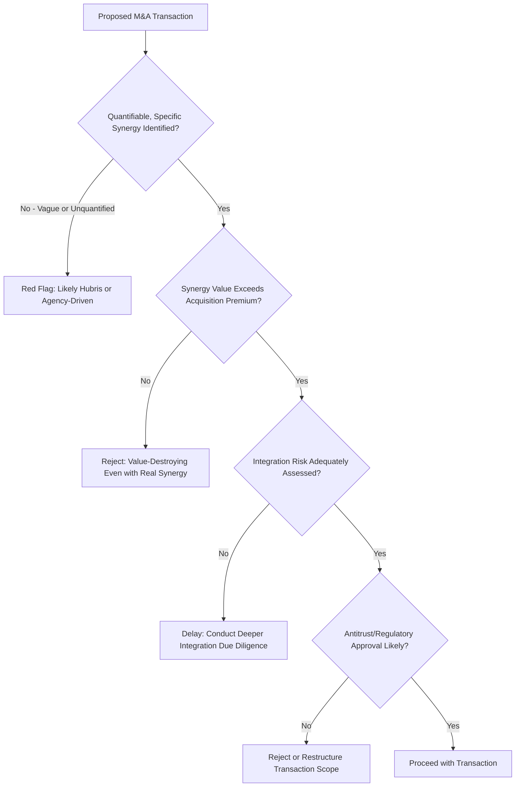

## Mergers and Acquisitions: Economic Motives and Evaluation

### Overview

Mergers and acquisitions (M&A) represent one of the most consequential and highest-stakes categories of corporate strategic decision, involving the combination of two previously independent firms (merger) or the purchase of one firm by another (acquisition). This topic examines the economic motives that theoretically justify M&A activity, the valuation and financial evaluation frameworks used to assess specific transactions, and the substantial body of empirical evidence indicating that a significant proportion of M&A transactions fail to create value for the acquiring firm's shareholders — a persistent puzzle in corporate finance that managers must navigate with analytical discipline.

This topic connects directly to diversification strategy (many acquisitions are diversification vehicles) and vertical integration (many acquisitions are integration vehicles), while adding the specific financial evaluation and deal-structuring considerations unique to M&A transactions.

### Types of M&A Transactions

**Key Points**

- **Horizontal merger**: Combination of firms operating in the same industry and competing directly against each other, primarily motivated by market power, scale economies, or elimination of competition.
- **Vertical merger**: Combination of firms at different stages of the same value chain (supplier-customer relationship), motivated by the vertical integration rationales covered previously.
- **Conglomerate merger**: Combination of firms in unrelated industries, motivated by the diversification rationales covered previously.
- **Merger**: Technically, a combination in which two firms combine to form a single new or surviving entity, often (though not always) involving relatively comparable-sized parties negotiating jointly.
- **Acquisition**: One firm (the acquirer) purchases a controlling interest in another firm (the target), which may continue to exist as a subsidiary or be fully absorbed into the acquirer.
- **Tender offer**: A direct offer made by the acquirer to the target company's shareholders to purchase their shares, sometimes used in contested or unsolicited ("hostile") acquisition attempts when target management does not support the transaction.

### Economic Motives for M&A

#### 1. Synergy Realization

The dominant stated rationale for most M&A transactions is synergy — the expectation that the combined firm will be worth more than the sum of the two independent firms:

$$V_{combined} > V_{acquirer} + V_{target}$$

$$\text{Synergy Value} = V_{combined} - (V_{acquirer} + V_{target})$$

**Operating synergies** arise from economies of scale (spreading fixed costs over greater volume), economies of scope (shared capabilities across product lines), increased market power/pricing leverage, or complementary capabilities (e.g., one firm's R&D pipeline combined with another's distribution/commercialization strength).

**Financial synergies** arise from increased debt capacity (via the coinsurance effect discussed in diversification analysis), tax benefits (e.g., utilizing acquired net operating losses, subject to relevant tax law limitations), or reduced cost of capital from improved diversification or scale.

#### 2. Market Power

Horizontal mergers, in particular, may be motivated by the desire to increase market concentration and pricing power, reducing competitive intensity in the combined firm's industry. This motive is the primary focus of antitrust review for horizontal transactions, discussed further below.

#### 3. Efficiency and Managerial Discipline

The **market for corporate control** theory holds that acquisitions (particularly hostile takeovers) can serve a disciplinary function, replacing underperforming management teams that have failed to maximize the target firm's value, with the acquisition premium reflecting the value improvement achievable under superior management.

#### 4. Growth Acceleration

Acquisition provides significantly faster market entry, capability acquisition, or scale growth compared to organic (internal) development, valuable in industries where speed to market or first-mover positioning carries substantial competitive value, or where the required capabilities would take prohibitively long to build internally.

#### 5. Diversification (Financial and Risk Motives)

As covered in the diversification strategy topic, some M&A activity is motivated by risk reduction or portfolio effects, though this rationale is subject to the same Modigliani-Miller-style critique — shareholders can typically diversify more cheaply themselves, making pure diversification a weak standalone justification for a specific acquisition.

#### 6. Managerial Hubris and Agency Motives (Cautionary Rationale)

**Key Points**

- The **hubris hypothesis** (Roll, 1986) proposes that some acquisitions occur because acquiring management overestimates their ability to create value from the combination, or overestimates the target's true value, leading to overpayment even absent any genuine synergy.
- Agency-based motives (empire-building, increased managerial compensation and prestige tied to firm size, entrenchment) can drive acquisitions that are not aligned with shareholder value maximization, echoing the managerial motive concerns raised in diversification strategy analysis.
- [Inference] The prevalence of hubris- and agency-driven M&A relative to genuinely synergy-driven M&A is difficult to observe directly and remains debated, but is frequently cited in the corporate finance literature as a contributing explanation for the substantial body of evidence (discussed below) showing many acquisitions fail to deliver positive returns to acquiring shareholders.

### M&A Motive Evaluation Diagram

### Valuation Framework for M&A

#### Standalone Valuation of Target

The starting point for any acquisition evaluation is the target's standalone (pre-synergy) fair value, typically assessed through multiple methods:

- **Discounted cash flow (DCF)**: Present value of the target's projected standalone free cash flows.
- **Comparable company analysis**: Valuation multiples (e.g., EV/EBITDA, P/E) derived from publicly traded comparable firms applied to the target's financials.
- **Precedent transaction analysis**: Multiples paid in comparable historical M&A transactions, which typically embed observed acquisition premiums.

#### The Acquisition Premium and Maximum Justifiable Price

$$\text{Acquisition Premium} = \text{Offer Price} - \text{Standalone Target Value}$$

$$\text{Maximum Justifiable Price} = \text{Standalone Target Value} + \text{Realizable Synergy Value}$$

For the transaction to create value for the *acquirer's* shareholders (as distinct from the target's shareholders, who generally capture most or all of the premium), the actual price paid should be below the maximum justifiable price — i.e., the acquirer should not pay away the entirety of the expected synergy value as premium to the target's shareholders.

$$NPV_{acquirer} = \text{Synergy Value} - \text{Acquisition Premium}$$

**Business implication**: A transaction with genuinely large synergies can still destroy value for the acquirer if competitive bidding or negotiation dynamics force the premium paid above the realizable synergy value — meaning disciplined maximum-price setting (and willingness to walk away from a competitive bidding process) is as important as accurate synergy estimation.

### Worked Example: Acquisition NPV to the Acquirer

**Example**

An acquirer is evaluating a target with a standalone DCF valuation of $400,000,000. The acquirer's management estimates realizable annual cost synergies of $25,000,000 (from combined procurement, shared corporate overhead, and distribution consolidation), expected to be fully realized starting in year 2 and sustained indefinitely, valued using a synergy-appropriate discount rate of 10%.

**Present value of synergies** (perpetuity starting year 2, valued as of today):

$$PV_{synergy} = \frac{\$25{,}000{,}000}{0.10} \times \frac{1}{1.10} \approx \$250{,}000{,}000 \times 0.9091 \approx \$227{,}275{,}000$$

**Maximum justifiable price**:

$$\$400{,}000{,}000 + \$227{,}275{,}000 = \$627{,}275{,}000$$

**Scenario A — Acquirer offers $550,000,000** (premium of $150,000,000 over standalone value):

$$NPV_{acquirer} = \$227{,}275{,}000 - \$150{,}000{,}000 = \$77{,}275{,}000 \text{ (value created for acquirer)}$$

**Scenario B — Competitive bidding pushes the price to $640,000,000** (premium of $240,000,000):

$$NPV_{acquirer} = \$227{,}275{,}000 - \$240{,}000{,}000 = -\$12{,}725{,}000 \text{ (value destroyed for acquirer)}$$

**Output**: Even with identical, genuinely realizable synergies, the acquirer's outcome shifts from significant value creation ($77.3 million) to value destruction (−$12.7 million) purely as a function of the price paid — illustrating why disciplined maximum-price discipline, informed by rigorous synergy estimation, is as critical to M&A success as identifying the synergy opportunity itself. This dynamic is central to the well-documented "winner's curse" risk in competitive acquisition bidding processes.

### Deal Structure Considerations

| Consideration | Cash Financing | Stock (Equity) Financing |
| --- | --- | --- |
| Signal to market | [Inference] Often interpreted as signaling acquirer confidence that its own stock is not overvalued (since cash avoids diluting existing shareholders at potentially unfavorable terms) | Often interpreted as a potential signal the acquirer's management believes its own stock is overvalued relative to fundamental value, per adverse selection theory in corporate finance |
| Target shareholder tax treatment | Generally a taxable event for target shareholders in most jurisdictions | Often eligible for tax-deferred treatment in many jurisdictions (structure-dependent) |
| Acquirer balance sheet impact | Increases leverage if debt-financed; reduces cash reserves if cash-financed | Dilutes existing acquirer shareholders' ownership percentage |
| Risk sharing | Target shareholders fully exit; acquirer bears all post-deal integration and synergy realization risk | Target shareholders retain partial exposure to combined entity performance, providing some risk-sharing |

### Post-Merger Integration and the Empirical Evidence on M&A Success

**Key Points**

- A substantial body of empirical M&A research has found that, on average, **acquiring firm shareholders often see neutral to negative abnormal returns** around and following acquisition announcements, while **target firm shareholders typically capture most of the acquisition premium** as a positive return — a pattern broadly consistent across multiple decades of event-study research in corporate finance, though findings vary by study methodology, time period, and deal type.
- Commonly cited explanations for this pattern include: acquirer overpayment (premiums exceeding realizable synergies, consistent with the hubris hypothesis), post-merger integration execution failures (culture clashes, systems integration difficulties, key talent attrition), overly optimistic synergy estimates at the time of the deal, and agency-driven acquisitions not primarily aimed at shareholder value creation.
- [Inference] Related, horizontal acquisitions with clearly quantifiable operational synergies and disciplined integration planning tend to show more favorable average outcomes in the empirical literature than unrelated/conglomerate acquisitions, though execution quality varies enormously by specific transaction and firm, limiting the reliability of category-level generalizations for any individual deal.
- Post-merger integration planning — encompassing systems integration, cultural alignment, talent retention, and customer/supplier communication — is widely regarded in both academic and practitioner literature as at least as important to ultimate transaction success as the initial deal valuation and negotiation, since even well-priced, genuinely synergistic transactions can fail to deliver value if integration execution falls short.

### Antitrust Considerations in M&A

Horizontal mergers, in particular, are subject to antitrust review assessing whether the transaction would substantially lessen competition, commonly evaluated through market concentration measures such as the Herfindahl-Hirschman Index (HHI):

$$HHI = \sum_{i=1}^{n} s_i^2$$

where $s_i$ is each firm's market share (as a percentage) in the relevant market. Regulatory agencies in many jurisdictions apply HHI thresholds (and the change in HHI resulting from the merger) as an initial screening tool, though [Unverified] specific numerical thresholds, safe harbors, and the broader analytical framework vary by jurisdiction and are subject to periodic revision by competition authorities — current guidance should be consulted directly rather than assumed static. Vertical and conglomerate mergers are generally subject to a different, often less stringent standard, focused primarily on foreclosure risk as discussed in the vertical integration topic.

### Common Misconceptions

**Key Points**

- A strategically sound acquisition rationale (genuine synergy potential) does not guarantee a value-creating transaction for the acquirer; the price paid relative to realizable synergy value is equally determinative of the outcome, as demonstrated in the worked example above.
- Stock price appreciation for the *combined* entity or the *target* shareholders following an announcement does not necessarily indicate the transaction was value-creating for the *acquirer's* shareholders specifically — these are distinct questions requiring separate analysis.
- Synergy estimates presented in deal announcements or management presentations should not be taken at face value; the empirical tendency toward synergy overestimation is well-documented, and rigorous, bottom-up (rather than top-down, target-driven) synergy quantification is a critical due diligence discipline.

### Conclusion

Mergers and acquisitions can create genuine shareholder value through operating and financial synergies, market power, accelerated growth, and managerial discipline effects, but a substantial and persistent body of empirical evidence indicates acquiring shareholders frequently fail to capture positive value, often due to overpayment relative to realizable synergies, integration execution failures, overly optimistic synergy projections, and hubris- or agency-driven deal motivation. Disciplined M&A evaluation requires rigorous, bottom-up synergy quantification, explicit calculation of the maximum justifiable price relative to the premium actually paid, careful attention to deal structure and financing signaling effects, and — critically — sustained investment in post-merger integration execution, since even well-priced and genuinely synergistic transactions can fail to deliver value without disciplined integration planning.

**Related Topics**

- Diversification strategy and economic analysis
- Vertical integration and its economic rationale
- Foreign direct investment decision analysis
- Horizontal vs. vertical merger antitrust analysis
- Discounted cash flow and comparable company valuation methods
- Corporate governance and shareholder value alignment
- Market for corporate control and takeover defense mechanisms
- Post-merger integration management
- Herfindahl-Hirschman Index and market concentration analysis
- Capital structure and financing decisions for major transactions