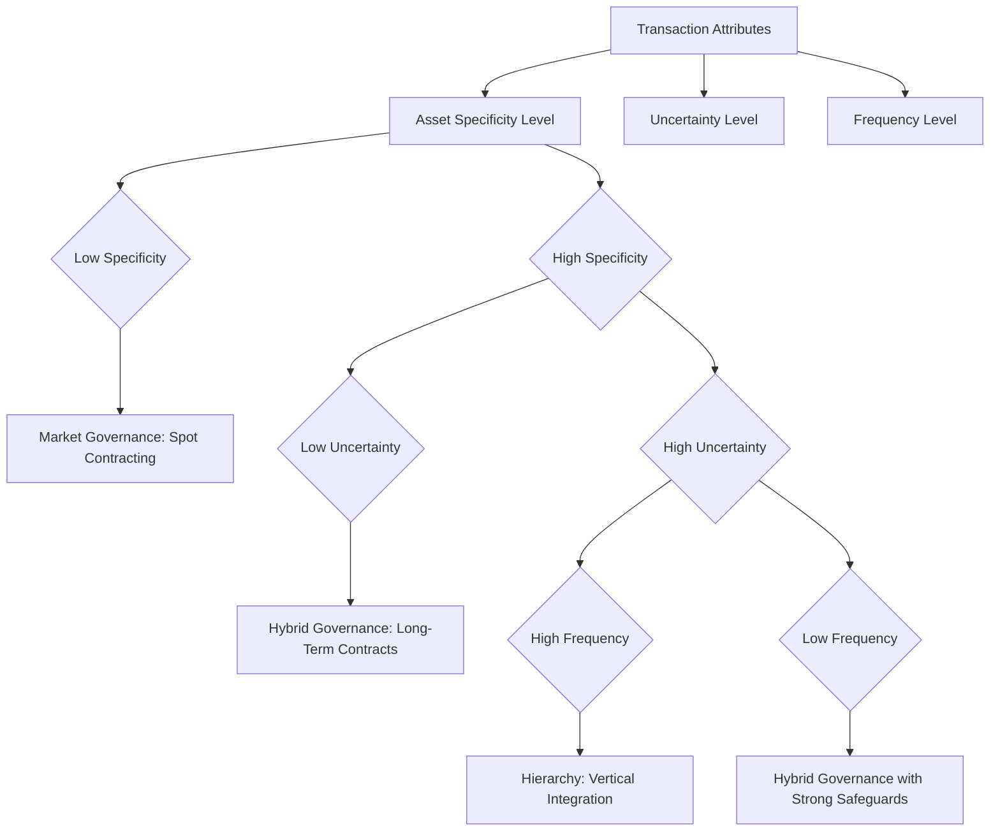

## Transaction Cost Economics and Firm Boundaries

### Overview

Transaction cost economics (TCE) is the theoretical foundation underlying nearly every organizational economics topic covered in this chapter — make-or-buy decisions, vertical integration, and the broader question of firm scope. This topic provides the systematic, foundational treatment of TCE itself: its origins in Ronald Coase's theory of the firm, Oliver Williamson's extension into a full analytical framework, the precise mechanics of how transaction cost attributes determine optimal governance structure, and the broader implications for understanding why firm boundaries exist where they do across an economy.

While prior topics in this chapter applied TCE logic to specific decisions (make-or-buy, integration, M&A), this topic treats TCE as the general theory of economic organization, establishing the conceptual toolkit from first principles.

### Coase's Foundational Question: Why Do Firms Exist?

Ronald Coase's 1937 paper "The Nature of the Firm" posed a question that classical economics had largely left unanswered: if markets and price mechanisms efficiently allocate resources (as classical price theory holds), why does economic activity often occur within firms — coordinated by managerial authority and hierarchy — rather than entirely through a web of independent market transactions between individual contractors?

Coase's answer: **using the market is not costless**. There are costs to discovering relevant prices, negotiating and drafting contracts for each transaction, and enforcing those contracts — collectively, transaction costs. Firms exist because, for certain transactions, it is cheaper to coordinate through internal managerial direction than to repeatedly negotiate and contract in the open market.

$$\text{Firm exists where: } TC_{market} > TC_{hierarchy}$$

**The firm's optimal boundary** is reached at the margin where the cost of organizing one additional transaction internally equals the cost of carrying out that same transaction through the market — beyond this margin, further internal expansion becomes less efficient than market contracting.

### Williamson's Extension: A Full Analytical Framework

Oliver Williamson (building on Coase, and awarded the Nobel Memorial Prize in Economic Sciences in 2009 partly for this work) developed TCE into a systematic, predictive framework by identifying the specific *attributes of transactions* that determine which governance structure (market, hybrid, or hierarchy) minimizes total transaction costs for a given exchange.

### The Three Key Transaction Attributes (Williamson's Framework)

**Key Points**

- **Asset specificity**: The degree to which a transaction-specific investment has significantly reduced value in alternative uses. This is the single most important determinant in Williamson's framework, driving the risk of **hold-up** (post-contractual opportunistic renegotiation) once a party has made a relationship-specific investment.
- **Uncertainty**: Both environmental uncertainty (unpredictable changes in market conditions, technology, demand) and behavioral uncertainty (difficulty verifying a trading partner's performance or true intentions) increase the cost and incompleteness of contracts, since not all future contingencies can be anticipated and specified in advance.
- **Frequency**: How often a given transaction recurs. Frequent, recurring transactions can justify the fixed cost of establishing specialized internal governance structures (dedicated management, internal processes), while one-off or infrequent transactions typically cannot justify this fixed investment relative to simply using the market each time.

### Supporting Behavioral Assumptions

**Key Points**

- **Bounded rationality**: Economic actors have limited cognitive capacity to process information and anticipate all future contingencies, making all complex, long-term contracts inherently and unavoidably incomplete — no contract, however carefully drafted, can specify optimal responses to every possible future state of the world.
- **Opportunism**: Economic actors may behave in self-interested ways, including strategic misrepresentation of information or "guileful" exploitation of contractual gaps, when doing so is advantageous. TCE does not assume all actors are opportunistic at all times, but rather that the *possibility* of opportunism by some actors under some conditions must be accounted for in governance design, since it is often costly or impossible to distinguish trustworthy from opportunistic partners in advance.

Together, bounded rationality and the possibility of opportunism explain why contracts cannot fully substitute for the flexibility of internal hierarchical governance when asset specificity and uncertainty are both high: incomplete contracts combined with potential opportunism create genuine hold-up exposure that only unified ownership (or close hybrid governance) can adequately address.

### The Governance Structure Discriminating Alignment Framework

Williamson's central predictive claim is that transactions are (and should be, for efficiency) matched to the governance structure that minimizes the *sum* of production costs and transaction costs, given the transaction's specific attributes — termed the **discriminating alignment hypothesis**.

### The Three Canonical Governance Structures

| Governance Structure | Coordination Mechanism | Incentive Intensity | Adaptation Capability | Best Suited For |
| --- | --- | --- | --- | --- |
| Market | Price mechanism, competition | High-powered (strong individual incentives) | High adaptation to price signals ("autonomous adaptation") | Low asset specificity, low uncertainty, standardized transactions |
| Hybrid | Long-term contracts, relational norms, partial equity linkages | Moderate | Moderate; relies on cooperative renegotiation | Moderate asset specificity or uncertainty, situations requiring some flexibility without full integration |
| Hierarchy (integrated firm) | Managerial authority, fiat | Low-powered (weaker individual profit incentives, but reduced opportunism risk) | High "coordinated adaptation" through direct managerial authority when contingencies arise | High asset specificity combined with high uncertainty, frequent transactions |

**Key insight**: Williamson's framework highlights a fundamental trade-off — markets provide superior **high-powered incentives** (individuals directly capture the returns to their effort and efficiency) but weaker **coordinated adaptability** (each party independently reacts to price signals, without centralized coordination), while hierarchies provide superior coordinated adaptability (a single decision-maker can redirect resources quickly in response to changing conditions) but weaker high-powered incentives (internal divisions often lack the same direct profit-and-loss accountability as independent firms facing market discipline).

### Asset Specificity in Depth: Sub-Types and Hold-Up Mechanics

As introduced in the make-or-buy topic, asset specificity takes several forms (site, physical, human, dedicated, and brand-name specificity). The hold-up problem this creates operates through a specific sequential logic:

$$\text{Sequence: } \text{Investment Decision} \rightarrow \text{Investment Becomes Sunk} \rightarrow \text{Renegotiation Opportunity} \rightarrow \text{Opportunistic Exploitation Risk}$$

**Example**

A component supplier is asked by a manufacturer to invest $5,000,000 in specialized tooling that can only produce parts for that manufacturer's specific product design (high asset specificity, no viable alternative use for the tooling). Once the tooling investment is sunk, the manufacturer — if inclined toward opportunistic behavior — has a temporary bargaining advantage: it could threaten to switch to an alternative supplier (even if switching would itself be costly and slow) to pressure the invested supplier into renegotiating the contract price downward, since the supplier's sunk investment gives it little practical alternative but to accept unfavorable terms rather than abandon the specialized tooling investment entirely.

**Output**: A rational supplier, anticipating this hold-up risk *before* making the investment, will either refuse to make the relationship-specific investment at all (reducing overall transaction efficiency, since the specialized tooling might genuinely lower joint production costs), demand a substantial risk premium in the initial contract price to compensate for the hold-up exposure, or insist on structural safeguards (long-term contracts with exit penalties, minimum purchase commitments, or the manufacturer's own reciprocal specific investment creating "mutual hostage" symmetry). This anticipatory logic is precisely why high asset specificity combined with contracting incompleteness drives firms toward vertical integration: unified ownership eliminates the separate-party renegotiation dynamic entirely, since there is no longer an arm's length "other party" who can exploit the sunk investment.

### Credible Commitments and Contractual Safeguards

Williamson's framework also identifies mechanisms parties use to make hybrid (contractual, non-integrated) governance more viable even under moderate asset specificity, reducing (though not eliminating) the need for full vertical integration:

**Key Points**

- **Hostage exchange**: Both parties make mutual specific investments or provide reciprocal collateral, so that opportunistic behavior by either party would be mutually costly, symmetrizing the hold-up risk.
- **Reputation effects and repeated dealing**: In relationships expected to continue over many transactions, the value of maintaining a reputation for fair dealing can deter opportunistic exploitation of any single transaction's hold-up vulnerability.
- **Third-party dispute resolution mechanisms**: Arbitration clauses and other structured dispute resolution provisions can reduce the cost and uncertainty of contract enforcement relative to reliance on court litigation alone.
- **Vertical restraints short of full integration**: Exclusive dealing arrangements, minimum purchase requirements, and territorial restrictions can address specific dimensions of hold-up risk without requiring full ownership integration.

### TCE Applied Beyond Make-or-Buy: Broader Organizational Implications

**Key Points**

- **Employment relationships**: TCE has been applied to explain why firms often employ workers directly (an internal hierarchical relationship) rather than contracting for labor services on a pure market basis for every task — particularly for roles involving firm-specific human capital (knowledge and skills valuable primarily within that specific firm) where the hold-up logic applies symmetrically to both the firm and the employee.
- **Franchise design**: Franchise arrangements represent a hybrid governance structure explicitly designed to balance the high-powered incentives of independent ownership (the franchisee bears direct profit/loss risk, motivating local effort and cost control) against the coordination benefits of centralized brand standards and system-wide consistency (imposed by the franchisor through contractual requirements), reflecting a deliberate TCE-informed governance design choice.
- **Joint ventures and alliances**: As discussed in the vertical integration topic, these represent intermediate governance structures explicitly designed to address moderate asset specificity and uncertainty without incurring the full costs (loss of high-powered incentives, bureaucratic complexity) of complete integration.

### Critiques and Extensions of Transaction Cost Economics

**Key Points**

- **Underemphasis on capabilities and learning**: The resource-based view and dynamic capabilities perspectives argue that TCE's focus on minimizing transaction costs given a fixed transaction can underweight the importance of firm-specific capabilities, organizational learning, and the strategic value of certain activities independent of their transaction cost characteristics — a firm might rationally retain an activity internally not because of hold-up risk, but because internal execution builds valuable capabilities that external contracting would not.
- **Measurement difficulty**: Transaction costs (particularly the cost of contractual incompleteness and the probability-weighted cost of potential future opportunism) are inherently difficult to measure precisely ex ante, making TCE a more useful qualitative/directional framework for governance decisions than a source of precise quantitative predictions in most practical applications.
- **Power and bargaining asymmetries**: Some critiques argue TCE underemphasizes how pre-existing power and bargaining asymmetries between parties (independent of the formal transaction cost attributes) shape actual governance outcomes in practice, particularly in contexts with significant disparities in firm size or market power between contracting parties.
- [Inference] Despite these critiques, TCE remains one of the most widely applied and empirically supported frameworks in organizational economics and strategic management, with substantial empirical research generally supporting its core discriminating alignment predictions (particularly regarding asset specificity's effect on governance choice), even as complementary frameworks address dimensions TCE does not fully capture.

### TCE and Related Frameworks: A Comparative Summary

| Framework | Primary Focus | Key Question Addressed | Relationship to TCE |
| --- | --- | --- | --- |
| Transaction cost economics | Minimizing transaction costs given transaction attributes | Should this specific transaction be governed by market, hybrid, or hierarchy? | Foundational framework |
| Resource-based view | Identifying and protecting valuable, rare, inimitable capabilities | What activities constitute sources of sustainable competitive advantage? | Complementary; can override pure transaction cost logic for core competencies |
| Agency theory | Aligning incentives between principals and agents under information asymmetry | How should contracts and monitoring be structured to minimize agency costs? | Complementary; addresses incentive design within any chosen governance structure |
| Property rights theory (Grossman-Hart-Moore) | Allocating ownership/control rights to incentivize efficient relationship-specific investment | Who should hold residual control rights over an asset? | Closely related extension/formalization of TCE's hold-up logic |

### Common Misconceptions

**Key Points**

- Transaction cost economics does not claim that markets are inherently inefficient or that firms are inherently superior; it is explicitly a *comparative* framework in which the efficient governance structure depends entirely on the specific attributes of the transaction in question, and most transactions in a modern economy are efficiently governed through markets rather than internal hierarchy.
- High asset specificity alone does not automatically mandate vertical integration; the framework requires asset specificity to combine with meaningful uncertainty and contracting incompleteness (and ideally sufficient transaction frequency to justify the fixed costs of internal governance) before integration becomes the efficiency-maximizing choice — moderate specificity is frequently well-managed through hybrid governance with appropriate contractual safeguards.
- TCE is a positive (explanatory/predictive) theory of why firm boundaries exist where they do, not merely a normative prescription; it aims to explain observed patterns of economic organization across an economy, not simply to provide a decision checklist for any single firm's boundary choices — though it functions effectively as both.

### Conclusion

Transaction cost economics provides the foundational theoretical explanation for why firm boundaries exist and where they should efficiently be drawn, building from Coase's original insight that market transactions carry real costs through Williamson's systematic framework identifying asset specificity, uncertainty, and frequency as the key transaction attributes that determine whether market, hybrid, or hierarchical governance minimizes total transaction costs. The framework's central discriminating alignment hypothesis — that efficient economic organization matches governance structure to transaction attributes — underlies the more applied make-or-buy, vertical integration, and diversification topics covered elsewhere in this chapter, while remaining subject to important complementary considerations from the resource-based view, agency theory, and property rights theory that address dimensions of organizational design TCE alone does not fully capture.

**Related Topics**

- Make-or-buy and outsourcing decisions
- Vertical integration and its economic rationale
- Diversification strategy and economic analysis
- Mergers and acquisitions: economic motives and evaluation
- Principal-agent theory and contract design
- Property rights theory and incomplete contracts (Grossman-Hart-Moore)
- Resource-based view and dynamic capabilities theory
- Franchise system design and governance
- Employment relationships and firm-specific human capital
- Relational contracting and credible commitment mechanisms