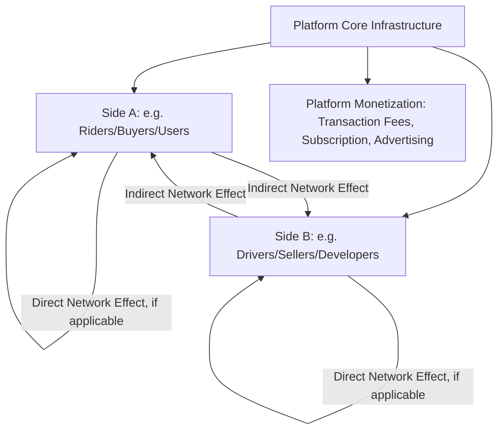

## Network Effects and Platform Economics

### Overview

Network effects (also termed network externalities) occur when the value a user derives from a product or service increases as more users adopt it. Platform economics extends this concept to businesses whose core function is facilitating exchange or interaction between two or more distinct user groups — a structure that has become increasingly central to modern managerial economics given the prevalence of digital platforms in transportation, e-commerce, social media, payments, and software ecosystems. This topic examines the economic mechanics of network effects, the distinctive competitive and pricing dynamics of multi-sided platforms, and the strategic implications for firms operating in or competing against network-effect-driven businesses.

### Defining Network Effects

**Key Points**

- **Direct (same-side) network effects**: The value to a user increases directly with the number of *other users of the same type* on the network — for example, a telephone network or a social media platform, where each additional user directly benefits all existing users by expanding who they can communicate or interact with.
- **Indirect (cross-side) network effects**: The value to a user of one type increases with the number of users of a *different type* on the platform — for example, a ride-sharing platform where riders benefit from more available drivers, and drivers benefit from more available riders, even though riders don't directly value having more riders.
- **Positive network effects**: Additional users increase value for existing users (the typical case discussed in most platform contexts).
- **Negative network effects (congestion effects)**: Additional users can, beyond some point, decrease value for existing users due to congestion, competition for attention, or reduced signal-to-noise ratio (e.g., a marketplace with excessive seller competition diluting buyer attention per listing, or a physical network experiencing congestion).

### The Mathematics of Network Value: Metcalfe's Law and Variants

A commonly cited (though heavily qualified) characterization of network value growth is **Metcalfe's Law**, which proposes that the value of a network grows proportionally to the square of the number of connected users, since the number of potential pairwise connections grows quadratically:

$$V \propto n(n-1) \approx n^2$$

where $n$ is the number of network participants. [Inference] Metcalfe's Law is best understood as a stylized, illustrative characterization rather than a precisely validated empirical law; critics have noted that not all connections are equally valuable (most individuals derive most of their value from a relatively small subset of possible connections), and several published empirical analyses have suggested network value may grow at a rate closer to $n \log(n)$ for many real-world networks rather than a strict $n^2$ relationship. Managers should treat quadratic network value growth as a useful conceptual illustration of *why* network effects can be powerful, not as a precise valuation formula for any specific platform.

### Multi-Sided Platforms: Core Structure

A multi-sided platform serves two or more distinct groups of users who value interacting with each other through the platform, but who could not (or could not as efficiently) transact directly without the platform's intermediation.

$$\text{Platform Value} = f(\text{Side A user base}, \text{Side B user base}, \text{interaction quality})$$

**Common examples of platform sides**: ride-sharing (riders and drivers), e-commerce marketplaces (buyers and sellers), operating systems (end users and app developers), payment networks (consumers and merchants), advertising-supported media (audiences and advertisers), and recruiting platforms (job seekers and employers).

### Multi-Sided Platform Structure Diagram

### The Chicken-and-Egg Problem

**Key Points**

- New platforms face the **chicken-and-egg problem** (also termed the cold-start problem): side A users will not join without a critical mass of side B users, and side B users will not join without a critical mass of side A users, creating a bootstrapping challenge for platform launch.
- **Critical mass**: The minimum scale of adoption (often on one or both sides) beyond which network effects become self-sustaining, generating organic growth without continued heavy subsidization or promotional effort — reaching critical mass is often the central strategic and financial challenge for early-stage platform businesses.
- **Common strategies to overcome the cold-start problem**:
  - **Subsidizing one side**: Offering free or below-cost access to the side with more elastic demand or lower willingness to pay, funded by the other side (discussed further under platform pricing below).
  - **Single-player utility**: Designing the product to offer standalone value even absent network effects, attracting initial users before network effects take hold (e.g., a note-taking app useful even without any sharing/collaboration features).
  - **Sequential market entry**: Launching in a narrow, geographically or demographically concentrated market to reach critical mass locally before expanding, rather than attempting simultaneous broad-market launch.
  - **Seeding supply artificially**: Platform operators sometimes directly provide or subsidize initial supply-side activity (e.g., a marketplace initially selling its own inventory) to attract demand-side users before organic supply-side participation reaches sufficient scale.

### Platform Pricing: The Two-Sided Pricing Problem

Unlike traditional single-sided businesses, platforms must set prices for *each side* of the market, and the profit-maximizing price structure often involves charging one side very little (or even subsidizing that side with a negative effective price) while charging the other side more, reflecting the differing price elasticities and network-effect externalities each side generates for the other.

$$\text{Platform optimizes: } \max (\text{Price}_A \times Q_A) + (\text{Price}_B \times Q_B) - \text{Cost}(Q_A, Q_B)$$

subject to the constraint that $Q_A$ and $Q_B$ are interdependent through cross-side network effects, meaning the price charged to side A affects not only $Q_A$ directly but also $Q_B$ (through the network effect) and thus indirectly affects the revenue achievable from side B.

**Key Points — Determinants of Which Side Gets Subsidized**

- **Relative price elasticity**: The side with more elastic demand (more price-sensitive, more likely to switch to alternatives) is typically subsidized more heavily, while the less elastic side bears more of the pricing burden — standard price discrimination logic extended to a two-sided context.
- **Relative externality generated**: The side whose participation generates greater marginal value for the other side is often subsidized more, since attracting that side yields outsized platform-wide benefit through the cross-side network effect.
- **Competitive dynamics**: In markets with multiple competing platforms, the side more prone to "multi-homing" (using multiple competing platforms simultaneously) versus "single-homing" (committing to one platform exclusively) affects optimal pricing strategy, discussed further below.

### Worked Example: Two-Sided Pricing Rationale

**Example**

A ride-sharing platform analyzes its two sides:

- **Riders**: Highly price-sensitive (elastic demand, many substitute transportation options — personal vehicles, public transit, competing platforms), and rider volume strongly attracts driver participation (high positive externality generated for drivers).
- **Drivers**: Less price-sensitive on the per-trip commission rate within a reasonable range (drivers primarily evaluate overall earning opportunity, and switching platforms involves some friction), though highly sensitive to *trip volume/frequency* — a factor directly determined by rider-side pricing and volume.

**Output**: Given rider-side price elasticity and riders' strong positive externality generation for drivers, standard two-sided platform pricing logic favors keeping rider-facing prices as low as the platform's overall economics allow (or even subsidizing rides in growth-focused phases) to maximize rider volume, which in turn attracts and retains driver supply — with platform revenue captured primarily through the commission charged on the driver side (or, alternatively, from ancillary revenue streams), rather than attempting to extract maximum margin symmetrically from both sides. This pricing asymmetry is a standard, economically rational feature of platform businesses rather than an indication of unsustainable or irrational pricing, though [Inference] the specific optimal split point requires careful empirical calibration specific to each platform's actual elasticity and network-effect parameters, which are difficult to estimate precisely ex ante and are typically refined through ongoing pricing experimentation.

### Winner-Take-All (or Winner-Take-Most) Dynamics

**Key Points**

- Strong network effects can create **increasing returns to scale in user acquisition** — as a platform grows, it becomes increasingly attractive relative to smaller competitors, potentially leading to a small number of dominant platforms (or a single dominant platform) capturing the vast majority of market value, a pattern termed winner-take-all or winner-take-most dynamics.
- **Tipping points**: Markets with strong network effects can experience a "tipping" dynamic where, once one platform gains a sufficient lead, network effects accelerate its advantage in a self-reinforcing cycle, making it increasingly difficult for competitors to catch up even with a superior underlying product.
- [Inference] Winner-take-all outcomes are more likely when switching costs are high, multi-homing is difficult or costly for users, and network effects are strong and same-side (direct) rather than purely cross-side; markets with easy multi-homing, low switching costs, or weaker network effects tend to sustain multiple competing platforms rather than converging to a single dominant winner.

### Multi-Homing and Its Strategic Implications

**Multi-homing** — users participating in multiple competing platforms simultaneously — significantly moderates winner-take-all dynamics, since it allows competing platforms to coexist even with substantial network effects, as users are not locked into a single network.

| Factor | Favors Single-Homing (Winner-Take-All Risk) | Favors Multi-Homing (Sustained Competition) |
| --- | --- | --- |
| Switching/setup costs | High (significant time/data/relationship investment to join a new platform) | Low (easy to join and use multiple platforms simultaneously) |
| Platform differentiation | Low (platforms are close substitutes) | High (platforms serve genuinely different needs or niches) |
| Cost of maintaining multiple accounts | High (subscription fees, significant ongoing effort) | Low (free or low-cost to maintain presence on multiple platforms) |
| User side incentive structure | Platform offers exclusivity incentives (loyalty programs, exclusive content) | No meaningful penalty for using competing platforms simultaneously |

**Business implication**: Platform strategy often explicitly aims to increase switching costs and discourage multi-homing (through loyalty programs, data lock-in, exclusive content or features, or bundling with other services) precisely because multi-homing erodes the winner-take-all advantage that network effects would otherwise provide.

### Platform Governance and Ecosystem Management

**Key Points**

- **Openness vs. control trade-off**: Platforms must decide how much access and functionality to grant third-party developers, sellers, or complementors — greater openness can accelerate ecosystem growth and innovation (leveraging external development effort) but reduces the platform owner's direct control over quality, user experience, and revenue capture.
- **Platform envelopment**: A platform in one market may leverage its existing user base and network effects to enter and compete in an adjacent market, potentially disadvantaging incumbent specialists in that adjacent market who lack a comparable existing network.
- **Governance rule design**: Platforms set rules (content policies, seller standards, developer terms of service, revenue-sharing/commission structures) that fundamentally shape ecosystem participant behavior and platform value; poorly designed governance can degrade trust and drive participants to competing platforms or trigger regulatory scrutiny, while overly restrictive governance can stifle the complementor innovation that made the ecosystem valuable in the first place.

### Antitrust and Regulatory Considerations for Platforms

**Key Points**

- Network-effect-driven market concentration has drawn increasing antitrust and regulatory scrutiny in multiple jurisdictions in recent years, focused on issues including platform self-preferencing (favoring the platform owner's own products/services over third-party competitors using the platform), data-driven competitive advantages, and the barriers to entry created by strong network effects and switching costs.
- [Unverified] Specific regulatory frameworks, enforcement priorities, and legal standards applicable to digital platforms vary significantly by jurisdiction and are evolving rapidly as competition authorities develop dedicated approaches to platform markets; firms operating significant platform businesses should consult current, jurisdiction-specific regulatory guidance rather than relying on generalized economic principles alone, given the pace of legal and regulatory development in this specific area.

### Common Misconceptions

**Key Points**

- Network effects do not guarantee a platform's success or permanent dominance; a platform must still successfully navigate the cold-start problem to reach critical mass, and even established network-effect businesses remain vulnerable to disruption from multi-homing, strong differentiated competitors, or shifts in user preference that reduce the effective strength of the network effect (e.g., if a superior alternative emerges that is different enough to justify the switching cost).
- Two-sided pricing that appears asymmetric or "unfair" (heavily subsidizing one side) is not evidence of irrational or predatory pricing; it commonly reflects standard, economically sound two-sided platform pricing logic based on relative elasticity and cross-side externality generation, rather than a deliberate below-cost strategy aimed solely at eliminating competitors (though the two can be difficult to distinguish in specific antitrust contexts, which is part of why platform pricing has drawn regulatory attention).
- Metcalfe's Law and similar quadratic-growth characterizations should not be applied as precise valuation tools; they illustrate a directional insight about why network effects can generate rapidly compounding value, not a reliable formula for estimating any specific platform's actual worth.

### Conclusion

Network effects and platform economics represent a distinctive category of business economics in which value creation depends fundamentally on user base scale and cross-side interaction quality rather than solely on traditional production efficiency. Successful platform strategy requires navigating the cold-start/chicken-and-egg problem to reach critical mass, implementing two-sided pricing that reflects each side's relative elasticity and externality contribution rather than symmetric cost-based pricing, and managing the tension between openness (fostering ecosystem growth) and control (protecting quality and revenue capture) — all while recognizing that multi-homing, differentiation, and switching costs meaningfully moderate the winner-take-all dynamics that strong network effects can otherwise produce.

**Related Topics**

- Transaction cost economics and firm boundaries
- Mergers and acquisitions: economic motives and evaluation
- Price discrimination and two-sided market pricing theory
- Switching costs and customer lock-in strategy
- Antitrust analysis of digital platform markets
- Increasing returns to scale and market structure
- Ecosystem strategy and complementor management
- Winner-take-all market dynamics and tipping points
- Freemium and subsidization pricing models
- Digital business model design and monetization strategy