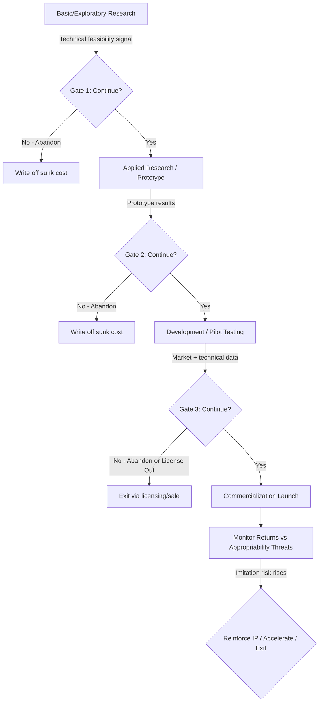

## Economics of Innovation and Research and Development Decisions

### Definition and Scope

The economics of innovation and R&D examines how firms decide whether, how much, and in what form to invest in generating new knowledge, products, and processes under conditions of uncertainty, appropriability risk, and long payback horizons. It sits at the intersection of managerial economics, industrial organization, and strategic management, addressing three interlocking questions: (1) how much should a firm invest in R&D, (2) how should that investment be organized and financed, and (3) how can the firm capture (appropriate) the returns from innovation before competitors imitate it.

Unlike ordinary capital investment, R&D spending has distinctive economic properties: it produces a partially non-rival, partially non-excludable good (knowledge), it faces high failure rates and fat-tailed payoff distributions, and its returns depend heavily on complementary assets (manufacturing, distribution, brand) and the strength of the appropriability regime (patents, secrecy, lead time).

### Why R&D Differs from Standard Investment

**Key Points**

- **Uncertainty is technical and market-based simultaneously.** A project may succeed technically (the product works) yet fail commercially (no demand or a superior substitute emerges), or vice versa.
- **Knowledge is a public-good-like output.** Once created, knowledge can in principle be used by multiple parties at near-zero marginal cost, which creates a wedge between private and social returns.
- **Sunk costs dominate.** R&D expenditure is largely irreversible; once spent, it cannot be redeployed to alternative uses at full value.
- **Skewed payoff distributions.** Most R&D projects yield modest or negative returns; a small fraction generate outsized returns that account for most of the portfolio's expected value. This is why R&D is frequently modeled using option-based rather than discounted-cash-flow (DCF) logic.
- **Cumulative and path-dependent.** Today's R&D builds on and shapes the direction of tomorrow's R&D (absorptive capacity, learning curves).

### The Market Failure Rationale for R&D Under- or Over-Investment

Because knowledge has public-good characteristics, private returns to an innovator are typically lower than the social returns generated (spillovers benefit rivals, suppliers, and consumers who did not pay for the R&D). This divergence is the standard justification for underinvestment in R&D relative to the social optimum, and for policy interventions such as patents, R&D tax credits, and public research subsidies.

$$\text{Social Return} = \text{Private Return} + \text{Spillover Benefits to Third Parties}$$

[Inference] The magnitude of the private-social wedge varies substantially by industry and has been estimated in empirical studies to be large (social returns often exceeding private returns by a factor of two or more), though exact multipliers are sensitive to methodology and should not be treated as universal constants.

Conversely, in some settings — patent races, standard-setting competitions — firms may *overinvest* in R&D relative to the social optimum because of a "rent-dissipation" effect: multiple firms duplicate research effort competing to be first, and only the winner captures the prize (patent, market position), so social resources are wasted on the losers' redundant effort.

### Determinants of Optimal R&D Investment

A firm's profit-maximizing R&D intensity depends on:

1. **Appropriability regime strength** — the ability to prevent imitation via patents, trade secrets, complexity, or lead time. Weak appropriability depresses the incentive to invest because rivals can free-ride on the innovation.
2. **Market structure and competitive intensity** — the relationship between market concentration and innovation is non-monotonic. This is formalized in the Aghion et al. "inverted-U" model, where innovation incentives are low under both very low competition (little pressure to innovate, easy rents) and very high competition (imitation and low post-innovation rents erode incentive), peaking at intermediate competition levels.
3. **Firm size and financial slack** — the Schumpeterian hypothesis (Schumpeter, 1942) argued that large firms with market power are better positioned to fund and exploit R&D due to economies of scale in research, access to capital, and ability to spread risk across a project portfolio. Empirical support is mixed; R&D intensity does not scale proportionally with firm size in all industries. [Unverified] The precise elasticity of R&D spending with respect to firm size varies considerably across sectors and time periods studied.
4. **Complementary assets** — per Teece's (1986) framework, the value a firm captures from innovation depends on whether it controls the specialized manufacturing, marketing, distribution, and service assets needed to commercialize the innovation. A firm with a weak appropriability regime but strong complementary assets can still profit; one lacking both often loses value to imitators or to firms that co-opt the innovation.
5. **Technological opportunity** — the underlying scientific/technical fertility of a field affects the expected return per dollar of research effort.
6. **Demand-pull vs. technology-push forces** — R&D direction responds both to anticipated market demand (demand-pull) and to autonomous advances in scientific/technical possibility (technology-push, or "invention push").

### Types of R&D and the Innovation Value Chain

| Category | Description | Risk/Payoff Profile |
| --- | --- | --- |
| Basic research | Expands fundamental scientific understanding with no immediate commercial target | High risk, high option value, long horizon, often has public-good character (frequently underfunded privately) |
| Applied research | Directs fundamental knowledge toward a specific problem or product class | Moderate risk, moderate horizon |
| Development | Converts research findings into marketable products/processes | Lower technical risk, but high capital intensity; commercial risk dominates |
| Process innovation | Improves how existing products are made (cost, quality, speed) | Often lower risk than product innovation; returns tied to cost-leadership strategy |
| Product innovation | Creates new or improved goods/services for the market | Higher market risk; returns tied to differentiation strategy |
| Incremental (sustaining) innovation | Improves existing technology along an established trajectory | Lower risk, predictable, defends existing market position |
| Radical (disruptive) innovation | Creates a new technological trajectory or business model | High risk, potential for market redefinition; often mismanaged by incumbents (Christensen's innovator's dilemma) |

### The R&D Investment Decision: Analytical Frameworks

**Standard NPV Approach and Its Limits**

The textbook rule is to invest if:

$$NPV = \sum_{t=0}^{T} \frac{E[CF_t]}{(1+r)^t} - I_0 > 0$$

where $E[CF_t]$ is expected cash flow, $r$ is the risk-adjusted discount rate, and $I_0$ is the initial R&D outlay. This approach is theoretically valid but practically weak for R&D because it forces a single point-estimate of cash flows despite deep technical/market uncertainty, and it treats the decision as now-or-never rather than allowing management to adapt as uncertainty resolves.

**Real Options Valuation (ROV)**

Because R&D is typically staged (a firm can abandon, delay, or expand a project as information arrives — e.g., after a clinical trial phase or a prototype test), R&D investments are more accurately modeled as compound real options rather than static NPV projects. The firm effectively buys a call option on a future commercialization decision by funding an early-stage R&D phase.

$$\text{Value of R\&D Project} = NPV_{\text{static}} + \text{Option Value of Flexibility}$$

The option value is increasing in: (a) the volatility/uncertainty of future payoffs (counter-intuitively, more uncertainty raises option value because downside is capped at the cost of the next stage, while upside is unbounded), (b) the time to the next decision point, and (c) the cost asymmetry between continuing and abandoning.

**Decision-Tree / Stage-Gate Analysis**

Large R&D portfolios (e.g., pharmaceutical pipelines) are commonly evaluated stage-by-stage, with each stage's probability of technical/regulatory success (PTS) multiplied through the pipeline:

$$E[\text{Value}] = \sum_{i} P(\text{success})_i \times (\text{Payoff}_i) - \text{Cost}_i$$

At each "gate," management decides go/no-go based on updated information, which is the discrete-time analogue of the real-options logic above.

### Mermaid: R&D Stage-Gate / Real-Options Decision Flow

### Appropriability Mechanisms

**Key Points**

- **Patents** — grant a legal, time-limited exclusion right (typically 20 years from filing in most jurisdictions) in exchange for public disclosure of the invention. Patents are most effective in industries with discrete, easily codified inventions (e.g., pharmaceuticals, chemicals) and weaker in industries with complex, rapidly cumulative technologies where "inventing around" a patent is easy (e.g., much of software and electronics).
- **Trade secrecy** — protects know-how indefinitely as long as secrecy is maintained, but offers no protection against independent discovery or reverse engineering, and provides no disclosure benefit to society.
- **Lead time / first-mover advantage** — the innovator profits during the window before imitators can replicate the product, independent of legal protection.
- **Complementary assets (Teece framework)** — control over manufacturing scale, distribution, brand, or service networks that imitators cannot easily replicate even once they copy the core technology.
- **Learning curve / cost advantages** — cumulative production experience that lowers unit costs faster than competitors can match.
- **Network effects and switching costs** — particularly relevant in platform and software markets, where accumulated user base itself becomes a barrier to imitation.

Firms typically combine several of these mechanisms; reliance on patents alone is empirically the exception rather than the rule outside a few sectors (notably pharmaceuticals and biotechnology). [Unverified] The relative ranking of appropriability mechanisms by effectiveness (as found in surveys such as the Yale and Carnegie Mellon surveys of R&D managers) is dated and industry-specific, so current rankings should be verified against recent survey data before being applied to a specific sector.

### R&D Financing and Organizational Structure

**Internal vs. External Financing**

R&D is disproportionately financed from internal cash flow rather than external debt or equity, because:

- Information asymmetry between managers and outside investors is unusually severe for R&D (investors cannot easily verify the quality or progress of research without revealing proprietary information).
- R&D assets are poor collateral — they have little liquidation value if the project fails, since the knowledge created is often firm-specific or difficult to value/sell separately from the team that created it.
- This creates a "financing hierarchy" (pecking order) effect that is more pronounced for R&D-intensive firms than for firms investing mainly in tangible capital.

**Make, Buy, or Ally Decisions**

Firms choose among:

1. **In-house R&D** — full control, but slower and requires internal capability across a broad technology base.
2. **Mergers & acquisitions** — buying already-developed technology or acquiring a target firm's innovation capability; faster but with integration risk and potential overpayment (winner's curse) in competitive bidding.
3. **Strategic alliances / joint ventures** — shared risk and combined capability, but exposure to partner opportunism and knowledge leakage.
4. **Licensing-in** — acquiring rights to use external technology without ownership.
5. **Open innovation** — sourcing ideas from outside the firm's boundaries (customers, suppliers, universities, crowdsourcing), formalized by Chesbrough (2003) as a contrast to the traditional closed, vertically integrated R&D model.
6. **Corporate venture capital (CVC)** — taking minority equity stakes in external startups to gain a real option on emerging technologies without full acquisition commitment.

The choice follows transaction-cost-economics logic: the more specific and tacit the required knowledge, and the higher the risk of opportunistic behavior by an external partner, the more a firm favors internal (hierarchical) R&D over market-based contracting.

### Spillovers, Absorptive Capacity, and Industry Dynamics

**Key Points**

- **R&D spillovers** occur when the knowledge generated by one firm's research benefits other firms without full compensation, lowering their own R&D costs or raising their innovation productivity.
- **Absorptive capacity** (Cohen and Levinthal, 1990) is a firm's ability to recognize, assimilate, and exploit external knowledge, which itself is largely a function of the firm's own prior R&D investment — implying that R&D has a dual role as both a generator of new knowledge and a "receptor" that enables the firm to learn from others.
- **Patent races** — when multiple firms compete for a single innovation prize (e.g., a patent conferring a discrete advantage), game-theoretic models predict potential overinvestment in aggregate R&D effort (duplication), with the probability of any one firm winning generally increasing in its own effort but decreasing in rivals' effort.
- **Cumulative innovation and patent thickets** — in industries where innovations build sequentially on prior patented technology, overlapping and fragmented patent ownership can raise the transaction costs of combining technologies (the "tragedy of the anticommons"), potentially slowing follow-on innovation.

### Measuring and Evaluating R&D Productivity

Common metrics used by firms and researchers to assess R&D effectiveness include:

- **R&D intensity** = R&D expenditure / Sales revenue — a standard cross-firm and cross-industry comparability measure.
- **Patent counts and citation-weighted patents** — used as a (imperfect) proxy for innovation output, since patent propensity varies by industry and not all patents represent commercially valuable innovation.
- **New product vitality index** = Revenue from products introduced in the last $n$ years / Total revenue.
- **R&D payback period and time-to-market** — operational metrics tracking how quickly R&D investment converts to commercial return.
- **Return on R&D (patents, revenue, or profit per R&D dollar)** — subject to significant lag and attribution problems, since current profits often reflect R&D undertaken years earlier.

$$\text{R\&D Intensity} = \frac{\text{R\&D Expenditure}}{\text{Total Sales Revenue}}$$

**Example**

A pharmaceutical firm spends $800 million on R&D in a year with $4 billion in sales, giving an R&D intensity of 20%. If a semiconductor firm spends $600 million on R&D with $3 billion in sales, its R&D intensity is also 20% — but comparing the two directly can be misleading, since the pharmaceutical firm's investment reflects a project pipeline with roughly 10–15 year development-to-launch cycles and low overall clinical success rates, while the semiconductor firm's R&D cycle is typically much shorter and more incremental. [Inference] Direct cross-industry comparison of R&D intensity figures should be treated cautiously because underlying risk profiles, time horizons, and capitalization conventions for R&D accounting differ substantially by sector.

### Innovator's Dilemma and Incumbent Response to Disruptive Innovation

Christensen's (1997) framework explains why financially rational, well-managed incumbent firms often fail to invest in disruptive technologies even when they possess superior R&D resources:

1. Disruptive technologies initially underperform on the metrics that matter to the incumbent's current best customers.
2. Rational resource-allocation processes (driven by existing customer demands and near-term profitability targets) systematically steer R&D investment toward sustaining innovations that serve current high-margin customers.
3. The disruptive technology improves along its own trajectory and eventually meets mainstream performance requirements at a lower cost or with a different value proposition, displacing the incumbent.

**Key Points**

- The dilemma is not a failure of technical R&D capability but a failure of the resource-allocation process and organizational incentive structure in responding to it.
- Common organizational responses include establishing autonomous business units insulated from the core organization's resource-allocation criteria, or using corporate venture capital to maintain optionality on emerging trajectories.

### Government Policy Tools Addressing R&D Market Failure

| Policy Instrument | Mechanism | Trade-off |
| --- | --- | --- |
| Patent system | Grants temporary monopoly to raise private appropriability | Creates static deadweight loss (monopoly pricing) in exchange for dynamic innovation incentive |
| R&D tax credits | Directly lowers the after-tax cost of R&D investment | Risk of subsidizing R&D that would have occurred anyway ("additionality" problem) |
| Direct public research funding / grants | Funds basic research with high spillovers and low private appropriability | Requires selecting projects without full market-price signals; risk of misallocation |
| Government-university-industry collaboration | Facilitates knowledge transfer from public basic research to commercial application | Coordination and incentive-alignment challenges across sectors |
| Prizes / innovation inducement contests | Pays for a defined outcome rather than inputs | Requires the outcome to be verifiable and the prize commensurate with expected private cost |
| Antitrust/competition policy | Shapes market structure, indirectly affecting the innovation-competition relationship | Must balance static consumer welfare against dynamic innovation incentives |

### Common Analytical Pitfalls

**Key Points**

- Treating R&D as a single upfront, all-or-nothing investment rather than a staged option understates its true value and biases decisions toward under-investment in high-uncertainty, high-potential projects.
- Using a single risk-adjusted discount rate across an entire R&D portfolio ignores that individual projects within the portfolio can have very different risk profiles.
- Conflating patent counts with innovation value; patent quality and citation impact vary enormously, and not all valuable innovations are patented.
- Assuming a monotonic (rather than inverted-U) relationship between market competition and innovation incentives.
- Ignoring complementary asset positioning when evaluating whether a firm can actually capture value from a given R&D outcome.

### Related Topics

- Real options analysis in capital budgeting
- Industrial organization: market structure and Schumpeterian competition
- Patent economics and intellectual property strategy
- Transaction cost economics and the make-or-buy decision
- Diffusion of innovation and technology adoption curves
- Corporate venture capital and startup ecosystem strategy
- Principal-agent problems in R&D management and scientist/engineer incentive design
- Network effects, platform economics, and standard-setting races
- Absorptive capacity and organizational learning theory
- Behavioral biases in long-horizon capital allocation (e.g., managerial overconfidence in R&D forecasting)