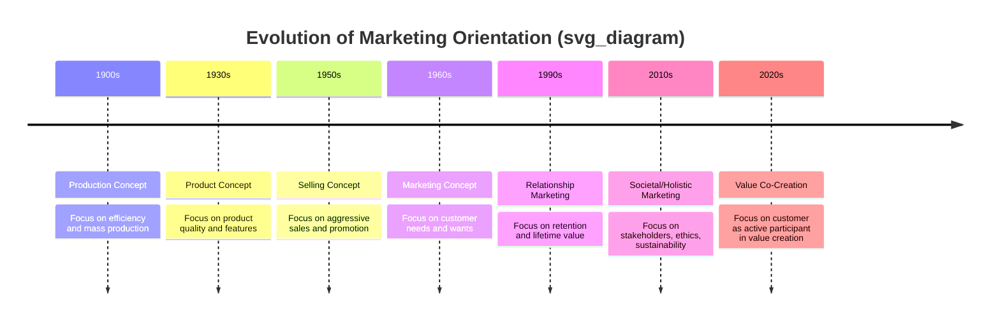

## Definitions and Scope of Marketing

### Overview

Marketing is both an organizational function and a set of processes for creating, communicating, delivering, and exchanging offerings that have value for customers, clients, partners, and society at large. It sits at the intersection of economics, psychology, sociology, and management science, and its definition has evolved substantially as markets shifted from production-driven to customer-driven and now to value-co-creation paradigms.

### Formal Definitions

**American Marketing Association (AMA) Definition (2017, current)**

Marketing is defined as the activity, set of institutions, and processes for creating, communicating, delivering, and exchanging offerings that have value for customers, clients, partners, and society at large. This is the most widely cited academic and professional definition, revised periodically (1935, 1985, 2004, 2007, 2017) to reflect shifts in marketing philosophy.

**Chartered Institute of Marketing (CIM) Definition**

Marketing is the management process responsible for identifying, anticipating, and satisfying customer requirements profitably. This definition emphasizes marketing as a managerial discipline oriented toward organizational profitability.

**Philip Kotler's Definition**

Marketing is a social and managerial process by which individuals and groups obtain what they need and want through creating and exchanging products and value with others. Kotler's framing highlights the dual nature of marketing: a societal process (broad) and a managerial process (narrow, organizational).

**Peter Drucker's Perspective**

[Inference] Drucker did not offer a single canonical "definition" in the AMA sense, but his widely referenced position is that the purpose of business is to create a customer, and that marketing and innovation are the only two functions that produce results; all else is cost. This is a foundational management-theory perspective rather than a formal marketing definition.

### Core Components Common to Most Definitions

| Component | Description |
| --- | --- |
| Value creation | Designing offerings (goods, services, experiences, ideas) that solve customer problems or fulfill wants |
| Value communication | Conveying the value proposition through messaging, branding, and positioning |
| Value delivery | Ensuring the offering reaches the customer through appropriate channels and logistics |
| Exchange | The mutual transfer of value between parties (money for goods/services, or non-monetary exchange) |
| Relationship building | Sustaining interactions beyond a single transaction to foster loyalty and lifetime value |
| Stakeholder orientation | Serving not just customers but also partners, society, and the organization itself |

### Scope of Marketing

Marketing's scope has expanded significantly from its origins in tangible goods exchange. Key dimensions of scope include:

**By Offering Type**

- Goods marketing (physical products)
- Services marketing (intangible, inseparable, perishable offerings)
- Experience marketing (events, entertainment, tourism)
- Ideas and cause marketing (social causes, public health campaigns)
- Place marketing (tourism boards, economic development)
- Person marketing (personal branding, political candidates)
- Organization marketing (nonprofits, corporate branding)

**By Market Level**

- Micromarketing: individual firm-level strategy and tactics
- Macromarketing: aggregate marketing systems and their societal, economic, and ecological impact

**By Transaction Type**

- B2C (Business-to-Consumer)
- B2B (Business-to-Business)
- C2C (Consumer-to-Consumer, e.g., peer marketplaces)
- B2G (Business-to-Government)
- Nonprofit and social marketing

**By Orientation**

- Transactional marketing: focus on discrete sales events
- Relationship marketing: focus on long-term customer relationships and retention
- Societal marketing: balancing company profits, consumer wants, and societal welfare

### Evolution of the Marketing Concept

### Narrow vs. Broad Scope Debate

A long-standing academic discussion, notably advanced by Kotler and Levy (1969), concerns whether marketing should be confined to for-profit, commercial transactions (narrow view) or extended to non-business contexts such as churches, universities, government agencies, and social causes (broad view). This "broadening of marketing" debate established the legitimacy of nonprofit and social marketing as subfields.

**Key Points**

- The narrow view treats marketing strictly as a business function tied to revenue generation.
- The broad view treats marketing as a universal process applicable wherever an exchange of value occurs, including ideas, behaviors, and social causes.
- Contemporary practice largely accepts the broad view, evidenced by the growth of social marketing, nonprofit marketing, and public sector marketing as recognized disciplines.

### Marketing as Exchange Theory

At its theoretical core, marketing is often explained through **exchange theory**: value is created when two or more parties voluntarily trade something of value for something else they perceive as more valuable. Conditions typically cited for exchange to occur include:

1. At least two parties
2. Each party has something of potential value to the other
3. Each party is capable of communication and delivery
4. Each party is free to accept or reject the exchange
5. Each party believes it is appropriate or desirable to deal with the other

### Marketing Mix as Operational Scope

The scope of marketing is often operationalized through the **4Ps** (McCarthy, 1960) and its extensions:

- Product
- Price
- Place (distribution)
- Promotion

For services marketing, this is extended to the **7Ps** by adding:

- People
- Process
- Physical evidence

$$\text{Marketing Mix} = f(P, Pr, Pl, Pm, Pe, Pc, Ph)$$

Where each variable represents a controllable element the marketer manipulates to influence the target market's response.

### Illustration: Scope of Marketing (svg_diagram)

<svg xmlns="http://www.w3.org/2000/svg" viewBox="0 0 720 420">
<text x="360" y="30" text-anchor="middle" font-size="18" font-weight="bold" fill="#1a1a1a">Scope of Marketing (svg_diagram)</text>
<circle cx="360" cy="220" r="180" fill="#eaf3fb" stroke="#2a6f97" stroke-width="2" />
<circle cx="360" cy="220" r="130" fill="#d3e8f5" stroke="#2a6f97" stroke-width="2" />
<circle cx="360" cy="220" r="80" fill="#a9d3e8" stroke="#2a6f97" stroke-width="2" />
<text x="360" y="220" text-anchor="middle" font-size="14" font-weight="bold" fill="#0b3d5c">Core Exchange</text>
<text x="360" y="238" text-anchor="middle" font-size="11" fill="#0b3d5c">Product-for-Money</text>
<text x="360" y="145" text-anchor="middle" font-size="12" font-weight="bold" fill="#0b3d5c">Organizational Marketing</text>
<text x="360" y="160" text-anchor="middle" font-size="10" fill="#0b3d5c">(B2C, B2B, Branding, CRM)</text>
<text x="360" y="85" text-anchor="middle" font-size="12" font-weight="bold" fill="#0b3d5c">Societal &amp; Macromarketing</text>
<text x="360" y="100" text-anchor="middle" font-size="10" fill="#0b3d5c">(Social Cause, Nonprofit, Policy, Ecology)</text>
</svg>

### Practical Example

**Example**

A university (non-traditional "seller") applies marketing by:

- Identifying prospective student needs (career outcomes, campus experience)
- Communicating value through brochures, digital campaigns, and open days
- Delivering value through enrollment, teaching, and student services
- Building long-term relationships through alumni engagement and lifetime donor relationships

This illustrates the broad scope of marketing extending beyond commercial goods into service and institutional contexts.

### Common Misconceptions

- Marketing is not synonymous with advertising or selling; these are subsets of the promotion element within the broader marketing process.
- Marketing is not only external-facing; internal marketing (aligning employees with brand values) is a recognized sub-discipline.
- Marketing is not purely persuasive manipulation; contemporary definitions emphasize mutual value creation and long-term relationship sustainability over one-sided persuasion. [Inference] Critiques of marketing ethics often center on cases where this mutual-value principle is violated.

### Conclusion

The definition and scope of marketing have shifted from a narrow, transaction-focused, goods-centric activity to a broad, relationship-oriented, multi-stakeholder process encompassing goods, services, ideas, experiences, and causes. Modern definitions from bodies like the AMA and scholars like Kotler converge on marketing as a value-creation and exchange process operating at both the organizational (micro) and societal (macro) levels.

**Related Topics**

- Evolution of marketing management philosophies (production, product, selling, marketing, societal concepts)
- Marketing mix: 4Ps vs. 7Ps
- Kotler and Levy's broadening of marketing concept debate
- Macromarketing and marketing systems theory
- Relationship marketing and customer lifetime value
- Social and nonprofit marketing
- Exchange theory in marketing
- Marketing ethics and societal marketing concept