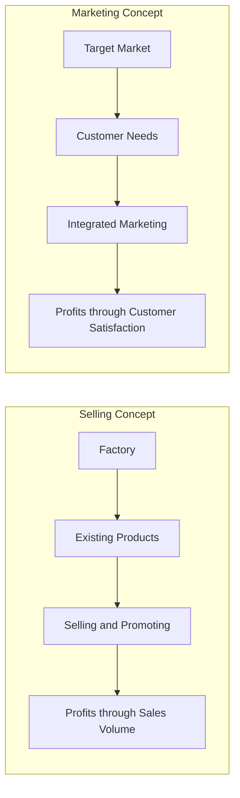
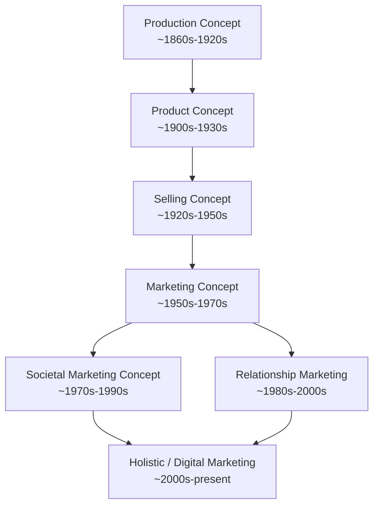

## Evolution of Marketing Management Eras

### Overview

The evolution of marketing management eras traces how organizational philosophy toward the marketplace has shifted over roughly 120 years, moving from an internally focused, output-driven logic to an externally focused, customer- and stakeholder-driven logic. Most textbooks (Kotler, Keller, Armstrong) frame this evolution as a sequence of five to six overlapping "eras" or "concepts," each representing a dominant managerial philosophy of its time. These eras are not strictly chronological in practice — organizations across industries and geographies may still operate under earlier orientations today.

### The Eras at a Glance

| Era / Concept | Approximate Period | Dominant Logic | Primary Driver |
| --- | --- | --- | --- |
| Production Era | ~1860s–1920s | "Produce as much as possible, as cheaply as possible" | Supply-side efficiency |
| Product Era | ~1900s–1930s | "Make a better product and customers will come" | Product quality/features |
| Selling Era | ~1920s–1950s | "Sell what is produced through aggressive promotion" | Sales/promotion push |
| Marketing Era (Marketing Concept) | ~1950s–1970s | "Identify and satisfy customer needs better than competitors" | Customer needs |
| Relationship/Societal Marketing Era | ~1970s–2000s | "Build long-term relationships; balance profit, customer, and societal welfare" | Retention and ethics |
| Holistic/Digital/Value Co-Creation Era | ~2000s–present | "Integrate all touchpoints; co-create value with connected, empowered customers" | Technology and stakeholder ecosystems |

### 1. Production Concept

**Key Points**

- Assumes consumers prefer products that are widely available and affordable.
- Management focus is on achieving high production efficiency, low costs, and mass distribution.
- Emerged during the Industrial Revolution when demand generally outstripped supply.

**Example**

Henry Ford's Model T strategy — standardizing a single model and color to maximize production efficiency and minimize unit cost — is the textbook illustration of production-era logic.

**Risk**

[Inference] This orientation risks "marketing myopia" (a term later coined by Theodore Levitt in 1960) — an overemphasis on internal efficiency at the expense of understanding evolving customer needs.

### 2. Product Concept

**Key Points**

- Assumes consumers favor products offering the most quality, performance, or innovative features.
- Organizations focus on continuous product improvement, sometimes without adequately validating market need.
- Can lead to over-engineering products customers do not want or cannot afford.

**Example**

A firm investing heavily in R&D to build a technically superior product without market research demonstrates product-concept thinking; the risk is producing something impressive that fails commercially due to poor demand-fit.

### 3. Selling Concept

**Key Points**

- Assumes consumers will not buy enough of a firm's products unless the firm undertakes large-scale selling and promotion efforts.
- Typically applied to unsought goods (goods buyers do not normally think of buying, such as insurance or encyclopedias).
- Focus is on transaction volume rather than building long-term customer relationships.

**Example**

High-pressure door-to-door sales tactics of mid-20th-century insurance and appliance industries exemplify the selling concept: the objective is to close the sale, not necessarily to ensure customer satisfaction afterward.

### 4. Marketing Concept

**Key Points**

- Inverts the selling concept's logic: instead of "sell what you make," the philosophy becomes "make what will sell."
- Centers on identifying target markets and delivering superior value more effectively than competitors.
- Considered the conceptual foundation of modern marketing management, often summarized as achieving organizational goals through understanding the needs and wants of target markets.

**Selling Concept vs. Marketing Concept (Comparison)**

### 5. Societal Marketing Concept

**Key Points**

- Extends the marketing concept by requiring firms to balance three considerations: company profits, consumer want satisfaction, and society's long-term welfare.
- Emerged in response to criticism that pure demand-fulfillment could conflict with environmental and social interests (e.g., pollution, resource depletion, disposable culture).
- Closely linked to the rise of corporate social responsibility (CSR) and sustainability marketing.

**Illustration: Societal Marketing's Three-Way Balance (svg_diagram)**

<svg xmlns="http://www.w3.org/2000/svg" viewBox="0 0 640 440">
<text x="320" y="28" text-anchor="middle" font-size="17" font-weight="bold" fill="#1a1a1a">Societal Marketing Concept (svg_diagram)</text>
<polygon points="320,70 500,340 140,340" fill="none" stroke="#2a6f97" stroke-width="2" />
<circle cx="320" cy="70" r="55" fill="#a9d3e8" stroke="#2a6f97" stroke-width="2" />
<text x="320" y="65" text-anchor="middle" font-size="12" font-weight="bold" fill="#0b3d5c">Society</text>
<text x="320" y="80" text-anchor="middle" font-size="10" fill="#0b3d5c">(Human Welfare)</text>
<circle cx="500" cy="340" r="55" fill="#d3e8f5" stroke="#2a6f97" stroke-width="2" />
<text x="500" y="335" text-anchor="middle" font-size="12" font-weight="bold" fill="#0b3d5c">Consumers</text>
<text x="500" y="350" text-anchor="middle" font-size="10" fill="#0b3d5c">(Want Satisfaction)</text>
<circle cx="140" cy="340" r="55" fill="#eaf3fb" stroke="#2a6f97" stroke-width="2" />
<text x="140" y="335" text-anchor="middle" font-size="12" font-weight="bold" fill="#0b3d5c">Company</text>
<text x="140" y="350" text-anchor="middle" font-size="10" fill="#0b3d5c">(Profits)</text>
</svg>

### 6. Relationship Marketing Era

**Key Points**

- Shifts emphasis from discrete transactions to long-term, mutually beneficial relationships with customers, suppliers, distributors, and other partners.
- Introduces concepts such as customer lifetime value (CLV), customer retention economics, and loyalty programs.
- Coincides with growth in CRM (Customer Relationship Management) systems and database marketing in the 1980s–1990s.

**Formula: Customer Lifetime Value (Simplified)**

$$CLV = \sum_{t=1}^{n} \frac{(R_t - C_t)}{(1 + d)^t}$$

Where $R_t$ is revenue in period $t$, $C_t$ is cost to serve in period $t$, $d$ is the discount rate, and $n$ is the projected relationship duration.

### 7. Holistic Marketing / Digital / Value Co-Creation Era

**Key Points**

- Kotler and Keller's "holistic marketing" concept (early 2000s) integrates four components: relationship marketing, integrated marketing, internal marketing, and performance (societal) marketing.
- Reflects the rise of digital channels, social media, big data, and marketing technology (MarTech) stacks that enable real-time, personalized, two-way engagement.
- Embraces the Service-Dominant Logic (Vargo and Lusch, 2004), which reframes customers as active co-creators of value rather than passive recipients.
- [Inference] Some contemporary scholars propose further refinement into an "Agile Marketing" or "AI-augmented Marketing" era given generative AI, automation, and real-time personalization capabilities emerging in the 2020s; this framing is not yet as universally codified in core textbooks as the preceding eras.

### Full Timeline Diagram

### Comparative Table: Orientation Shift Over Time

| Dimension | Production/Selling Era | Marketing Era | Holistic/Relationship Era |
| --- | --- | --- | --- |
| Focus | Internal (factory, product) | External (target market) | Ecosystem (customers, partners, society) |
| Time Horizon | Short-term transaction | Medium-term satisfaction | Long-term relationship/lifetime value |
| Success Metric | Production volume, sales volume | Market share, satisfaction | Retention, CLV, brand equity, advocacy |
| Customer Role | Passive recipient | Target to be satisfied | Active co-creator of value |
| Technology Role | Minimal | Market research | Data-driven personalization, automation |

### Practical Application Example

**Example**

A retail bank in the 1960s (selling era) might have relied on branch staff aggressively cross-selling products to walk-in customers. By the 1990s (marketing/relationship era), the same bank would segment customers and design tailored product bundles based on identified needs. By the 2020s (holistic/digital era), the bank would use behavioral data, mobile app engagement, and AI-driven personalization to co-create financial wellness experiences with customers in real time.

### Critiques and Limitations of the Era Model

- The "era" framework is a pedagogical simplification; in practice, multiple orientations coexist within the same industry or even the same firm depending on product line or market maturity. [Inference]
- Critics argue the linear "eras" narrative understates the recurrence of production- and selling-oriented practices in commoditized or resource-constrained markets even today.
- The framework is primarily Western/US-centric in its historical origin and may not map precisely onto the development of marketing thought in other economic contexts. [Unverified]

### Conclusion

The evolution of marketing management eras illustrates a broad philosophical migration from firm-centric efficiency and persuasion toward customer-centric value creation and, most recently, toward collaborative, technology-enabled, stakeholder-inclusive value co-creation. Understanding this progression provides the conceptual scaffolding for nearly all subsequent marketing management theory, including segmentation, targeting, positioning, and relationship/CRM strategy.

**Related Topics**

- Marketing myopia (Theodore Levitt)
- Service-Dominant Logic (Vargo and Lusch)
- Customer Relationship Management (CRM) systems
- Customer Lifetime Value (CLV) modeling
- Corporate Social Responsibility (CSR) and sustainability marketing
- Holistic marketing framework (Kotler and Keller)
- Digital and omnichannel marketing strategy
- Agile marketing and AI-augmented marketing practices