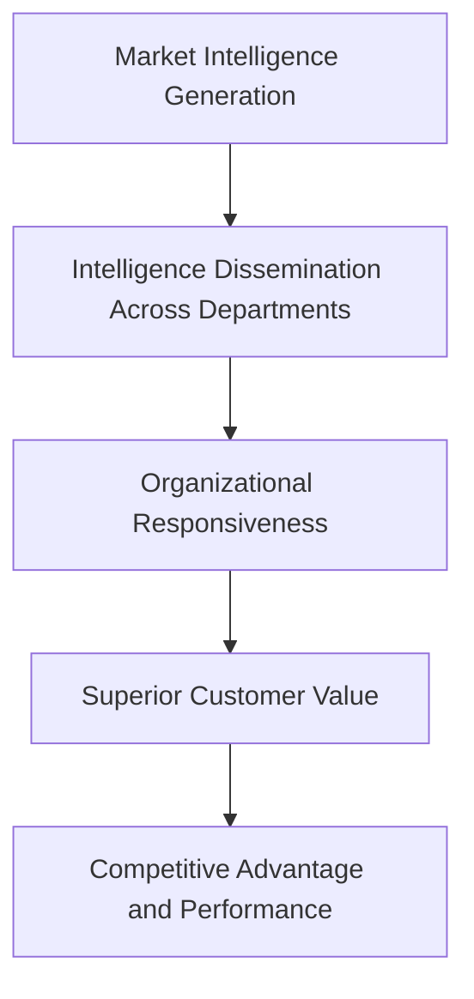
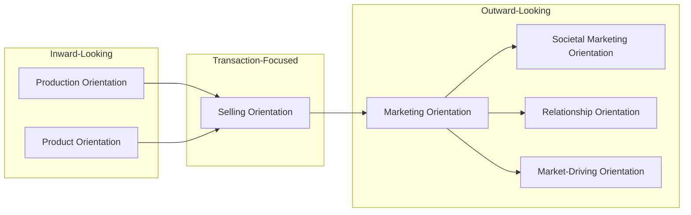

## Marketing Philosophies and Orientations

### Overview

Marketing philosophies and orientations refer to the underlying strategic mindsets that guide how an organization defines its purpose relative to the market. While closely related to the "eras" framework (which is historically sequenced), "orientations" is the broader theoretical term used in strategy and organizational behavior literature to describe the relatively stable, ongoing posture a firm adopts toward customers, competitors, and the wider environment — independent of any specific time period. A firm's marketing orientation shapes resource allocation, organizational structure, decision-making criteria, and performance metrics.

### Core Marketing Orientations

| Orientation | Central Question | Primary Focus |
| --- | --- | --- |
| Production Orientation | "How can we produce more efficiently?" | Internal efficiency, cost, availability |
| Product Orientation | "How can we make a better product?" | Product quality/innovation |
| Selling Orientation | "How can we sell what we make?" | Promotion and persuasion |
| Marketing Orientation | "What does the customer need?" | Customer needs and competitive advantage |
| Societal Marketing Orientation | "What serves the customer, company, and society?" | Ethical and sustainable balance |
| Relationship Orientation | "How do we build durable value over time?" | Retention, loyalty, lifetime value |
| Market-Driving Orientation | "How can we shape or create the market?" | Innovation ahead of stated needs |

### 1. Production Orientation

**Key Points**

- Internally focused; assumes the central managerial task is operational efficiency and distribution reach.
- Appropriate primarily in supply-constrained markets or in the early stages of industrialization.
- Vulnerable to competitive disruption once supply catches up with demand and customers can exercise choice.

### 2. Product Orientation

**Key Points**

- Assumes competitive advantage comes from continually improving product attributes.
- Risk of "marketing myopia" — a firm becomes so focused on product features it fails to notice a shift in the underlying customer need.

**Example**

[Inference] The often-cited (though partly anecdotal) case of buggy-whip manufacturers who kept perfecting whip quality while the underlying need ("personal transportation") shifted to automobiles illustrates the limitation of a pure product orientation.

### 3. Selling Orientation

**Key Points**

- Assumes customers are passive and must be persuaded through aggressive promotional effort.
- Metrics of success center on sales volume and conversion rate rather than post-purchase satisfaction.
- Most applicable to unsought goods where customer-initiated demand is low.

### 4. Marketing Orientation (Customer Orientation)

**Key Points**

- Represents the shift toward using systematic market research and customer insight as the starting point for product and communication decisions.
- Operationalized in academic literature through constructs such as MARKOR (Kohli, Jaworski, and Kumar, 1993) and MKTOR (Narver and Slater, 1990), which measure the degree of market orientation in a firm via intelligence generation, intelligence dissemination, and organizational responsiveness.

**Narver and Slater's Market Orientation Components**

1. Customer orientation — understanding target buyers' needs
2. Competitor orientation — understanding competitors' strengths, weaknesses, and strategies
3. Inter-functional coordination — utilizing firm-wide resources to create superior customer value

### 5. Societal Marketing Orientation

**Key Points**

- Adds an ethical and ecological dimension to customer orientation, requiring firms to weigh long-term societal welfare alongside profit and customer satisfaction.
- Closely tied to the emergence of green marketing, cause-related marketing, and corporate social responsibility (CSR) reporting.
- [Inference] Increasingly operationalized today through Environmental, Social, and Governance (ESG) frameworks that formalize the societal dimension into measurable corporate disclosures.

### 6. Relationship Orientation

**Key Points**

- Centers on long-term value exchange rather than single transactions, incorporating loyalty programs, CRM systems, and personalization.
- Draws on relationship marketing theory (Berry, 1983; Grönroos, 1994) emphasizing trust, commitment, and mutual investment between buyer and seller.

**Key Relationship Marketing Constructs**

| Construct | Definition |
| --- | --- |
| Trust | Confidence in the reliability and integrity of the exchange partner |
| Commitment | Belief in the value of maintaining the relationship long-term |
| Satisfaction | Cumulative evaluation of purchase and consumption experiences |
| Switching Costs | Perceived costs (financial, procedural, relational) of changing suppliers |

### 7. Market-Driving Orientation (Beyond Customer-Led)

**Key Points**

- Distinguishes between being "market-driven" (responding to articulated customer needs) and "market-driving" (shaping customer preferences through innovation the customer could not have articulated).
- Associated with disruptive innovation theory and firms that create new market categories rather than segment existing ones.

**Example**

[Inference] Early smartphone touchscreen interfaces are frequently cited as a market-driving innovation — customers had not explicitly requested this interface paradigm, yet it reshaped subsequent demand expectations industry-wide.

### Comparative Orientation Model

### Illustration: Orientation Spectrum (svg_diagram)

<svg xmlns="http://www.w3.org/2000/svg" viewBox="0 0 720 320">
<text x="360" y="28" text-anchor="middle" font-size="17" font-weight="bold" fill="#1a1a1a">Marketing Orientation Spectrum (svg_diagram)</text>
<line x1="60" y1="180" x2="660" y2="180" stroke="#2a6f97" stroke-width="3" />
<circle cx="100" cy="180" r="8" fill="#0b3d5c" />
<text x="100" y="210" text-anchor="middle" font-size="11" fill="#0b3d5c">Production</text>
<circle cx="230" cy="180" r="8" fill="#0b3d5c" />
<text x="230" y="210" text-anchor="middle" font-size="11" fill="#0b3d5c">Product</text>
<circle cx="360" cy="180" r="8" fill="#0b3d5c" />
<text x="360" y="210" text-anchor="middle" font-size="11" fill="#0b3d5c">Selling</text>
<circle cx="490" cy="180" r="8" fill="#0b3d5c" />
<text x="490" y="210" text-anchor="middle" font-size="11" fill="#0b3d5c">Marketing/Societal</text>
<circle cx="620" cy="180" r="8" fill="#0b3d5c" />
<text x="620" y="210" text-anchor="middle" font-size="11" fill="#0b3d5c">Relationship/Driving</text>
<text x="100" y="150" text-anchor="middle" font-size="10" fill="#555">Inward-Focused</text>
<text x="620" y="150" text-anchor="middle" font-size="10" fill="#555">Outward &amp; Long-Term</text>
</svg>

### Measuring Market Orientation: MARKOR Scale (Conceptual Structure)

$$MO = f(I_g, I_d, R)$$

Where $I_g$ = intelligence generation, $I_d$ = intelligence dissemination, and $R$ = organizational responsiveness. [Inference] This is a conceptual simplification of the MARKOR construct for illustrative purposes; the original scale (Kohli, Jaworski, and Kumar, 1993) uses multi-item Likert survey measures rather than a strict mathematical function.

### Practical Example Across Orientations

**Example**

Consider a coffee equipment manufacturer:

- **Production-oriented** version: mass-produce a single machine model to minimize unit cost.
- **Product-oriented** version: continuously add technical features (pressure control, temperature precision) regardless of customer demand for them.
- **Selling-oriented** version: deploy an aggressive direct sales team to push inventory.
- **Marketing-oriented** version: survey café owners and home baristas to identify unmet needs, then design machines around those insights.
- **Societal-oriented** version: additionally ensure sustainable sourcing of materials and energy-efficient design.
- **Relationship-oriented** version: build a loyalty ecosystem (maintenance subscriptions, community forums, repeat-purchase incentives).
- **Market-driving** version: introduce a novel brewing technology that redefines how the category is used, ahead of any articulated customer request.

### Criticisms and Boundary Conditions

- A pure marketing (customer) orientation can lead to incrementalism, where firms only make improvements customers can already articulate, potentially missing breakthrough innovation opportunities. [Inference]
- Excessive relationship orientation investment can produce diminishing returns if switching costs and loyalty programs are not matched by genuine value delivery.
- Empirical research on the market orientation–performance link shows a generally positive but context-dependent relationship, moderated by factors such as market turbulence, competitive intensity, and technological change. [Unverified — findings vary by study, industry, and measurement approach]

### Conclusion

Marketing philosophies and orientations describe the enduring strategic postures organizations adopt toward markets, ranging from internally focused production and product orientations to externally focused, ethically balanced, and relationship-driven orientations. Understanding this spectrum helps explain not only historical shifts in marketing practice but also why firms within the same industry today can pursue markedly different strategic logics.

**Related Topics**

- Market orientation scales: MARKOR and MKTOR
- Marketing myopia and its strategic implications
- Relationship marketing and trust-commitment theory
- ESG and corporate social responsibility in marketing
- Disruptive innovation and market-driving strategy
- Inter-functional coordination in market-oriented firms
- Customer-centricity vs. product-centricity debates