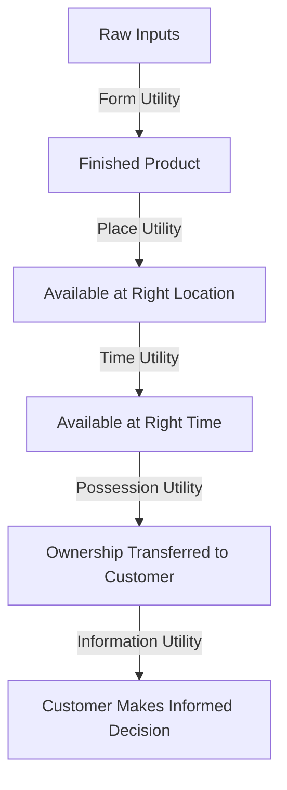
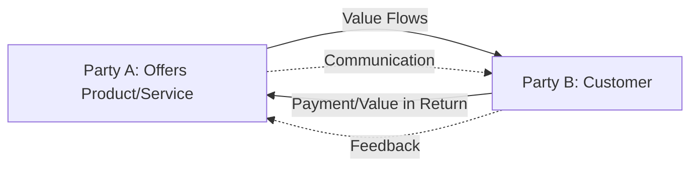

## Value Creation, Exchange, and Utility

### Overview

Value creation, exchange, and utility form the theoretical bedrock underlying nearly all marketing activity. Marketing exists because exchange is more efficient than self-production for satisfying human needs and wants, and firms compete by creating and delivering superior *utility* — the want-satisfying power of a good, service, or experience — relative to alternatives. This trio of concepts connects economic theory (utility, exchange) with managerial marketing practice (value proposition design, customer value management).

### Foundational Definitions

| Concept | Definition |
| --- | --- |
| Value | The customer's overall assessment of the utility of an offering based on perceptions of what is received relative to what is given |
| Exchange | The act of obtaining a desired object from someone by offering something in return |
| Utility | The want-satisfying capacity of a good, service, or idea |
| Value Proposition | The set of benefits a company promises to deliver to customers to satisfy their needs |

### Types of Utility

Classical economics and marketing theory identify four (sometimes five) forms of utility that marketing activities create:

| Utility Type | Description | Marketing Function Involved |
| --- | --- | --- |
| Form Utility | Value created by converting raw materials/inputs into a finished, usable product | Production/Product Design |
| Place Utility | Value created by making a product available where the customer wants it | Distribution/Logistics |
| Time Utility | Value created by making a product available when the customer wants it | Inventory/Distribution/Scheduling |
| Possession Utility | Value created by facilitating transfer of ownership or use rights to the customer | Sales/Financing/Transaction |
| Information Utility (sometimes added) | Value created by providing knowledge needed to make a purchase decision | Promotion/Communication |

**Key Points**

- Although *form utility* is often primarily created by operations/production functions, marketing frequently informs form utility through product design input based on customer insight.
- Place, time, and possession utility are the utilities most directly and classically attributed to marketing's logistical and transactional functions.

### Customer Value Formula

A widely used conceptual formula for customer-perceived value is:

$$V = \frac{B}{C}$$

Where $V$ is perceived value, $B$ represents the sum of perceived benefits (functional, emotional, social, epistemic), and $C$ represents the sum of perceived costs (monetary price, time, effort, psychological/risk costs).

An expanded additive formulation often used in marketing texts is:

$$V = (B_f + B_e + B_s) - (C_m + C_t + C_p)$$

Where $B_f$ = functional benefits, $B_e$ = emotional benefits, $B_s$ = social benefits, $C_m$ = monetary cost, $C_t$ = time cost, and $C_p$ = psychological/effort cost. [Inference] This additive formulation is a common pedagogical simplification used across marketing management textbooks rather than a single universally standardized equation; exact benefit/cost categorizations vary by author.

### Total Customer Value vs. Total Customer Cost (Kotler's Framework)

**Total Customer Value** components:

- Product value
- Services value
- Personnel value
- Image value

**Total Customer Cost** components:

- Monetary cost
- Time cost
- Energy cost
- Psychological cost

**Customer Delivered Value** = Total Customer Value − Total Customer Cost

### The Exchange Process

Exchange is the core act through which marketing delivers value. For exchange to occur, five conditions are generally required:

1. At least two parties participate
2. Each party has something of value to the other
3. Each party is capable of communication and delivery
4. Each party is free to accept or reject the exchange offer
5. Each party believes it is appropriate to deal with the other party

### Types of Exchange

| Type | Description |
| --- | --- |
| Restricted (Two-Party) Exchange | Direct exchange between two parties (classic buyer-seller transaction) |
| Generalized Exchange | Exchange involving three or more parties in a network (e.g., multi-sided platforms) |
| Complex Exchange | Multiple simultaneous exchanges among interconnected parties (e.g., B2B supply chains) |
| Monetary Exchange | Exchange using currency as the medium |
| Barter Exchange | Direct exchange of goods/services without currency |
| Relational Exchange | Repeated exchange embedded within an ongoing relationship, as opposed to a one-off transaction |

### Value Creation vs. Value Capture

**Key Points**

- *Value creation* refers to the total value generated for all parties in an exchange (often modeled as the difference between a customer's willingness to pay and the seller's cost to produce).
- *Value capture* refers to how much of that created value a firm is able to retain as profit, typically through pricing strategy.
- Marketing strategy involves both maximizing total value created (through superior offerings) and effectively capturing a fair share of that value (through pricing, positioning, and differentiation).

$$\text{Value Created} = WTP - \text{Cost to Produce}$$

$$\text{Value Captured by Firm} = \text{Price} - \text{Cost to Produce}$$

$$\text{Value Captured by Customer} = WTP - \text{Price}$$

Where $WTP$ = customer's willingness to pay.

### Illustration: Value Creation and Capture (svg_diagram)

<svg xmlns="http://www.w3.org/2000/svg" viewBox="0 0 700 260">
<text x="350" y="26" text-anchor="middle" font-size="16" font-weight="bold" fill="#1a1a1a">Value Creation and Capture (svg_diagram)</text>
<rect x="50" y="80" width="600" height="60" fill="#eaf3fb" stroke="#2a6f97" stroke-width="2" />
<line x1="220" y1="80" x2="220" y2="140" stroke="#0b3d5c" stroke-width="2" stroke-dasharray="4,3" />
<line x1="430" y1="80" x2="430" y2="140" stroke="#0b3d5c" stroke-width="2" stroke-dasharray="4,3" />
<text x="135" y="115" text-anchor="middle" font-size="11" fill="#0b3d5c">Firm Cost</text>
<text x="325" y="115" text-anchor="middle" font-size="11" fill="#0b3d5c">Firm Value Captured (Profit)</text>
<text x="540" y="115" text-anchor="middle" font-size="11" fill="#0b3d5c">Customer Value Captured (Surplus)</text>
<text x="50" y="170" font-size="10" fill="#555">Cost</text>
<text x="220" y="170" font-size="10" fill="#555">Price</text>
<text x="650" y="170" text-anchor="end" font-size="10" fill="#555">Willingness to Pay (WTP)</text>
</svg>

### Practical Example

**Example**

A ride-hailing app creates value by combining:

- **Form utility**: aggregating driver supply and rider demand into a usable service via its platform.
- **Place utility**: matching riders with nearby drivers.
- **Time utility**: enabling on-demand pickup rather than pre-scheduled-only transportation.
- **Possession utility**: transferring the right to use transportation service for a defined trip.
- **Information utility**: providing fare estimates, driver ratings, and route information upfront.

The exchange occurs when the rider pays the fare (monetary cost + time + effort) in return for the transportation service (functional, time-saving, and convenience benefits). The firm captures value through the fare markup or commission above driver payout and operating cost; the rider captures value through convenience exceeding the fare paid, i.e., their surplus relative to willingness to pay.

### Value-in-Exchange vs. Value-in-Use

**Key Points**

- **Value-in-exchange** (Goods-Dominant Logic): value is embedded in the product at the point of sale and determined by its exchange/market price.
- **Value-in-use** (Service-Dominant Logic, Vargo and Lusch, 2004): value is only realized when the customer actually uses/consumes the offering, and is co-created between firm and customer during usage.
- [Inference] This distinction underlies the modern shift toward subscription and outcome-based business models, where firms are incentivized to ensure ongoing usage value rather than a single point-of-sale transaction.

### Common Misconceptions

- Value is not identical to price; price is the monetary expression of exchange, while value encompasses the full benefit-cost comparison as perceived by the customer.
- Utility is not solely functional; emotional, social, and epistemic (novelty-seeking) utility are equally legitimate drivers of exchange decisions.
- Exchange does not require monetary transactions; barter, information-sharing, and attention-for-content models (e.g., free platforms funded by advertising) are also forms of exchange.

### Conclusion

Value creation, exchange, and utility together explain *why* marketing exists as an economic and social activity: firms create various forms of utility (form, place, time, possession, information), facilitate voluntary exchange under defined conditions, and compete on their ability to both create superior customer value and capture a sustainable share of that value through pricing and positioning strategy.

**Related Topics**

- Customer Value Proposition (CVP) design frameworks
- Willingness-to-pay (WTP) estimation methods
- Service-Dominant Logic vs. Goods-Dominant Logic
- Value-based pricing strategy
- Customer Lifetime Value and relationship exchange
- Multi-sided platform and network exchange models
- Behavioral economics of perceived cost and psychological pricing