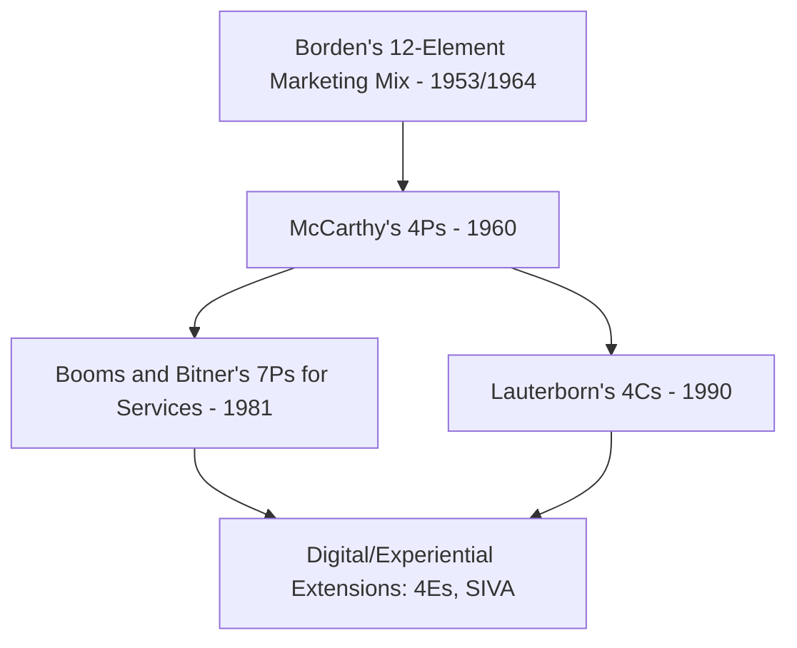
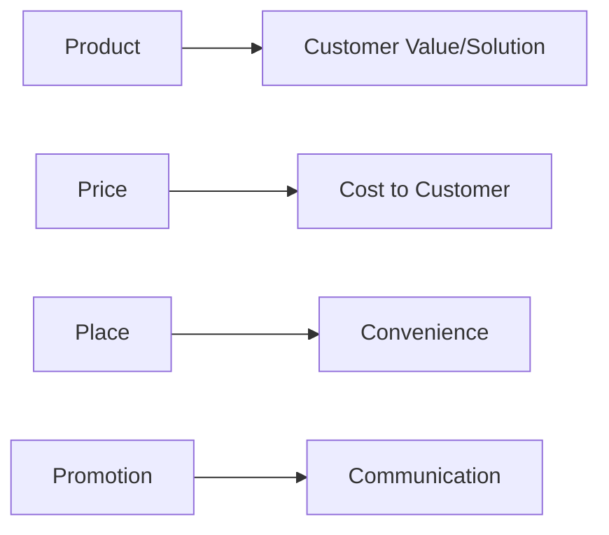
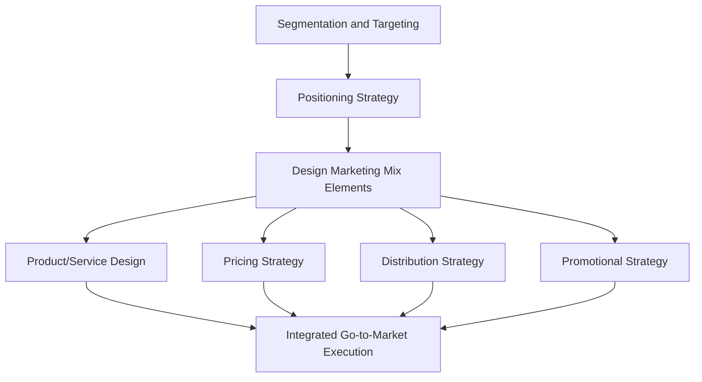

## The Marketing Mix and Its Extensions

### Overview

The marketing mix is the set of controllable, tactical marketing tools that a firm blends to produce the response it wants from its target market. Originally conceptualized by Neil Borden in the 1950s as a longer list of managerial variables, it was popularized and simplified by E. Jerome McCarthy in 1960 into the **4Ps** framework. Over subsequent decades, scholars extended the framework to address the limitations of a purely goods-centric model, producing the **7Ps** (for services), the **4Cs** (customer-centric reframing), and various further extensions (SIVA, 4Es) for digital and experiential contexts.

### Historical Origin

**Key Points**

- Neil Borden introduced the term "marketing mix" in his 1964 paper (based on a 1953 address), originally comprising 12 elements including product planning, pricing, branding, distribution channels, personal selling, advertising, promotions, packaging, display, servicing, physical handling, and fact-finding/analysis.
- E. Jerome McCarthy condensed Borden's list into the more memorable **4Ps**: Product, Price, Place, Promotion — a framework that became the dominant teaching model in marketing management.

### The Classic 4Ps

| Element | Definition | Key Decisions |
| --- | --- | --- |
| Product | The good, service, or idea offered to satisfy customer needs | Features, quality, branding, packaging, variety, warranties |
| Price | The amount of money charged for the product | List price, discounts, payment terms, price positioning |
| Place | The activities that make the product available to target customers | Channels, coverage, logistics, inventory, transportation |
| Promotion | Activities that communicate the product's merits and persuade customers | Advertising, personal selling, sales promotion, PR, direct marketing |

**Illustration: The 4Ps Framework (svg_diagram)**

<svg xmlns="http://www.w3.org/2000/svg" viewBox="0 0 640 440">
<text x="320" y="26" text-anchor="middle" font-size="16" font-weight="bold" fill="#1a1a1a">The 4Ps Marketing Mix (svg_diagram)</text>
<circle cx="320" cy="230" r="80" fill="#a9d3e8" stroke="#2a6f97" stroke-width="2" />
<text x="320" y="234" text-anchor="middle" font-size="13" font-weight="bold" fill="#0b3d5c">Target Market</text>
<rect x="120" y="70" width="140" height="60" fill="#eaf3fb" stroke="#2a6f97" stroke-width="2" />
<text x="190" y="105" text-anchor="middle" font-size="13" font-weight="bold" fill="#0b3d5c">Product</text>
<rect x="380" y="70" width="140" height="60" fill="#eaf3fb" stroke="#2a6f97" stroke-width="2" />
<text x="450" y="105" text-anchor="middle" font-size="13" font-weight="bold" fill="#0b3d5c">Price</text>
<rect x="120" y="340" width="140" height="60" fill="#eaf3fb" stroke="#2a6f97" stroke-width="2" />
<text x="190" y="375" text-anchor="middle" font-size="13" font-weight="bold" fill="#0b3d5c">Place</text>
<rect x="380" y="340" width="140" height="60" fill="#eaf3fb" stroke="#2a6f97" stroke-width="2" />
<text x="450" y="375" text-anchor="middle" font-size="13" font-weight="bold" fill="#0b3d5c">Promotion</text>
<line x1="220" y1="130" x2="280" y2="180" stroke="#2a6f97" stroke-width="2" />
<line x1="420" y1="130" x2="360" y2="180" stroke="#2a6f97" stroke-width="2" />
<line x1="220" y1="340" x2="280" y2="280" stroke="#2a6f97" stroke-width="2" />
<line x1="420" y1="340" x2="360" y2="280" stroke="#2a6f97" stroke-width="2" />
</svg>

### Extension 1: The 7Ps (Services Marketing Mix)

Booms and Bitner (1981) extended the 4Ps to account for the distinctive characteristics of services — intangibility, inseparability, variability, and perishability (often abbreviated IHIP) — by adding three elements:

| Additional Element | Definition | Key Decisions |
| --- | --- | --- |
| People | Employees and customers involved in service delivery | Hiring, training, empowerment, customer-to-customer interaction |
| Process | The procedures and flow of activities by which service is delivered | Service blueprinting, standardization vs. customization, wait time |
| Physical Evidence | Tangible cues that signal service quality | Servicescape design, branding materials, staff appearance, packaging |

**Key Points**

- The 7Ps framework is the standard extension taught for services, retail, hospitality, and experience-based marketing.
- Physical evidence functions as a proxy for quality assessment because services cannot be inspected prior to purchase in the way physical goods can.

### Extension 2: The 4Cs (Customer-Centric Reframing)

Robert Lauterborn (1990) proposed reframing the 4Ps from the customer's perspective, arguing that sellers' variables should be translated into buyer-relevant equivalents:

| 4Ps (Seller View) | 4Cs (Customer View) | Rationale |
| --- | --- | --- |
| Product | Customer Value/Solution | Customers buy solutions to problems, not product features |
| Price | Cost to the Customer | Price is only part of total cost (time, effort, risk) |
| Place | Convenience | Customers care about ease of access, not channel logistics |
| Promotion | Communication | Modern marketing favors two-way dialogue over one-way promotion |

### Extension 3: SIVA Model

An alternative customer-centric model sometimes referenced in modern marketing curricula:

| Element | Corresponds To |
| --- | --- |
| Solution | Product |
| Information | Promotion |
| Value | Price |
| Access | Place |

[Inference] The SIVA model is less universally adopted in mainstream marketing management textbooks compared to the 4Cs, but appears in some marketing communications and digital marketing curricula as an alternative customer-centric framing.

### Extension 4: Digital-Era Extensions (4Es and Beyond)

With the rise of digital, social, and experiential marketing, several additional frameworks have been proposed, though these are less standardized across academic sources:

| Element | Concept |
| --- | --- |
| Experience | Replacing "Product" — focus on the overall experience delivered |
| Exchange | Replacing "Price" — broader value exchange, not just monetary |
| Everyplace | Replacing "Place" — omnichannel presence, not fixed location |
| Evangelism | Replacing "Promotion" — customer advocacy and word-of-mouth |

[Unverified] The "4Es" framework does not have a single universally credited originator and appears in multiple variant forms across marketing consultancy and digital marketing literature; it should be treated as an illustrative extension rather than a formally standardized academic model to the same degree as the 4Ps/7Ps.

### Comparative Table: Mix Frameworks Across Contexts

| Context | Recommended Framework | Reason |
| --- | --- | --- |
| Physical goods, traditional retail | 4Ps | Established, simple, widely taught |
| Services, hospitality, healthcare | 7Ps | Accounts for intangibility and service delivery process |
| Customer-centric strategic planning | 4Cs | Reframes tactics around buyer perspective |
| Digital/omnichannel/experiential marketing | 4Es or hybrid models | Reflects fluid, non-transactional value exchange |

### Practical Example

**Example**

A boutique fitness studio applying the extended marketing mix:

- **Product**: group class formats, personal training packages
- **Price**: monthly membership tiers, drop-in rates
- **Place**: physical studio location plus app-based virtual class access
- **Promotion**: social media content, referral incentives
- **People**: instructor expertise and community-building skills
- **Process**: class booking flow, check-in experience, waitlist management
- **Physical Evidence**: studio interior design, branded apparel, cleanliness

Reframed through the 4Cs lens:

- **Customer Value**: achieving fitness goals and community belonging (not just "classes")
- **Cost to Customer**: membership fee plus time commitment and travel effort
- **Convenience**: ease of booking, proximity, flexible scheduling
- **Communication**: two-way engagement via social media comments, member feedback loops

### Applying the Mix: Strategic Sequencing

### Common Misconceptions

- The marketing mix is not a checklist to be applied uniformly; elements must be internally consistent and aligned with the firm's positioning strategy (a low-price element combined with luxury-tier promotion, for example, creates positioning conflict).
- The 7Ps are not exclusive to "pure" service businesses; most modern offerings include a service component (e.g., customer support, delivery experience) that benefits from the extended framework.
- The 4Cs do not replace the 4Ps operationally; they are a *perspective-shift* tool for ensuring tactical decisions remain customer-relevant, not a separate implementation framework.

### Conclusion

The marketing mix, beginning with McCarthy's foundational 4Ps, remains the central tactical toolkit of marketing management. Its extensions — the 7Ps for services, the 4Cs for customer-centric reframing, and various digital-era models — reflect marketing theory's ongoing adaptation to intangible, experiential, and technology-mediated value exchange, while preserving the core discipline of designing internally consistent, target-market-aligned tactical decisions.

**Related Topics**

- Service-Dominant Logic and the IHIP characteristics of services
- Service blueprinting and process design
- Positioning strategy and mix consistency
- Omnichannel and digital marketing strategy
- Pricing strategy frameworks (value-based, cost-based, competition-based)
- Integrated Marketing Communications (IMC)
- Customer journey mapping and touchpoint design