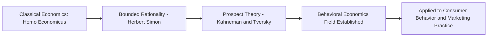
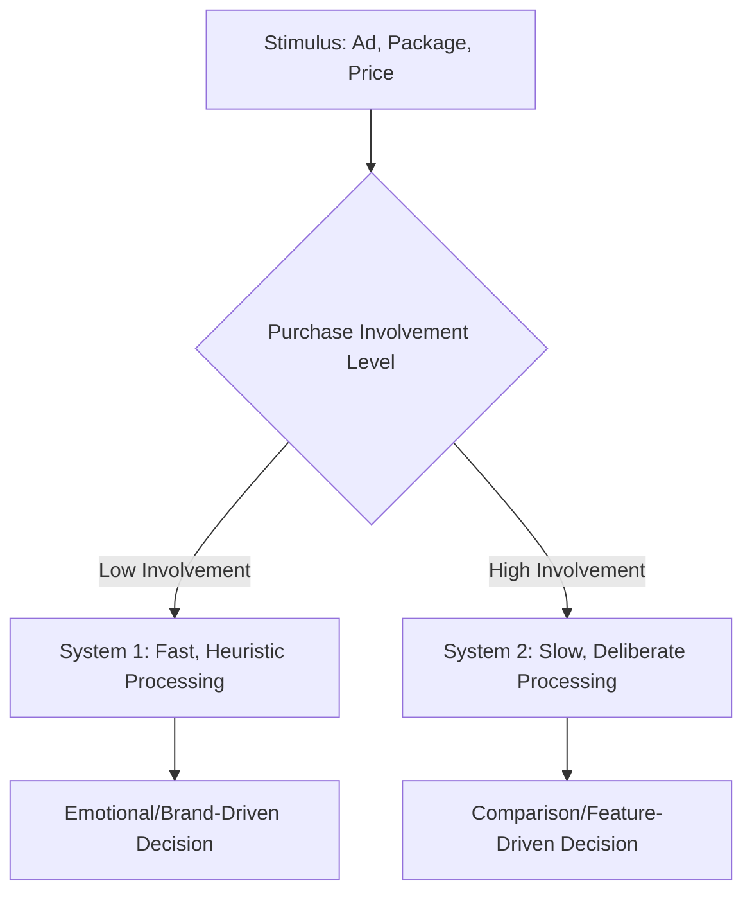

## Marketing's Links to Economics and Behavioral Science

### Overview

Marketing theory draws heavily on two adjacent disciplines: classical/neoclassical **economics**, which provides the foundational logic of exchange, utility maximization, supply-demand equilibrium, and pricing; and **behavioral science** (psychology, behavioral economics, cognitive science), which explains why real consumer decision-making frequently deviates from the rational-actor assumptions of classical economic models. Understanding both lineages explains why modern marketing theory operates as a hybrid discipline — using economic frameworks for structural/strategic decisions while relying on behavioral science for understanding actual consumer psychology and decision processes.

### The Economic Foundations of Marketing

**Key Points**

- Classical economics assumes the **homo economicus** model: a rational actor with stable preferences who maximizes utility subject to a budget constraint, possessing full information and unlimited cognitive processing capacity.
- Microeconomic concepts directly underpin core marketing tools: demand curves inform pricing strategy, elasticity informs promotional and pricing sensitivity analysis, and marginal utility informs product-line and bundling decisions.
- Marketing emerged partly as an applied extension of economics, particularly the sub-field of industrial organization and distribution economics in the early 20th century.

**Core Economic Concepts Used in Marketing**

| Economic Concept | Marketing Application |
| --- | --- |
| Supply and Demand | Pricing strategy, market sizing, inventory planning |
| Price Elasticity of Demand | Determining price sensitivity, discount strategy, revenue optimization |
| Marginal Utility | Product bundling, quantity discounts, diminishing returns on promotions |
| Consumer Surplus | Value-based pricing, willingness-to-pay estimation |
| Opportunity Cost | Positioning against substitute products/categories |
| Perfect vs. Imperfect Competition | Differentiation strategy, monopolistic competition via branding |
| Game Theory | Competitive strategy, bidding (e.g., auctions, media buying) |

### Price Elasticity of Demand (Core Formula)

$$E_d = \frac{\% \Delta Q_d}{\% \Delta P}$$

Where $E_d$ is price elasticity of demand, $\%\Delta Q_d$ is the percentage change in quantity demanded, and $\%\Delta P$ is the percentage change in price. Understanding elasticity is essential for pricing decisions: goods with $|E_d| > 1$ are elastic (price-sensitive), while goods with $|E_d| < 1$ are inelastic (less price-sensitive).

### Where Classical Economics Falls Short: The Behavioral Turn

**Key Points**

- Classical economic models assume consistent, rational preferences, but decades of empirical research in psychology and behavioral economics demonstrate systematic, predictable deviations from rationality.
- Herbert Simon's concept of **bounded rationality** (1950s) first challenged the assumption of unlimited cognitive capacity, proposing that decision-makers "satisfice" (choose a satisfactory option) rather than optimize.
- Daniel Kahneman and Amos Tversky's **Prospect Theory** (1979) formalized how people evaluate gains and losses asymmetrically relative to a reference point, a foundational shift that gave rise to modern behavioral economics.

### Prospect Theory and Marketing Implications

Prospect Theory proposes that value is assessed relative to a reference point, with losses looming larger than equivalent gains (**loss aversion**), and that people are risk-averse for gains but risk-seeking for losses.

$$v(x) = \begin{cases} x^{\alpha} & x \geq 0 \\ -\lambda(-x)^{\beta} & x < 0 \end{cases}$$

Where $v(x)$ is the subjective value of outcome $x$ relative to the reference point, $\alpha$ and $\beta$ are typically estimated less than 1 (reflecting diminishing sensitivity), and $\lambda > 1$ represents the loss-aversion coefficient (commonly estimated around 2 to 2.25 in empirical studies, though this varies by context). [Inference] Specific parameter values vary considerably across empirical replications and should be treated as illustrative rather than fixed constants.

**Marketing Applications of Loss Aversion**

- Framing discounts as "avoiding a loss" (e.g., "Don't miss out on $20 savings") rather than purely as a gain
- Free trial periods that create an ownership reference point, making cancellation feel like a loss
- "Limited time" and scarcity messaging leveraging loss aversion around missed opportunity

### Key Behavioral Science Concepts Applied in Marketing

| Concept | Origin | Marketing Application |
| --- | --- | --- |
| Loss Aversion | Kahneman and Tversky | Discount framing, free trials, cancellation friction |
| Anchoring | Tversky and Kahneman | Initial price display, "was/now" pricing, premium decoy options |
| Social Proof | Cialdini (Influence, 1984) | Reviews, testimonials, "bestseller" labeling |
| Scarcity | Cialdini | Limited stock/time messaging, exclusivity marketing |
| Reciprocity | Cialdini | Free samples, gifts-with-purchase |
| Mere Exposure Effect | Zajonc (1968) | Repetition in advertising, brand familiarity building |
| Choice Overload | Iyengar and Lepper (2000) | Simplified product assortments, curated recommendations |
| Decoy Effect (Asymmetric Dominance) | Huber, Payne, and Puto (1982) | Three-tier pricing structures to nudge toward a target option |
| Status Quo Bias / Default Effect | Samuelson and Zeckhauser (1988) | Default subscription tiers, opt-out enrollment |

### Illustration: Economics vs. Behavioral Science Contribution to Marketing (svg_diagram)

<svg xmlns="http://www.w3.org/2000/svg" viewBox="0 0 700 360">
<text x="350" y="26" text-anchor="middle" font-size="16" font-weight="bold" fill="#1a1a1a">Economics vs. Behavioral Science in Marketing (svg_diagram)</text>
<rect x="60" y="70" width="260" height="240" fill="#eaf3fb" stroke="#2a6f97" stroke-width="2" />
<text x="190" y="100" text-anchor="middle" font-size="13" font-weight="bold" fill="#0b3d5c">Economics</text>
<text x="190" y="130" text-anchor="middle" font-size="10" fill="#0b3d5c">Supply and Demand</text>
<text x="190" y="155" text-anchor="middle" font-size="10" fill="#0b3d5c">Price Elasticity</text>
<text x="190" y="180" text-anchor="middle" font-size="10" fill="#0b3d5c">Marginal Utility</text>
<text x="190" y="205" text-anchor="middle" font-size="10" fill="#0b3d5c">Consumer Surplus</text>
<text x="190" y="230" text-anchor="middle" font-size="10" fill="#0b3d5c">Game Theory</text>
<rect x="380" y="70" width="260" height="240" fill="#d3e8f5" stroke="#2a6f97" stroke-width="2" />
<text x="510" y="100" text-anchor="middle" font-size="13" font-weight="bold" fill="#0b3d5c">Behavioral Science</text>
<text x="510" y="130" text-anchor="middle" font-size="10" fill="#0b3d5c">Loss Aversion</text>
<text x="510" y="155" text-anchor="middle" font-size="10" fill="#0b3d5c">Anchoring</text>
<text x="510" y="180" text-anchor="middle" font-size="10" fill="#0b3d5c">Social Proof</text>
<text x="510" y="205" text-anchor="middle" font-size="10" fill="#0b3d5c">Choice Overload</text>
<text x="510" y="230" text-anchor="middle" font-size="10" fill="#0b3d5c">Default Effects</text>
<text x="350" y="330" text-anchor="middle" font-size="11" font-weight="bold" fill="#0b3d5c">Both Inform Integrated Marketing Strategy</text>
</svg>

### Dual-Process Theory (System 1 / System 2)

**Key Points**

- Kahneman's dual-process framework (popularized in *Thinking, Fast and Slow*, 2011) distinguishes **System 1** (fast, automatic, intuitive, emotion-driven processing) from **System 2** (slow, deliberate, effortful, analytical processing).
- Most everyday, low-involvement purchase decisions rely predominantly on System 1 heuristics, which explains the effectiveness of branding, packaging design, and emotional advertising in driving purchase behavior without deliberate comparison.
- High-involvement purchases (e.g., homes, cars, enterprise software) engage System 2 more heavily, which explains why detailed specifications, comparison content, and rational appeals remain effective in those contexts.

### Nudge Theory and Choice Architecture

**Key Points**

- Thaler and Sunstein's **Nudge Theory** (2008) applies behavioral economics to "choice architecture" — the design of decision environments that influence behavior without restricting options or significantly changing economic incentives.
- Widely applied in marketing through default options, opt-in/opt-out framing, and simplified decision pathways (e.g., pre-selected subscription tiers, recommended product highlighting).
- [Inference] The ethical boundary between legitimate "nudging" and manipulative "dark patterns" is an active area of regulatory and academic debate, particularly regarding digital interface design (e.g., EU Digital Services Act discussions on manipulative design).

### Practical Example

**Example**

A subscription streaming service integrates both economic and behavioral principles:

- **Economic**: sets tiered pricing based on estimated price elasticity across customer segments (basic, standard, premium), using price discrimination to capture more consumer surplus across willingness-to-pay levels.
- **Behavioral**: defaults new sign-ups into an annual plan framed as "save 20%" (loss-aversion and anchoring framing), displays "most popular" labeling on the middle tier (decoy effect and social proof), and sends a "you'll lose access" cancellation warning (loss aversion) before allowing subscription cancellation.

### Comparative Table: Assumptions Contrasted

| Dimension | Classical Economic View | Behavioral Science View |
| --- | --- | --- |
| Decision Process | Rational, utility-maximizing | Heuristic-driven, bounded rationality |
| Information Processing | Full information, unlimited capacity | Limited attention, cognitive shortcuts |
| Preference Stability | Stable, consistent preferences | Context-dependent, reference-point sensitive |
| Risk Behavior | Consistent risk attitude | Asymmetric risk attitude (loss aversion) |
| Role in Marketing | Pricing, market structure, elasticity modeling | Messaging, framing, choice architecture, UX design |

### Common Misconceptions

- Behavioral science does not claim consumers are irrational in an unpredictable sense; deviations from classical rationality are systematic and predictable, which is precisely what makes them actionable for marketing strategy.
- Economic models are not obsolete in marketing; they remain essential for pricing structure, market sizing, and competitive strategy, complementing rather than replacing behavioral insight.
- Not all behavioral "nudges" are ethically equivalent; use of these principles carries ethical responsibility, and misuse (manipulative dark patterns) is increasingly subject to regulatory scrutiny. [Unverified — regulatory specifics vary by jurisdiction and are subject to ongoing legislative change]

### Conclusion

Marketing sits at the intersection of economics, which supplies the structural logic of exchange, pricing, and market equilibrium, and behavioral science, which explains the psychological realities of how consumers actually perceive value, process information, and make decisions. Modern marketing theory and practice integrate both lineages: economic frameworks guide macro-level strategic and pricing decisions, while behavioral science informs micro-level messaging, framing, and choice-architecture design.

**Related Topics**

- Prospect Theory and reference-dependent decision-making
- Behavioral pricing strategies (anchoring, decoy pricing, price bundling)
- Cialdini's principles of influence and persuasion
- Dual-process theory (System 1/System 2) in consumer behavior
- Nudge theory and choice architecture ethics
- Consumer surplus and value-based pricing
- Dark patterns and manipulative design regulation