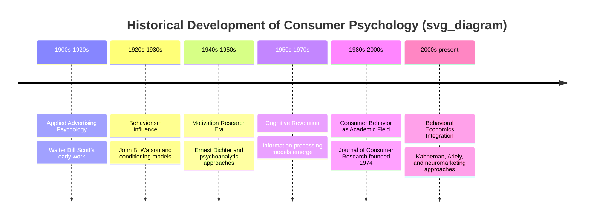
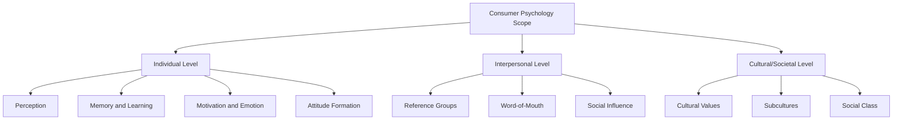
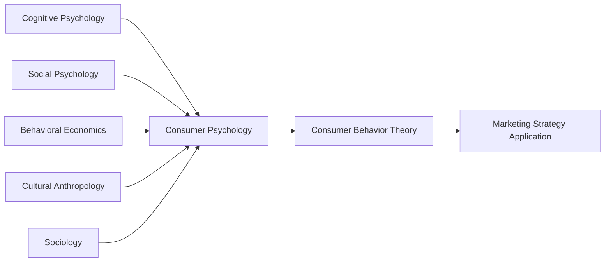

## Origins and Scope of Consumer Psychology

### Overview

Consumer psychology is the applied behavioral science discipline that studies how individuals and groups think, feel, and act in relation to acquiring, using, and disposing of products, services, and ideas. It draws on cognitive, social, developmental, and clinical psychology, as well as economics, anthropology, and sociology, to explain the internal mental processes and social influences that shape consumption decisions. Consumer psychology forms the applied behavioral foundation underlying consumer behavior theory, which in turn informs marketing strategy, product design, and public policy.

### Historical Origins

**Key Points**

- Early 20th-century applied psychology laid the groundwork for consumer psychology through the study of advertising effectiveness. Walter Dill Scott's *The Theory of Advertising* (1903) and *The Psychology of Advertising* (1908) are widely cited as among the earliest systematic applications of psychological principles to marketing communication.
- The field grew alongside the rise of mass advertising and market research in the 1920s–1930s, as firms sought scientific methods to predict and influence purchasing behavior.
- Behaviorism (John B. Watson, who transitioned from academic psychology into advertising in the 1920s) influenced early marketing psychology's focus on conditioning, association, and stimulus-response models of consumer behavior.
- The post-WWII period saw the rise of "motivation research" (associated with Ernest Dichter in the 1940s–1950s), which applied psychoanalytic (Freudian) concepts to uncover unconscious motivations behind consumer choices.
- The **cognitive revolution** in psychology (1950s–1970s) shifted consumer psychology away from pure behaviorism toward information-processing models of decision-making, which remains the dominant paradigm in contemporary consumer psychology.

### Defining Consumer Psychology

| Definition Source | Core Emphasis |
| --- | --- |
| American Psychological Association (Division 23: Society for Consumer Psychology) | The study of consumers' thoughts, feelings, and behaviors in the marketplace |
| Consumer Behavior Textbook Tradition (e.g., Solomon, Hoyer) | The study of processes involved when individuals or groups select, purchase, use, or dispose of products, services, ideas, or experiences to satisfy needs and desires |
| Applied/Marketing Perspective | The behavioral science foundation used to explain and predict market responses to marketing stimuli |

**Key Points**

- Consumer psychology is distinct from but closely related to "consumer behavior": consumer psychology emphasizes the internal cognitive, affective, and motivational mechanisms, while consumer behavior is the broader, more applied field encompassing psychology, sociology, anthropology, and economics as they relate to consumption.

### Scope of Consumer Psychology

Consumer psychology's scope spans the full consumption journey and multiple levels of analysis:

**By Stage of Consumption Process**

- Pre-purchase: need recognition, information search, expectation formation
- Purchase: decision-making, choice heuristics, point-of-sale influences
- Post-purchase: satisfaction, cognitive dissonance, loyalty, word-of-mouth, disposal behavior

**By Level of Analysis**

| Level | Focus | Example Topics |
| --- | --- | --- |
| Individual/Intrapersonal | Internal mental processes | Perception, memory, attitude formation, motivation, emotion |
| Interpersonal/Social | Influence between individuals | Reference groups, opinion leaders, word-of-mouth, social proof |
| Cultural/Societal | Broad societal and cultural influences | Cultural values, subcultures, social class, globalization effects |

### Core Topic Domains Within Consumer Psychology

| Domain | Description |
| --- | --- |
| Perception | How consumers select, organize, and interpret sensory stimuli (packaging, branding, advertising) |
| Learning and Memory | How consumers acquire knowledge and retain brand/product associations over time |
| Motivation and Needs | Underlying drives that direct consumption behavior (e.g., Maslow's hierarchy) |
| Attitudes and Persuasion | Formation and change of evaluative judgments toward brands/products |
| Decision-Making | Cognitive processes and heuristics used in choice among alternatives |
| Emotion and Affect | Role of feelings in evaluation, satisfaction, and brand attachment |
| Self-Concept and Identity | How consumption relates to identity expression and self-image |
| Social Influence | Impact of groups, culture, and social norms on consumption |
| Post-Purchase Behavior | Satisfaction, dissonance, complaint behavior, loyalty formation |

### Interdisciplinary Foundations

**Key Points**

- Cognitive psychology contributes theories of perception, memory, and information processing.
- Social psychology contributes theories of attitude formation, persuasion, and group influence.
- Behavioral economics contributes models of bounded rationality and decision heuristics.
- Cultural anthropology and sociology contribute frameworks for understanding symbolic consumption, ritual, and social stratification effects on buying behavior.

### Institutionalization as a Field

**Key Points**

- The **Association for Consumer Research (ACR)** was founded in 1969, and the *Journal of Consumer Research* was established in 1974, marking consumer behavior/psychology's emergence as a distinct interdisciplinary academic field rather than a subfield solely within marketing or psychology departments.
- The American Psychological Association's **Division 23 (Society for Consumer Psychology)** formally represents consumer psychology as a recognized applied psychology specialization.
- [Inference] The field continues to institutionally straddle both psychology and business/marketing departments, with research published across psychology journals (e.g., *Journal of Personality and Social Psychology*) and marketing journals (e.g., *Journal of Consumer Research*, *Journal of Marketing Research*) depending on theoretical emphasis.

### Practical Example

**Example**

A consumer psychologist studying why people buy premium bottled water despite tap water being nearly free would examine:

- **Perception**: how bottle design and branding signal purity/quality (perceptual cues)
- **Motivation**: status signaling, health-consciousness, environmental self-image
- **Social influence**: normative consumption in certain social/professional contexts
- **Attitude formation**: prior advertising exposure shaping brand trust
- **Post-purchase**: satisfaction reinforcement through taste attribution (often influenced by branding rather than blind taste differences)

This example illustrates the interplay between internal psychological processes (perception, motivation) and external influences (marketing stimuli, social context) that consumer psychology seeks to explain.

### Consumer Psychology vs. Related Fields (Comparison)

| Field | Primary Focus | Relationship to Consumer Psychology |
| --- | --- | --- |
| Consumer Behavior | Broader interdisciplinary study of the full consumption process | Consumer psychology is a core theoretical pillar within it |
| Marketing Research | Methods for gathering market data | Applies consumer psychology theory using empirical methods |
| Behavioral Economics | Deviations from rational economic decision-making | Overlaps heavily, especially in judgment/decision-making research |
| Neuromarketing | Use of neuroscience tools to study consumer response | An emerging methodological extension of consumer psychology |

### Common Misconceptions

- Consumer psychology is not synonymous with "manipulating" consumers; its scientific aim is to explain and predict behavior, though ethical application is a separate normative consideration addressed in marketing ethics.
- Consumer psychology is not limited to advertising response; it encompasses the entire consumption journey, including usage, satisfaction, and disposal behavior.
- The field is not purely theoretical; it has substantial applied dimensions in market research, UX design, public health campaigns, and policy nudges.

### Conclusion

Consumer psychology originated from early 20th-century applied advertising psychology and evolved through behaviorist, psychoanalytic, and cognitive paradigms into a mature, interdisciplinary field institutionalized through dedicated academic associations and journals. Its scope spans individual cognitive and emotional processes, interpersonal social influence, and broader cultural forces across the entire pre-purchase, purchase, and post-purchase consumption journey, forming the psychological foundation upon which applied consumer behavior and marketing strategy are built.

**Related Topics**

- Motivation research and Ernest Dichter's psychoanalytic approach
- Cognitive revolution and information-processing models of decision-making
- Association for Consumer Research and academic institutionalization
- Consumer behavior vs. consumer psychology distinctions
- Neuromarketing and psychophysiological research methods
- Maslow's hierarchy of needs in consumption motivation
- Cultural and cross-cultural consumer psychology