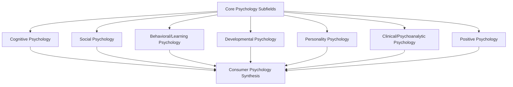
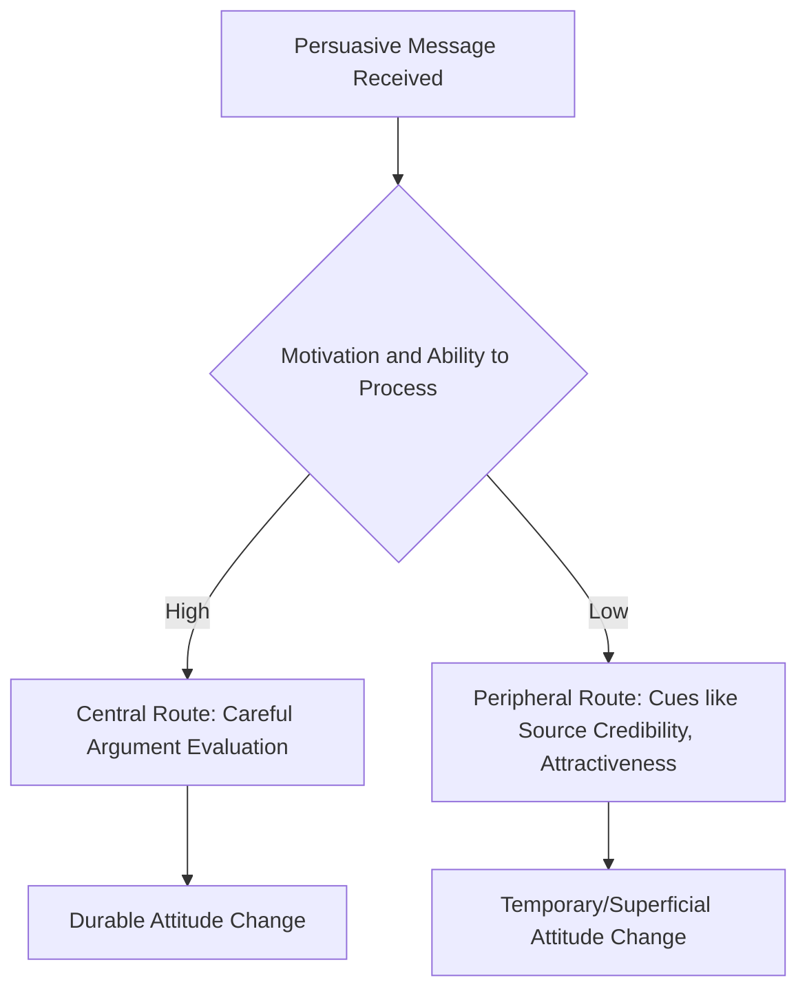

## Core Psychological Subfields Applied to Consumption

### Overview

Consumer psychology is not a single unified theory but a synthesis of multiple established psychological subfields, each contributing distinct theoretical lenses and methodologies to explain consumption behavior. Understanding these constituent subfields — cognitive, social, behavioral/learning, developmental, personality, clinical/psychoanalytic, and positive psychology — clarifies why consumer psychology research methods and explanatory models vary so widely depending on the specific consumption phenomenon being studied.

### Map of Contributing Subfields

### 1. Cognitive Psychology

**Key Points**

- Studies mental processes: perception, attention, memory, categorization, reasoning, and decision-making.
- Forms the dominant paradigm in contemporary consumer psychology, especially in understanding information processing during purchase decisions.
- Core theories applied: selective attention, schema theory, dual-process (System 1/System 2) decision-making, heuristics and biases.

**Applications to Consumption**

| Cognitive Concept | Marketing Application |
| --- | --- |
| Selective Attention | Package design and advertising cut-through in cluttered environments |
| Schema Theory | Brand categorization and category-based expectations |
| Working Memory Limits | Limiting choice sets to avoid cognitive overload |
| Heuristics (availability, representativeness) | Understanding shortcut-based purchase judgments |
| Framing Effects | Price and promotion messaging design |

### 2. Social Psychology

**Key Points**

- Studies how individuals' thoughts, feelings, and behaviors are influenced by the actual, imagined, or implied presence of others.
- Core theories applied: social proof, conformity (Asch), social identity theory (Tajfel and Turner), reference group theory, persuasion (Elaboration Likelihood Model — Petty and Cacioppo, 1986).

**Applications to Consumption**

| Social Psychology Concept | Marketing Application |
| --- | --- |
| Social Proof | Reviews, ratings, testimonials, "most popular" labeling |
| Reference Groups | Influencer marketing, aspirational brand positioning |
| Social Identity Theory | Brand tribes, in-group/out-group brand signaling |
| Elaboration Likelihood Model | Determining central- vs. peripheral-route persuasive messaging |
| Conformity | Herd behavior in trending products, bestseller effects |

**Elaboration Likelihood Model (Simplified Structure)**

### 3. Behavioral and Learning Psychology

**Key Points**

- Rooted in behaviorism (Pavlov, Skinner, Watson); studies how behavior is acquired and modified through conditioning and reinforcement.
- Core theories applied: classical conditioning, operant conditioning, observational/social learning (Bandura).

**Applications to Consumption**

| Learning Concept | Marketing Application |
| --- | --- |
| Classical Conditioning | Associating brands with positive stimuli (music, celebrities, imagery) |
| Operant Conditioning | Loyalty programs and reward-based reinforcement schedules |
| Observational Learning | Influencer and testimonial-based modeling of product use |
| Variable Ratio Reinforcement | Gamification, loot boxes, "surprise and delight" reward mechanics |

**Example**

[Inference] Classical conditioning in advertising is often illustrated by pairing a neutral brand (conditioned stimulus) repeatedly with an emotionally positive unconditioned stimulus (e.g., appealing music or imagery), such that the brand alone eventually elicits a positive emotional response — a mechanism frequently cited in advertising psychology literature, though direct real-world effect sizes are harder to isolate than in controlled lab studies.

### 4. Developmental Psychology

**Key Points**

- Studies how cognitive, emotional, and social capacities change across the lifespan, informing "consumer socialization" — the process by which individuals acquire skills, knowledge, and attitudes relevant to functioning as consumers.
- Particularly relevant to child-directed marketing, family purchase influence, and generational cohort research.

**Applications to Consumption**

| Developmental Concept | Marketing Application |
| --- | --- |
| Consumer Socialization Stages | Age-appropriate marketing to children vs. adults |
| Family Life Cycle | Segmenting by life stage (young single, young family, empty nester) |
| Generational Cohort Effects | Marketing calibrated to Gen Z, Millennial, Gen X value differences |

### 5. Personality Psychology

**Key Points**

- Studies stable individual differences in thought, emotion, and behavior patterns.
- Core frameworks applied: the Five-Factor Model / "Big Five" (openness, conscientiousness, extraversion, agreeableness, neuroticism), self-concept theory, brand personality (Aaker, 1997).

**Aaker's Brand Personality Dimensions**

| Dimension | Description |
| --- | --- |
| Sincerity | Down-to-earth, honest, wholesome, cheerful |
| Excitement | Daring, spirited, imaginative, up-to-date |
| Competence | Reliable, intelligent, successful |
| Sophistication | Upper-class, charming |
| Ruggedness | Outdoorsy, tough |

**Key Points**

- Brand personality theory proposes consumers select brands partly to express or reinforce facets of their own self-concept, a psychological extension of personality theory into brand relationship research.

### 6. Clinical and Psychoanalytic Psychology

**Key Points**

- Historically influential through Ernest Dichter's mid-20th-century "motivation research," which applied Freudian concepts (unconscious drives, symbolism) to explain consumption motives not consciously articulated by consumers.
- Contemporary consumer psychology retains limited but present influence from this tradition, particularly in qualitative research methods (projective techniques, depth interviews) aimed at uncovering latent motivations.
- [Inference] Mainstream academic consumer psychology today relies far more heavily on cognitive and social-psychological paradigms than psychoanalytic theory, which is now considered a largely historical rather than dominant contemporary influence, though its qualitative research techniques persist in applied market research practice.

### 7. Positive Psychology

**Key Points**

- A more recent contributor (formalized as a field by Seligman in the late 1990s), focused on well-being, flourishing, and positive emotional states rather than deficit-based models.
- Increasingly applied to understand experiential consumption, hedonic well-being from purchases, and the growing "experience economy" trend of prioritizing experiences over material goods.

**Applications to Consumption**

| Positive Psychology Concept | Marketing Application |
| --- | --- |
| Hedonic Well-Being | Experiential marketing, "buy experiences not things" positioning |
| Flow Theory (Csikszentmihalyi) | Designing immersive brand/product engagement (gaming, apps) |
| Savoring | Marketing anticipation and post-consumption reflection (e.g., travel marketing) |

### Illustration: Subfields Mapped to the Consumption Journey (svg_diagram)

<svg xmlns="http://www.w3.org/2000/svg" viewBox="0 0 720 300">
<text x="360" y="26" text-anchor="middle" font-size="16" font-weight="bold" fill="#1a1a1a">Psychological Subfields Across the Consumption Journey (svg_diagram)</text>
<line x1="60" y1="150" x2="660" y2="150" stroke="#2a6f97" stroke-width="3" />
<circle cx="120" cy="150" r="8" fill="#0b3d5c" />
<text x="120" y="180" text-anchor="middle" font-size="10" fill="#0b3d5c">Need Recognition</text>
<text x="120" y="120" text-anchor="middle" font-size="9" fill="#555">Motivation/Personality</text>
<circle cx="270" cy="150" r="8" fill="#0b3d5c" />
<text x="270" y="180" text-anchor="middle" font-size="10" fill="#0b3d5c">Information Search</text>
<text x="270" y="120" text-anchor="middle" font-size="9" fill="#555">Cognitive Psychology</text>
<circle cx="420" cy="150" r="8" fill="#0b3d5c" />
<text x="420" y="180" text-anchor="middle" font-size="10" fill="#0b3d5c">Evaluation</text>
<text x="420" y="120" text-anchor="middle" font-size="9" fill="#555">Social Psychology</text>
<circle cx="560" cy="150" r="8" fill="#0b3d5c" />
<text x="560" y="180" text-anchor="middle" font-size="10" fill="#0b3d5c">Purchase</text>
<text x="560" y="120" text-anchor="middle" font-size="9" fill="#555">Behavioral/Learning</text>
<circle cx="640" cy="150" r="8" fill="#0b3d5c" />
<text x="620" y="210" text-anchor="middle" font-size="10" fill="#0b3d5c">Post-Purchase</text>
<text x="620" y="120" text-anchor="middle" font-size="9" fill="#555">Positive Psychology</text>
</svg>

### Comparative Summary Table

| Subfield | Core Unit of Analysis | Primary Consumer Psychology Contribution |
| --- | --- | --- |
| Cognitive | Mental processes | Decision-making, information processing, memory |
| Social | Interpersonal influence | Persuasion, conformity, group identity |
| Behavioral/Learning | Conditioning and reinforcement | Brand association, loyalty mechanics |
| Developmental | Lifespan change | Consumer socialization, generational marketing |
| Personality | Individual traits | Brand personality, self-concept congruence |
| Clinical/Psychoanalytic | Unconscious motives | Qualitative depth research, symbolic meaning |
| Positive | Well-being and flourishing | Experiential marketing, hedonic value |

### Practical Example

**Example**

A luxury automotive brand's marketing strategy draws on multiple subfields simultaneously:

- **Cognitive**: simplifying trim/feature comparison to reduce decision fatigue
- **Social**: leveraging reference-group aspiration through aspirational lifestyle imagery
- **Behavioral**: reinforcing test-drive experiences with positive sensory conditioning (engine sound, interior scent)
- **Personality**: aligning brand personality (sophistication, competence) with target self-concept
- **Positive Psychology**: marketing the driving experience itself (flow, sensory pleasure) rather than only functional specifications

### Common Misconceptions

- No single subfield "owns" consumer psychology; effective consumer psychology research and application typically integrates multiple subfields depending on the specific behavior being studied.
- Psychoanalytic/motivation-research methods are not the dominant contemporary paradigm, despite their historical prominence and continued presence in some qualitative market research practice.
- Behavioral conditioning principles are not limited to "manipulative" advertising; they also explain legitimate habit-formation processes such as loyalty and repeat-purchase behavior.

### Conclusion

Consumer psychology functions as an applied synthesis of core psychological subfields — cognitive, social, behavioral/learning, developmental, personality, clinical/psychoanalytic, and positive psychology — each contributing distinct theories and methods relevant to different stages and dimensions of the consumption journey. Recognizing which subfield's lens is operative in a given research question or marketing problem is essential for selecting appropriate theoretical frameworks and research methodologies.

**Related Topics**

- Elaboration Likelihood Model and dual-route persuasion
- Classical and operant conditioning in brand marketing
- Aaker's brand personality framework
- Consumer socialization theory
- Ernest Dichter and motivation research methods
- Flow theory and experiential marketing
- Self-concept congruence theory in brand choice