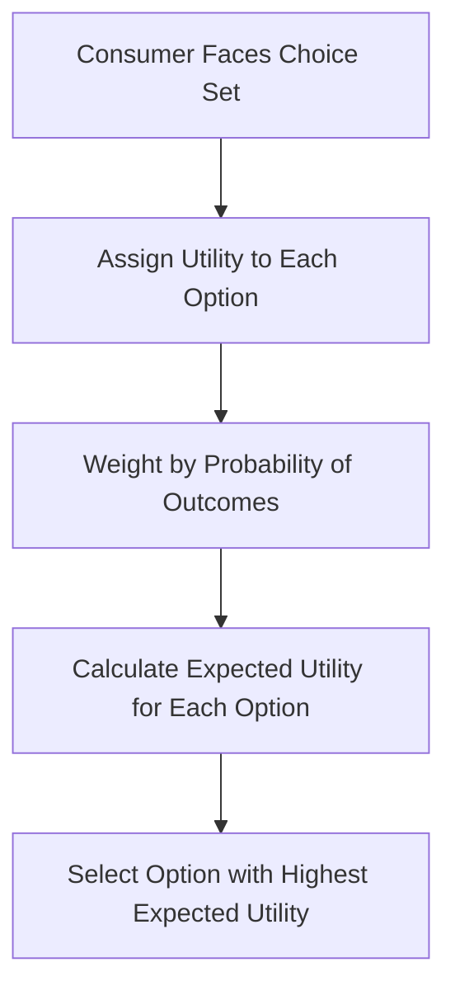
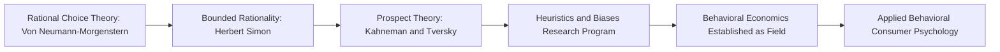

## Rational Choice Theory and Its Behavioral Limits

### Overview

Rational choice theory (RCT) is the foundational economic model of decision-making that assumes individuals make consistent, utility-maximizing choices based on stable preferences and complete information processing. It underpins classical microeconomic models of consumer demand and served as the implicit behavioral assumption in early marketing theory. However, decades of empirical research in psychology and behavioral economics have identified systematic and predictable violations of rational choice assumptions, giving rise to the behavioral decision theory tradition that dominates contemporary consumer psychology.

### Core Assumptions of Rational Choice Theory

| Assumption | Description |
| --- | --- |
| Completeness | The decision-maker can rank-order all possible options from most to least preferred |
| Transitivity | If A is preferred to B, and B is preferred to C, then A must be preferred to C |
| Independence of Irrelevant Alternatives (IIA) | Preference between two options should not be affected by the presence of a third, irrelevant option |
| Utility Maximization | The decision-maker selects the option that maximizes expected utility given constraints |
| Consistency | Preferences remain stable across contexts, framing, and time |
| Full Information Processing | The decision-maker can access and process all relevant information without cognitive limitation |

### The Expected Utility Framework

Classical rational choice under uncertainty is typically modeled via **Expected Utility Theory** (von Neumann and Morgenstern, 1944):

$$EU = \sum_{i=1}^{n} p_i \cdot u(x_i)$$

Where $EU$ is expected utility, $p_i$ is the probability of outcome $i$, and $u(x_i)$ is the utility of outcome $i$. Under this model, a rational consumer chooses the option with the highest expected utility across all probability-weighted outcomes.

### Why Rational Choice Theory Became Foundational to Early Marketing

**Key Points**

- Classical economic demand theory, price elasticity models, and early market research all implicitly relied on RCT assumptions to justify treating consumers as predictable optimizers responding rationally to price and information signals.
- RCT provided marketing with tractable, mathematically elegant models for pricing, market sizing, and competitive strategy that remain useful approximations at aggregate market levels even when they fail at the individual decision level. [Inference]

### The Behavioral Challenge to Rational Choice Theory

**Key Points**

- Herbert Simon's concept of **bounded rationality** (1955, 1957) was among the first formal challenges, proposing that decision-makers operate under cognitive, informational, and time constraints, leading them to "satisfice" (select a satisfactory option) rather than fully optimize.
- Daniel Kahneman and Amos Tversky's **Prospect Theory** (1979) provided the most influential empirical and theoretical challenge, demonstrating systematic, replicable deviations from expected utility predictions.
- This body of work collectively established **behavioral economics** as a distinct field, subsequently recognized by Nobel Memorial Prizes awarded to Kahneman (2002) and Richard Thaler (2017) for contributions to this area.

### Key Documented Violations of Rational Choice Assumptions

| RCT Assumption Violated | Behavioral Phenomenon | Key Research |
| --- | --- | --- |
| Consistency/Stable Preferences | Preference Reversals | Lichtenstein and Slovic (1971) |
| Independence of Irrelevant Alternatives | Decoy Effect / Asymmetric Dominance | Huber, Payne, and Puto (1982) |
| Rational Risk Assessment | Loss Aversion and Reference Dependence | Kahneman and Tversky (1979) |
| Full Information Processing | Bounded Rationality / Satisficing | Simon (1955, 1957) |
| Context-Independent Valuation | Anchoring Effects | Tversky and Kahneman (1974) |
| Stable Time Preferences | Hyperbolic Discounting | Laibson (1997); Thaler (1981) |
| Consistent Choice Under Framing | Framing Effects | Tversky and Kahneman (1981) |
| Unlimited Choice Processing Capacity | Choice Overload | Iyengar and Lepper (2000) |

### Prospect Theory: The Central Behavioral Alternative

Prospect Theory replaces expected utility maximization with a value function defined over gains and losses relative to a **reference point**, rather than absolute wealth states:

$$v(x) = \begin{cases} x^{\alpha} & x \geq 0 \text{ (gains)} \\ -\lambda(-x)^{\beta} & x < 0 \text{ (losses)} \end{cases}$$

**Key Points**

- $\lambda > 1$ represents **loss aversion**: losses are weighted more heavily than equivalent gains (commonly estimated in the range of 2 to 2.25 in various empirical studies, though estimates vary by context and methodology). [Inference]
- The value function exhibits diminishing sensitivity, meaning the psychological impact of a change decreases as the distance from the reference point increases (illustrated by the concave shape for gains and convex shape for losses).
- Prospect Theory also incorporates **probability weighting**, where people systematically overweight small probabilities and underweight large/moderate probabilities relative to their objective values.

### Illustration: Rational Choice vs. Prospect Theory Value Function (svg_diagram)

<svg xmlns="http://www.w3.org/2000/svg" viewBox="0 0 640 420">
<text x="320" y="26" text-anchor="middle" font-size="16" font-weight="bold" fill="#1a1a1a">Prospect Theory Value Function (svg_diagram)</text>
<line x1="60" y1="210" x2="580" y2="210" stroke="#555" stroke-width="1.5" />
<line x1="320" y1="60" x2="320" y2="380" stroke="#555" stroke-width="1.5" />
<text x="590" y="215" font-size="11" fill="#555">Gains</text>
<text x="20" y="215" font-size="11" fill="#555">Losses</text>
<text x="330" y="70" font-size="11" fill="#555">Value</text>
<path d="M 320 210 C 400 200, 500 150, 580 110" fill="none" stroke="#2a6f97" stroke-width="3" />
<path d="M 320 210 C 260 260, 150 340, 60 370" fill="none" stroke="#c0392b" stroke-width="3" />
<circle cx="320" cy="210" r="5" fill="#0b3d5c" />
<text x="320" y="235" text-anchor="middle" font-size="10" fill="#0b3d5c">Reference Point</text>
<text x="450" y="140" font-size="10" fill="#2a6f97">Concave (Gains): Risk-Averse</text>
<text x="120" y="330" font-size="10" fill="#c0392b">Convex, Steeper (Losses): Risk-Seeking</text>
</svg>

### Common Heuristics That Deviate from Rational Choice

| Heuristic | Description | Consumer Behavior Implication |
| --- | --- | --- |
| Availability Heuristic | Judging probability by ease of recall | Overestimating risk of vivid, memorable events (e.g., product recalls) |
| Representativeness Heuristic | Judging by similarity to a prototype | Stereotyping product quality by brand category associations |
| Anchoring and Adjustment | Relying heavily on an initial reference number | Original/"was" price influencing perceived deal value |
| Affect Heuristic | Using emotional response as a decision shortcut | Purchase decisions driven by feeling rather than feature analysis |

### Marketing Implications of RCT's Behavioral Limits

**Key Points**

- Marketers exploit (or, from a consumer-welfare framing, must navigate ethically around) predictable deviations from rational choice: price anchoring, decoy pricing tiers, scarcity framing, and default options are all designed around known behavioral departures from RCT rather than pure rational optimization.
- Retention and subscription strategies increasingly leverage loss aversion (e.g., "you will lose your benefits") rather than purely rational cost-benefit messaging.
- Choice architecture and default-option design (Thaler and Sunstein's "nudge" theory) directly apply the recognition that consumers do not process all available information with unlimited rational capacity.

### Practical Example

**Example**

Consider a consumer choosing between two smartphone data plans:

- **Rational choice prediction**: the consumer calculates expected monthly cost against expected usage and selects the mathematically optimal plan.
- **Behavioral reality**: the consumer is influenced by a three-tier pricing structure where a deliberately unattractive "decoy" middle option makes the premium tier appear to be the superior value (asymmetric dominance/decoy effect), leading to a choice that may not reflect the mathematically optimal plan for their actual usage pattern.

This illustrates how choice architecture, rather than pure utility calculation, frequently determines observed consumer decisions.

### Where Rational Choice Theory Remains Useful

**Key Points**

- Despite well-documented individual-level violations, RCT-based models often perform reasonably well at predicting aggregate market-level behavior (e.g., overall demand curves, price elasticity trends across large populations), even when they fail to describe any single individual's actual decision process. [Inference]
- RCT remains a useful normative benchmark — a model of how a fully rational agent *should* decide — against which behavioral deviations can be measured and studied.
- Many marketing pricing and market-sizing tools continue to rely on RCT-adjacent demand models as a reasonable first-order approximation, refined with behavioral corrections where warranted.

### Comparative Table: RCT vs. Behavioral Decision Theory

| Dimension | Rational Choice Theory | Behavioral Decision Theory |
| --- | --- | --- |
| Preference Stability | Stable, context-independent | Context- and framing-dependent |
| Reference Point | Absolute wealth/outcome states | Relative to a reference point (gains/losses) |
| Risk Attitude | Single consistent attitude | Asymmetric (risk-averse for gains, risk-seeking for losses) |
| Information Processing | Unlimited, exhaustive | Bounded, heuristic-driven |
| Predictive Level | Strong at aggregate/market level | Strong at individual decision level |
| Marketing Use | Pricing models, elasticity, market sizing | Messaging, framing, choice architecture, UX |

### Common Misconceptions

- Behavioral limits to rational choice do not mean consumers behave randomly or irrationally in an unpredictable sense; deviations are systematic, replicable, and directionally predictable, which is precisely why they are useful for applied marketing and policy design.
- Rational choice theory is not "wrong" so much as an idealized normative benchmark; it remains analytically useful for certain aggregate-level and structural marketing decisions even where it fails as a descriptive model of individual psychology.
- Bounded rationality and heuristics are not synonymous with poor decision-making; heuristics are often adaptive, efficient shortcuts that perform well under real-world time and information constraints, even though they can produce systematic biases in specific circumstances.

### Conclusion

Rational choice theory provided the foundational, mathematically tractable model of consumer decision-making underlying classical economics and early marketing theory, resting on assumptions of stable preferences, complete information, and utility maximization. Decades of behavioral research — from Simon's bounded rationality to Kahneman and Tversky's Prospect Theory and the broader heuristics-and-biases program — have identified systematic, predictable violations of these assumptions, establishing behavioral decision theory as the dominant explanatory framework in contemporary consumer psychology while preserving rational choice models as useful aggregate-level and normative benchmarks.

**Related Topics**

- Prospect Theory and reference-dependent choice
- Heuristics and biases research program (availability, representativeness, anchoring)
- Bounded rationality and satisficing (Herbert Simon)
- Choice architecture and nudge theory
- Hyperbolic discounting and intertemporal choice
- Decoy effect and asymmetric dominance in pricing
- Behavioral economics' influence on marketing regulation and ethics