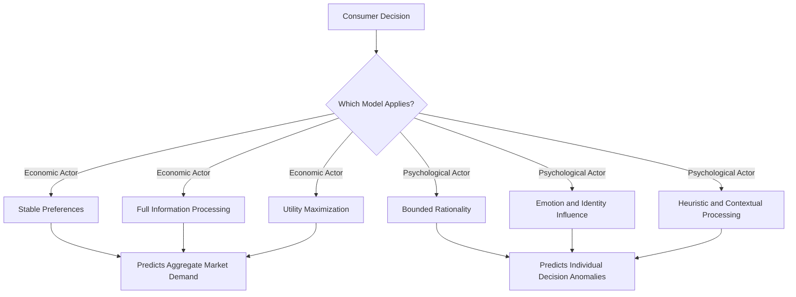
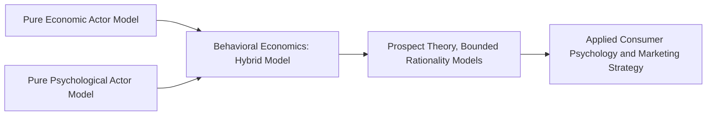

## Economic Actor Versus Psychological Actor Models

### Overview

The distinction between the **economic actor** model (homo economicus) and the **psychological actor** model represents one of the most consequential theoretical divides in consumer behavior theory. The economic actor model treats the consumer as a rational, self-interested optimizer with stable preferences, while the psychological actor model treats the consumer as a cognitively bounded, emotionally influenced, socially embedded being whose choices are shaped by context, identity, and heuristic processing. Contemporary marketing theory largely operates on a hybrid understanding, using economic actor assumptions for structural/aggregate modeling and psychological actor assumptions for individual-level behavioral prediction and messaging design.

### The Economic Actor Model (Homo Economicus)

**Key Points**

- Originates in classical and neoclassical economic theory, formalized through utility theory and later Expected Utility Theory (von Neumann and Morgenstern, 1944).
- Assumes the consumer possesses complete, transitive, and stable preferences; processes all relevant information without cognitive limitation; and selects the option that maximizes expected utility subject to a budget constraint.
- Functions primarily as a **normative** model — describing how a perfectly rational agent *should* behave — rather than a strictly descriptive account of actual behavior.

**Core Assumptions Table**

| Assumption | Description |
| --- | --- |
| Self-Interest | The actor seeks to maximize their own utility/welfare |
| Complete Information | The actor has access to and can process all relevant information |
| Consistent Preferences | Preferences do not change based on framing, context, or order of presentation |
| Unlimited Computational Capacity | The actor can calculate optimal choices without cognitive constraint |
| Independence from Emotion | Decisions are unaffected by emotional or affective states |

### The Psychological Actor Model

**Key Points**

- Emerges from cognitive and social psychology, behavioral economics, and consumer research traditions (Simon's bounded rationality; Kahneman and Tversky's Prospect Theory; social psychological research on identity and group influence).
- Assumes the consumer operates under cognitive, attentional, and time constraints; is influenced by emotion, social context, and identity; and often relies on heuristics rather than exhaustive calculation.
- Functions as a **descriptive** model — an attempt to characterize how consumers actually behave, including systematic deviations from rational optimization.

**Core Assumptions Table**

| Assumption | Description |
| --- | --- |
| Bounded Rationality | Decision-making is constrained by cognitive capacity, time, and available information |
| Reference Dependence | Value is assessed relative to a reference point, not in absolute terms |
| Heuristic Processing | Judgments often rely on mental shortcuts rather than exhaustive analysis |
| Emotional Influence | Affect and mood materially shape evaluation and choice |
| Social Embeddedness | Identity, group belonging, and social norms shape preferences and decisions |
| Context Dependence | Preferences can shift based on framing, presentation order, and choice set composition |

### Comparative Model Diagram

### Side-by-Side Comparison

| Dimension | Economic Actor Model | Psychological Actor Model |
| --- | --- | --- |
| Core Discipline | Neoclassical Economics | Cognitive/Social Psychology, Behavioral Economics |
| Decision Basis | Utility maximization | Heuristics, emotion, identity, social context |
| Information Processing | Complete and exhaustive | Selective, bounded, effortful |
| Preference Stability | Fixed and consistent | Context- and framing-dependent |
| Role of Emotion | Excluded or minimized | Central explanatory factor |
| Predictive Strength | Strong at aggregate/market level | Strong at individual/micro level |
| Typical Use in Marketing | Pricing models, demand curves, market sizing | Messaging, UX design, behavioral segmentation |
| View of Consumer Errors | Errors are random noise around rational choice | Errors are systematic and predictable biases |

### Illustration: Two Models of the Consumer (svg_diagram)

<svg xmlns="http://www.w3.org/2000/svg" viewBox="0 0 700 340">
<text x="350" y="26" text-anchor="middle" font-size="16" font-weight="bold" fill="#1a1a1a">Economic Actor vs. Psychological Actor (svg_diagram)</text>
<rect x="60" y="70" width="270" height="230" fill="#eaf3fb" stroke="#2a6f97" stroke-width="2" />
<text x="195" y="100" text-anchor="middle" font-size="13" font-weight="bold" fill="#0b3d5c">Economic Actor</text>
<text x="195" y="130" text-anchor="middle" font-size="10" fill="#0b3d5c">Rational</text>
<text x="195" y="150" text-anchor="middle" font-size="10" fill="#0b3d5c">Utility-Maximizing</text>
<text x="195" y="170" text-anchor="middle" font-size="10" fill="#0b3d5c">Stable Preferences</text>
<text x="195" y="190" text-anchor="middle" font-size="10" fill="#0b3d5c">Full Information</text>
<text x="195" y="210" text-anchor="middle" font-size="10" fill="#0b3d5c">Normative Model</text>
<rect x="370" y="70" width="270" height="230" fill="#d3e8f5" stroke="#2a6f97" stroke-width="2" />
<text x="505" y="100" text-anchor="middle" font-size="13" font-weight="bold" fill="#0b3d5c">Psychological Actor</text>
<text x="505" y="130" text-anchor="middle" font-size="10" fill="#0b3d5c">Bounded Rationality</text>
<text x="505" y="150" text-anchor="middle" font-size="10" fill="#0b3d5c">Heuristic-Driven</text>
<text x="505" y="170" text-anchor="middle" font-size="10" fill="#0b3d5c">Context-Dependent</text>
<text x="505" y="190" text-anchor="middle" font-size="10" fill="#0b3d5c">Emotion and Identity</text>
<text x="505" y="210" text-anchor="middle" font-size="10" fill="#0b3d5c">Descriptive Model</text>
</svg>

### Historical Reconciliation: Behavioral Economics as Hybrid Bridge

**Key Points**

- Rather than fully rejecting the economic actor model, behavioral economics (Kahneman, Tversky, Thaler) sought to formally model *systematic and predictable* deviations from rational choice, preserving mathematical rigor while incorporating psychological realism.
- This hybrid approach retains the economic actor's formal utility-based structure but modifies it with psychologically grounded parameters (e.g., loss-aversion coefficients, probability-weighting functions), producing models like Prospect Theory that are more descriptively accurate than pure expected utility theory while remaining more tractable than unconstrained psychological models. [Inference]

### When Each Model Is More Useful in Marketing Practice

| Marketing Task | Preferred Model | Rationale |
| --- | --- | --- |
| Aggregate demand forecasting | Economic Actor | Large-sample averaging smooths individual-level anomalies |
| Price elasticity estimation | Economic Actor | Provides tractable, testable functional relationships |
| Individual message/creative design | Psychological Actor | Captures framing, emotion, and heuristic response at decision-point |
| UX/choice architecture design | Psychological Actor | Accounts for attention limits, defaults, and cognitive load |
| Competitive market structure analysis | Economic Actor | Game-theoretic models assume rational competitive response |
| Brand loyalty and identity-driven purchase | Psychological Actor | Requires social identity and self-concept theory |

### Practical Example

**Example**

An airline pricing strategy illustrates both models operating simultaneously:

- **Economic actor application**: dynamic pricing algorithms use aggregate demand elasticity data across thousands of transactions to set fares that approximate revenue-maximizing equilibrium — a classic rational-actor optimization problem at the system level.
- **Psychological actor application**: the same airline frames fare changes using scarcity messaging ("only 2 seats left at this price"), anchors against a higher reference fare, and offers a decoy "basic economy" tier to make the standard fare appear more attractive — all techniques designed around known departures from rational choice at the individual decision level.

This dual application demonstrates how firms often use economic actor logic for backend pricing optimization while using psychological actor logic for frontend messaging and choice presentation.

### Critiques of Each Model in Isolation

**Economic Actor Model Critiques**

- Fails to explain systematic, replicable anomalies such as loss aversion, framing effects, and preference reversals.
- Assumes a level of information processing capacity inconsistent with well-documented cognitive limitations (working memory constraints, attention bottlenecks).

**Psychological Actor Model Critiques**

- [Inference] Can be criticized for being less parsimonious and harder to operationalize into precise, falsifiable quantitative predictions compared to formal economic models, particularly at an aggregate market-forecasting level.
- Risk of overfitting: an unconstrained list of behavioral biases without a unifying formal structure can become descriptively rich but predictively weak if not integrated into a coherent model (a critique partially addressed by Prospect Theory's formal structure).

### Common Misconceptions

- The economic actor model is not simply "wrong" and the psychological actor model simply "right"; each serves different explanatory purposes at different levels of analysis (aggregate vs. individual).
- Adopting a psychological actor model does not mean assuming consumers are irrational in an unpredictable or chaotic sense; deviations from the economic actor model are typically systematic and directionally predictable.
- Behavioral economics is not a rejection of economics but an extension and refinement of it, retaining formal utility-based modeling while incorporating psychologically realistic parameters.

### Conclusion

The economic actor and psychological actor models represent complementary rather than strictly competing frameworks for understanding consumer decision-making. The economic actor model, rooted in rational choice and utility theory, remains valuable for aggregate-level market modeling and normative benchmarking, while the psychological actor model, rooted in cognitive and social psychology, provides superior descriptive accuracy for individual-level decision behavior. Contemporary consumer psychology and marketing strategy operate most effectively by applying each model where it offers the greatest explanatory and predictive value, often blending both through behavioral economics frameworks such as Prospect Theory.

**Related Topics**

- Rational choice theory and expected utility theory
- Prospect Theory and reference-dependent valuation
- Bounded rationality and satisficing behavior
- Behavioral economics as a hybrid theoretical bridge
- Social identity theory and self-concept in consumption
- Choice architecture and nudge theory
- Aggregate demand modeling vs. individual decision modeling