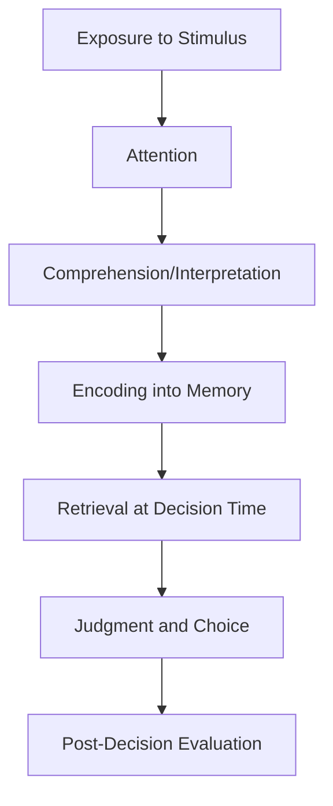
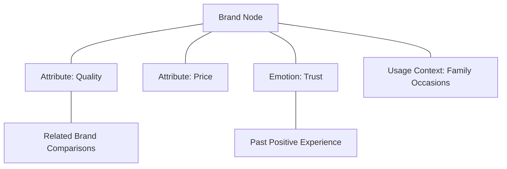
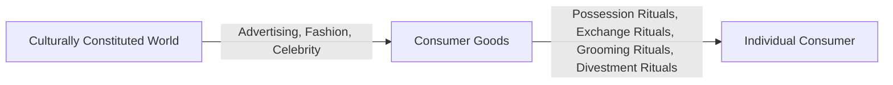

## Interdisciplinary Roots in Cognitive Science and Anthropology

### Overview

Beyond its foundations in psychology and economics, consumer behavior theory draws substantially from **cognitive science** — the interdisciplinary study of mind, intelligence, and information processing — and **cultural anthropology** — the study of human culture, symbolism, and social organization. These two fields contribute distinct but complementary lenses: cognitive science explains the internal architecture of perception, reasoning, and decision-making, while anthropology explains how consumption behavior is embedded in cultural meaning systems, rituals, and symbolic exchange that vary across and within societies.

### Cognitive Science's Contribution to Consumer Behavior

**Key Points**

- Cognitive science emerged as a distinct interdisciplinary field in the 1950s–1970s, integrating psychology, linguistics, computer science, neuroscience, and philosophy of mind under a shared information-processing paradigm.
- Its central contribution to consumer behavior is the **information-processing model** of decision-making: consumers are conceptualized as processing units that encode, store, retrieve, and manipulate information to reach judgments and choices.
- Cognitive science also introduced formal models of memory architecture, categorization, and mental representation that underpin much of contemporary consumer research on brand knowledge and judgment.

**Core Cognitive Science Contributions**

| Concept | Origin Discipline | Consumer Behavior Application |
| --- | --- | --- |
| Information-Processing Model | Cognitive Psychology/Computer Science | Stages of consumer decision-making (search, evaluation, choice) |
| Schema Theory | Cognitive Psychology | Brand and category knowledge structures |
| Dual-Process Theory | Cognitive Psychology | System 1/System 2 decision processing |
| Associative Network Models of Memory | Cognitive Psychology | Brand association mapping, spreading activation in brand recall |
| Categorization Theory | Cognitive Psychology/Linguistics | Product category boundaries, typicality effects |
| Embodied Cognition | Cognitive Science (broader) | Sensory marketing, packaging texture/weight effects on perceived quality |

### The Information-Processing Model of Consumer Decision-Making

**Key Points**

- This model, adapted from cognitive science's broader information-processing paradigm, remains the dominant structural framework in consumer decision-making research, underpinning classic models such as the Engel-Kollat-Blackwell (EKB) model and the Bettman Information Processing model.
- Memory research from cognitive science — particularly the distinction between short-term/working memory and long-term memory, and associative network models — directly informs how marketers think about brand recall, recognition, and advertising repetition effects.

### Associative Network Model of Brand Memory

**Key Points**

- Adapted from cognitive science's spreading-activation models of semantic memory (Collins and Loftus, 1975), this framework represents brand knowledge as a network of interconnected nodes (attributes, associations, feelings) linked by association strength.
- Activating one node (e.g., seeing a brand logo) triggers activation that spreads to connected nodes (associated attributes, emotions, past experiences), a mechanism foundational to Keller's Customer-Based Brand Equity model of brand associations.

### Cultural Anthropology's Contribution to Consumer Behavior

**Key Points**

- Cultural anthropology contributes the study of how consumption is embedded in systems of shared meaning, ritual, symbolism, and social structure — moving beyond individual cognition to explain consumption as fundamentally social and culturally constructed behavior.
- Key anthropological concepts applied to consumer research include material culture theory, ritual theory, gift-giving/reciprocity theory, and symbolic anthropology.
- The **Consumer Culture Theory (CCT)** movement within consumer research (formalized as a labeled research program by Arnould and Thompson, 2005) draws heavily and explicitly on anthropological and sociocultural theory to study consumption as identity work, cultural production, and marketplace mythology.

**Core Anthropological Contributions**

| Concept | Origin | Consumer Behavior Application |
| --- | --- | --- |
| Material Culture Theory | Cultural Anthropology (e.g., Mary Douglas, Grant McCracken) | Products as carriers of cultural meaning |
| Ritual Theory | Anthropology (Victor Turner, Arnold van Gennep) | Consumption rituals (gift-giving, grooming, holiday shopping) |
| Gift-Giving and Reciprocity | Marcel Mauss, "The Gift" (1925) | Loyalty gifts, sampling, reciprocity-based marketing |
| Symbolic Anthropology | Clifford Geertz | Brand symbolism and cultural meaning transfer |
| Meaning Transfer Model | Grant McCracken (1986) | Celebrity endorsement, cultural meaning movement into products |

### McCracken's Meaning Transfer Model

**Key Points**

- Grant McCracken's influential model (1986) describes how cultural meaning moves from the culturally constituted world, through advertising and celebrity endorsement, into consumer products, and finally into the consumer's individual identity through rituals of possession, exchange, grooming, and divestment.

### Consumer Culture Theory (CCT)

**Key Points**

- CCT is not a single unified theory but a research program studying the sociocultural, symbolic, and experiential dimensions of consumption, in contrast to the cognitive/information-processing paradigm's focus on individual decision mechanics.
- Major CCT research streams include consumer identity projects, marketplace cultures, sociohistoric patterning of consumption, and mass-mediated marketplace ideologies.
- [Inference] CCT and cognitive information-processing research are often treated as somewhat distinct methodological traditions within consumer research — CCT favoring qualitative, interpretive, ethnographic methods, while cognitive approaches favor quantitative, experimental methods — though the two increasingly inform integrated, mixed-methods marketing research in practice.

### Comparative Table: Cognitive Science vs. Anthropological Lens

| Dimension | Cognitive Science Lens | Anthropological Lens |
| --- | --- | --- |
| Unit of Analysis | Individual mind/information processing | Culture, community, shared meaning systems |
| Core Question | How do consumers process information and decide? | How does consumption create and express cultural meaning? |
| Typical Methods | Experiments, surveys, reaction-time studies | Ethnography, participant observation, depth interviews |
| Key Constructs | Memory, attention, schema, heuristics | Ritual, symbolism, identity, reciprocity |
| Marketing Application | Message design, choice architecture, brand recall | Brand storytelling, cultural positioning, ritual marketing |

### Illustration: Dual Interdisciplinary Roots (svg_diagram)

<svg xmlns="http://www.w3.org/2000/svg" viewBox="0 0 700 320">
<text x="350" y="26" text-anchor="middle" font-size="16" font-weight="bold" fill="#1a1a1a">Cognitive Science and Anthropology Roots (svg_diagram)</text>
<rect x="60" y="70" width="270" height="210" fill="#eaf3fb" stroke="#2a6f97" stroke-width="2" />
<text x="195" y="100" text-anchor="middle" font-size="13" font-weight="bold" fill="#0b3d5c">Cognitive Science</text>
<text x="195" y="130" text-anchor="middle" font-size="10" fill="#0b3d5c">Information Processing</text>
<text x="195" y="150" text-anchor="middle" font-size="10" fill="#0b3d5c">Memory and Schema</text>
<text x="195" y="170" text-anchor="middle" font-size="10" fill="#0b3d5c">Decision Heuristics</text>
<text x="195" y="190" text-anchor="middle" font-size="10" fill="#0b3d5c">Individual-Level Focus</text>
<rect x="370" y="70" width="270" height="210" fill="#d3e8f5" stroke="#2a6f97" stroke-width="2" />
<text x="505" y="100" text-anchor="middle" font-size="13" font-weight="bold" fill="#0b3d5c">Cultural Anthropology</text>
<text x="505" y="130" text-anchor="middle" font-size="10" fill="#0b3d5c">Ritual and Symbolism</text>
<text x="505" y="150" text-anchor="middle" font-size="10" fill="#0b3d5c">Meaning Transfer</text>
<text x="505" y="170" text-anchor="middle" font-size="10" fill="#0b3d5c">Gift Exchange</text>
<text x="505" y="190" text-anchor="middle" font-size="10" fill="#0b3d5c">Cultural/Group-Level Focus</text>
</svg>

### Practical Example

**Example**

A wedding registry service illustrates both interdisciplinary lenses simultaneously:

- **Cognitive science lens**: examines how couples process an overwhelming array of product choices (choice overload), how default/recommended item lists reduce cognitive burden, and how the registry interface's information architecture affects decision efficiency.
- **Anthropological lens**: examines the wedding registry as a modern ritual of gift-giving and reciprocity (drawing on Mauss's gift theory), a possession ritual marking a life-stage transition (drawing on McCracken's meaning transfer model), and a culturally patterned practice that varies significantly across cultures and subcultures in terms of expected gift value, timing, and symbolic meaning. [Inference]

### Why Both Lenses Matter for Marketing Strategy

**Key Points**

- Relying solely on cognitive/information-processing models risks treating consumption as a purely individual, mechanical decision process, missing the powerful role of shared cultural meaning, identity signaling, and ritual in driving purchase behavior — particularly for symbolically loaded categories (fashion, gifting, celebration goods, religious/cultural products).
- Relying solely on anthropological/cultural analysis risks under-specifying the micro-level cognitive mechanisms (attention, memory, heuristic processing) that determine how cultural meanings are actually noticed, encoded, and acted upon by individual consumers.
- Integrated consumer research increasingly combines both traditions: using ethnographic and cultural analysis to identify meaningful cultural narratives and rituals, then using cognitive/experimental methods to test how specific messaging or product design choices activate those meanings most effectively. [Inference]

### Common Misconceptions

- Cognitive science's information-processing model is not "more scientific" than anthropological approaches; both employ rigorous, validated methodologies appropriate to their respective research questions (individual cognition vs. cultural meaning systems).
- Anthropological consumer research (CCT) is not limited to niche or "cultural" product categories; ritual, symbolism, and identity dynamics are present across virtually all consumption categories, including seemingly mundane household and grocery purchases.
- The two traditions are not mutually exclusive; many contemporary consumer researchers and marketing practitioners draw on both simultaneously depending on the research question at hand.

### Conclusion

Consumer behavior theory's interdisciplinary roots extend well beyond psychology and economics into cognitive science, which supplies information-processing models of memory, attention, and decision heuristics, and cultural anthropology, which supplies frameworks for understanding consumption as ritual, symbol, and cultural meaning-making. Together, these two traditions provide complementary individual-level and cultural-level lenses essential for a complete understanding of consumer behavior, from moment-to-moment decision mechanics to the deep symbolic significance that products and brands carry within human social life.

**Related Topics**

- Consumer Culture Theory (CCT) research program
- McCracken's meaning transfer model and celebrity endorsement
- Associative network models of brand memory
- Mauss's gift theory and reciprocity in marketing
- Schema theory and brand categorization
- Ritual theory in consumption (possession, grooming, divestment rituals)
- Embodied cognition and sensory marketing