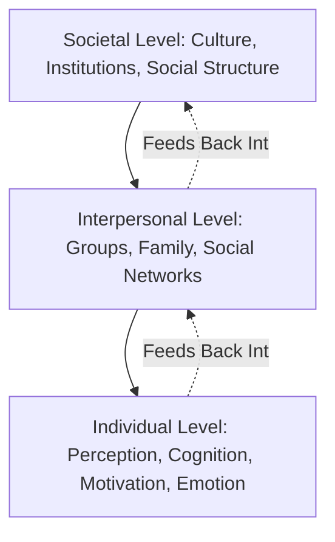

## Levels of Analysis: Individual, Interpersonal, and Societal

### Overview

Consumer psychology and behavior research operates across three interconnected levels of analysis: the **individual level** (internal cognitive, emotional, and motivational processes), the **interpersonal level** (influence occurring between people, such as groups, families, and social networks), and the **societal level** (broad cultural, structural, and institutional forces). This multi-level framework is foundational to organizing consumer research and marketing strategy, since different marketing problems — from personal purchase decisions to cultural brand positioning — are best explained and addressed at different levels.

### The Three-Level Framework

**Key Points**

- These levels are not strictly hierarchical or one-directional; individual behavior shapes interpersonal and cultural patterns just as culture and social groups shape individual cognition, creating a continuous feedback loop.
- Most real-world consumption decisions are simultaneously influenced by processes operating at all three levels, even though individual research studies typically isolate one level for methodological tractability.

### Level 1: Individual Analysis

**Key Points**

- Focuses on internal psychological processes occurring within a single consumer's mind: perception, attention, memory, motivation, emotion, attitude formation, and personal decision-making.
- Draws primarily from cognitive psychology, personality psychology, and individual-level behavioral economics.
- Typical research methods include laboratory experiments, eye-tracking, reaction-time studies, surveys of individual attitudes, and (increasingly) neuromarketing/psychophysiological measures.

**Core Individual-Level Constructs**

| Construct | Description | Example Application |
| --- | --- | --- |
| Perception | Selection, organization, and interpretation of sensory input | Package design, color psychology |
| Motivation | Internal drives directing behavior toward goals | Needs-based segmentation (e.g., Maslow's hierarchy) |
| Memory | Encoding, storage, and retrieval of brand information | Advertising repetition and recall studies |
| Attitude | Evaluative judgment toward a brand/product | Attitude-behavior consistency models |
| Personality | Stable individual traits | Brand personality congruence |
| Emotion | Affective states influencing evaluation | Emotional advertising appeals |

### Level 2: Interpersonal Analysis

**Key Points**

- Focuses on how consumption behavior is shaped by direct interaction with and influence from other individuals: family members, friends, reference groups, opinion leaders, and online social networks.
- Draws primarily from social psychology and sociology, particularly theories of group influence, social comparison, and interpersonal communication.
- Typical research methods include social network analysis, dyadic/family decision studies, focus groups, and social media influence tracking.

**Core Interpersonal-Level Constructs**

| Construct | Description | Example Application |
| --- | --- | --- |
| Reference Groups | Groups used as a comparison point for values/behavior | Aspirational brand positioning |
| Opinion Leadership | Individuals with disproportionate influence within a network | Influencer marketing strategy |
| Family Decision-Making | Joint decision processes within household units | Child-influenced purchase research |
| Word-of-Mouth (WOM) | Informal interpersonal communication about products | Referral programs, viral marketing |
| Social Comparison | Evaluating oneself relative to others | Status consumption, "keeping up" dynamics |
| Diffusion of Innovation | How new products/ideas spread through social networks | Early adopter targeting strategies |

**Diffusion of Innovation Curve (Rogers, 1962)**

[Inference] The specific percentage segments in Rogers' diffusion model are based on a normal distribution assumption applied to adoption timing and should be treated as an idealized theoretical benchmark rather than a precise universal prediction for any specific product category.

### Level 3: Societal Analysis

**Key Points**

- Focuses on broad cultural, structural, economic, and institutional forces that shape consumption patterns across entire populations or subpopulations, often operating below the level of conscious individual awareness.
- Draws primarily from cultural anthropology, sociology, and macro-level economics.
- Typical research methods include ethnography, historical/archival analysis, cross-cultural comparative studies, and large-scale demographic/survey research.

**Core Societal-Level Constructs**

| Construct | Description | Example Application |
| --- | --- | --- |
| Culture and Subculture | Shared values, norms, and meaning systems | Cross-cultural marketing adaptation |
| Social Class | Stratified access to economic and social resources | Luxury vs. mass-market positioning |
| Social Institutions | Structures such as religion, education, media | Marketing regulation, media literacy effects |
| Demographic/Generational Trends | Population-level shifts in age, structure, values | Generational marketing strategy |
| Globalization | Cross-border diffusion of consumption patterns | Standardization vs. localization strategy |
| Consumer Culture Ideology | Dominant societal narratives about consumption's role | Marketplace mythology, anti-consumption movements |

### Comparative Table Across Levels

| Dimension | Individual Level | Interpersonal Level | Societal Level |
| --- | --- | --- | --- |
| Unit of Analysis | Single consumer's mind | Dyads, groups, networks | Populations, cultures, institutions |
| Primary Discipline | Cognitive/Personality Psychology | Social Psychology/Sociology | Anthropology/Macro-Sociology |
| Research Methods | Experiments, psychophysiology | Social network analysis, focus groups | Ethnography, cross-cultural surveys |
| Marketing Application | Ad creative, UX design, pricing psychology | Influencer marketing, referral programs | Cultural positioning, CSR strategy, market entry |
| Time Horizon Typically Studied | Momentary/short-term decisions | Medium-term social influence patterns | Long-term cultural/structural shifts |

### Illustration: Nested Levels of Consumer Analysis (svg_diagram)

<svg xmlns="http://www.w3.org/2000/svg" viewBox="0 0 640 440">
<text x="320" y="28" text-anchor="middle" font-size="16" font-weight="bold" fill="#1a1a1a">Nested Levels of Analysis (svg_diagram)</text>
<circle cx="320" cy="250" r="170" fill="#eaf3fb" stroke="#2a6f97" stroke-width="2" />
<circle cx="320" cy="250" r="110" fill="#d3e8f5" stroke="#2a6f97" stroke-width="2" />
<circle cx="320" cy="250" r="55" fill="#a9d3e8" stroke="#2a6f97" stroke-width="2" />
<text x="320" y="250" text-anchor="middle" font-size="12" font-weight="bold" fill="#0b3d5c">Individual</text>
<text x="320" y="265" text-anchor="middle" font-size="9" fill="#0b3d5c">Cognition, Emotion</text>
<text x="320" y="150" text-anchor="middle" font-size="12" font-weight="bold" fill="#0b3d5c">Interpersonal</text>
<text x="320" y="165" text-anchor="middle" font-size="9" fill="#0b3d5c">Family, Groups, WOM</text>
<text x="320" y="95" text-anchor="middle" font-size="12" font-weight="bold" fill="#0b3d5c">Societal</text>
<text x="320" y="110" text-anchor="middle" font-size="9" fill="#0b3d5c">Culture, Institutions, Class</text>
</svg>

### Practical Example Across All Three Levels

**Example**

Consider the marketing of a plant-based meat alternative:

- **Individual level**: a consumer's personal taste perception, health motivation, and attitude toward the product's texture/flavor determine trial and repeat purchase likelihood.
- **Interpersonal level**: peer recommendations, family meal-planning dynamics (e.g., accommodating a vegetarian family member), and social media food-influencer content shape awareness and normative acceptance of trying the product.
- **Societal level**: broader cultural shifts toward environmental sustainability values, generational differences in meat consumption attitudes, and evolving cultural norms around dietary identity all shape aggregate category growth and market receptivity.

A marketing strategy that addresses only the individual level (e.g., taste-focused advertising) while ignoring interpersonal dynamics (family acceptance) or societal trends (sustainability positioning) is likely to be less effective than an integrated multi-level strategy.

### Why Multi-Level Thinking Matters for Marketing Strategy

**Key Points**

- Segmentation and targeting decisions often require societal-level demographic/cultural analysis combined with individual-level psychographic profiling.
- Referral and advocacy program design requires interpersonal-level understanding of social network structure and opinion leadership.
- Message and creative design primarily requires individual-level cognitive and emotional insight, but message *distribution* and *social validation* strategy requires interpersonal-level thinking.
- Long-term brand positioning and category-creation strategy often requires societal-level cultural trend analysis to identify emerging value shifts before they become mainstream. [Inference]

### Common Misconceptions

- The three levels are not competing explanations for the "true" cause of consumer behavior; they are complementary lenses that each explain a portion of the variance in consumption behavior, often operating simultaneously.
- Societal-level analysis is not simply "demographics"; it encompasses deeper structural and cultural forces (institutions, ideology, social stratification) beyond simple population statistics.
- Interpersonal-level influence is not limited to explicit recommendations; it includes subtle normative and comparative processes (social comparison, conformity) that shape behavior even without direct communication.

### Conclusion

The individual, interpersonal, and societal levels of analysis provide a comprehensive, complementary framework for understanding consumer behavior — spanning internal cognitive and emotional processes, direct social influence within groups and networks, and broad cultural and structural forces shaping consumption at a population scale. Effective marketing strategy typically requires integrating insight from all three levels, since real-world consumption decisions are rarely determined by any single level in isolation.

**Related Topics**

- Diffusion of Innovation theory (Rogers)
- Reference group theory and opinion leadership
- Family decision-making and household purchase influence
- Social class and consumption stratification theory
- Consumer Culture Theory and societal-level meaning systems
- Word-of-mouth and social network marketing
- Cross-cultural and international consumer behavior