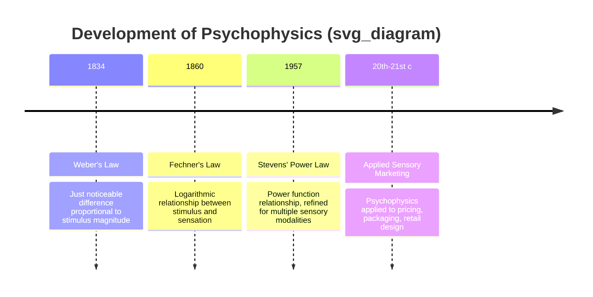
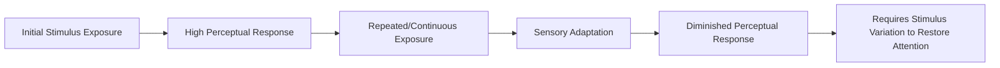

## Sensory Thresholds and Psychophysics

### Overview

Psychophysics is the branch of psychology that quantitatively studies the relationship between physical stimuli and the subjective sensory/perceptual experiences they produce. Founded by Gustav Fechner in the 19th century, psychophysics provides the foundational science underlying sensory marketing — explaining precisely how much physical change in a stimulus (price, sound volume, light intensity, scent concentration) is required before consumers actually notice or respond to it. This makes psychophysics directly practical for pricing psychology, packaging design, retail environment design, and sensory branding.

### Historical Origins

**Key Points**

- Ernst Weber (1834) first established that the smallest detectable difference between two stimuli is proportional to the magnitude of the original stimulus, a relationship now known as **Weber's Law**.
- Gustav Fechner (1860) built on Weber's work to found psychophysics as a formal discipline, proposing a logarithmic relationship between stimulus intensity and perceived sensation magnitude (the **Weber-Fechner Law**).
- S.S. Stevens (1957) later proposed an alternative **power law** relationship, arguing that perceived magnitude grows as a power function of stimulus intensity rather than strictly logarithmically, which better fit certain sensory modalities.

### Core Psychophysical Concepts

| Concept | Definition |
| --- | --- |
| Absolute Threshold | The minimum stimulus intensity required for detection at least 50% of the time |
| Differential Threshold (Just Noticeable Difference, JND) | The minimum difference between two stimuli required to detect a change |
| Weber's Law | The JND is a constant proportion of the original stimulus intensity |
| Fechner's Law | Perceived sensation intensity grows logarithmically with physical stimulus intensity |
| Stevens' Power Law | Perceived sensation intensity grows as a power function of physical stimulus intensity |
| Subliminal Perception | Processing of stimuli below the threshold of conscious awareness |
| Sensory Adaptation | Decreased sensitivity to a stimulus following prolonged exposure |

### Weber's Law (Formula)

$$\frac{\Delta I}{I} = k$$

Where $\Delta I$ is the just noticeable difference (the smallest detectable change in stimulus intensity), $I$ is the initial stimulus intensity, and $k$ is the **Weber constant**, which is specific to each sensory modality (e.g., brightness, loudness, weight).

**Key Points**

- Weber's Law implies that the *absolute* amount of change required for detection increases as the baseline stimulus intensity increases — a critical insight for pricing psychology, since it implies that the same absolute price change (e.g., $5) will be far more noticeable on a $20 product than on a $200 product.

### Fechner's Law (Formula)

$$S = k \cdot \log(I)$$

Where $S$ is the perceived sensation magnitude, $I$ is the physical stimulus intensity, and $k$ is a modality-specific constant. Fechner derived this logarithmic relationship by integrating Weber's Law across a continuous range of stimulus intensities.

### Stevens' Power Law (Formula)

$$S = k \cdot I^n$$

Where $S$ is perceived sensation magnitude, $I$ is physical stimulus intensity, $k$ is a scaling constant, and $n$ is a modality-specific exponent. [Inference] The exponent $n$ varies considerably by sensory modality based on empirical psychophysical research — for example, brightness perception tends to show a compressive exponent (less than 1), while perceived heaviness/electric shock intensity tends to show an expansive exponent (greater than 1) — and specific exponent values should be treated as empirically derived estimates rather than universal constants.

### Illustration: Weber-Fechner vs. Stevens' Power Law (svg_diagram)

<svg xmlns="http://www.w3.org/2000/svg" viewBox="0 0 640 400">
<text x="320" y="26" text-anchor="middle" font-size="15" font-weight="bold" fill="#1a1a1a">Stimulus-Sensation Relationship Models (svg_diagram)</text>
<line x1="60" y1="340" x2="580" y2="340" stroke="#555" stroke-width="1.5" />
<line x1="60" y1="340" x2="60" y2="60" stroke="#555" stroke-width="1.5" />
<text x="320" y="370" text-anchor="middle" font-size="11" fill="#555">Physical Stimulus Intensity</text>
<text x="30" y="200" text-anchor="middle" font-size="11" fill="#555" transform="rotate(-90 30 200)">Perceived Sensation</text>
<path d="M 60 340 C 150 200, 300 120, 580 90" fill="none" stroke="#2a6f97" stroke-width="3" />
<text x="480" y="80" font-size="10" fill="#2a6f97">Fechner: Logarithmic</text>
<path d="M 60 340 C 200 300, 400 180, 580 60" fill="none" stroke="#c0392b" stroke-width="3" />
<text x="420" y="140" font-size="10" fill="#c0392b">Stevens: Power (n &gt; 1)</text>
</svg>

### Absolute Threshold and Marketing Applications

| Sense | Example Absolute Threshold Application |
| --- | --- |
| Vision | Minimum detectable brightness/color difference in packaging design |
| Hearing | Minimum detectable volume for in-store audio branding |
| Smell | Minimum detectable scent concentration in ambient scent marketing |
| Taste | Minimum detectable flavor concentration in product formulation testing |
| Touch | Minimum detectable texture difference in packaging material selection |

**Example**

[Inference] Retail environments often calibrate ambient scent marketing to concentrations near but above the absolute threshold, since scent intended to influence mood or perception is typically most effective when detectable but not overpowering, avoiding sensory overload that could produce a negative rather than positive association — though optimal concentration levels vary by product category, retail context, and individual sensitivity.

### Just Noticeable Difference (JND) in Pricing Strategy

**Key Points**

- JND is central to pricing psychology: it determines the threshold at which a price increase becomes consciously noticeable (and potentially resented) by consumers, versus remaining unnoticed.
- Firms often use JND logic to time and size price increases such that the change falls below the consumer's differential threshold, or alternatively, to size promotional discounts such that they clearly exceed the JND and are perceived as meaningfully valuable.

**Example**

Applying Weber's Law to pricing: if the Weber constant for price perception in a given category is approximately $k = 0.10$ (a illustrative, category-dependent estimate), then a product priced at $50 would require an approximate $5 change to be reliably noticed, while a product priced at $200 would require an approximate $20 change to reach the same perceptual threshold. [Inference] Actual Weber constants for price perception vary substantially by product category, price level, and consumer segment, and should be estimated empirically for any specific pricing application rather than assumed from a single illustrative constant.

### JND Applied to Package Downsizing ("Shrinkflation")

**Key Points**

- Manufacturers seeking to reduce costs by decreasing product quantity while holding price constant often size the reduction below the JND for volume/weight perception, aiming to avoid triggering conscious consumer detection of the change.
- [Unverified] The specific effectiveness and ethical acceptability of this practice is a subject of ongoing public and regulatory debate, particularly regarding transparency expectations in packaging and labeling regulation, which vary by jurisdiction.

### Subliminal Perception

**Key Points**

- Refers to processing of stimuli presented below the absolute threshold of conscious awareness.
- The popular belief that subliminal advertising (e.g., hidden messages in media) produces strong, direct behavioral influence on purchase decisions originated largely from a discredited 1957 claim (James Vicary's alleged "drink Coca-Cola/eat popcorn" cinema experiment), which Vicary later admitted was fabricated.
- [Inference] Contemporary experimental research does provide evidence that subliminal priming can produce small, short-term effects on specific behaviors under controlled laboratory conditions, but robust evidence for subliminal advertising producing significant, reliable purchase behavior change in real-world marketing contexts remains limited and contested in the academic literature.

### Sensory Adaptation

**Key Points**

- Refers to the decreased responsiveness to a stimulus following continuous or repeated exposure (e.g., no longer noticing a store's background scent after several minutes, or "banner blindness" to repeated digital ad placements).
- Directly relevant to advertising wear-out effects, requiring creative rotation and variation to counteract diminishing attentional response over repeated exposures.

### Comparative Table: Psychophysical Laws

| Law | Relationship Form | Key Contribution |
| --- | --- | --- |
| Weber's Law | $\Delta I / I = k$ | Established proportional relationship for JND |
| Fechner's Law | $S = k \log(I)$ | Logarithmic model of sensation growth |
| Stevens' Power Law | $S = k I^n$ | Power function model, refined across sensory modalities |

### Practical Marketing Example

**Example**

A retailer testing package redesign uses JND principles to determine how much visual change (color, logo size, layout) is needed for consumers to consciously notice the redesign versus perceiving brand continuity. If the goal is to modernize packaging while preserving brand recognition, changes are typically kept below the JND threshold in a single update and implemented through a series of smaller, incremental changes over time rather than one large, easily-noticed shift — a common practice in long-running consumer packaged goods brand evolution. [Inference]

### Common Misconceptions

- Psychophysics is not solely about extremely small, imperceptible stimulus changes; it also encompasses the study of how perceived intensity scales across the *entire* range of detectable stimulus magnitudes (via Fechner's and Stevens' laws), not only threshold detection.
- Subliminal advertising is not established in contemporary research as a powerful, reliable tool for driving major purchase behavior; the popularized "subliminal messaging" narrative traces to a debunked historical claim rather than robust ongoing empirical support for large real-world effects.
- Weber's Law does not imply a universal constant across all senses and contexts; the Weber constant $k$ is empirically specific to each sensory modality and often varies by context, individual, and stimulus range.

### Conclusion

Psychophysics, founded by Weber and Fechner and refined by Stevens, provides the quantitative scientific foundation for understanding how physical stimulus changes translate into perceived sensory experience. Its core concepts — absolute thresholds, just noticeable differences, and the logarithmic/power-law relationships between stimulus and sensation — offer directly actionable guidance for pricing psychology, packaging redesign, sensory branding, and retail environment design, making it one of the most practically applied psychological frameworks in sensory marketing.

**Related Topics**

- Weber's Law applications in pricing strategy
- Sensory branding and multisensory marketing
- Package redesign and JND-based visual change management
- Subliminal perception research and its marketing myths
- Sensory adaptation and advertising wear-out effects
- Scent marketing and ambient retail environment design
- Price perception and psychological pricing tactics