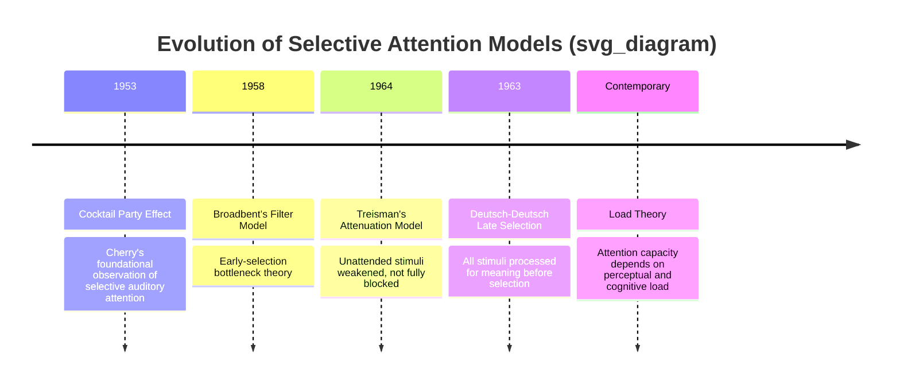
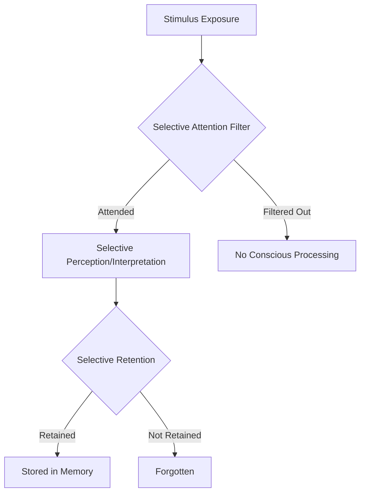
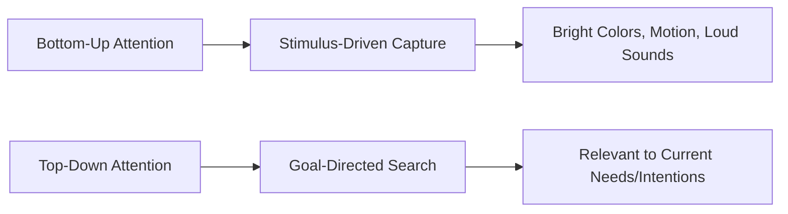

## Selective Attention and Perceptual Filters

### Overview

Selective attention refers to the cognitive process by which individuals focus mental resources on a limited subset of available stimuli while filtering out the vast majority of competing sensory information. Given that consumers are exposed to thousands of marketing stimuli daily but possess strictly limited attentional capacity, selective attention and perceptual filtering are foundational concepts for understanding why most marketing messages go unnoticed, and what conditions increase the likelihood of a message breaking through to conscious processing.

### Theoretical Foundations of Selective Attention

**Key Points**

- Selective attention research began with studies of auditory processing, most notably Colin Cherry's "cocktail party effect" (1953), which demonstrated that individuals can selectively attend to one conversation among many simultaneous ones while filtering out competing auditory input.
- Donald Broadbent's **Filter Model** (1958) proposed that attention operates as an early-stage bottleneck filter, selecting stimuli based on physical characteristics before deeper semantic processing occurs.
- Anne Treisman's **Attenuation Model** (1964) refined this, proposing that unattended stimuli are not fully blocked but merely attenuated (weakened), allowing highly salient or personally relevant unattended information (e.g., one's own name) to still break through.
- Deutsch and Deutsch's **Late Selection Model** (1963) proposed that all stimuli are processed for meaning, with selection occurring later, at the response stage, rather than early in perceptual processing.

### Comparative Table of Attention Models

| Model | Core Claim | Key Contribution |
| --- | --- | --- |
| Broadbent's Filter Model | Attention filters stimuli early, based on physical features | Established the "bottleneck" concept of limited capacity |
| Treisman's Attenuation Model | Unattended stimuli weakened, not eliminated | Explains why salient unattended stimuli (own name) can break through |
| Late Selection Model | All stimuli processed for meaning; selection occurs later | Explains semantic priming effects from "unattended" stimuli |
| Load Theory (Lavie, 1995) | Attentional selectivity depends on perceptual/cognitive load | Explains context-dependent variability in distractor processing |

### Why Selective Attention Matters for Marketing

**Key Points**

- Consumers are exposed to an extremely high volume of marketing stimuli daily across advertising, packaging, digital content, and retail environments, making attentional capture the essential first gate a marketing message must pass through before any subsequent persuasion process can occur.
- [Unverified] Frequently cited figures claiming consumers are exposed to a specific number of ads per day (commonly cited ranges span from several hundred to several thousand) originate from varied and often outdated or methodologically inconsistent estimates; the precise figure is highly dependent on media consumption patterns, definitions of "exposure," and measurement methodology, and should be treated with caution rather than cited as a precise fact.
- The practical implication remains robust regardless of the exact figure: attentional competition in the modern media environment is intense, making perceptual salience and relevance critical design factors for marketing stimuli.

### The Perceptual Process and Filtering Stages

**Key Points**

- Marketing textbooks commonly describe three sequential perceptual filters: **selective attention** (which stimuli are noticed), **selective distortion** (how noticed stimuli are interpreted, often in ways consistent with existing beliefs), and **selective retention** (which interpreted stimuli are remembered).
- Each filtering stage represents an opportunity for a marketing message to be lost, making cumulative message survival through all three stages a significant design challenge.

### Selective Distortion

**Key Points**

- Refers to the tendency to interpret information in ways that align with pre-existing beliefs, expectations, or attitudes, even when the objective stimulus is identical across individuals.
- Closely related to confirmation bias: consumers favorably predisposed to a brand tend to interpret ambiguous or even negative information about that brand more charitably than consumers unfavorably predisposed to it.

**Example**

[Inference] Two consumers viewing an identical advertisement for a brand they hold different prior attitudes toward may derive substantially different interpretations of the same message — one interpreting a bold claim as confident and credible, the other interpreting the same claim as exaggerated or untrustworthy — illustrating how selective distortion operates on identical objective stimuli.

### Selective Retention

**Key Points**

- Refers to the tendency to remember information that supports existing beliefs and attitudes more readily than information that contradicts them.
- Explains why brand loyalists tend to retain and recall positive brand information more readily than negative information, reinforcing existing brand attitudes over time (a self-reinforcing perceptual cycle).

### Factors That Increase the Likelihood of Attentional Capture

| Factor | Description | Marketing Application |
| --- | --- | --- |
| Stimulus Salience | Physical prominence (size, color, contrast, movement) | Bold packaging design, high-contrast digital ads |
| Novelty | Unexpected or unfamiliar stimuli | Disruptive creative concepts, pattern interrupts |
| Personal Relevance | Connection to the individual's needs, goals, or identity | Personalized/targeted advertising |
| Emotional Intensity | Stimuli evoking strong emotional response | Emotionally charged advertising appeals |
| Contrast with Context | Deviation from surrounding stimuli | Unconventional placement, minimalist design in cluttered environments |
| Movement | Motion draws automatic (bottom-up) attentional capture | Animated digital ads, in-store video displays |

### Bottom-Up vs. Top-Down Attention

**Key Points**

- **Bottom-up (stimulus-driven) attention** is automatically captured by physically salient features of a stimulus (bright colors, sudden motion, loud sounds), independent of the viewer's goals or intentions.
- **Top-down (goal-directed) attention** is voluntarily directed based on the viewer's current goals, needs, or interests (e.g., a consumer actively searching for a specific product category will selectively attend to relevant cues even amid a cluttered visual field).

### Load Theory (Lavie, 1995)

**Key Points**

- Proposes that the degree to which irrelevant/distractor stimuli are processed depends on the perceptual and cognitive "load" of the primary task: under high perceptual load, attentional resources are fully consumed by the primary task, reducing processing of distractors; under low load, spare capacity allows distractor stimuli (including peripheral marketing stimuli) to be processed even without intentional attention.
- [Inference] This has practical implications for advertising placement: contexts with low cognitive load (e.g., passive media consumption) may allow greater peripheral ad processing than contexts with high cognitive load (e.g., focused task completion), though the magnitude of this effect depends on the specific task and stimulus characteristics.

### Illustration: Selective Attention Funnel (svg_diagram)

<svg xmlns="http://www.w3.org/2000/svg" viewBox="0 0 640 420">
<text x="320" y="26" text-anchor="middle" font-size="16" font-weight="bold" fill="#1a1a1a">Selective Attention Funnel (svg_diagram)</text>
<polygon points="80,70 560,70 460,180 180,180" fill="#eaf3fb" stroke="#2a6f97" stroke-width="2" />
<text x="320" y="130" text-anchor="middle" font-size="12" font-weight="bold" fill="#0b3d5c">Total Stimuli Encountered</text>
<polygon points="180,180 460,180 400,270 240,270" fill="#d3e8f5" stroke="#2a6f97" stroke-width="2" />
<text x="320" y="230" text-anchor="middle" font-size="11" font-weight="bold" fill="#0b3d5c">Attended Stimuli</text>
<polygon points="240,270 400,270 360,340 280,340" fill="#a9d3e8" stroke="#2a6f97" stroke-width="2" />
<text x="320" y="310" text-anchor="middle" font-size="10" font-weight="bold" fill="#0b3d5c">Accurately Interpreted</text>
<polygon points="280,340 360,340 340,390 300,390" fill="#7ab8db" stroke="#2a6f97" stroke-width="2" />
<text x="320" y="370" text-anchor="middle" font-size="9" font-weight="bold" fill="#0b3d5c">Retained</text>
</svg>

### The Cocktail Party Effect and Its Marketing Analog

**Key Points**

- Cherry's original cocktail party effect demonstrated that personally relevant stimuli (notably one's own name) can break through selective attentional filters even when embedded in an unattended stream of information.
- The marketing analog is the well-documented effectiveness of personalization: including a consumer's name, location, or personally relevant details in marketing communication significantly increases the likelihood of attentional capture compared to generic messaging. [Inference]

### Practical Example

**Example**

A digital advertising platform designing a banner ad campaign applies selective attention principles by:

- Using high color contrast and subtle motion to capture bottom-up attention against a cluttered webpage background
- Personalizing ad content based on browsing history to increase perceived relevance (supporting top-down attentional engagement)
- Testing ad placement in both high-load contexts (e.g., alongside dense article content) and low-load contexts (e.g., alongside passive social media browsing) to assess differential attentional capture
- Rotating creative variations to counteract sensory adaptation and banner blindness from repeated exposure to the same stimulus

### Common Misconceptions

- Selective attention filtering does not mean unattended stimuli have zero influence; research on late selection and attenuation models suggests some semantic processing of unattended information can still occur, informing debates around implicit/peripheral advertising effects.
- Attentional capture is necessary but not sufficient for marketing effectiveness; a message that captures attention but fails subsequent selective distortion and retention stages may still fail to influence brand attitudes or purchase behavior.
- Selective distortion is not a deliberate or conscious act of ignoring information; it operates largely automatically as a function of how existing cognitive schemas shape interpretation of ambiguous stimuli.

### Conclusion

Selective attention and perceptual filtering explain why the overwhelming majority of marketing stimuli fail to reach conscious processing, and why those that do succeed are shaped by both bottom-up stimulus salience and top-down goal relevance. Understanding the sequential filtering process — selective attention, selective distortion, and selective retention — combined with theoretical models from Broadbent, Treisman, and Load Theory, provides essential guidance for designing marketing stimuli capable of breaking through perceptual filters and achieving durable impact on consumer memory and attitudes.

**Related Topics**

- Broadbent's Filter Model and early vs. late selection theories
- Load Theory and cognitive capacity in attention
- Selective distortion and confirmation bias in brand perception
- Selective retention and brand loyalty reinforcement
- Bottom-up vs. top-down attention in advertising design
- Personalization and attentional relevance
- Banner blindness and digital advertising attention research