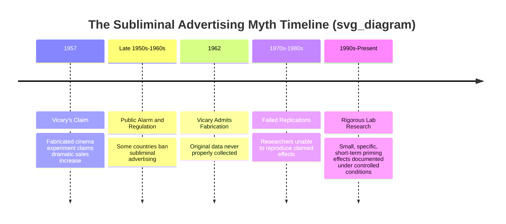
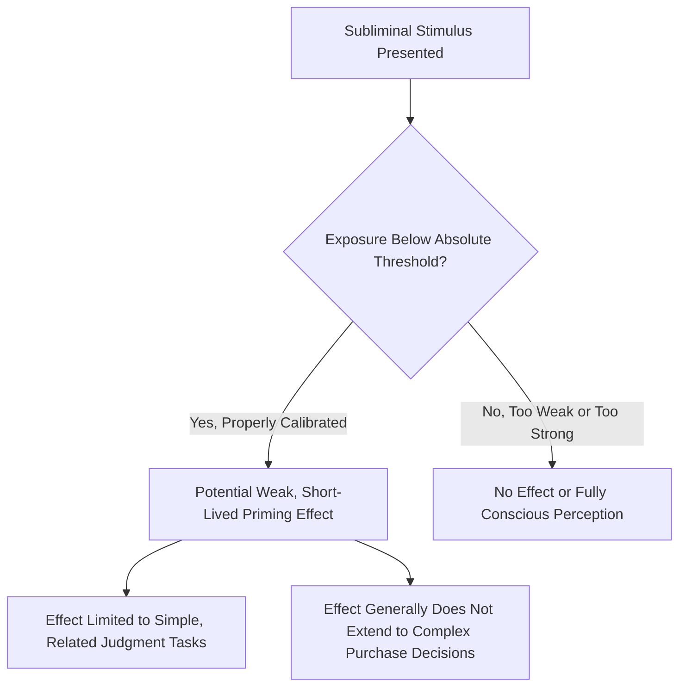

## Subliminal Perception: Evidence Versus Myth

### Overview

Subliminal perception refers to the processing of sensory stimuli presented below the threshold of conscious awareness — stimuli too brief, too faint, or too subtly embedded to be consciously detected, yet potentially capable of influencing cognition or behavior at an unconscious level. Few topics in consumer psychology are as persistently misunderstood by the public as subliminal advertising. This topic requires carefully separating the popularized "myth" (largely traceable to a single discredited 1950s claim) from the more limited, methodologically rigorous evidence that has emerged from decades of subsequent experimental psychology research.

### Defining Subliminal Perception

| Term | Definition |
| --- | --- |
| Subliminal Stimulus | A stimulus presented below the absolute threshold of conscious detection |
| Supraliminal Stimulus | A stimulus presented above the threshold of conscious detection (consciously perceivable) |
| Subliminal Priming | The phenomenon whereby a subliminally presented stimulus influences subsequent conscious judgment, perception, or behavior |
| Absolute Threshold | The stimulus intensity at which a person can detect the stimulus at least 50% of the time |

### The Origin of the Myth: The Vicary Claim

**Key Points**

- In 1957, market researcher James Vicary claimed to have flashed the subliminal messages "Drink Coca-Cola" and "Eat Popcorn" during a movie screening in a New Jersey theater, reportedly increasing concession sales significantly.
- This claim received enormous media attention and sparked widespread public concern about subliminal manipulation, prompting bans on subliminal advertising in some jurisdictions (e.g., regulatory prohibitions in countries including the United Kingdom and Australia).
- Vicary later admitted the experiment was never properly conducted and the data was fabricated; subsequent attempts by other researchers to replicate the claimed effect failed to reproduce anything resembling the originally reported results.
- [Inference] Despite being thoroughly debunked by the researcher's own admission and by failed replication attempts, the Vicary claim remains deeply embedded in popular culture as "evidence" that subliminal advertising is a powerful, reliable persuasion tool — a striking example of a scientific myth outliving its factual refutation in public consciousness.

### What Rigorous Research Actually Shows

**Key Points**

- Contemporary experimental psychology does provide evidence that subliminal *priming* can occur under tightly controlled laboratory conditions — for example, briefly flashed subliminal words can measurably influence reaction times or judgments on closely related subsequent tasks.
- However, these documented effects are typically small in magnitude, short-lived, highly dependent on precise experimental parameters (exposure duration, stimulus-target relevance, individual attention state), and generally limited to simple perceptual or semantic priming rather than complex behavioral outcomes like brand choice or purchase decisions.
- [Unverified] Evidence for subliminal advertising producing meaningful, reliable effects on actual real-world purchase behavior or brand preference remains limited and contested; most robust subliminal priming findings come from controlled lab paradigms using simple stimuli (words, symbols) rather than naturalistic advertising exposure, and effect sizes found in lab settings do not straightforwardly generalize to complex real-world marketing contexts.

### Comparative Table: Myth vs. Evidence-Based Understanding

| Dimension | Popular Myth | Evidence-Based Understanding |
| --- | --- | --- |
| Origin | Vicary's 1957 fabricated cinema claim | Discredited by Vicary's own admission and failed replications |
| Claimed Effect Size | Large, dramatic behavior change (e.g., significantly boosted sales) | Small, narrow, short-lived priming effects on simple tasks |
| Real-World Applicability | Assumed to work powerfully in everyday advertising | Limited evidence for real-world advertising effectiveness |
| Behavioral Scope | Assumed to drive complex decisions (brand choice, purchase) | Evidence largely limited to simple perceptual/semantic priming |
| Regulatory Response | Prompted outright bans in some jurisdictions | [Unverified] Ongoing regulatory status varies by jurisdiction and is not uniformly current in the author's training data |

### Conditions Required for Subliminal Priming in Lab Research

| Condition | Description |
| --- | --- |
| Precise Exposure Duration | Typically requires exposure durations calibrated below individual perceptual thresholds, often in the tens-of-milliseconds range |
| Masking | Often requires a masking stimulus immediately before/after to prevent conscious perception |
| Target Relevance | Priming effects are typically strongest when the subliminal stimulus is semantically or perceptually related to the subsequent judgment task |
| Attentional State | Some research suggests effects vary based on the perceiver's arousal, motivation, or attentional focus at time of exposure |
| Individual Differences | [Unverified] Some evidence suggests susceptibility to subliminal priming may vary across individuals, though the robustness and generalizability of specific individual-difference findings is an area of ongoing research |

### Why the Myth Persists Despite Debunking

**Key Points**

- [Inference] Several psychological and cultural factors likely contribute to the myth's persistence: the intuitive appeal of a simple, dramatic explanation for consumer behavior; confirmation bias among those already suspicious of advertising manipulation; and the difficulty of widely correcting a sensational claim once it has entered popular culture, compared to the relatively low-profile nature of the subsequent debunking and failed replications.
- The persistence of the subliminal advertising myth is sometimes cited in psychology and media literacy education as a case study in how scientific misinformation can become deeply culturally embedded despite being unsupported (and in this case, actively disavowed by its original source).

### The "Backward Masking" and Audio Subliminal Message Myths

**Key Points**

- A related popular myth concerns claims of hidden backward or subliminal audio messages embedded in music allegedly influencing listener behavior (e.g., claims made about certain music genres in the 1980s).
- [Unverified] Rigorous experimental research examining these specific claims has generally failed to find reliable evidence supporting meaningful behavioral influence from such embedded audio messages; this remains an area where public belief substantially outpaces the state of the supporting evidence.

### Ethical and Regulatory Considerations

**Key Points**

- Regardless of the debated *effectiveness* of subliminal advertising, many jurisdictions have historically enacted regulations prohibiting deliberately embedded subliminal messaging in advertising, reflecting a precautionary ethical stance rather than an evidence-based conclusion that such techniques are proven to work. [Inference]
- This creates an important distinction for marketing ethics discussions: a practice can be regulated or ethically discouraged based on the *potential* for manipulation and consumer autonomy concerns, independent of definitive proof that the technique produces strong, reliable effects.
- Consumer protection debates around subliminal messaging illustrate a broader principle in marketing ethics: precautionary regulation of manipulative-seeming techniques does not require conclusive proof of effectiveness to be justified on ethical or consumer-trust grounds.

### Illustration: Threshold and Priming Relationship (svg_diagram)

<svg xmlns="http://www.w3.org/2000/svg" viewBox="0 0 640 320">
<text x="320" y="26" text-anchor="middle" font-size="15" font-weight="bold" fill="#1a1a1a">Subliminal vs. Supraliminal Processing (svg_diagram)</text>
<line x1="60" y1="260" x2="580" y2="260" stroke="#555" stroke-width="1.5" />
<text x="320" y="290" text-anchor="middle" font-size="11" fill="#555">Stimulus Intensity</text>
<line x1="300" y1="60" x2="300" y2="260" stroke="#c0392b" stroke-width="2" stroke-dasharray="5,3" />
<text x="300" y="50" text-anchor="middle" font-size="10" fill="#c0392b">Absolute Threshold</text>
<rect x="60" y="200" width="240" height="60" fill="#eaf3fb" stroke="#2a6f97" stroke-width="1.5" />
<text x="180" y="235" text-anchor="middle" font-size="11" fill="#0b3d5c">Subliminal Zone</text>
<text x="180" y="185" text-anchor="middle" font-size="9" fill="#555">Weak, narrow priming possible under lab conditions</text>
<rect x="300" y="140" width="280" height="120" fill="#d3e8f5" stroke="#2a6f97" stroke-width="1.5" />
<text x="440" y="200" text-anchor="middle" font-size="11" fill="#0b3d5c">Supraliminal Zone</text>
<text x="440" y="220" text-anchor="middle" font-size="9" fill="#555">Consciously perceived; standard advertising operates here</text>
</svg>

### Practical Implications for Marketing Practice

**Example**

A marketing team debating whether to invest in "subliminal messaging" techniques for an advertising campaign should recognize that the practice lacks robust evidence of meaningful effectiveness for actual consumer behavior change, carries significant ethical and regulatory risk given historical bans and consumer trust concerns, and diverts resources away from well-supported, evidence-based persuasion approaches such as clear value proposition communication, emotional appeal design, and social proof — techniques with substantially stronger empirical support in the consumer psychology literature.

### Common Misconceptions

- Subliminal advertising is not proven by the Vicary cinema claim; that specific claim was fabricated and never occurred as originally described.
- The existence of subliminal priming effects in controlled laboratory settings does not equate to proof that subliminal advertising works in real-world marketing contexts; effect sizes, task complexity, and exposure control differ dramatically between lab paradigms and naturalistic advertising environments.
- Regulatory bans on subliminal advertising do not necessarily reflect scientific consensus that the technique is highly effective; they often reflect precautionary consumer-protection reasoning independent of definitive efficacy evidence.

### Conclusion

Subliminal perception is a legitimate area of experimental psychological research, but the popular narrative of powerful, market-moving subliminal advertising is traceable to a single fabricated 1957 claim that has never been credibly replicated. While rigorous laboratory research demonstrates that subliminal priming can produce small, short-lived effects on simple perceptual and semantic judgment tasks under tightly controlled conditions, robust evidence for subliminal advertising meaningfully influencing real-world purchase behavior remains limited. Marketing practitioners and consumer psychology students should treat subliminal advertising claims with significant methodological skepticism, distinguishing rigorously documented lab findings from persistent but unsupported popular mythology.

**Related Topics**

- Absolute threshold and psychophysics
- Priming effects in cognitive psychology
- The Vicary cinema experiment and scientific misinformation case studies
- Marketing ethics and precautionary regulation
- Consumer protection regulation of advertising techniques
- Media literacy and debunking marketing myths
- Evidence-based persuasion techniques in advertising