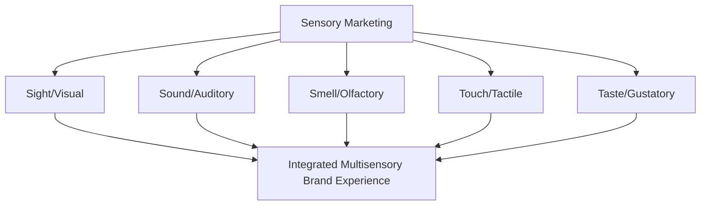
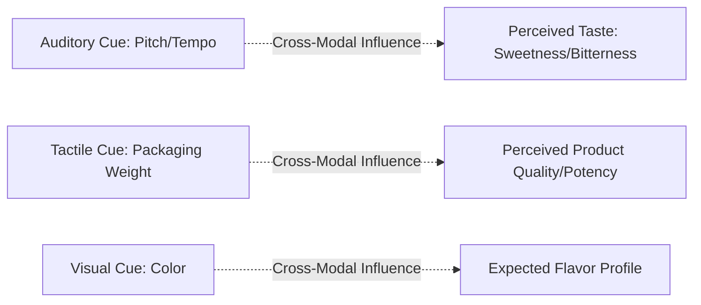

## Sensory Marketing Across Sight, Sound, Smell, Touch, and Taste

### Overview

Sensory marketing is the practice of engaging consumers' five senses to shape perception, emotion, and behavior toward a brand or product. Grounded in psychophysics, embodied cognition, and affective psychology, sensory marketing recognizes that consumption experiences are fundamentally multisensory, and that deliberate design of visual, auditory, olfactory, tactile, and gustatory cues can significantly influence brand perception, product evaluation, and purchase behavior — often operating below the level of conscious deliberation.

### Theoretical Foundation

**Key Points**

- Sensory marketing draws on **embodied cognition** theory, which proposes that cognitive processes are shaped by bodily sensory-motor experience rather than operating as abstract, disembodied information processing.
- Krishna's (2012) academic definition frames sensory marketing as marketing that engages consumers' senses and affects their perception, judgment, and behavior — a definition widely cited in the consumer sensory research literature.
- Multisensory integration research demonstrates that sensory cues do not operate independently; cross-modal interactions (e.g., sound influencing taste perception) are a core and often counterintuitive feature of sensory marketing effects.

### 1. Sight (Visual Marketing)

**Key Points**

- The dominant sense in most marketing contexts, given its role in packaging, advertising, retail environment, and digital interface design.
- Core visual variables include color, shape, typography, size, contrast, and visual complexity.

**Core Visual Design Elements**

| Element | Consumer Psychology Effect |
| --- | --- |
| Color | Evokes emotional and cultural associations; influences arousal and perceived product category fit |
| Shape | Rounded shapes often associated with friendliness/softness; angular shapes with strength/efficiency [Inference] |
| Typography | Font weight and style influence perceived brand personality (e.g., serif fonts often perceived as more traditional/trustworthy) [Inference] |
| Visual Complexity | Moderate complexity often preferred over extremes of oversimplification or clutter |
| Packaging Design | Shapes perceived product quantity, quality expectations, and premium positioning |

[Inference] Many specific color-emotion associations cited in popular marketing literature (e.g., "blue equals trust," "red equals urgency") are culturally and contextually variable rather than universal, and academic research on color psychology in marketing shows effects that are frequently moderated by product category, cultural context, and individual differences rather than fixed, universal rules.

### 2. Sound (Auditory Marketing)

**Key Points**

- Encompasses brand sonic identity (jingles, sonic logos), background music in retail environments, and product-generated sounds (e.g., the sound of a car door closing, a product's packaging).
- Research on background music in retail settings has examined effects of tempo, volume, and genre on shopping pace, dwell time, and spending behavior.

**Core Auditory Applications**

| Application | Description |
| --- | --- |
| Sonic Branding | Distinctive audio signatures (jingles, sound logos) associated with brand recognition |
| Retail Background Music | Tempo and genre selection to influence shopping pace and mood |
| Product Sound Design | Engineered sounds (e.g., snack crunch, engine sound) signaling quality |
| Voice and Tone in Advertising | Vocal pitch, pacing, and accent influencing perceived trustworthiness/authority |

**Example**

[Inference] Retail research has explored how slower background music tempo may correlate with longer in-store dwell time and, in some studies, increased spending, though effects are moderated by store type, product category, and consumer mood, and should not be treated as a universally guaranteed outcome.

### 3. Smell (Olfactory Marketing)

**Key Points**

- Scent is uniquely processed via the olfactory bulb, which has direct neural connections to the limbic system (associated with emotion and memory), giving scent a particularly strong and often unconscious link to affective and memory-based responses. [Inference — the general olfactory-limbic neuroanatomical pathway is well-established, though the degree of resulting "power" relative to other senses in marketing contexts is more debated]
- Ambient scent marketing (diffusing a subtle signature scent in retail environments) is widely used by hospitality, retail, and luxury brands to shape mood and brand association.

**Core Olfactory Applications**

| Application | Description |
| --- | --- |
| Ambient Scent Marketing | Diffusing brand-associated scents in physical retail/hospitality spaces |
| Signature Scent Branding | A proprietary scent used consistently across brand touchpoints |
| Product Scent Engineering | Deliberately designed product scent (e.g., "new car smell," cleaning product fragrance) |
| Scent-Congruence Effects | Matching ambient scent to product category to enhance perceived relevance |

### 4. Touch (Tactile Marketing)

**Key Points**

- Touch influences product evaluation through haptic cues such as weight, texture, temperature, and material quality, which consumers often use as heuristic indicators of overall product quality.
- Research on "haptic imagery" suggests that even imagining touching a product (in the absence of physical contact, as in online shopping) can activate some tactile-related cognitive processing, though this remains an area of ongoing research regarding its practical marketing impact. [Inference]

**Core Tactile Applications**

| Application | Description |
| --- | --- |
| Packaging Material and Weight | Heavier, higher-quality-feeling materials often associated with premium perception |
| Product Texture Design | Texture cues signaling product attributes (e.g., smoothness signaling luxury) |
| In-Store Touch Opportunities | Allowing physical product interaction to increase psychological ownership |
| Digital "Need for Touch" Compensation | Zoom features, 360-degree views, and detailed material descriptions in e-commerce |

**Example**

[Inference] Consumers with a high dispositional "need for touch" (a construct studied in consumer research) may show greater purchase hesitation for products purchased without physical inspection (e.g., certain e-commerce categories like clothing and furniture), which partly explains the growth of augmented reality try-on and detailed material-description features in online retail.

### 5. Taste (Gustatory Marketing)

**Key Points**

- Most directly relevant to food and beverage marketing, though taste perception itself is heavily influenced by cross-modal sensory cues from packaging, branding, and even ambient sound — a phenomenon extensively studied in the field of "gastrophysics" or multisensory flavor perception.
- Branding and packaging can measurably alter perceived taste even when the underlying product is physically identical, demonstrating the powerful role of expectation and cross-modal sensory integration in taste evaluation.

**Example**

[Inference] Studies on blind versus branded taste tests (in the tradition of research following the well-known Pepsi/Coca-Cola taste-test paradigm) have repeatedly demonstrated that brand knowledge can shift subjective taste preference and even measurable neural response compared to fully blind conditions, illustrating that "taste" as experienced by consumers is not a purely objective gustatory phenomenon but is substantially shaped by brand expectation.

### Cross-Modal Sensory Interactions

**Key Points**

- A defining and often counterintuitive feature of sensory marketing research is that senses do not operate independently; cross-modal correspondences mean that a cue in one sensory modality can systematically alter perception in another.
- Documented cross-modal effects in the sensory marketing literature include sound pitch influencing perceived taste sweetness/bitterness, and packaging weight influencing perceived product potency or quality. [Inference — specific cross-modal correspondence findings vary across studies and should be treated as an active, evolving research area rather than fixed universal rules]

### Illustration: Five Senses in Integrated Brand Experience (svg_diagram)

<svg xmlns="http://www.w3.org/2000/svg" viewBox="0 0 640 440">
<text x="320" y="26" text-anchor="middle" font-size="16" font-weight="bold" fill="#1a1a1a">Five Senses in Brand Experience (svg_diagram)</text>
<circle cx="320" cy="240" r="90" fill="#a9d3e8" stroke="#2a6f97" stroke-width="2" />
<text x="320" y="244" text-anchor="middle" font-size="13" font-weight="bold" fill="#0b3d5c">Brand Experience</text>
<circle cx="320" cy="100" r="55" fill="#eaf3fb" stroke="#2a6f97" stroke-width="2" />
<text x="320" y="105" text-anchor="middle" font-size="11" fill="#0b3d5c">Sight</text>
<circle cx="460" cy="160" r="55" fill="#eaf3fb" stroke="#2a6f97" stroke-width="2" />
<text x="460" y="165" text-anchor="middle" font-size="11" fill="#0b3d5c">Sound</text>
<circle cx="460" cy="330" r="55" fill="#eaf3fb" stroke="#2a6f97" stroke-width="2" />
<text x="460" y="335" text-anchor="middle" font-size="11" fill="#0b3d5c">Smell</text>
<circle cx="180" cy="330" r="55" fill="#eaf3fb" stroke="#2a6f97" stroke-width="2" />
<text x="180" y="335" text-anchor="middle" font-size="11" fill="#0b3d5c">Touch</text>
<circle cx="180" cy="160" r="55" fill="#eaf3fb" stroke="#2a6f97" stroke-width="2" />
<text x="180" y="165" text-anchor="middle" font-size="11" fill="#0b3d5c">Taste</text>
</svg>

### Comparative Table: Sensory Modality Applications

| Sense | Primary Marketing Channels | Key Underlying Mechanism |
| --- | --- | --- |
| Sight | Packaging, advertising, digital UI, store layout | Visual salience, color/shape associations |
| Sound | Sonic branding, retail music, product sound design | Emotional arousal, tempo-pacing effects |
| Smell | Ambient scent, signature fragrance, product scent | Direct limbic/emotional memory pathway |
| Touch | Packaging materials, product texture, in-store handling | Haptic quality heuristics, psychological ownership |
| Taste | Food/beverage formulation, cross-modal branding effects | Expectation-driven flavor perception |

### Practical Example: Integrated Multisensory Strategy

**Example**

A premium coffee brand applies sensory marketing across all five senses:

- **Sight**: minimalist, high-contrast packaging signaling premium positioning
- **Sound**: curated in-store ambient music tempo designed to encourage relaxed browsing and longer dwell time
- **Smell**: ambient coffee aroma reinforcing product category and triggering appetite/anticipation
- **Touch**: matte-textured, weighted packaging signaling craftsmanship and quality
- **Taste**: product formulation paired with congruent visual/olfactory branding cues shown in research to enhance perceived flavor intensity and quality beyond the product's isolated sensory properties

### Common Misconceptions

- Sensory marketing is not limited to physical retail contexts; digital sensory marketing (visual design, sonic branding in video content, haptic feedback in mobile interfaces) is an active and growing application area.
- Sensory effects are not uniform or guaranteed across all consumers; individual differences (cultural background, sensory sensitivity, product category familiarity) meaningfully moderate sensory marketing effectiveness.
- Sensory marketing does not operate through a single dominant sense in isolation; cross-modal sensory integration means effective sensory marketing strategy typically requires designing congruent, mutually reinforcing cues across multiple senses simultaneously.

### Conclusion

Sensory marketing applies principles from psychophysics, embodied cognition, and multisensory perception research to deliberately engage sight, sound, smell, touch, and taste in shaping brand perception and consumer behavior. Because sensory modalities interact through well-documented cross-modal effects rather than operating independently, the most effective sensory marketing strategies design congruent, integrated multisensory experiences rather than optimizing any single sense in isolation.

**Related Topics**

- Psychophysics and sensory thresholds
- Embodied cognition theory in consumer research
- Cross-modal correspondence and gastrophysics
- Ambient scent marketing and retail environment design
- Sonic branding and audio logo design
- Packaging design psychology
- Haptic imagery and "need for touch" in e-commerce