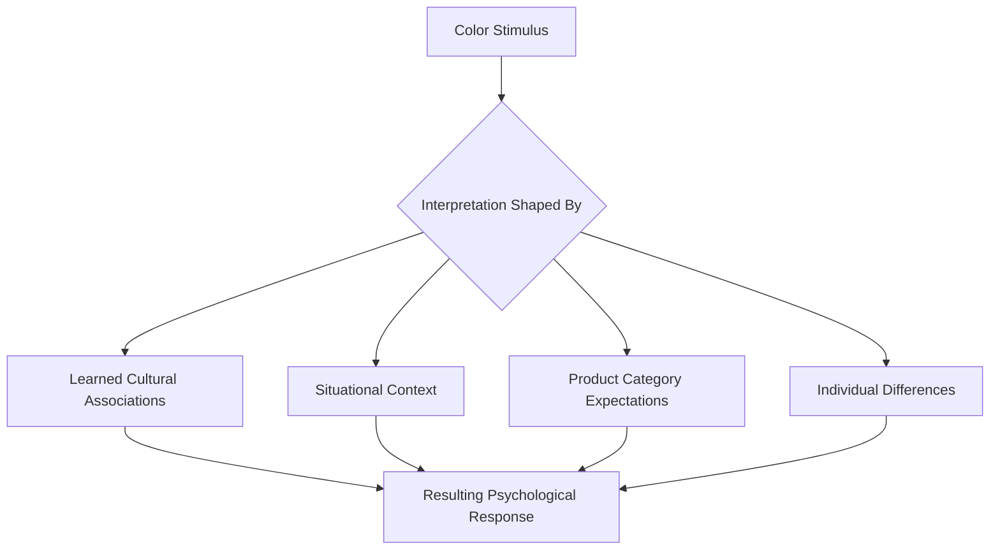
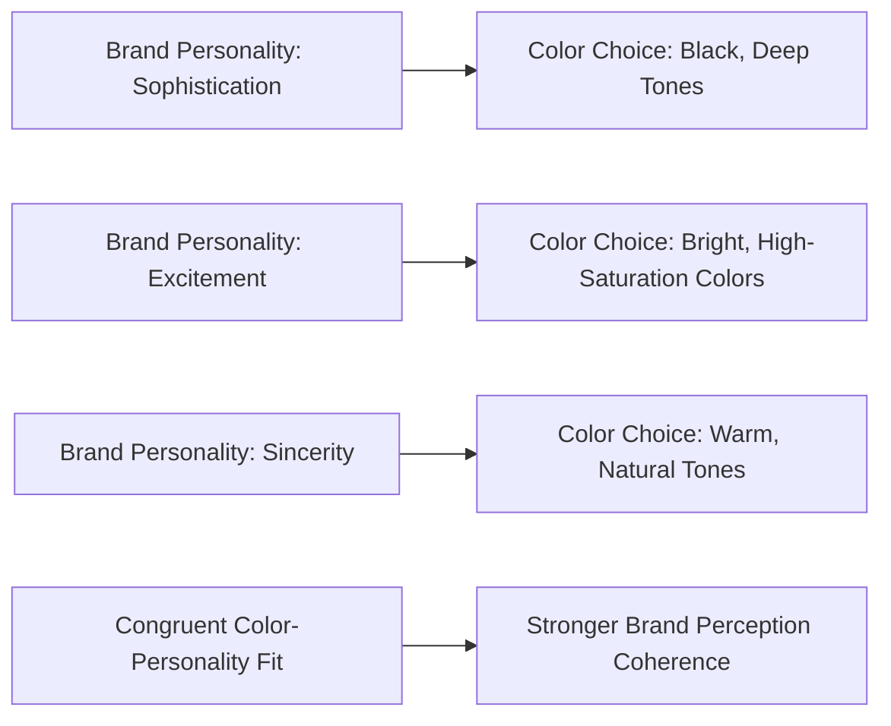
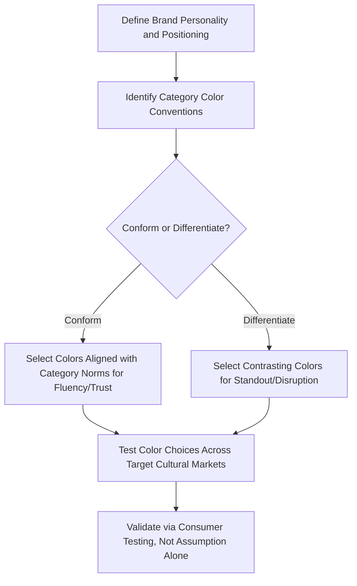

## Color Psychology in Branding and Design

### Overview

Color psychology in branding examines how color choices in logos, packaging, retail environments, and digital interfaces influence consumer perception, emotion, and behavior. While color is one of the most frequently discussed sensory marketing variables, it is also one of the most susceptible to oversimplified popular claims. This topic requires careful distinction between well-supported general principles (color affects attention, arousal, and category-based expectations) and the more contested, often-exaggerated claims about fixed, universal color-emotion associations that circulate widely in marketing content.

### Theoretical Foundations

**Key Points**

- Color perception operates through the visual system's response to light wavelength, but color's *psychological* meaning is substantially shaped by learned associations, cultural context, and situational factors rather than being a fixed, hardwired response.
- The **Color-in-Context Theory** (Elliot and Maier, 2012) proposes that color meaning is not universal but depends on the specific context in which it is encountered — the same color can carry different psychological associations depending on situational and cultural framing.
- Aaron Labrecque and Bernd Schmitt's marketing-focused color research emphasizes brand-color-fit — the importance of color choices aligning with brand personality and product category expectations — as a more robust predictor of marketing effectiveness than any single color's presumed universal emotional meaning. [Inference]

### Commonly Cited Color Associations (With Caution)

| Color | Frequently Cited Association | Caveat |
| --- | --- | --- |
| Red | Excitement, urgency, appetite stimulation | [Inference] Associations vary by culture (e.g., red signifies luck/prosperity in some East Asian contexts, danger/urgency in Western retail contexts) |
| Blue | Trust, calm, professionalism | [Inference] Widely used in financial/tech branding, but effect is confounded with category convention rather than proven intrinsic color-emotion causality |
| Green | Nature, health, sustainability | [Inference] Strongly tied to learned environmental/health category associations rather than a universal innate response |
| Yellow | Optimism, attention-grabbing, caution | [Inference] High visual salience is well-supported; specific emotional connotations are more culturally variable |
| Black | Luxury, sophistication, authority | [Inference] Strongly associated with premium positioning in Western retail contexts; cultural meaning varies (e.g., mourning associations in some cultures) |
| Purple | Royalty, luxury, creativity | [Inference] Historical association with royalty traces to the historical rarity/cost of purple dye; contemporary associations are largely learned/cultural |

**Key Points**

- These associations are widely repeated in popular marketing literature but should be treated as culturally and contextually contingent tendencies rather than fixed psychological laws; academic research in this area shows considerably more nuance, context-dependency, and cross-cultural variation than popular infographics typically suggest. [Inference]

### What Is More Robustly Supported

**Key Points**

- Color's effect on **visual salience and attention capture** (via contrast, brightness, and saturation) is well-established in visual perception research, independent of any specific emotional meaning attributed to individual colors.
- Color's role in **category-based expectation formation** is well-documented: consumers develop learned associations between colors and product categories through repeated exposure (e.g., red/white color schemes in cola branding, green in "natural"/eco-positioned products), such that color choices consistent with category norms are processed more fluently, while choices that strongly violate category color norms may create either disruptive novelty or dissonance/confusion depending on execution. [Inference]
- **Color contrast and legibility** effects on readability and usability are robustly supported by human factors and visual design research, independent of color's emotional connotations.

### Brand-Color Fit (Congruence) Theory

**Key Points**

- Rather than asking "what does this color universally mean," a more empirically supported framing asks "does this color choice fit the brand's intended personality and category positioning."
- Research on brand personality (drawing on Aaker's brand personality framework) suggests color choices are more effective when congruent with the brand's intended personality dimensions (sincerity, excitement, competence, sophistication, ruggedness) than when selected based on presumed universal color-emotion rules alone. [Inference]

### Color and Purchase Intent: The "Colour Lends Credence" Framework

**Key Points**

- Singh's (2006) frequently cited marketing research paper argues that color increases brand recognition and can influence purchase intent by shaping first impressions, and emphasizes that appropriateness of color to the product/brand context matters more than any single color's inherent properties. [Inference — this remains a widely cited but not universally replicated claim, and effect sizes for color's direct influence on purchase intent independent of other design variables are difficult to isolate empirically]

### Cross-Cultural Variation in Color Meaning

| Color | Western Association (commonly cited) | Alternative Cultural Association (illustrative) |
| --- | --- | --- |
| White | Purity, cleanliness, simplicity | Associated with mourning in some East Asian cultural traditions |
| Red | Danger, urgency, passion | Associated with luck, prosperity, and celebration in Chinese culture |
| Black | Elegance, sophistication, luxury | Associated with mourning in many Western contexts as well, creating context-dependent duality even within a single culture |

[Unverified] Cross-cultural color association research shows substantial documented variation, but specific claims about any single culture's color associations should be treated as general tendencies rather than absolute rules, given significant within-culture variation and the evolving nature of color associations amid globalization.

### Illustration: Color-in-Context Framework (svg_diagram)

<svg xmlns="http://www.w3.org/2000/svg" viewBox="0 0 700 340">
<text x="350" y="26" text-anchor="middle" font-size="15" font-weight="bold" fill="#1a1a1a">Color-in-Context Theory (svg_diagram)</text>
<circle cx="350" cy="190" r="70" fill="#a9d3e8" stroke="#2a6f97" stroke-width="2" />
<text x="350" y="185" text-anchor="middle" font-size="12" font-weight="bold" fill="#0b3d5c">Color</text>
<text x="350" y="200" text-anchor="middle" font-size="10" fill="#0b3d5c">Stimulus</text>
<rect x="60" y="70" width="150" height="60" fill="#eaf3fb" stroke="#2a6f97" stroke-width="2" />
<text x="135" y="105" text-anchor="middle" font-size="10" fill="#0b3d5c">Product Category</text>
<rect x="490" y="70" width="150" height="60" fill="#eaf3fb" stroke="#2a6f97" stroke-width="2" />
<text x="565" y="105" text-anchor="middle" font-size="10" fill="#0b3d5c">Culture/Region</text>
<rect x="60" y="260" width="150" height="60" fill="#eaf3fb" stroke="#2a6f97" stroke-width="2" />
<text x="135" y="295" text-anchor="middle" font-size="10" fill="#0b3d5c">Brand Personality</text>
<rect x="490" y="260" width="150" height="60" fill="#eaf3fb" stroke="#2a6f97" stroke-width="2" />
<text x="565" y="295" text-anchor="middle" font-size="10" fill="#0b3d5c">Situational Mood</text>
</svg>

### Practical Application: Logo and Packaging Design Process

### Practical Example

**Example**

A financial technology startup deciding between a traditional blue (category-conforming, signaling trust and stability consistent with established banking brand conventions) and a bold orange or green (category-differentiating, signaling innovation and approachability distinct from traditional banking) illustrates the strategic tradeoff at the heart of color-in-branding decisions: conforming to category color norms borrows established trust associations, while differentiating creates standout distinctiveness at the potential cost of initial category-fit ambiguity. The optimal choice depends on brand strategy (disruption vs. trust-building) rather than any single color's presumed universal psychological meaning.

### Common Misconceptions

- Color psychology "cheat sheets" claiming fixed, universal emotional meanings for specific colors substantially overstate the scientific consensus; rigorous research shows color meaning is heavily moderated by cultural context, product category, and situational framing.
- Color choice in isolation rarely drives purchase decisions; color operates as one input among many (typography, imagery, positioning, price, packaging materials) in an integrated brand perception, and isolating color's independent causal effect on purchase behavior is methodologically difficult in real-world contexts.
- A color is not inherently "good" or "bad" for branding; effectiveness depends on fit with brand personality, category conventions, target cultural context, and consistency with other design elements.

### Conclusion

Color psychology in branding is a genuinely important design consideration, but its practical application should be grounded in evidence-supported principles — visual salience for attention capture, category-based color expectations, and brand-personality color congruence — rather than the oversimplified, often culturally-naive color-emotion association charts common in popular marketing content. Effective color strategy requires evaluating color choices within their specific brand, category, cultural, and situational context rather than applying fixed universal rules.

**Related Topics**

- Color-in-Context Theory (Elliot and Maier)
- Brand personality and color congruence
- Cross-cultural variation in color meaning
- Visual salience and attention capture in packaging design
- Category-based color conventions and brand differentiation strategy
- Aaker's brand personality framework
- Packaging design psychology beyond color