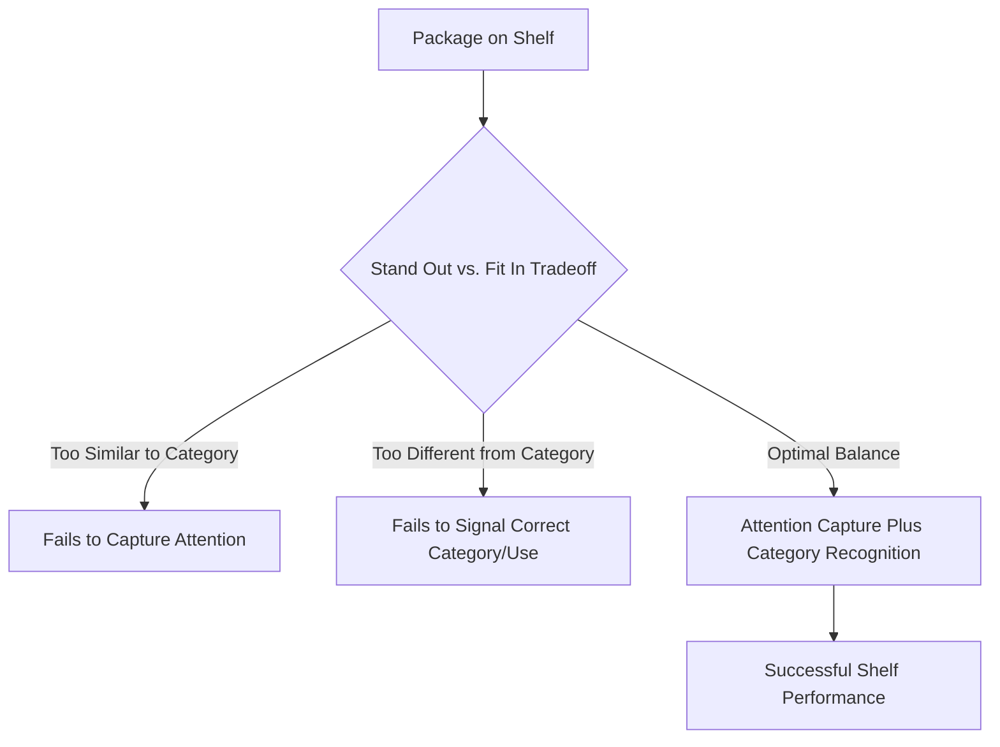
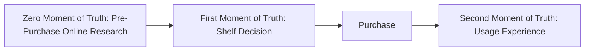
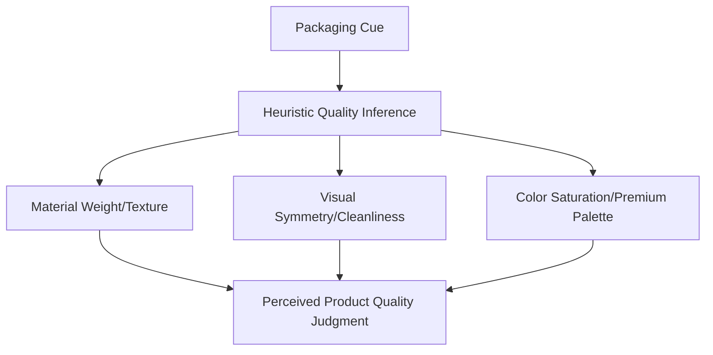

## Packaging Design and Shelf Perception

### Overview

Packaging design and shelf perception concern how a product's physical (or digital) packaging shapes attentional capture, quality inference, and purchase decisions at the critical point of sale. Packaging functions simultaneously as a physical container, a communication medium, and — in traditional retail — the primary moment-of-truth touchpoint where a purchase decision is often finalized within seconds. This topic integrates psychophysics (visual salience), perceptual psychology (schema-based quality inference), and applied retail research on shelf behavior.

### Theoretical Foundations

**Key Points**

- Packaging operates at the intersection of **selective attention** (does the package get noticed amid shelf clutter), **selective distortion** (how is the noticed package interpreted), and **heuristic quality inference** (what quality/attribute judgments does the consumer form based on visual and tactile packaging cues).
- The retail shelf environment represents an extreme case of attentional competition: a package must achieve **stand-out** (visual differentiation to be noticed) while also achieving **fit-in** (category-appropriate cues that allow it to be quickly recognized as belonging to the correct product category) — a tension frequently discussed in packaging design literature as the "stand out vs. fit in" tradeoff. [Inference]

### The "Moment of Truth" Concept

**Key Points**

- Procter & Gamble popularized the term **"First Moment of Truth" (FMOT)** in the early 2000s to describe the critical, brief window (often estimated in marketing literature as a matter of seconds) during which a shopper evaluates a product on the shelf and decides whether to purchase.
- This concept has since been extended in digital marketing to a **"Zero Moment of Truth" (ZMOT)**, referring to pre-shelf online research, and a **"Second Moment of Truth" (SMOT)**, referring to the post-purchase usage experience.
- [Unverified] Specific timing estimates for shelf decision-making (commonly cited figures suggest very brief windows, sometimes cited as a few seconds) originate from industry and eye-tracking research that varies by methodology, product category, and shopping context, and should be treated as illustrative rather than a precise universal constant.

### Core Packaging Design Elements

| Element | Perceptual Function |
| --- | --- |
| Color | Attention capture, category signaling, emotional association |
| Shape/Structure | Perceived quantity, ergonomic usability, shelf differentiation |
| Typography | Brand personality signaling, legibility, premium/value positioning |
| Imagery/Graphics | Product benefit communication, appetite appeal (for food), lifestyle association |
| Material and Texture | Perceived quality, sustainability signaling, premium tactile cues |
| Size and Proportion | Perceived value, portion expectations, shelf visibility |
| Information Layout/Hierarchy | Ease of ingredient/benefit scanning, regulatory compliance |

### Shelf-Level Perceptual Research Methods

| Method | Application |
| --- | --- |
| Eye-Tracking | Measures visual attention patterns, fixation duration, and gaze sequence on shelf displays |
| Shelf Simulation Testing | Virtual or physical shelf mockups testing packaging standout in realistic competitive context |
| Implicit Association Testing | Measures automatic quality/attribute associations triggered by packaging cues |
| A/B Package Testing | Comparative testing of packaging variants on purchase intent or attention metrics |
| Tachistoscopic Testing | Brief timed exposure testing to measure rapid, first-glance packaging impressions |

### The Package-as-Quality-Signal Heuristic

**Key Points**

- Consumers frequently use packaging cues as heuristic proxies for product quality, especially under low-involvement, time-constrained shelf conditions where detailed product evaluation is impractical.
- Documented heuristic associations include: heavier/more substantial packaging materials signaling higher perceived quality; symmetrical, "cleaner" layouts signaling higher perceived quality/trustworthiness; and premium material finishes (matte textures, embossing) signaling higher price-tier positioning. [Inference]

### Category Norms and Deviation Strategy

**Key Points**

- Product categories tend to develop established visual conventions over time (e.g., specific color palettes and layout patterns common to a category), which consumers learn implicitly and use to quickly categorize products during rapid shelf scanning.
- Two broad packaging strategies exist relative to category norms: **conformity** (adopting established category visual cues to signal appropriate category membership and reduce consumer uncertainty) and **disruption** (deliberately deviating from category norms to stand out, typically used by challenger or premium brands seeking differentiation). [Inference]

| Strategy | Goal | Risk |
| --- | --- | --- |
| Category Conformity | Fast category recognition, reduced consumer uncertainty | Risk of blending in, reduced shelf standout |
| Category Disruption | Strong differentiation, memorability | Risk of confusing category signaling, reduced immediate recognition |

### Illustration: Shelf Scanning Attention Pattern (svg_diagram)

<svg xmlns="http://www.w3.org/2000/svg" viewBox="0 0 700 360">
<text x="350" y="26" text-anchor="middle" font-size="15" font-weight="bold" fill="#1a1a1a">Shelf Scanning and Attention Capture (svg_diagram)</text>
<rect x="60" y="70" width="580" height="240" fill="#f5f5f5" stroke="#999" stroke-width="1" />
<rect x="80" y="100" width="70" height="180" fill="#d3e8f5" stroke="#2a6f97" stroke-width="1.5" />
<rect x="170" y="100" width="70" height="180" fill="#d3e8f5" stroke="#2a6f97" stroke-width="1.5" />
<rect x="260" y="90" width="70" height="190" fill="#a9d3e8" stroke="#c0392b" stroke-width="3" />
<text x="295" y="70" text-anchor="middle" font-size="9" fill="#c0392b">Standout Package</text>
<rect x="350" y="100" width="70" height="180" fill="#d3e8f5" stroke="#2a6f97" stroke-width="1.5" />
<rect x="440" y="100" width="70" height="180" fill="#d3e8f5" stroke="#2a6f97" stroke-width="1.5" />
<rect x="530" y="100" width="70" height="180" fill="#d3e8f5" stroke="#2a6f97" stroke-width="1.5" />
<path d="M 115 100 Q 200 60, 295 90" fill="none" stroke="#0b3d5c" stroke-width="2" stroke-dasharray="4,3" />
<text x="200" y="55" text-anchor="middle" font-size="9" fill="#0b3d5c">Gaze Path</text>
</svg>

### Packaging and Consumption Behavior (Post-Purchase Effects)

**Key Points**

- Packaging design also influences post-purchase consumption behavior, not only pre-purchase shelf selection. Research on package size and portion perception (e.g., Brian Wansink's work on package/portion size effects) has examined how larger package or serving sizes can be associated with increased consumption quantity, though it should be noted that portions of Wansink's broader research record faced significant methodological criticism and several retractions in subsequent years, so specific numeric claims from that body of work should be treated with particular caution. [Unverified — treat specific package-size-consumption effect claims from this research tradition cautiously given documented replication and integrity concerns]
- Packaging also serves functional post-purchase roles (resealability, storage convenience, disposal/recyclability) that increasingly factor into purchase decisions alongside pure shelf-appeal considerations, particularly amid rising sustainability-conscious consumer segments. [Inference]

### Digital Shelf Perception (E-Commerce Packaging)

**Key Points**

- In e-commerce contexts, "shelf perception" is mediated through thumbnail images, product photography, and digital packaging representation rather than physical shelf presence, requiring packaging design to remain legible and differentiated at small digital thumbnail sizes.
- [Inference] This has led some brands to design packaging with digital-shelf legibility in mind (larger logo/brand elements, higher contrast at small scale) alongside traditional physical-shelf considerations, reflecting the growing dual physical/digital retail environment.

### Practical Example

**Example**

A new snack brand entering a crowded category faces the stand-out/fit-in tradeoff directly: using the category-conventional color palette (e.g., certain colors strongly associated with the snack category) would aid rapid category recognition but risk shelf invisibility among established competitors using similar palettes; conversely, using a highly unconventional color scheme would capture attention but risk consumers failing to immediately recognize the product's category or use case during a rapid shelf scan. A common resolution strategy is partial conformity: retaining category-signaling structural cues (package shape, iconography) while introducing a differentiated color or graphic treatment to achieve both recognition and standout. [Inference]

### Comparative Table: Packaging Design Objectives

| Objective | Design Lever | Research Method to Validate |
| --- | --- | --- |
| Attention Capture | Color contrast, visual salience, size/shape distinctiveness | Eye-tracking, tachistoscopic testing |
| Category Recognition | Conventional structural/color cues | Rapid categorization testing |
| Quality Inference | Material weight, finish, layout symmetry | Implicit association testing, survey-based quality ratings |
| Brand Personality Signaling | Typography, imagery style, color palette | Brand personality congruence testing |
| Post-Purchase Usability | Resealability, portion control, disposal design | Usage diary studies, qualitative usability testing |

### Common Misconceptions

- Packaging design success is not determined by a single "best" design principle; effective packaging balances multiple, sometimes competing objectives (standout, category fit, quality signaling, brand personality, functional usability) simultaneously.
- Eye-tracking attention data alone does not guarantee purchase conversion; capturing visual attention is a necessary but not sufficient condition for purchase, requiring subsequent successful interpretation and positive evaluation.
- Not all packaging research claims in popular marketing literature reflect current scientific consensus; some influential studies in this domain (e.g., portions of the package-size/consumption literature) have faced significant subsequent methodological scrutiny, underscoring the importance of evaluating packaging research claims critically rather than accepting popularized findings uncritically.

### Conclusion

Packaging design and shelf perception sit at the convergence of psychophysics, perceptual heuristics, and applied retail research, governing the critical "first moment of truth" where attention capture, category recognition, and quality inference combine to influence purchase decisions within a brief perceptual window. Effective packaging strategy requires deliberately balancing the competing demands of shelf standout and category fit-in, while extending design consideration beyond the point of purchase to post-purchase usability and, increasingly, digital-shelf legibility in e-commerce contexts.

**Related Topics**

- Selective attention and perceptual filters
- First/Zero/Second Moment of Truth frameworks
- Heuristic quality inference from physical product cues
- Category norms and packaging differentiation strategy
- Eye-tracking methodology in retail research
- E-commerce and digital shelf design considerations
- Sustainability signaling in packaging design