## Atmospherics and Sensory Store Environments

### Definition and Theoretical Foundation

Atmospherics refers to the deliberate design of a physical (or digital) environment to produce specific emotional and behavioral effects on shoppers. The term was coined in the marketing literature to describe "the effort to design buying environments to produce specific emotional effects in the buyer that enhance purchase probability" — treating store space itself as a communication medium, distinct from the product or price.

Sensory store environments extend this concept across all five sensory channels — visual, auditory, olfactory, tactile, and gustatory — recognizing that consumers process an environment holistically and largely nonconsciously before conscious evaluation occurs.

**Key Points**

- Atmospherics operates below the threshold of conscious awareness for most shoppers; effects are typically implicit rather than deliberately noticed
- The environment is treated as a bundle of "atmospheric cues" that combine to shape a global impression, rather than as isolated design choices
- The goal is behavioral: increased approach behavior, dwell time, spending, and satisfaction, not merely aesthetic appeal

### The Mehrabian-Russell (M-R) Model

The dominant theoretical framework underlying atmospherics research is the Mehrabian-Russell Pleasure-Arousal-Dominance (PAD) model, adapted to retail contexts.

The model proposes a sequential chain:

$$\text{Environmental Stimuli (S)} \rightarrow \text{Emotional State (O)} \rightarrow \text{Behavioral Response (R)}$$

This is commonly called the **S-O-R (Stimulus-Organism-Response) framework**.

**Core components:**

1. **Stimulus (S)** — atmospheric cues (lighting, music, scent, layout, temperature, crowding)
2. **Organism (O)** — internal emotional states, decomposed into:
   - **Pleasure**: degree to which the person feels good, joyful, satisfied in the environment
   - **Arousal**: degree of mental alertness and physical activation (stimulated vs. sleepy)
   - **Dominance**: degree to which the person feels in control of, versus controlled by, the environment
3. **Response (R)** — approach or avoidance behaviors:
   - **Approach**: desire to stay, explore, affiliate with staff, spend more time/money
   - **Avoidance**: desire to leave, ignore, ignore staff, spend less time

**Approach-avoidance behaviors** are typically operationalized across four dimensions: physical approach/avoidance (staying vs. leaving), exploratory approach/avoidance (browsing vs. restricted movement), communication approach/avoidance (willingness to interact with staff), and performance/satisfaction (task completion and repeat-visit intention).

[Inference] The relative predictive strength of Pleasure versus Arousal is moderated by task orientation — pleasure tends to dominate in hedonic/recreational shopping contexts, while arousal effects are more contingent and can flip sign (excessive arousal reducing approach) in task-focused or time-pressured shopping.

```mermaid
flowchart LR
    subgraph Stimulus["Stimulus (S) — Atmospheric Cues"]
        A1[Lighting]
        A2[Music/Sound]
        A3[Scent]
        A4[Layout/Spatial Design]
        A5[Color]
        A6[Temperature]
        A7[Crowding/Density]
        A8[Tactile Elements]
    end

    subgraph Organism["Organism (O) — Internal State"]
        B1[Pleasure]
        B2[Arousal]
        B3[Dominance]
    end

    subgraph Response["Response (R) — Behavior"]
        C1[Approach: Stay, Browse, Spend, Affiliate]
        C2[Avoidance: Leave, Ignore, Restrict]
    end

    Stimulus --> Organism
    Organism --> Response
```

### Core Atmospheric Cue Categories

**Ambient Cues** (background conditions affecting five senses subconsciously)

- Lighting (color temperature, intensity, direction)
- Scent (ambient vs. localized)
- Sound/music (tempo, volume, genre)
- Temperature and air quality

**Design Cues** (visual/functional stimuli, both aesthetic and functional)

- Layout (grid, racetrack/loop, free-form)
- Color palette and contrast
- Signage, fixtures, architecture
- Cleanliness and organization

**Social Cues** (human elements)

- Employee density, appearance, and behavior
- Other customer density (crowding)
- Perceived social presence

This tripartite taxonomy (ambient, design, social) is the standard classification used to organize atmospheric variables in retail environment research.

### Visual Atmospherics: Lighting and Color

**Lighting**

- Brighter lighting is generally associated with higher arousal and increased examination/handling of merchandise
- Lower, warmer lighting supports relaxed browsing in hedonic contexts (e.g., upscale restaurants, spas)
- Directional/accent lighting on merchandise increases visual attention and perceived product value

**Color**

- Warm colors (red, orange, yellow) tend to increase arousal and can be attention-grabbing but may increase perceived wait time and urgency
- Cool colors (blue, green) tend to be perceived as more relaxing and are associated with approach behavior and longer dwell time in some retail contexts
- [Inference] Color effects are highly moderated by product category congruence — warm colors may enhance appetite-related purchases (food retail) while potentially reducing dwell time in browsing-heavy categories

### Auditory Atmospherics: Music

Music is among the most extensively studied atmospheric variables.

**Tempo effects**

- Slow-tempo music is associated with slower in-store traffic flow and, in several classic studies, higher sales volume in grocery contexts, though not universally replicated
- Fast-tempo music is associated with faster movement, shorter dwell time, but potentially higher perceived energy/excitement

**Volume effects**

- Louder music generally increases arousal but can reduce dwell time in exploratory/deliberative purchase contexts

**Genre/congruence effects**

- Music genre congruent with store positioning (e.g., classical music in wine shops) has been shown in landmark studies to shift purchase choice toward the congruent category, without shoppers reporting awareness of the influence
- This illustrates the largely **nonconscious** mechanism by which atmospherics operates

**Absence of music**

- Silence is itself an atmospheric choice and can increase perceived formality or luxury positioning in some retail contexts (e.g., high-end boutiques)

### Olfactory Atmospherics: Scent Marketing

Scent is processed via the olfactory bulb with direct neural pathways to the limbic system, giving it a distinctive link to emotion and memory compared to other sensory channels.

**Key mechanisms:**

- **Ambient scent** (diffused throughout an environment, not attributable to a specific product) versus **product scent** (emitted by an item itself)
- Congruent scents (scent matching store category/positioning, e.g., a "beachy" scent in a swimwear store) show stronger positive effects on evaluation and approach behavior than incongruent scents
- Moderate scent intensity tends to outperform very strong or very faint scent presence; excessive intensity can trigger avoidance or perceived manipulation

**Documented effects:**

- Increased perceived time spent (subjective time distortion)
- Increased willingness to browse and evaluate merchandise
- [Inference] Effect sizes on actual sales lift vary considerably by category, retailer, and scent-brand congruence, and published effect sizes should not be treated as universally generalizable across all retail contexts

### Tactile Atmospherics

Tactile input includes surface textures of fixtures, flooring, product packaging, and the "touchability" of merchandise.

- Encouraging touch of merchandise increases the **endowment effect** — psychological ownership that increases willingness to pay, a mechanism extensively documented in touch-and-ownership research
- Floor and fixture materials contribute to perceived quality tier (e.g., hardwood/marble suggesting premium positioning vs. utilitarian flooring suggesting value positioning)
- Temperature and haptic comfort (seating, handles, textures) contribute to overall pleasure ratings within the S-O-R framework

### Spatial Design and Layout

**Common layout typologies:**

| Layout Type | Characteristics | Typical Use Case |
| --- | --- | --- |
| Grid | Parallel aisles, high efficiency | Grocery, drugstores |
| Racetrack/Loop | Single primary path guiding full-store exposure | Department stores, IKEA |
| Free-form | Irregular, boutique-style fixture placement | Fashion, specialty retail |
| Forced-path | Single mandatory route | Costco-style warehouse clubs, some experience-based retail |

**Crowding and density**

- **Human crowding** (density of other shoppers) generally shows a curvilinear (inverted-U) relationship with pleasure — moderate crowding can signal popularity/social proof, while high crowding reduces perceived control (Dominance) and triggers avoidance
- **Spatial crowding** (density of fixtures/merchandise) interacts with human crowding; combined effects are typically more negative than each factor's individual effect
- [Inference] The inflection point of the inverted-U for crowding tolerance is moderated by shopper goal orientation (task-focused shoppers tolerate less crowding than recreational shoppers) and by cultural context

### Servicescape Framework (Bitner)

A complementary and widely cited framework organizes atmospheric elements from a services-marketing perspective, proposing three dimensions:

1. **Ambient conditions** — temperature, lighting, noise, scent
2. **Spatial layout and functionality** — arrangement of equipment, furnishings, ability to navigate to accomplish goals
3. **Signs, symbols, and artifacts** — explicit signage and implicit cues about identity/norms (e.g., décor style signaling brand positioning)

This framework additionally models the servicescape's effect on **employees**, not just customers — recognizing that atmospheric design shapes staff satisfaction, social interaction, and service delivery quality, which in turn feeds back into the customer experience.

### Congruence and Consistency Principles

**Gestalt congruence**: Individual atmospheric cues are evaluated as a unified whole rather than additively; incongruent combinations (e.g., upbeat pop music in a somber, minimalist luxury environment) can produce dissonance that reduces overall pleasure ratings even when individual elements are independently well-executed.

**Brand-environment congruence**: Atmospheric elements should reinforce brand positioning consistently across channels (e.g., a "quiet luxury" brand should maintain congruent restraint across lighting intensity, music volume, scent subtlety, and staff density).

### Multisensory Integration and Cross-Modal Effects

Contemporary sensory marketing research emphasizes that sensory cues do not act independently but interact through **cross-modal correspondence** — perceptual associations between different sensory dimensions (e.g., higher-pitched sounds are cross-modally associated with lighter/smaller/sweeter products; certain scents cross-modally shift the perceived temperature of a space).

[Inference] Cross-modal correspondence effects are generally robust in controlled laboratory settings; ecological validity and effect magnitude in complex, high-distraction real-world retail environments is less consistently established and should be treated with appropriate caution when designing atmospheric interventions.

### Digital and Omnichannel Extension

Atmospherics theory has been extended to e-commerce and digital environments ("e-atmospherics" / "webmospherics"), substituting physical sensory cues with:

- Visual design (color, layout, imagery, whitespace)
- Auditory cues (background audio, notification sounds)
- Simulated tactile feedback (haptic feedback on mobile devices, 3D product rotation, zoom)
- Site navigation structure as an analog to physical store layout

[Speculation] The long-term equivalence of digital "atmospheric" cues to physical sensory cues in producing comparable Pleasure-Arousal-Dominance effects remains an active and unsettled area of research, particularly regarding olfactory and tactile channels, which currently lack direct digital analogs.

### Practical Application Framework

**Example**

A specialty coffee retailer redesigning its flagship store applies the S-O-R model as follows:

1. **Stimulus design**: Warm (2700K) directional lighting over the counter; ambient roasted-coffee scent reinforced (not masked) near entry; moderate-tempo acoustic/jazz playlist at conversational volume; reclaimed-wood tactile surfaces signaling "craft" positioning
2. **Predicted organism state**: High Pleasure (warm, congruent multisensory bundle), moderate Arousal (stimulating but not overstimulating), moderate-high Dominance (open layout, clear sightlines, low forced-path constraint)
3. **Target response**: Increased dwell time, increased willingness to explore premium/specialty offerings, increased likelihood of purchasing add-on items (pastries, retail coffee bags) through extended exploratory approach behavior

### Measurement and Research Methods

- **Self-report scales**: PAD semantic differential scales (Mehrabian-Russell), PANAS (Positive and Negative Affect Schedule) adaptations
- **Behavioral tracking**: Dwell time, path tracking (via video or RFID/beacon technology), basket size, conversion rate
- **Physiological measures**: Galvanic skin response (arousal proxy), eye-tracking (visual attention allocation), heart rate variability
- [Unverified] Emerging neuromarketing methods (EEG-based emotional valence detection in live retail settings) show promise in academic pilot studies but have not achieved the methodological standardization or peer-reviewed consensus of established self-report and behavioral measures

### Ethical and Boundary Considerations

- The nonconscious nature of atmospheric influence raises persistent ethical questions about manipulation versus legitimate experience design; the field's own accepted definition explicitly frames the goal as *producing specific emotional effects to enhance purchase probability*, which the literature acknowledges sits close to a manipulation boundary
- Regulatory attention to olfactory and audio marketing is limited relative to visual advertising, but sensitivity claims (fragrance allergies, misophonia, photosensitivity to certain lighting) represent a growing accessibility consideration in atmospheric design
- Cultural variation in sensory norms (acceptable ambient volume, scent tolerance, personal space/crowding tolerance) means atmospheric strategies validated in one market cannot be assumed to transfer directly to another without local validation

**Next Steps**

- Mehrabian-Russell PAD model — deeper theoretical treatment and measurement scales
- Bitner's Servicescape framework — full model including employee-facing effects
- Scent marketing and olfactory branding — mechanisms and case studies
- Music and retail behavior — tempo/genre/volume experimental literature
- Crowding theory and the inverted-U density-pleasure relationship
- Cross-modal correspondence in sensory marketing
- E-atmospherics and digital sensory design
- Endowment effect and haptic/tactile marketing
- Store layout typologies and shopper path analytics