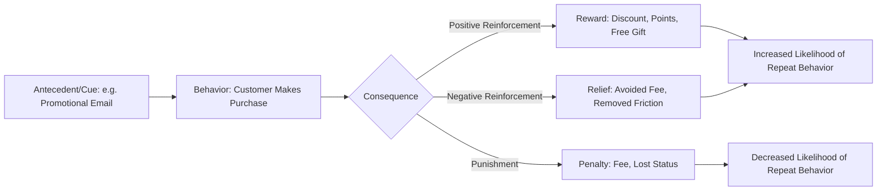

## Operant Conditioning and Reinforcement Schedules

### Definition and Theoretical Foundation

Operant conditioning, formalized primarily by B.F. Skinner, is a learning process in which the frequency of a voluntary behavior is shaped by the consequences that follow it. Unlike classical conditioning (which pairs stimuli to elicit automatic, involuntary responses), operant conditioning targets voluntary, goal-directed behaviors — such as purchasing, repeat visits, app usage, or brand switching — by manipulating what happens *after* the behavior occurs.

The foundational principle is the **Law of Effect** (originally from Thorndike, extended by Skinner): behaviors followed by satisfying consequences are more likely to be repeated, while behaviors followed by unsatisfying consequences are less likely to be repeated.

### Core Terminology

- **Reinforcement**: Any consequence that increases the likelihood of a behavior recurring
  - **Positive Reinforcement**: Adding a desirable stimulus after the behavior (e.g., giving a discount after a purchase)
  - **Negative Reinforcement**: Removing an aversive stimulus after the behavior (e.g., "stop worrying about running out of stock — subscribe and never run out")
- **Punishment**: Any consequence that decreases the likelihood of a behavior recurring
  - **Positive Punishment**: Adding an aversive stimulus (e.g., a fee for late payment)
  - **Negative Punishment**: Removing a desirable stimulus (e.g., losing loyalty points/status for inactivity)
- **Shaping**: Reinforcing successive approximations of a target behavior until the full behavior is learned (e.g., onboarding flows that reward small early actions to build toward full product adoption)
- **Extinction**: The gradual disappearance of a behavior when reinforcement is withdrawn (e.g., customers stop engaging with a loyalty app once rewards stop appearing)
- **Discriminative Stimulus**: A cue that signals reinforcement is available if the behavior is performed (e.g., a "Sale Ends Tonight" banner signaling that purchasing now will be rewarded with savings)

### Process Flow

### Reinforcement Schedules

Reinforcement schedules describe the timing and frequency rules governing when reinforcement is delivered. These schedules dramatically affect how quickly a behavior is learned and how resistant it is to extinction.

**Continuous Reinforcement**

- Every instance of the behavior is reinforced (e.g., every purchase earns cashback)
- Leads to fast learning/acquisition but is also fast to extinguish once reinforcement stops
- Best used in early-stage habit formation (e.g., onboarding, first-time customer incentives)

**Partial (Intermittent) Reinforcement**

Reinforcement is delivered only some of the time, based on either a count of responses (ratio) or the passage of time (interval), and either predictably (fixed) or unpredictably (variable).

| Schedule Type | Definition | Marketing Example | Behavioral Pattern |
| --- | --- | --- | --- |
| Fixed Ratio (FR) | Reinforcement after a fixed number of responses | "Buy 10 coffees, get the 11th free" (punch cards) | High response rate, brief pause after reward |
| Variable Ratio (VR) | Reinforcement after an unpredictable number of responses | Slot machines, gacha/loot boxes, "mystery discount" scratch cards, surprise upsells | Highest, most consistent response rate; highly resistant to extinction |
| Fixed Interval (FI) | Reinforcement after a fixed period of time, for the first response after that period | Monthly sales, seasonal clearance events | Response rate increases as the time approaches ("scalloping" pattern) |
| Variable Interval (VI) | Reinforcement after an unpredictable period of time | Random flash sales, surprise "you've been selected" emails | Steady, moderate response rate; resistant to extinction |

### Key Points

- **Variable Ratio schedules produce the strongest and most extinction-resistant behavior**, which is why gamified loyalty programs, loot boxes, and randomized reward mechanics are so effective (and why they draw regulatory and ethical scrutiny, particularly regarding gambling-like mechanics)
- **Continuous reinforcement is best for acquisition, not maintenance**: brands often start new customers on generous, predictable rewards, then shift to intermittent schedules once the behavior is established, to sustain it more cost-effectively and durably
- **Negative reinforcement is often confused with punishment**: negative reinforcement *increases* behavior by removing discomfort (e.g., "never miss a delivery again" subscription messaging), whereas punishment *decreases* behavior
- **Extinction bursts**: when reinforcement is suddenly withdrawn (e.g., discontinuing a loyalty program), behavior frequency or intensity may temporarily spike before declining — brands should anticipate a backlash period, not interpret it as a durable signal
- **Schedule switching**: transitioning customers from continuous to intermittent reinforcement should be done gradually to avoid triggering rapid extinction

### Practical Applications in Marketing

- **Loyalty Programs**: Points-based systems typically use fixed ratio schedules (spend $X, earn Y points); tiered/gamified programs often introduce variable ratio elements (random bonus point multipliers) to boost engagement
- **Gamification and Loot Mechanics**: Mobile apps and games use variable ratio reinforcement (randomized rewards, mystery boxes) to maximize engagement and time-on-app, directly modeled on slot-machine mechanics
- **Email and Push Notification Cadence**: Marketers use fixed interval campaigns (weekly newsletters) for predictable engagement, and variable interval campaigns (surprise flash sales) for sustained curiosity and higher open rates
- **Cashback and Rebate Programs**: Typically continuous reinforcement in early adoption phases to build the habit of using a specific payment method or platform
- **Referral Programs**: Reinforce the referring customer (positive reinforcement: reward for referral) and often the referred customer simultaneously (a dual-sided incentive structure), reinforcing both acquisition and advocacy behaviors
- **Free Trials and Freemium Models**: Structured negative reinforcement — removing the friction/cost of trying a product — to encourage adoption before switching to paid engagement
- **Checkout and Cart Abandonment Flows**: Discount codes triggered after cart abandonment function as intermittent (often near-fixed) reinforcement to recover lost sales

### Shaping in Customer Journey Design

Marketers use shaping to build complex end-behaviors (e.g., "become a repeat, high-LTV customer") by reinforcing incremental steps:

1. Reinforce account creation (small reward, e.g., 10% off first purchase)
2. Reinforce first purchase (e.g., free shipping)
3. Reinforce second purchase within a set window (e.g., loyalty points activation)
4. Reinforce referral behavior (e.g., give-and-get bonus)
5. Reinforce long-term retention (e.g., tiered status upgrade)

Each step approximates the final target behavior (habitual, loyal purchasing), with reinforcement calibrated to each stage rather than only rewarded at the final outcome.

### Reinforcement vs. Punishment Strategy Considerations

- Positive reinforcement is generally preferred in customer-facing marketing because punishment-based tactics (late fees, lost status, aggressive penalty messaging) can generate resentment, brand switching, or negative word-of-mouth [Inference: this preference reflects general consumer relationship management best practice rather than a universal rule, since punishment-based tactics like subscription cancellation fees are still commonly used in specific industries]
- Negative punishment (e.g., "use it or lose it" point expiration) is common because it creates urgency without directly penalizing the customer with a cost, though it can still generate frustration if poorly communicated

### Critiques and Boundary Conditions

- **Ethical Concerns with Variable Ratio Mechanics**: The resemblance between variable ratio reinforcement in gamified apps/loot boxes and gambling mechanics has drawn regulatory attention in several jurisdictions, particularly concerning minors and vulnerable populations
- **Diminishing Novelty**: Over-reliance on any single schedule can lead to habituation, where consumers become desensitized to formerly effective reinforcers, requiring marketers to periodically vary reward types and delivery
- **Overjustification Effect (related risk)**: Introducing strong external reinforcement (e.g., heavy discounting) for behavior that was previously intrinsically motivated (e.g., genuine brand affinity) can, in some cases, undermine intrinsic motivation once the external reward is removed [Inference: this effect is well-documented in psychology broadly, but its magnitude in specific commercial loyalty contexts can vary and is not universally observed]
- **Individual and Cultural Variation**: Sensitivity to different reinforcement types (monetary vs. status vs. social recognition) varies significantly by customer segment, requiring segmentation-aware reward design rather than one-size-fits-all schedules

### Related Topics

- Classical conditioning in advertising
- Gamification mechanics and loot box regulation
- Habit formation models (e.g., Hook Model, habit loops)
- Loyalty program design and tiered reward architecture
- Behavioral economics: variable reward and dopamine-driven engagement
- Extinction bursts and churn management
- Nudge theory and choice architecture
- Customer lifetime value (LTV) and reinforcement-driven retention strategy