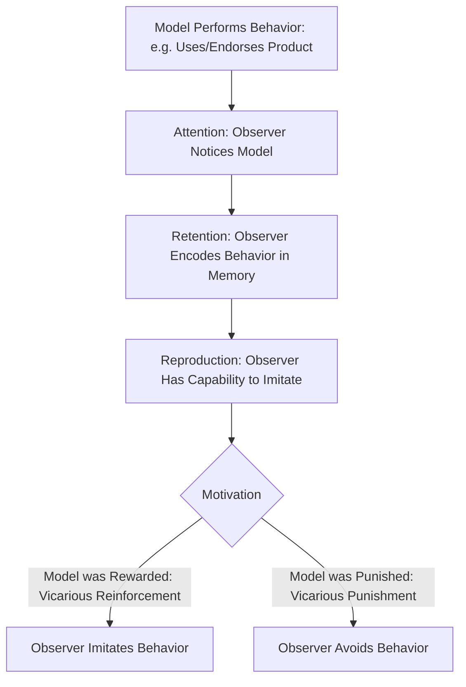

## Observational Learning and Social Modeling

### Definition and Theoretical Foundation

Observational learning, rooted in Albert Bandura's **Social Learning Theory** (later extended into Social Cognitive Theory), describes how individuals acquire new behaviors, attitudes, and preferences by watching others (models) and the consequences those models experience, without needing to personally perform the behavior or experience direct reinforcement themselves. This is often called **vicarious learning**, since reinforcement is experienced indirectly, through observation rather than personal consequence.

This theory departs from strict behaviorism (classical/operant conditioning) by incorporating cognitive processes — attention, memory, motivation — as mediators of learning, making it central to understanding how consumers learn brand preferences, product usage norms, and purchasing behaviors from others.

### Bandura's Bobo Doll Experiment (Foundational Study)

Bandura's classic studies demonstrated that children who observed an adult model behaving aggressively toward an inflatable doll were significantly more likely to imitate that aggression later, even without direct reinforcement — establishing that learning can occur purely through observation and that vicarious reinforcement (seeing the model rewarded or punished) influences whether the observed behavior is later performed.

### Core Component Processes (Bandura's Four-Stage Model)

Observational learning requires four sequential cognitive processes to translate observation into behavior:

1. **Attention**: The observer must notice and attend to the model and the behavior; attention is influenced by the model's attractiveness, credibility, similarity to the observer, and distinctiveness
2. **Retention**: The observer must encode and store the observed behavior in memory (symbolically, often via mental imagery or verbal labels) for later retrieval
3. **Reproduction (Motor Reproduction)**: The observer must possess the physical/cognitive capability to reproduce the behavior; in a marketing context, this maps to having the means, access, or skill to replicate the purchasing/usage behavior observed
4. **Motivation**: The observer must have a reason to perform the behavior, often driven by expected outcomes — this is where **vicarious reinforcement** (seeing the model rewarded) or **vicarious punishment** (seeing the model penalized) plays a decisive role

### Process Flow

### Key Points

- **Vicarious Reinforcement is central to advertising effectiveness**: showing a model being socially rewarded, admired, happier, or more successful after using a product increases the likelihood that viewers will imitate the purchase behavior, even without ever personally experiencing that outcome
- **Model Similarity Increases Imitation**: observers are more likely to imitate models who are perceived as similar to themselves in age, lifestyle, or identity — this underlies the effectiveness of "relatable" influencer marketing over purely aspirational celebrity marketing in many contexts [Inference: the relative effectiveness of similarity vs. aspirational distance is context- and product-category-dependent, and is an active area of applied marketing research rather than a fixed universal rule]
- **Model Credibility and Attractiveness**: high-status, attractive, or expert models capture more attention and are processed as more worth imitating, consistent with source credibility research in persuasion
- **Social Proof is a downstream application**: much of what is commonly labeled "social proof" in marketing (reviews, testimonials, "best-seller" labels, visible crowds) operates through the same observational learning and vicarious reinforcement mechanisms — observers infer that if many others engage in a behavior and appear satisfied, the behavior is safe or rewarding to imitate
- **No Direct Reinforcement Required**: unlike operant conditioning, the observer does not need to personally experience a consequence — this makes observational learning highly efficient for spreading behavior across large audiences via media, advertising, and social platforms
- **Behavior Can Be Learned but Not Performed**: learning and performance are distinct; an observer may learn a behavior through observation but not perform it until sufficiently motivated (e.g., a promotional trigger, price drop, or social occasion)

### Practical Applications in Marketing

- **Influencer Marketing**: Influencers function as models whose product use and visible enjoyment/reward (engagement, aspirational lifestyle, follower approval) vicariously reinforces the behavior for their audience
- **Testimonials and User-Generated Content (UGC)**: Real customers shown enjoying positive outcomes from a product serve as relatable models, increasing perceived attainability and imitation likelihood compared to overly polished, non-relatable spokespeople
- **Celebrity Endorsement**: Leverages high attention-capture (via attractiveness/status) to maximize the first stage (attention) of the observational learning process, often combined with vicarious reinforcement cues (e.g., showing the celebrity's social/professional success)
- **Unboxing and Demonstration Videos**: Provide clear behavioral modeling (retention-stage support) by explicitly showing how to use a product, reducing ambiguity and increasing the observer's confidence in their own reproduction capability
- **Social Proof Indicators**: "10,000 five-star reviews," "bestseller," visible customer counts, and crowd imagery all function as compressed, symbolic representations of many models being vicariously rewarded, streamlining the observational learning process at scale
- **Aspirational Lifestyle Advertising**: Luxury and lifestyle brands often use models who are similar enough to be aspirational-but-attainable, modeling both the product use and the socially rewarded outcome (admiration, status, romantic success)
- **Peer Modeling in Word-of-Mouth**: Friends and family act as especially high-credibility, high-similarity models, which is why peer recommendations and word-of-mouth marketing tend to strongly influence purchase decisions

### Example

A skincare brand features real customers (not professional models) on social media, each sharing a short video of their skincare routine along with visible before/after results and comments about feeling more confident (vicarious reinforcement: the model is rewarded with visible social/emotional benefit). Viewers who share similar skin concerns pay close attention (attention stage, driven by similarity), remember the specific product steps shown (retention), have easy access to purchase the same product (reproduction), and are motivated to buy because they observed the model being rewarded with a desirable outcome (motivation via vicarious reinforcement) — all without the viewer personally having tried the product first.

### Factors Affecting Strength of Observational Learning

- **Model Status and Expertise**: Higher perceived expertise or authority increases the weight given to the observed outcome, particularly in categories requiring trust (e.g., health, finance, technical products)
- **Number and Consistency of Models**: Observing multiple different models experiencing the same rewarded outcome (as in aggregated reviews or widespread UGC) tends to strengthen the learned association more than a single model, aligning with the diffusion-of-credibility principle in social proof
- **Emotional Salience of the Outcome**: Vicarious reinforcement tied to strong emotional payoffs (joy, relief, social approval, status elevation) is generally more motivating than neutral or mildly positive outcomes
- **Perceived Realism**: Observers weigh outcomes more heavily when they perceive the model's experience as authentic and unstaged, which partly explains the growing marketing shift toward UGC and "de-influencing" styled authenticity over polished traditional advertising [Unverified: the precise magnitude of this authenticity effect compared to traditional advertising varies across studies, platforms, and consumer segments]

### Critiques and Boundary Conditions

- **Distinguishing Correlation from Causation in Field Settings**: While lab studies (like Bandura's) demonstrate clear causal effects, real-world marketing environments involve many co-occurring influences (pricing, timing, competing messages), making it harder to isolate observational learning as the sole driver of a purchase decision
- **Saturation and Skepticism**: As consumers become more aware of influencer marketing and sponsored content, perceived model authenticity can decline, weakening the vicarious reinforcement effect — a driver behind disclosure regulations (e.g., FTC endorsement guidelines) and the rise of "authenticity" as a marketing value in itself
- **Ethical Considerations**: Modeling behaviors with negative externalities (e.g., excessive consumption, unrealistic body standards, financial risk-taking) raises ethical concerns, particularly when the audience includes minors or vulnerable populations, since observational learning does not require the observer's conscious critical evaluation of the modeled behavior
- **Cultural Variation**: The relative influence of aspirational vs. peer-similar models, and the categories in which vicarious reinforcement is most persuasive, can vary meaningfully across cultural contexts [Inference: cross-cultural variation in observational learning effects is a recognized area of cross-cultural consumer research, though specific effect sizes are study-dependent]

### Related Topics

- Classical conditioning in advertising
- Operant conditioning and reinforcement schedules
- Social proof and the psychology of conformity
- Source credibility and persuasion (ethos-based appeals)
- Influencer marketing and parasocial relationships
- Word-of-mouth and referral-driven marketing
- Self-efficacy theory and consumer confidence in product usage
- FTC endorsement guidelines and sponsored content disclosure