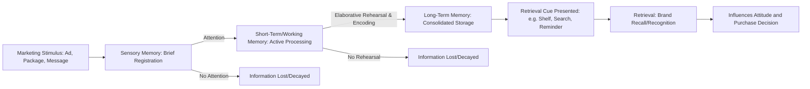

## Cognitive and Information-Processing Models of Learning

### Definition and Theoretical Foundation

Cognitive and information-processing models of learning treat the human mind as a system that actively encodes, stores, retrieves, and transforms information, in contrast to behaviorist models (classical/operant conditioning) that focus only on observable stimulus-response relationships. In a marketing context, these models explain how consumers notice, interpret, evaluate, and remember brand information, and how that internal processing shapes attitudes, recall, and purchase decisions — even without any explicit external reinforcement.

The dominant framework is the **multi-store (Atkinson-Shiffrin) memory model**, extended by later elaborations such as **Levels of Processing Theory** and **Schema Theory**, all of which describe learning as an active, structured transformation of incoming information rather than a passive stamping-in of associations.

### The Multi-Store Memory Model

Information flows through three theoretically distinct memory stores, each with different capacity and duration characteristics:

1. **Sensory Memory**: Very brief (milliseconds to ~1-2 seconds) raw sensory registration of a stimulus (e.g., a glimpsed billboard, a heard jingle); most information decays here unless attended to
2. **Short-Term/Working Memory**: Limited-capacity, active processing store (commonly cited capacity: roughly 4 to 7 chunks of information, per Miller's and later Cowan's research) where consumers consciously evaluate an ad, compare prices, or process a claim; duration without rehearsal is roughly 15-30 seconds
3. **Long-Term Memory (LTM)**: Theoretically unlimited-capacity, durable store where brand knowledge, past experiences, and learned associations are consolidated for extended retrieval; further divided into:
   - **Explicit (Declarative) Memory**: Consciously recallable facts and events
     - **Semantic Memory**: General brand knowledge and facts (e.g., "this brand is expensive")
     - **Episodic Memory**: Personal experiences with a brand (e.g., "I had a great experience with this brand's customer service last year")
   - **Implicit (Non-declarative) Memory**: Unconscious influences on behavior, including conditioned associations and procedural habits (e.g., automatically reaching for a familiar brand without conscious deliberation)

### Process Flow

### Key Constructs and Theories

**Levels of Processing Theory (Craik & Lockhart)**

- Proposes that memory durability depends on the depth of cognitive processing applied to information, not merely repetition or store location
- **Shallow processing** (structural/visual features, e.g., noting an ad's color scheme) produces weak, short-lived memory traces
- **Deep processing** (semantic, meaning-based elaboration, e.g., relating a product's benefit to one's own life) produces stronger, more durable and more retrievable memory traces
- Marketing implication: ads that prompt self-referential thinking or meaningful elaboration (e.g., "How would this product fit into your morning routine?") tend to be better remembered than purely attention-grabbing but shallow stimuli

**Schema Theory**

- A schema is a cognitive structure representing organized prior knowledge about a category, brand, or situation (e.g., a "fast food restaurant" schema, a "luxury brand" schema)
- New information is interpreted and encoded relative to existing schemas; information consistent with a schema is processed more easily (schema congruity), while moderately incongruent information can capture more attention and elaboration (up to a point), and highly incongruent information may be rejected or cause confusion
- Marketing implication: brand extensions and new product launches are evaluated by consumers against existing brand schemas, which is why "schema congruity" is a key consideration in brand extension strategy

**Elaboration Likelihood Model (ELM) — Cognitive Route Component**

- Distinguishes **central route processing** (careful, effortful evaluation of message arguments, occurring under high motivation and ability) from **peripheral route processing** (reliance on simple cues like source attractiveness or number of arguments, occurring under low motivation/ability)
- Central route processing produces more durable attitude change and stronger resistance to counter-persuasion, directly connecting information-processing depth to attitude durability

**Dual-Coding Theory (Paivio)**

- Proposes that information encoded both verbally and visually (e.g., a slogan paired with a distinctive image) creates two independent memory traces, improving retrieval likelihood compared to single-mode (verbal-only or visual-only) encoding
- Marketing implication: pairing a memorable tagline with a strong visual/logo produces more robust brand recall than either element alone

**Chunking**

- The process of grouping individual pieces of information into larger, meaningful units to overcome working memory capacity limits (e.g., a phone number formatted in three chunks rather than ten separate digits)
- Marketing implication: simplifying complex product information into a small number of memorable "chunks" or key benefit statements improves consumer retention of the message

### Key Points

- **Attention is the critical gateway**: information that fails to capture attention in sensory or working memory never reaches long-term storage, which is why advertisers prioritize attention-capturing techniques (novelty, contrast, motion, emotional salience) as a prerequisite for any downstream learning
- **Repetition alone is not sufficient for durable learning**: per Levels of Processing Theory, repetition without meaningful elaboration produces weak memory traces; effective learning requires the consumer to actively process the *meaning* of the message, not just be exposed to it repeatedly
- **Retrieval Cues Matter as Much as Encoding**: information stored in long-term memory is only useful if it can be retrieved at the moment of decision; marketers therefore design retrieval cues (distinctive packaging, point-of-sale reminders, consistent branding) to match how the information was originally encoded (encoding specificity principle)
- **Working Memory Limitations Constrain Message Complexity**: because working memory can only actively process a small number of chunks at once, overly complex or information-dense advertising risks cognitive overload, reducing comprehension and retention
- **Interference Effects**: new learning can disrupt retrieval of older, similar information (**retroactive interference**), and old learning can disrupt encoding of new, similar information (**proactive interference**) — both are relevant when brands operate in cluttered categories with many similar competitor messages
- **Consumers Actively Construct Meaning**: unlike behaviorist models where the consumer is a passive responder, cognitive models treat consumers as active interpreters who relate new brand information to existing knowledge structures (schemas), prior experiences, and goals

### Practical Applications in Marketing

- **Message Simplicity and Chunking**: Reducing product benefits to 2-3 memorable, chunked claims rather than exhaustive feature lists, respecting working memory constraints
- **Distinctive Brand Assets**: Consistent use of logos, colors, jingles, and taglines leverages dual-coding and provides stable retrieval cues that reconnect consumers to stored brand knowledge at the point of purchase
- **Self-Referencing Appeals**: Advertising copy that prompts consumers to relate the product to their own life or identity ("Imagine your mornings with...") encourages deep, elaborative processing, improving message durability
- **Schema-Consistent Positioning**: New products are often positioned to align with an existing, familiar category schema initially (to ease processing and acceptance), with differentiation introduced incrementally
- **Testimonial and Storytelling Formats**: Narrative-based advertising encourages deeper elaboration than simple feature-based claims, as stories require the consumer to build a mental model connecting characters, actions, and outcomes
- **In-Store and Point-of-Sale Cue Design**: Retail environments are designed to trigger retrieval of previously encoded advertising messages at the moment of decision, leveraging the encoding specificity principle
- **Simplified Comparison Tools**: Product comparison charts and simplified spec sheets reduce cognitive load, supporting working-memory-limited consumers in the consideration stage

### Example

A software company launches a productivity app and, instead of listing all 20 features in its ad, chunks the message into three benefit categories: "Save time," "Stay organized," "Work anywhere" (chunking, respecting working memory limits). The ad copy asks viewers to picture their own cluttered task list becoming organized (self-referential elaboration, deep processing), paired consistently with a distinctive blue checkmark logo and a short audio cue (dual coding). When the consumer later sees the same blue checkmark icon in an app store search (retrieval cue matching original encoding), the previously stored brand association is more easily retrieved, increasing the likelihood of recall and selection over a competitor.

### Factors Affecting Cognitive Learning Effectiveness

- **Motivation and Involvement**: Higher personal relevance or involvement with a product category increases the likelihood of central-route, deep processing, strengthening memory formation
- **Cognitive Load at Exposure**: Consumers processing an ad while multitasking or in a high-distraction environment (e.g., scrolling social media) have reduced working memory capacity available for encoding, generally producing shallower processing [Inference: the magnitude of this reduction varies by individual and context and is not precisely quantifiable as a universal rule]
- **Prior Knowledge and Schema Availability**: Consumers with more developed category knowledge can process new brand information more efficiently by fitting it into existing schemas, whereas category novices require more foundational, structurally simple messaging
- **Message-Medium Fit**: Information-dense messages are better suited to media allowing self-paced processing (print, web pages) versus fast-paced media (short video, audio) where working memory constraints are more restrictive

### Critiques and Boundary Conditions

- **Implicit vs. Explicit Memory Divergence**: A consumer may show behavioral evidence of learning (implicit memory, e.g., habitual brand selection) without being able to consciously recall or articulate why (explicit memory), which complicates survey-based marketing research that relies on self-reported recall
- **Overreliance on Laboratory-Derived Capacity Limits**: Specific numeric estimates of working memory capacity (e.g., "7 plus or minus 2") originate from controlled lab tasks and may not translate precisely to real-world, multimedia advertising environments [Unverified: exact working memory capacity under real-world marketing exposure conditions is difficult to benchmark precisely and is an active area of applied cognitive research]
- **Individual Differences**: Working memory capacity, processing speed, and prior schema development vary substantially across individuals and cultural contexts, limiting the precision of one-size-fits-all cognitive design principles
- **Interaction with Conditioning Models**: Cognitive/information-processing models are not mutually exclusive with classical/operant conditioning; most contemporary consumer behavior theory treats them as complementary explanations operating at different levels (conscious/deliberate vs. automatic/associative)

### Related Topics

- Classical conditioning in advertising
- Operant conditioning and reinforcement schedules
- Observational learning and social modeling
- Elaboration Likelihood Model and dual-route persuasion
- Memory retrieval cues and encoding specificity
- Schema congruity in brand extensions
- Cognitive load theory in advertising design
- Attention and perception in consumer information processing
- Implicit vs. explicit brand memory measurement techniques