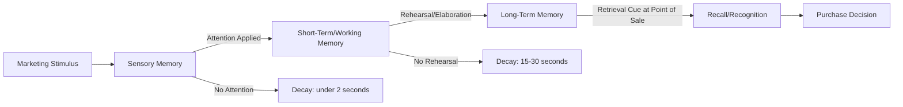

## Memory Systems: Sensory, Working, and Long-Term

### Definition and Theoretical Foundation

Memory systems theory describes the distinct stages and structures through which marketing information passes as it moves from initial perception to durable storage and eventual retrieval at the moment of purchase decision. The foundational framework is the **Multi-Store Model** (Atkinson & Shiffrin, 1968), which proposes three structurally and functionally distinct memory stores — sensory, short-term/working, and long-term — each governed by different capacity limits, durations, and encoding processes. Understanding these systems is essential to designing marketing stimuli that are not only noticed, but retained and retrievable at the point of decision.

### The Three-Store Architecture

### Sensory Memory

**Definition**: The initial, extremely brief registration of raw sensory input from a marketing stimulus, before any conscious attention is applied.

**Key Characteristics**:

- **Duration**: Roughly 200-500 milliseconds for iconic (visual) memory; slightly longer, up to approximately 2-4 seconds, for echoic (auditory) memory
- **Capacity**: Very high, capturing a broad but unprocessed "snapshot" of the sensory field
- **Function**: Acts as a buffer allowing the brain a brief window to select which stimuli warrant further attention; most sensory information decays and is lost unless attended to almost immediately

**Marketing Relevance**:

- Sensory memory explains why the very first moments of an ad, a billboard glimpsed while driving, or a package seen briefly on a shelf must be visually and auditorily distinctive enough to capture attention before the information decays
- **Iconic memory** underlies the importance of strong, instantly recognizable visual branding (color, shape, logo silhouette) that can be registered even in brief exposure
- **Echoic memory** underlies the importance of a short, distinctive sonic logo or jingle opening, since auditory sensory traces persist slightly longer than visual ones, offering marginally more processing opportunity

### Short-Term / Working Memory

**Definition**: The active, limited-capacity system where attended information is consciously held and manipulated — evaluating a claim, comparing prices, or processing an ad's message.

**Key Characteristics**:

- **Duration**: Approximately 15-30 seconds without active rehearsal
- **Capacity**: Classically estimated at 7 ± 2 chunks of information (Miller, 1956); later research (Cowan, 2001) suggests a more conservative estimate of approximately 4 chunks under conditions that prevent rehearsal strategies
- **Working Memory (Baddeley & Hitch model)**: A more dynamic elaboration of short-term memory, comprising:
  - **Phonological Loop**: Handles verbal and auditory information (e.g., processing a spoken tagline or jingle lyrics)
  - **Visuospatial Sketchpad**: Handles visual and spatial information (e.g., processing package layout, ad imagery)
  - **Central Executive**: Allocates attention and coordinates between subsystems, managing which stimuli receive continued processing
  - **Episodic Buffer**: Integrates information from the loop, sketchpad, and long-term memory into a coherent, temporary representation

**Marketing Relevance**:

- Because working memory capacity is limited, advertising messages with too many simultaneous claims risk **cognitive overload**, reducing comprehension and the likelihood that any single claim is successfully processed
- **Chunking** product information into a small number of memorable groups (e.g., three core benefits rather than ten features) respects working memory limits and improves the odds of successful encoding
- Multimedia ads that engage both the phonological loop (voiceover/jingle) and visuospatial sketchpad (visuals) simultaneously, without exceeding combined capacity, can improve processing efficiency (related to **dual-coding theory**)
- Information not rehearsed or elaborated upon within working memory is lost before it can transfer to long-term storage — this is why simple exposure/repetition without meaningful engagement is often insufficient for durable brand learning

### Long-Term Memory (LTM)

**Definition**: The durable, theoretically unlimited-capacity store where consolidated brand knowledge, associations, and experiences are retained over extended periods, from days to a lifetime.

**Key Characteristics**:

- **Duration**: Potentially indefinite, subject to interference, decay, and retrieval failure over time
- **Capacity**: No firmly established upper limit
- **Consolidation**: The process by which information is stabilized and integrated into long-term storage, typically dependent on rehearsal, elaboration, sleep, and emotional salience during encoding

**Subdivisions of Long-Term Memory**:

| Type | Category | Description | Marketing Example |
| --- | --- | --- | --- |
| Explicit (Declarative) | Semantic | General factual brand knowledge | "This brand is eco-friendly" |
| Explicit (Declarative) | Episodic | Personal experiences with a brand | "I got great service from them last year" |
| Implicit (Non-declarative) | Procedural | Learned habitual actions | Automatically reaching for a familiar brand |
| Implicit (Non-declarative) | Associative/Conditioned | Learned emotional/evaluative associations | Feeling positive toward a brand due to prior ad pairing |

**Marketing Relevance**:

- **Semantic memory** underlies brand knowledge structures (schemas) that consumers use to categorize and evaluate products, forming the basis for brand positioning strategy
- **Episodic memory** underlies the power of direct customer experience (service interactions, product usage) as a particularly durable and emotionally weighted form of brand learning, often outweighing advertising-based learning
- **Implicit memory** explains why consumers can exhibit strong brand preference or habitual purchase behavior without being able to consciously articulate why — a key reason self-reported survey data can diverge from actual purchase behavior
- **Retrieval cues** designed to match the original encoding context (encoding specificity principle) — such as consistent packaging, in-store branding, and consistent slogans — increase the likelihood that stored long-term brand knowledge is successfully retrieved at the moment of purchase

### Key Points

- **Information must pass through all three stores sequentially** (in the classical model) to become durable long-term brand knowledge: unattended sensory information is lost before ever reaching working memory, and unrehearsed working memory content is lost before consolidation into long-term memory
- **Attention is the primary gate** between sensory and working memory, making attention-capture (novelty, contrast, motion, emotional salience) a prerequisite — but not sufficient condition — for learning
- **Elaboration is the primary gate** between working and long-term memory: deeper, meaning-based processing (per Levels of Processing Theory) produces more durable long-term traces than shallow, repetition-only exposure
- **Retrieval failure is common even when information is stored**: durable long-term memories can fail to be retrieved if appropriate cues are absent at the decision moment, which is why consistent, recognizable branding at the point of sale is critical even for well-established brands
- **Interference disrupts memory across stores**: similar competing messages (e.g., cluttered advertising categories with many similar claims) can cause proactive interference (old learning disrupts new encoding) or retroactive interference (new learning disrupts retrieval of older information)
- **Emotional salience enhances consolidation**: emotionally engaging content is generally more likely to be successfully consolidated into durable long-term memory than emotionally neutral content, consistent with broader psychological research on emotional memory enhancement

### Practical Applications in Marketing

- **Distinctive Sensory Branding**: Strong, instantly recognizable visual/audio cues designed to survive the extremely brief sensory memory window and capture attention
- **Message Simplification (Chunking)**: Limiting core ad claims to 2-4 chunked benefit statements to respect working memory capacity constraints
- **Repetition Combined with Variation**: Repeated exposure across a campaign, varied in execution but consistent in core message/branding, supports both working memory processing (via multiple exposure opportunities) and long-term consolidation (via meaningful engagement across different contexts)
- **Point-of-Sale Retrieval Cue Design**: Ensuring packaging, shelf placement, and in-store signage closely match previously encoded advertising cues, leveraging the encoding specificity principle to bridge stored long-term knowledge to the purchase moment
- **Emotional and Narrative Advertising**: Story-based and emotionally engaging ad formats support deeper elaboration and stronger consolidation into long-term memory compared to purely factual, feature-based messaging
- **Multisensory Campaigns**: Coordinated use of visual, auditory, and even tactile/olfactory cues (where applicable, e.g., in-store scent marketing) can create multiple, mutually reinforcing retrieval pathways into long-term memory

### Example

A beverage brand runs a TV ad featuring a distinctive bottle silhouette (captured in sensory/iconic memory even during a brief glance), paired with a short jingle (echoic memory) and three chunked benefit claims — "refreshing," "low sugar," "locally sourced" (respecting working memory capacity). The ad tells a brief relatable story of friends reconnecting over the drink (emotional salience, deep processing, aiding consolidation into long-term episodic-adjacent memory). Months later, the consumer encounters the same bottle silhouette on a store shelf (a retrieval cue matching original sensory encoding), which successfully triggers recall of the stored brand association and the earlier positive emotional response, influencing the purchase decision.

### Critiques and Boundary Conditions

- **Sequential Model Is a Simplification**: While the classical three-store model remains pedagogically useful, later research (e.g., Baddeley's working memory model, levels-of-processing approaches) suggests memory processes are more interactive and less strictly linear/sequential than the original 1968 model implies
- **Individual Variability**: Working memory capacity, attentional control, and consolidation efficiency vary meaningfully across individuals, ages, and cognitive states (e.g., fatigue, distraction), limiting the precision of universal capacity estimates in real-world marketing contexts [Inference: exact real-world capacity and consolidation rates under naturalistic marketing exposure are difficult to benchmark precisely and vary by study and context]
- **Measurement Challenges**: Explicit recall/recognition tests used in marketing research may not capture implicit memory effects that still influence purchase behavior, meaning traditional ad recall metrics can understate a campaign's true long-term memory impact
- **Interaction with Conditioning and Observational Learning**: Memory systems theory operates alongside, rather than in place of, classical/operant conditioning and observational learning — most contemporary models treat these as complementary explanations addressing different aspects (structural storage vs. associative learning vs. social acquisition) of how consumers learn about brands

### Related Topics

- Cognitive and information-processing models of learning
- Classical conditioning in advertising
- Levels of Processing Theory and depth of encoding
- Encoding specificity and retrieval cue design
- Dual-coding theory and multisensory branding
- Implicit vs. explicit brand memory measurement
- Cognitive load and message simplification in advertising
- Emotional advertising and memory consolidation
- Point-of-sale cue design and shelf branding strategy