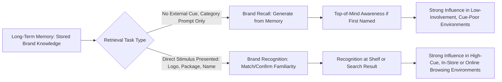

## Brand Recall Versus Brand Recognition

### Definition and Theoretical Foundation

Brand recall and brand recognition are the two primary dimensions of **brand awareness**, representing distinct retrieval processes from long-term memory that differ in the amount of retrieval support (cueing) provided at the moment of measurement or decision. Both are central to understanding how effectively a marketing campaign has embedded brand knowledge into consumer memory, and each favors different marketing strategies depending on the purchase context.

### Core Definitions

- **Brand Recall**: The ability to retrieve a brand from memory **without** external cues, when prompted only by a product category or need state (e.g., "name a soft drink brand" or "what brand comes to mind when you think of running shoes?"). This is an **unaided**, generative retrieval process.
- **Brand Recognition**: The ability to correctly identify a brand as previously encountered **when presented with it directly** (e.g., seeing a logo, package, or name on a list and confirming familiarity). This is an **aided**, recognition-based retrieval process requiring only a match/familiarity judgment rather than active generation.

### The Recall-Recognition Spectrum

### Key Points

- **Recognition is generally easier than recall**: because recognition only requires a familiarity judgment against a directly presented stimulus, it typically requires a weaker memory trace than recall, which requires active, cue-free generation from memory — this is a robust and well-established finding in memory research
- **Different retrieval mechanisms, different marketing value**: recall is more valuable in purchase contexts where the consumer must generate options themselves without seeing brands directly (e.g., asking a friend for a restaurant recommendation, deciding what brand to search for online); recognition is more valuable in contexts where brands are directly presented to the consumer at the decision point (e.g., a supermarket shelf, an e-commerce results page)
- **Top-of-Mind Awareness (TOMA)**: The specific brand recalled *first* within a category, representing the strongest form of unaided recall and typically the strongest predictor of purchase likelihood in low-involvement categories
- **Aided vs. Unaided Awareness Measurement**: Market research distinguishes **unaided awareness** (measuring recall, "what brands of X can you name?") from **aided awareness** (measuring recognition, "have you heard of Brand X?" with the brand name/logo shown) — aided awareness scores are typically higher than unaided scores for the same brand, since recognition is the less demanding retrieval task
- **The Evoked Set (Consideration Set)**: In categories relying heavily on recall, consumers typically generate only a small subset of known brands (the evoked/consideration set, often just 3-5 brands) when making a decision; brands outside this set, even if recognized when shown, are far less likely to be purchased
- **Both Dimensions Draw on the Same Underlying Memory Trace, but Measure It Differently**: strengthening brand memory (through repetition, distinctiveness, elaboration) generally improves both metrics, but a brand can score disproportionately higher on one dimension than the other depending on media strategy and distinctiveness of assets

### Factors That Favor Recall Development

- **Distinctive, Repeatable Category Associations**: Advertising that consistently links the brand to the product category itself (e.g., strongly associating a brand name with "the category leader" concept) strengthens the category-to-brand retrieval pathway needed for recall
- **High Share of Voice**: Greater relative advertising presence within a category increases the likelihood of being generated first or early when a consumer mentally searches the category
- **Verbal/Semantic Reinforcement**: Repeated, clear verbal articulation of the brand name (rather than reliance on visual-only branding) strengthens the semantic memory pathway required for cue-free generation
- **Simplicity and Memorability of Brand Name**: Short, distinctive, easily pronounceable brand names are generally more readily recalled than long or complex names [Inference: while this pattern is broadly supported in branding research, the magnitude of the effect varies by category and cultural/linguistic context]

### Factors That Favor Recognition Development

- **Distinctive Visual and Sensory Assets**: Strong, consistent packaging design, color, logo shape, and other sensory brand assets support rapid recognition even with minimal conscious processing
- **In-Store and Point-of-Sale Presence**: Since recognition relies on direct stimulus presentation, consistent shelf presence and packaging visibility reinforce recognition-based retrieval more than recall
- **High Exposure Frequency in Visually Rich Media**: Media formats emphasizing strong visual repetition (outdoor advertising, packaging, digital display ads) tend to build recognition more efficiently than recall, since they reinforce visual familiarity without requiring cue-free generation
- **Mere Exposure Effect**: Repeated passive exposure to a stimulus, even without deep processing, reliably increases recognition-based familiarity and liking, more so than it reliably improves unaided recall

### Practical Applications in Marketing

- **Category Leader / Challenger Strategy**: Market leaders with high recall (top-of-mind status) often benefit from reinforcing that recall dominance, while challenger brands with lower recall frequently prioritize recognition-building strategies (distinctive packaging, in-store visibility) to compete effectively at the point of sale, even without leading unaided recall
- **Media Channel Selection**: Brands prioritizing recall-building often invest more heavily in broad-reach, repetition-friendly channels (broadcast, audio) with strong verbal branding; brands prioritizing recognition often invest more in visually persistent channels (packaging design, retail presence, programmatic display retargeting)
- **New Product Launches**: Early-stage campaigns often prioritize recognition-building (ensuring the product is identifiable when encountered) before layering in recall-building efforts (ensuring the product is spontaneously generated as a category option)
- **E-commerce and Search Behavior**: Online shopping environments blend both dimensions — search behavior often depends on recall (typing a remembered brand name), while browsing/comparison behavior depends heavily on recognition (visually identifying a familiar brand among search results)
- **Tracking Studies and Brand Health Metrics**: Marketing research routinely measures both unaided recall and aided recognition as complementary KPIs, since a gap between the two (e.g., high recognition but low recall) can reveal specific strategic weaknesses, such as strong visual assets but weak category association

### Example

Two competing coffee brands are both well-established. Brand A has heavily invested in broad radio and podcast advertising with a distinctive, frequently repeated brand name and tagline; consumers surveyed are highly likely to name Brand A unaided when asked "what coffee brands come to mind?" (strong recall, high TOMA). Brand B has invested primarily in striking, consistent packaging design and extensive retail shelf placement; while fewer consumers spontaneously name Brand B unaided, when shown the packaging in-store or in a list, recognition rates are very high, and Brand B performs strongly in in-store purchase decisions where the product is directly visible (strong recognition, weaker recall). Each brand's strategy is well-matched to a different retrieval context relevant to its predominant sales channel.

### Measurement Methods

- **Unaided Recall Testing**: Open-ended survey questions asking respondents to name brands within a category, often measuring first-mentioned (TOMA), total recall, and recall order
- **Aided Recognition Testing**: Presenting a list of brand names, logos, or packaging images and asking respondents to indicate which they have heard of or seen before
- **Day-After Recall (DAR) Testing**: A specific advertising research method measuring what proportion of exposed audience members can recall specific ad content the day after exposure, historically used to estimate advertising memorability [Unverified: the precise predictive validity of DAR scores for actual sales outcomes has been debated in advertising effectiveness research and varies by study]
- **Implicit Measures**: Reaction-time-based and other indirect measurement techniques are increasingly used to capture recognition-related brand associations that may not surface in explicit self-report measures

### Critiques and Boundary Conditions

- **Self-Report Limitations**: Both recall and recognition are typically measured via self-report, which can be influenced by social desirability, question wording, and the specific competitive set presented, introducing measurement variability across studies
- **Recall and Recognition Are Not Perfectly Correlated with Purchase**: high awareness on either dimension does not guarantee purchase, since attitude, price sensitivity, availability, and situational factors also strongly influence the final decision
- **Category Dependency**: The relative importance of recall versus recognition varies significantly by category and purchase context — high-involvement, considered purchases (e.g., cars, financial services) often rely more heavily on recall-driven consideration sets, while low-involvement, shelf-based purchases (e.g., packaged goods) often rely more heavily on recognition at the point of sale [Inference: this categorical distinction is a widely used heuristic in marketing practice, though the precise boundary varies by specific product and consumer segment]

### Related Topics

- Memory systems: sensory, working, and long-term
- Cognitive and information-processing models of learning
- Top-of-mind awareness and the evoked/consideration set
- Mere exposure effect and repetition-based familiarity
- Distinctive brand assets and visual branding strategy
- Encoding specificity and retrieval cue design
- Brand equity measurement frameworks (e.g., Aaker, Keller)
- Share of voice and media strategy for awareness building