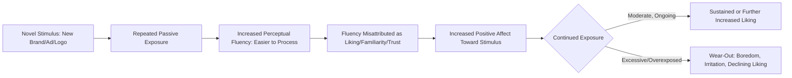

## The Mere Exposure Effect and Repetition

### Definition and Theoretical Foundation

The mere exposure effect, first systematically documented by Robert Zajonc (1968), describes the psychological phenomenon whereby repeated, passive exposure to a stimulus is sufficient to increase an individual's preference or liking for that stimulus, even in the complete absence of conscious recognition, reinforcement, or reasoned evaluation. In marketing, this principle explains why simple, repeated exposure to a brand, name, jingle, or logo — even without persuasive argumentation — can measurably increase consumer liking and preference over time.

Critically, the effect does not require the stimulus to be consciously recalled or even consciously perceived; studies using subliminal exposure have demonstrated preference increases even when participants could not explicitly recognize having seen the stimulus before, suggesting the effect operates substantially through implicit, low-effort processing rather than deliberate evaluation.

### Core Mechanism

$$\text{Liking} \propto f(\text{Exposure Frequency})$$

The relationship is generally characterized as an **inverted-U shape** rather than a strictly linear one: liking increases with repeated exposure up to a point, after which additional exposure can lead to boredom, irritation, or **wear-out**, reducing or reversing the positive effect.

### Process Flow

### Key Theoretical Explanations

- **Perceptual Fluency Theory**: The leading explanation holds that repeated exposure increases the ease and speed with which the brain processes a stimulus (**processing fluency**); this increased fluency is then misattributed by the observer as a positive feeling — a sense of familiarity, comfort, or "rightness" — even though the actual source of the good feeling is simply the ease of processing, not any inherent quality of the stimulus
- **Uncertainty Reduction**: Some theorists propose that unfamiliar stimuli trigger a mild sense of uncertainty or wariness (an evolutionary caution toward the unknown), which diminishes with repeated safe exposure, resulting in increased comfort and preference
- **Subliminal and Non-Conscious Processing**: Because the effect has been demonstrated even when participants cannot consciously recall prior exposure, it is understood to operate substantially through implicit memory systems rather than requiring explicit recognition or evaluative reasoning

### Key Points

- **Repetition alone can build preference without persuasion**: unlike traditional persuasion models requiring argument quality or emotional appeal, mere exposure demonstrates that preference can increase through repetition alone, independent of message content quality
- **Effect strength diminishes with excessive repetition (Wear-Out)**: the relationship between exposure frequency and liking is not indefinitely linear; after an optimal exposure range, additional repetition frequently leads to diminishing returns or outright irritation, sometimes called **advertising wear-out** or **advertising fatigue** [Inference: the precise number of exposures at which wear-out begins varies significantly by ad creative, media context, and audience, and is not governed by a fixed universal threshold]
- **Effect is Stronger for Initially Neutral or Mildly Positive Stimuli**: mere exposure reliably increases liking for stimuli that are neutral or mildly positive at first encounter; it is less reliable, and can sometimes backfire, for stimuli that are initially strongly disliked, where repetition may simply reinforce the negative reaction instead
- **Works Best Under Low Cognitive Elaboration**: the effect is most robust in low-involvement contexts, where consumers are not actively scrutinizing or critically evaluating the stimulus — consistent with its classification as a peripheral-route (rather than central-route) influence in dual-process persuasion models
- **Distinct From, But Complementary To, Classical Conditioning**: while classical conditioning requires pairing a neutral stimulus with an already-positive unconditioned stimulus, mere exposure requires no such pairing — repetition of the stimulus alone, with no explicit associated reward, is sufficient to shift preference
- **Distinctiveness Interacts with Repetition**: highly familiar, prototypical stimuli may benefit less from additional repetition (already near-ceiling fluency), while novel or distinctive stimuli often show the steepest preference gains from initial repeated exposures

### Practical Applications in Marketing

- **Brand Name and Logo Repetition**: Consistent, frequent display of brand names and logos across touchpoints (packaging, advertising, sponsorships) builds preference through fluency-driven familiarity, independent of explicit product claims
- **Media Frequency Planning**: Media planning frequently targets an "effective frequency" range (a commonly cited historical heuristic being approximately three exposures as a minimum threshold for initial impact, though this figure has been extensively debated and revised in later research) to maximize preference gains from repetition while managing budget efficiency [Unverified: specific effective-frequency numbers are contested in academic and industry literature and vary substantially by media context, message complexity, and category]
- **Retargeting and Programmatic Advertising**: Digital retargeting campaigns that repeatedly display the same brand or product to a previously exposed audience leverage mere exposure to build familiarity and preference over the course of a browsing/consideration journey
- **Sponsorships and Naming Rights**: Long-term, repeated brand visibility through sponsorships (e.g., stadium naming rights, recurring event sponsorship) builds preference through sustained passive exposure, even among audiences not actively attending to the sponsorship message
- **Packaging Consistency**: Maintaining consistent packaging design over long periods allows cumulative exposure benefits to compound, whereas frequent redesigns can reset accumulated fluency and familiarity gains
- **Jingles and Sonic Branding**: Repeated use of a consistent audio signature across a long campaign period builds auditory fluency and associated liking, even among consumers who could not consciously recall having heard the jingle before

### Example

A financial services company launches an unfamiliar new brand name into a crowded market. Rather than relying solely on argument-heavy advertising about its rates or services, the company runs a high-frequency awareness campaign consisting of short, simple ads featuring the brand name and logo repeated across transit ads, digital banners, and short pre-roll video spots over several months. Even among consumers who cannot recall the content of any specific ad, survey data shows increased self-reported trust and preference for the brand compared to equally qualified but less-exposed competitors — an outcome consistent with fluency-driven mere exposure effects rather than deliberate evaluation of the company's actual service quality.

### Factors Moderating the Effect

- **Initial Valence of the Stimulus**: Positive or neutral initial impressions are generally strengthened by repetition; strongly negative initial impressions are less reliably improved and can sometimes be reinforced instead
- **Stimulus Complexity**: Moderately complex stimuli often show a broader effective repetition range before wear-out, since there is more content to process freshly on each exposure, compared to very simple stimuli that reach fluency ceiling quickly
- **Exposure Variation ("Repetition with Variation")**: Advertisers frequently vary creative execution while holding core brand elements (name, logo, tagline) constant across a campaign, which can extend the effective repetition range by introducing enough novelty to sustain attention and delay wear-out, while still reinforcing the consistent core brand cues
- **Audience Involvement Level**: Highly involved consumers who scrutinize each exposure critically are somewhat less susceptible to pure fluency-driven preference shifts compared to low-involvement audiences processing the stimulus more passively

### Critiques and Boundary Conditions

- **Ecological Validity of Lab Findings**: Much of the foundational mere exposure research was conducted using simple, decontextualized stimuli (shapes, unfamiliar words, faces) under controlled repetition schedules; the direct translatability of exact effect sizes to complex, real-world advertising exposure patterns is not precisely established [Unverified: exact effect magnitudes in applied marketing contexts vary by study and are difficult to isolate from co-occurring marketing variables]
- **Overexposure Risk in Modern High-Frequency Media Environments**: The proliferation of digital retargeting and high-frequency programmatic advertising has heightened practical concern about wear-out and consumer irritation, making frequency capping (limiting the number of times an individual sees a given ad) a standard risk-mitigation practice in digital media planning
- **Difficult to Isolate from Co-Occurring Effects**: In real-world campaigns, mere exposure effects often occur simultaneously with classical conditioning (positive emotional pairings), social proof, and message-based persuasion, making it methodologically challenging to attribute preference shifts to repetition alone outside of controlled experimental conditions
- **Ethical Considerations**: Because the effect operates independent of conscious evaluation or reasoned argument, and can function even via subliminal exposure, its use raises similar ethical considerations to other non-conscious persuasion techniques, particularly regarding transparency and consumer autonomy in decision-making

### Related Topics

- Classical conditioning in advertising
- Processing fluency and its role in judgment and decision-making
- Brand recall versus brand recognition
- Advertising wear-out and frequency capping strategy
- Elaboration Likelihood Model (central vs. peripheral persuasion routes)
- Memory systems: sensory, working, and long-term
- Distinctive brand assets and consistent visual identity
- Subliminal advertising and implicit persuasion ethics