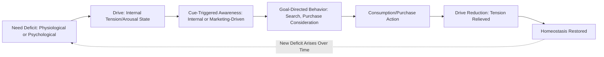

## Drive Theory and Need Arousal

### Definition and Theoretical Foundation

Drive theory, rooted in early 20th-century psychology (notably Clark Hull's work) and later adapted into consumer behavior research, proposes that unmet physiological or psychological needs create an internal state of tension called a **drive**, which motivates behavior aimed at reducing that tension and restoring equilibrium (**homeostasis**). In a marketing context, drive theory explains why consumers actively seek out products and services: consumption is understood as a **drive-reduction behavior**, where purchasing and using a product resolves the discomfort of an aroused, unmet need.

This framework is foundational to understanding **need arousal** — the process by which a latent need becomes an active, felt state that motivates goal-directed behavior, often triggered or intensified by internal cues (hunger, discomfort) or external marketing stimuli (advertising, in-store cues, social triggers).

### Core Mechanism

$$\text{Need Deficit} \rightarrow \text{Drive (Tension State)} \rightarrow \text{Goal-Directed Behavior} \rightarrow \text{Drive Reduction (Satisfaction)}$$

The strength of the drive is generally proportional to the magnitude of the perceived deficit and the felt urgency of restoring balance, though this relationship is moderated by individual differences, situational cues, and the availability of a clear behavioral path to resolution.

### Process Flow

### Key Constructs

- **Drive**: An aroused internal state of tension resulting from an unmet need, functioning as the motivational energy that pushes an organism toward action
- **Homeostasis**: The physiological and psychological equilibrium state that an organism is motivated to maintain or restore; drives arise precisely when this equilibrium is disrupted
- **Need Arousal**: The activation of a previously dormant or latent need into a consciously or subconsciously felt state requiring resolution; arousal can originate from internal physiological cues (e.g., hunger) or external environmental/marketing cues (e.g., the smell of food, an advertisement depicting a desirable lifestyle)
- **Drive Reduction**: The satisfaction achieved through goal-directed behavior that resolves the tension state, reinforcing the behavior that produced the resolution (connecting drive theory to reinforcement learning principles)
- **Primary (Biogenic) Drives**: Innate, physiologically-based needs (hunger, thirst, sleep, comfort, sex) requiring no learning to become motivating
- **Secondary (Psychogenic) Drives**: Learned, socially and psychologically based needs (status, achievement, belonging, self-esteem) that acquire motivational force through socialization and experience, and are particularly central to marketing since most branded products address psychogenic rather than purely biogenic needs

### Key Points

- **Drive intensity influences behavior intensity, not just direction**: stronger drive states tend to produce more vigorous, urgent, and less deliberative goal-directed behavior, which is relevant to understanding impulse purchasing under conditions of high need arousal (e.g., hunger while grocery shopping)
- **Cue-Triggered Arousal is central to marketing strategy**: much of advertising functions not by creating entirely new needs, but by **arousing latent or dormant needs** that already exist within the consumer (e.g., a latent desire for social approval, made salient by advertising imagery depicting social success)
- **Drive Reduction Reinforces Behavior**: because successfully reducing a drive state is inherently rewarding, drive theory connects directly to operant conditioning — behaviors (including specific brand choices) that successfully reduce a drive are more likely to be repeated when the same need arises again
- **Not All Consumption is Driven by Deficit**: critics note that drive theory, in its classical form, struggles to explain consumption driven by curiosity, novelty-seeking, or growth-oriented motives that are not clearly tied to resolving a deficit state — a limitation that led to complementary frameworks like optimal stimulation level theory and hierarchical need models
- **Distinction from Incentive Motivation**: drive theory emphasizes internal push-based motivation (tension reduction), whereas incentive theory emphasizes external pull-based motivation (the attractiveness of an external goal object); most contemporary consumer behavior models treat these as complementary, with marketing stimuli often functioning to both arouse internal drives and simultaneously present an attractive incentive/goal object

### Practical Applications in Marketing

- **Need Arousal Through Advertising Cues**: Food advertising frequently uses visual and sometimes olfactory cues (imagery of appetizing food) to arouse the hunger drive even among viewers who were not previously consciously hungry, a well-documented technique in food marketing
- **Scarcity and Urgency Messaging**: Marketing tactics that intensify felt tension (e.g., "only 2 left in stock," limited-time offers) function by amplifying the perceived urgency of drive resolution, encouraging faster, less deliberative purchase behavior
- **Status and Belonging-Driven Positioning**: Luxury and social products are frequently positioned to arouse secondary psychogenic drives (status anxiety, fear of social exclusion), motivating consumption as a means of drive reduction (achieving perceived status or belonging)
- **Problem-Recognition Advertising**: Many ad campaigns are structured explicitly around arousing awareness of an unmet need or problem (a core stage in the classic consumer decision-making process) before presenting the product as the drive-reducing solution
- **In-Store Sensory Triggers**: Retail environments often use sensory cues (bakery smells near store entrances, appealing product displays) to intentionally arouse primary drives in-context, increasing the likelihood of impulse purchase behavior
- **Fear Appeals**: Advertising that arouses anxiety-based drives (health risks, financial insecurity, social rejection) followed by a clear drive-reducing solution (the advertised product/service) is a long-standing persuasion technique, though effectiveness depends heavily on perceived efficacy of the proposed solution (per the Extended Parallel Process Model in fear appeal research)

### Example

A consumer is not consciously thinking about snacking while browsing social media. An ad appears showing a close-up, appetizing image of a chocolate bar with sensory-rich visual cues (melting texture, rich color). This external stimulus arouses a latent hunger drive that was not previously salient (need arousal via marketing cue), creating an internal tension state. The consumer, now experiencing this aroused drive, searches for and purchases the snack shortly afterward (goal-directed behavior), and the act of eating it resolves the tension (drive reduction), reinforcing the association between that specific brand and successful need resolution for future occasions.

### Drive Theory in Relation to Broader Motivation Frameworks

- **Maslow's Hierarchy of Needs (complementary framework)**: While drive theory explains the *mechanism* of tension-driven motivation, Maslow's hierarchy provides a *structural* framework for categorizing which needs (physiological, safety, belonging, esteem, self-actualization) are being aroused and prioritized at a given time, and is often used alongside drive theory in applied marketing strategy
- **Optimal Stimulation Level Theory**: Developed partly in response to drive theory's limitations, this framework proposes that individuals are motivated not only to reduce excessive tension/arousal but also to seek an *optimal* level of stimulation, explaining novelty-seeking and variety-seeking consumer behaviors that classical drive-reduction models struggle to account for
- **Involvement Theory**: The intensity of an aroused drive is closely related to the concept of consumer involvement, with highly aroused drive states typically corresponding to higher situational involvement and more urgent information search/purchase behavior

### Critiques and Boundary Conditions

- **Explains Deficit-Driven, Not Growth-Driven, Consumption Well**: classical drive theory is most robust in explaining consumption tied to resolving a clear deficit (hunger, discomfort, anxiety) and less robust in explaining consumption motivated by curiosity, self-expression, or aspirational growth, which are better addressed by complementary frameworks
- **Secondary Drives Are Harder to Measure and Verify**: while primary/biogenic drives have clear physiological markers, secondary/psychogenic drives (status, belonging) are more difficult to objectively measure, and their arousal is more subject to individual and cultural variation [Inference: the precise mechanisms and intensity of arousal for learned psychogenic drives are less standardized across individuals than for primary biogenic drives, and remain an area of ongoing behavioral research]
- **Risk of Manipulative Application**: Because need arousal techniques can be used to intentionally amplify anxiety, insecurity, or urgency beyond what is organically felt by the consumer, their use raises ongoing ethical considerations, particularly in categories like health, beauty, and financial services where manufactured insecurity can have real psychological costs
- **Overreliance on Homeostatic Framing**: Some contemporary consumer psychologists argue that a strict homeostasis-based model understates the role of anticipatory, forward-looking motivation (wanting rather than needing), which is addressed more directly in incentive-based and goal-setting motivational theories

### Related Topics

- Maslow's hierarchy of needs in consumer behavior
- Optimal stimulation level theory and variety-seeking
- Involvement theory and the elaboration likelihood model
- Fear appeals and the Extended Parallel Process Model
- Scarcity and urgency in persuasion tactics
- Problem recognition in the consumer decision-making process
- Operant conditioning and reinforcement schedules
- Incentive motivation and goal-object attractiveness