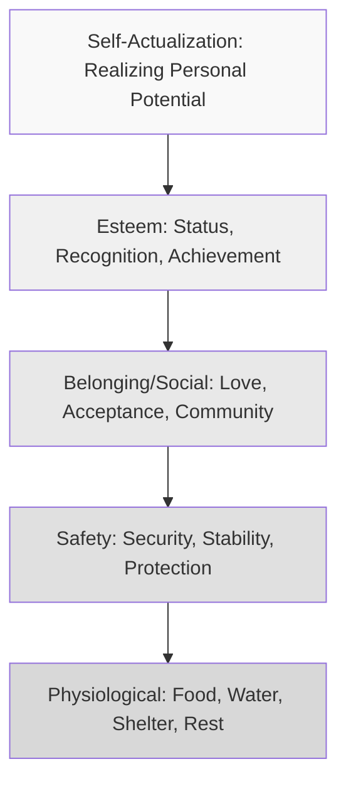

## Maslow's Hierarchy Applied to Consumption

### Definition and Theoretical Foundation

Maslow's Hierarchy of Needs, originally developed by psychologist Abraham Maslow (1943), proposes that human needs are organized into a structured hierarchy, typically depicted as a five-tier pyramid, ranging from basic physiological survival needs at the base to self-actualization at the peak. In consumer behavior, this framework provides a widely used structural model for categorizing *which* underlying need a product or marketing message addresses, and for understanding how consumers prioritize competing needs when allocating limited time, attention, and financial resources.

Maslow's original formulation proposed that lower-tier needs generally must be substantially satisfied before higher-tier needs become salient motivators, though later interpretations and Maslow's own later revisions treat this as a flexible tendency rather than a strict, universally sequential requirement.

### The Five-Tier Hierarchy

### Tier-by-Tier Breakdown with Marketing Applications

**1. Physiological Needs (Base Tier)**

- **Definition**: Fundamental biological survival requirements — food, water, sleep, shelter, warmth
- **Marketing Relevance**: Products directly addressing basic survival and bodily comfort, such as food and beverage brands, basic clothing, housing, and utilities
- **Example Appeals**: Advertising emphasizing nourishment, basic comfort, hunger satisfaction, or essential shelter/warmth

**2. Safety Needs**

- **Definition**: Needs for security, stability, protection from harm, financial security, and predictability
- **Marketing Relevance**: Insurance products, home security systems, financial services, health and wellness products, safe vehicles, and warranty/guarantee-based reassurance messaging
- **Example Appeals**: Advertising emphasizing protection, risk reduction, reliability, and long-term financial or physical security

**3. Belonging and Social Needs**

- **Definition**: Needs for love, friendship, social acceptance, community membership, and freedom from isolation
- **Marketing Relevance**: Social media platforms, communication technology, family-oriented products, social/community-based brands, dating services, and products marketed around shared experiences
- **Example Appeals**: Advertising emphasizing connection, togetherness, shared experience, and inclusion within a valued group

**4. Esteem Needs**

- **Definition**: Needs for self-respect, recognition, status, achievement, and respect from others; Maslow distinguished lower esteem needs (respect from others, status) from higher esteem needs (self-respect, mastery, confidence)
- **Marketing Relevance**: Luxury goods, status symbols, premium brands, achievement-oriented products (fitness technology, professional development tools), and prestige-signaling purchases
- **Example Appeals**: Advertising emphasizing exclusivity, achievement recognition, status elevation, and admiration from others

**5. Self-Actualization (Peak Tier)**

- **Definition**: The need to realize one's full personal potential, pursue self-fulfillment, creativity, and personal growth
- **Marketing Relevance**: Educational products, experiential travel, creative tools, personal development services, and brands positioned around authentic self-expression and purpose-driven living
- **Example Appeals**: Advertising emphasizing personal growth, authentic self-expression, creative fulfillment, and purpose beyond material or social validation

### Key Points

- **The hierarchy provides a categorization tool, not a strict behavioral law**: in applied marketing use, Maslow's tiers function primarily as a heuristic for identifying which class of underlying need a product or message is appealing to, rather than a precise predictive model of sequential consumer behavior
- **Products Can Appeal to Multiple Tiers Simultaneously**: many products are marketed with appeals spanning several tiers at once (e.g., a smartphone marketed simultaneously on functional utility [safety/physiological-adjacent], social connectivity [belonging], and status signaling [esteem]), and effective positioning often deliberately layers these appeals
- **Strict Sequential Progression Is Contested**: while Maslow's original theory suggested lower needs generally must be substantially met before higher needs become motivationally salient, real-world consumer behavior frequently contradicts strict sequencing — individuals facing financial or safety insecurity often still purchase esteem or belonging-oriented products (e.g., prioritizing a smartphone or social experience despite economic constraint), a widely noted critique of rigid hierarchical application [Inference: the degree to which real-world purchase behavior follows strict sequential prioritization versus parallel, context-dependent need pursuit is a long-standing debate in consumer psychology, without a single settled resolution]
- **Cultural and Individual Variation**: Maslow's hierarchy was developed within a Western, individualist psychological tradition; cross-cultural research has questioned the universality of the hierarchy's specific ordering, particularly regarding the relative prioritization of belonging/collective needs versus individual esteem/self-actualization needs in more collectivist cultural contexts [Unverified: the precise degree of cross-cultural variation in need hierarchy ordering remains an active area of cross-cultural psychology research with mixed findings across studies]
- **Useful for Segmentation and Positioning Strategy**: despite theoretical critiques, the hierarchy remains widely used in applied marketing as a practical framework for segmenting audiences by dominant motivational driver and for crafting messaging that aligns with a target segment's most salient need tier

### Practical Applications in Marketing

- **Need-Based Market Segmentation**: Marketers segment audiences based on which need tier is most salient for a given product category or life stage (e.g., young professionals prioritizing esteem/status purchases versus new parents prioritizing safety/security purchases)
- **Message Tier Escalation in Category Advertising**: Categories with low differentiation on functional/physiological grounds often shift advertising emphasis upward through the hierarchy toward esteem or self-actualization appeals to create meaningful differentiation (a common strategy once basic functional parity is achieved across competitors)
- **Brand Positioning Strategy**: Premium and luxury brands frequently position primarily around esteem and self-actualization tiers (status, personal identity, self-expression) even when the underlying product category (e.g., beverages, apparel) could be marketed at the purely physiological or safety tier
- **Life-Stage and Situational Marketing**: Products are often marketed differently depending on which need tier is contextually salient for the target audience's life circumstances (e.g., insurance marketed on safety needs to new parents, but on esteem/legacy needs to older, wealthier segments)
- **Crisis and Recession-Era Marketing Shifts**: During periods of economic or safety insecurity, marketing across many categories often shifts messaging emphasis downward toward safety and physiological reassurance, even for products traditionally positioned at higher tiers [Inference: this directional shift is a commonly observed practitioner pattern during economic downturns, though its consistency and magnitude vary by category and specific economic conditions]

### Example

An athletic shoe brand markets the same core product differently across campaigns to appeal to different need tiers: a budget-line campaign emphasizes durability and foot protection during exercise (safety/physiological appeal), a mid-tier campaign emphasizes joining a community of runners and shared achievement (belonging and esteem appeal), and a premium limited-edition release emphasizes personal athletic mastery, individual potential, and pushing one's own limits (self-actualization appeal) — demonstrating how a single product category can be strategically positioned across multiple tiers of Maslow's hierarchy depending on the target segment and price tier.

### Critiques and Boundary Conditions

- **Lack of Strong Empirical Validation for Strict Hierarchy**: subsequent psychological research has found limited consistent empirical support for a strictly sequential, universal need hierarchy as originally proposed, with many studies finding needs are pursued more flexibly and in parallel than Maslow's model implies
- **Overapplication Risk in Marketing Practice**: because the framework is intuitive and easy to communicate, it is sometimes applied in marketing strategy in an oversimplified way that treats it as a precise, validated behavioral model rather than the loosely structured heuristic it functions as in contemporary psychological understanding
- **Alternative and Competing Need Models**: contemporary motivation psychology often favors alternative frameworks — such as Self-Determination Theory (autonomy, competence, relatedness) or the more flexible, non-hierarchical "Fundamental Motives" framework — as offering more empirically grounded and less rigidly sequential explanations of human motivation, though Maslow's hierarchy remains dominant in applied marketing education due to its intuitive clarity and structural usefulness for segmentation
- **Cultural Universality Remains Contested**: as noted, the specific ordering and relative weighting of needs (particularly individual esteem versus collective belonging) may not generalize uniformly across all cultural contexts, warranting caution when applying the hierarchy without local market adaptation

### Related Topics

- Drive theory and need arousal
- Self-Determination Theory (autonomy, competence, relatedness)
- Need-based market segmentation strategies
- Status consumption and conspicuous consumption theory
- Involvement theory and purchase decision complexity
- Cross-cultural consumer behavior variation
- Brand positioning and value proposition design
- Life-stage and situational marketing strategy