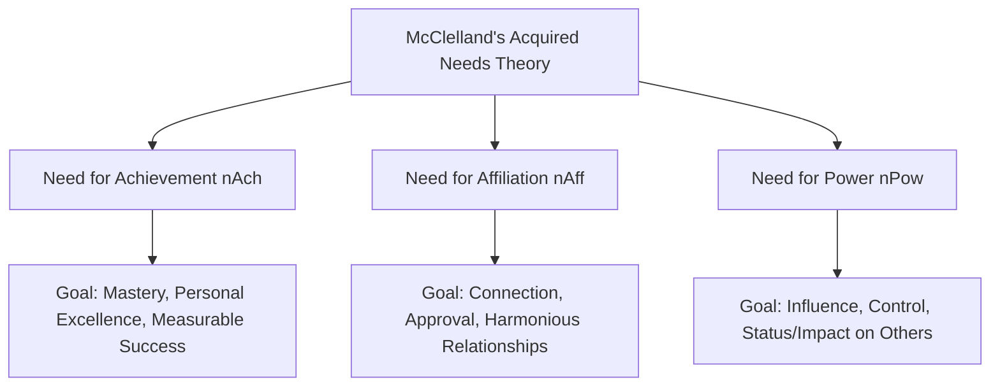

## McClelland's Needs and Consumer Goal-Setting

### Definition and Theoretical Foundation

David McClelland's **Acquired Needs Theory** (also called Three Needs Theory or Learned Needs Theory), developed primarily in the 1960s, proposes that individuals develop three core psychological needs through life experience and socialization rather than innate biological drives: the **need for achievement (nAch)**, **need for affiliation (nAff)**, and **need for power (nPow)**. Unlike Maslow's hierarchical model, McClelland's theory holds that these needs coexist in every individual simultaneously, but with varying relative strength, and this individual variation in dominant need shapes goal orientation, consumption motivation, and responsiveness to different marketing appeals.

McClelland originally used the **Thematic Apperception Test (TAT)**, a projective psychological measure, to assess relative need strength by analyzing the themes individuals generated in response to ambiguous imagery — a method later influential in motivation-based market research techniques.

### The Three Acquired Needs

### Need for Achievement (nAch)

**Definition**: The drive to excel, accomplish challenging goals, and achieve standards of excellence, typically accompanied by a preference for moderate, calculated risk (tasks with achievable but meaningful difficulty) and a strong desire for concrete performance feedback.

**Key Characteristics**:

- Preference for tasks of **moderate difficulty** (neither too easy, offering no sense of accomplishment, nor impossibly hard, offering no realistic chance of success)
- Strong desire for clear, measurable feedback on performance
- Tendency toward personal responsibility for outcomes rather than reliance on luck or others

**Marketing Relevance**:

- High-nAch consumers respond well to products and messaging emphasizing self-improvement, measurable progress, skill mastery, and personal accomplishment
- Fitness tracking technology, professional development products, educational courses, and performance-oriented products (sports equipment, productivity tools) frequently target this need
- Advertising appeals often emphasize personal bests, quantifiable progress metrics, and individual mastery narratives

### Need for Affiliation (nAff)

**Definition**: The drive to establish, maintain, and restore warm, close, cooperative relationships with others, along with a strong desire for social approval and harmonious interpersonal interactions.

**Key Characteristics**:

- Preference for collaborative rather than competitive contexts
- Sensitivity to social approval and concern about relational conflict
- Tendency to prioritize group harmony and belonging in decision-making

**Marketing Relevance**:

- High-nAff consumers respond well to products and messaging emphasizing social connection, shared experiences, community belonging, and relational warmth
- Social media platforms, family and household products, communication technology, and experience-based products marketed around togetherness (dining, travel, social events) frequently target this need
- Advertising appeals often emphasize group belonging, friendship, family connection, and shared celebration

### Need for Power (nPow)

**Definition**: The drive to influence, control, or have an impact on others and one's environment, often expressed through a desire for status, recognition, and the ability to direct outcomes.

**Key Characteristics**:

- McClelland further distinguished **personalized power** (self-serving dominance and control) from **socialized power** (influence exercised for collective or organizational benefit)
- High-nPow individuals often seek visibility, prestige, and positions that allow them to direct or influence others or outcomes

**Marketing Relevance**:

- High-nPow consumers respond well to products and messaging emphasizing status, exclusivity, leadership, influence, and visible distinction from others
- Luxury goods, executive-oriented products, leadership development programs, and premium/prestige brand positioning frequently target this need
- Advertising appeals often emphasize command, exclusivity, being "in charge," and visible markers of elevated status

### Key Points

- **All three needs coexist within every individual, but with varying relative dominance**: unlike Maslow's sequential hierarchy, McClelland's model does not propose that one need must be satisfied before another becomes active; instead, marketers segment audiences by which need tends to be relatively dominant for a given individual or consumption context
- **Need Dominance Can Be Context-Dependent**: the same individual may exhibit achievement-driven motivation in a professional/fitness context while exhibiting affiliation-driven motivation in a family/social consumption context, meaning need dominance is often product-category- or situation-specific rather than a single fixed personality trait governing all purchases [Inference: the degree of cross-situational consistency versus context-dependence in dominant need expression is a nuanced area of trait versus state motivation research]
- **Goal-Setting Implications**: nAch is particularly directly tied to consumer goal-setting behavior, since high-achievement-motivated consumers are more likely to set specific, measurable personal consumption or usage goals (e.g., fitness targets, savings targets, skill-building milestones) and to respond to products that support structured progress tracking toward those goals
- **Risk Preference Varies by Need**: nAch is associated with moderate risk preference (calculated challenge), which has implications for how achievement-motivated consumers respond to financial products, new product trial, and challenge-based marketing (e.g., "30-day challenges")
- **Complementary to, not Replacing, Other Motivation Frameworks**: McClelland's theory is often used alongside Maslow's hierarchy and drive theory in applied consumer psychology, offering a complementary lens focused specifically on socially and psychologically acquired motivational drivers rather than a general structural or physiological account of needs

### Practical Applications in Marketing

- **Psychographic Segmentation**: Marketers use McClelland's framework (often alongside broader psychographic and personality-based segmentation tools) to identify and target audience segments by dominant need, tailoring messaging tone and content accordingly
- **Goal-Setting and Progress-Tracking Product Design**: Products targeting high-nAch consumers frequently incorporate explicit goal-setting features, milestone tracking, and achievement badges/rewards (e.g., fitness apps, language-learning platforms, financial savings tools) to align with the achievement-oriented preference for measurable, incremental progress
- **Community and Social Features in Product Design**: Products targeting high-nAff consumers frequently emphasize community-building features, social sharing, group challenges, and relationship-oriented messaging (e.g., social fitness platforms emphasizing group support over individual competition)
- **Prestige and Exclusivity Positioning**: Products targeting high-nPow consumers frequently emphasize exclusivity, limited access, executive/leadership framing, and visible status markers (e.g., invitation-only membership tiers, premium executive product lines)
- **Advertising Appeal Customization**: The same underlying product benefit can be reframed across different campaign executions to appeal to different dominant needs — for example, a financial planning service might emphasize "achieve your personal financial milestones" (nAch appeal), "provide security and togetherness for your family" (nAff appeal), or "build the wealth and influence to lead on your own terms" (nPow appeal)
- **B2B and Executive Marketing**: In B2B and premium/executive-targeted marketing, nPow-oriented appeals (leadership, influence, control over outcomes) are frequently emphasized given the target audience's professional context and typical role-based motivational profile

### Example

A financial technology company offers a single core savings product but runs three distinct ad campaigns targeting different customer segments. One campaign, targeting young professionals building career momentum, emphasizes hitting specific savings milestones and tracking measurable financial progress (nAch appeal, with visual progress bars and milestone celebrations). A second campaign, targeting families, emphasizes building a secure, shared financial future together and saving for family experiences (nAff appeal, with imagery of family togetherness). A third campaign, targeting high-net-worth individuals, emphasizes exclusive wealth management access and the influence that comes with financial independence (nPow appeal, with premium, executive-oriented messaging) — demonstrating how a single product can be positioned across all three McClelland need dimensions for different audience segments.

### Measurement and Research Applications

- **Thematic Apperception Test (TAT) and Projective Techniques**: McClelland's original methodology using ambiguous imagery to elicit need-revealing narrative responses has influenced qualitative and projective market research techniques used to uncover underlying motivational drivers that consumers may not directly articulate in standard surveys
- **Content Analysis of Consumer Narratives**: Applied consumer research sometimes analyzes the thematic content of consumer-generated content (reviews, social posts, brand narratives) for achievement, affiliation, or power-related language to infer segment-level motivational tendencies [Inference: the reliability and validity of this specific applied extension of TAT-style content analysis to consumer-generated digital content is not as extensively validated in peer-reviewed literature as the original clinical/organizational applications of the theory]

### Critiques and Boundary Conditions

- **Originally Developed for Organizational/Workplace Motivation, Not Consumer Behavior**: McClelland's theory was originally formulated and validated primarily in organizational and entrepreneurial motivation research; its extension to consumer marketing segmentation, while widely practiced, is an applied adaptation rather than the theory's original empirical domain [Inference: the direct empirical validation of McClelland's specific need categories as applied to consumer purchase behavior segmentation is less extensive than its validation in organizational psychology contexts]
- **Measurement Challenges Outside Clinical Settings**: The original TAT-based measurement approach is resource-intensive and requires trained interpretation, making direct, rigorous measurement of McClelland's needs difficult to scale in standard commercial market research, which often relies on simplified proxy measures instead
- **Overlap with Other Trait and Motivation Frameworks**: nAch, nAff, and nPow show conceptual overlap with dimensions from other personality and motivation models (e.g., Big Five traits, Self-Determination Theory's competence/relatedness/autonomy), and the degree of McClelland's model's unique explanatory contribution versus overlapping frameworks remains a subject of ongoing psychological debate
- **Individual Need Profiles May Be More Fluid Than Trait-Like**: as noted, dominant need expression may vary meaningfully by context and life stage rather than functioning as a fully stable individual trait, complicating static segmentation approaches that treat need dominance as fixed

### Related Topics

- Maslow's hierarchy applied to consumption
- Drive theory and need arousal
- Self-Determination Theory (autonomy, competence, relatedness)
- Psychographic and needs-based market segmentation
- Status consumption and conspicuous consumption theory
- Goal-setting theory and consumer progress tracking
- Gamification mechanics and achievement-based product design
- Projective techniques in qualitative market research