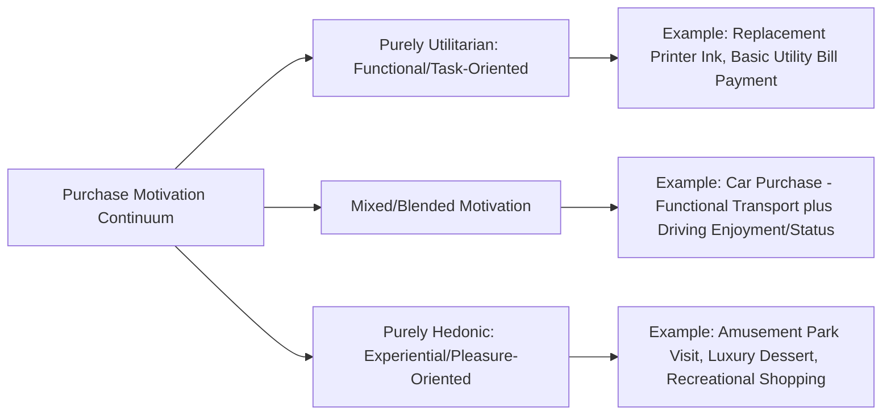

## Hedonic Versus Utilitarian Motivation

### Definition and Theoretical Foundation

Hedonic and utilitarian motivation represent two distinct dimensions along which consumer purchase and consumption behavior can be understood and predicted, based on the underlying type of value the consumer seeks from a product or experience. This distinction, extensively developed in consumer research (notably by Hirschman and Holbrook, and later Batra and Ahtola, among others), recognizes that consumption is driven not only by functional problem-solving but also by experiential, emotional, and sensory gratification, and that most real purchases involve some blend of both motivational dimensions rather than a purely one-or-the-other classification.

### Core Definitions

- **Utilitarian Motivation**: Consumption driven by functional, instrumental, and goal-oriented objectives — acquiring a product because it efficiently and effectively accomplishes a practical task or solves a specific problem. Utilitarian value is typically evaluated through cognitive, rational criteria: performance, efficiency, durability, and cost-effectiveness.
- **Hedonic Motivation**: Consumption driven by experiential, emotional, and sensory objectives — acquiring a product or experience for the pleasure, fun, fantasy, or sensory gratification it provides, independent of functional necessity. Hedonic value is typically evaluated through affective, experiential criteria: enjoyment, excitement, and emotional satisfaction.

### The Hedonic-Utilitarian Spectrum

### Key Distinguishing Characteristics

| Dimension | Utilitarian | Hedonic |
| --- | --- | --- |
| Primary Driver | Functional necessity, task completion | Pleasure, emotion, sensory experience |
| Evaluation Criteria | Objective performance, efficiency, cost | Subjective enjoyment, fun, aesthetic appeal |
| Cognitive Involvement | Higher deliberate, rational evaluation | Higher affective, experiential processing |
| Typical Purchase Trigger | Need recognition, problem-solving | Mood, desire for escapism/pleasure, impulse |
| Post-Purchase Evaluation | "Did it work well/efficiently?" | "Did it feel good/enjoyable?" |
| Guilt/Justification Tendency | Generally low; purchase is self-evidently justified | Can be higher; consumers may rationalize or feel guilt over indulgent purchases |

### Key Points

- **Most real purchases involve both dimensions simultaneously**: rather than a strict binary, most products and purchase decisions involve a blend of utilitarian and hedonic value in varying proportions, and the *relative weighting* of each dimension often shapes both the purchase decision process and the marketing strategy most likely to be effective
- **Different Cognitive Processing Routes**: utilitarian evaluation tends to engage more deliberate, analytical (System 2 / central-route) cognitive processing, while hedonic evaluation tends to engage more affective, intuitive (System 1 / peripheral-route) processing — connecting this distinction to dual-process models of cognition and persuasion
- **Guilt and Rationalization in Hedonic Purchases**: because hedonic consumption is not justified by objective necessity, consumers purchasing primarily hedonic goods sometimes experience anticipatory guilt or seek post-purchase rationalization (e.g., justifying a luxury purchase as "well-earned" or finding secondary functional justifications) — a well-documented pattern in hedonic consumption research
- **Category Norms Shape Expected Motivation Type**: certain product categories carry strong cultural or contextual expectations regarding which motivation type should dominate (e.g., insurance is expected to be evaluated primarily on utilitarian grounds; entertainment is expected to be evaluated primarily on hedonic grounds), and marketing that misaligns with category-expected motivation type can create dissonance or reduced credibility
- **Situational and Individual Variation**: the same product category can shift along the hedonic-utilitarian spectrum depending on purchase context (e.g., grocery shopping for weekly staples is typically utilitarian, while grocery shopping for a celebratory dinner can become significantly more hedonic) and individual differences in general shopping orientation (some consumers exhibit chronically higher hedonic shopping motivation regardless of category)
- **Hedonic Adaptation**: Pleasure derived from hedonic consumption tends to diminish over repeated exposure faster than the functional satisfaction derived from utilitarian consumption, a pattern related to the broader psychological concept of the "hedonic treadmill," with implications for repeat-purchase and product refresh strategies in hedonically-positioned categories

### Practical Applications in Marketing

- **Message Framing Alignment**: Utilitarian-positioned products are typically marketed with fact-based, comparative, and performance-oriented messaging (specifications, efficiency claims, cost-per-use calculations), while hedonically-positioned products are typically marketed with emotionally evocative, sensory-rich, and experience-focused messaging (imagery, mood, aspirational lifestyle framing)
- **Retail Environment Design**: Utilitarian-oriented retail formats (e.g., warehouse/discount stores, hardware stores) typically emphasize efficiency and ease of navigation, while hedonically-oriented retail formats (e.g., flagship experiential stores, specialty boutiques) typically emphasize atmosphere, sensory engagement, and browsing enjoyment — a distinction closely related to atmospherics and store environment research
- **Dual Appeal Positioning**: Many categories deliberately position products to satisfy both dimensions simultaneously (e.g., a premium kitchen appliance marketed both on functional performance specifications and on the pleasurable cooking experience it enables), broadening appeal across consumers with different dominant motivation orientations
- **Promotional Framing**: Price promotions on utilitarian products are typically framed around savings and value efficiency ("save $X"), while promotions on hedonic products are sometimes framed to preserve the indulgent, non-guilt-inducing experience (e.g., bundling or "treat yourself" framing rather than heavily emphasizing discount mechanics, which can undercut the hedonic experience by foregrounding a utilitarian, deal-seeking frame)
- **Cross-Selling and Bundling Strategy**: Utilitarian purchases are sometimes bundled with small hedonic add-ons (e.g., a "treat" or premium option at checkout) to introduce hedonic value into an otherwise purely functional transaction, a technique connected to impulse purchase and upselling research
- **Guilt-Mitigation Messaging**: Marketing for hedonic products sometimes incorporates functional justifications or self-care framing (e.g., positioning indulgent purchases as earned rewards or wellness investments) to help resolve the anticipatory guilt sometimes associated with purely pleasure-driven spending

### Example

A consumer purchasing a new laptop for basic work tasks (word processing, email, spreadsheets) is primarily driven by utilitarian motivation, evaluating options based on processing speed, battery life, price, and reliability, and the retailer's marketing correspondingly emphasizes technical specifications and value comparisons. A different consumer purchasing a high-end gaming laptop is driven by a blend of utilitarian motivation (processing power needed for gaming performance) and strong hedonic motivation (the immersive entertainment experience, aesthetic design, and status associated with a premium gaming setup), and the marketing for this product correspondingly blends technical specification claims with emotionally evocative imagery of immersive gameplay experience and community status among gaming peers.

### Measurement Approaches

- **Hedonic/Utilitarian Attitude Scales**: Established multi-item survey scales (such as those developed by Batra and Ahtola, and later Voss, Spangenberg, and Grohmann) are used in consumer research to empirically measure the relative hedonic and utilitarian components of attitude toward a specific product or brand
- **Behavioral and Physiological Proxies**: Some research uses purchase context variables (e.g., browsing time, unplanned purchase incidence, self-reported mood state at purchase) as behavioral proxies for the relative hedonic versus utilitarian orientation of a given shopping occasion [Inference: the precise reliability of specific behavioral proxies as indicators of underlying hedonic versus utilitarian motivation can vary by study design and product category]

### Critiques and Boundary Conditions

- **Binary Framing Can Oversimplify a Continuous, Multidimensional Construct**: while useful as an analytical lens, treating hedonic and utilitarian motivation as a simple single continuum can understate the more complex, multidimensional nature of consumer value perception, which some researchers argue involves additional distinct value dimensions (e.g., social value, epistemic/curiosity value) beyond this two-factor framing
- **Context-Dependency Complicates Fixed Product Classification**: because the same product can shift along the spectrum depending on purchase context and individual consumer state, treating specific product categories as permanently and exclusively "hedonic" or "utilitarian" oversimplifies real-world variability in motivation
- **Cultural Variation in Guilt and Indulgence Norms**: the degree to which hedonic consumption triggers guilt or requires rationalization varies across cultural contexts and individual value systems, meaning guilt-mitigation marketing strategies effective in one market may be unnecessary or miscalibrated in another [Unverified: the specific cross-cultural variation in hedonic consumption guilt has been studied in cross-cultural consumer research but precise comparative effect sizes are not fully standardized across the literature]

### Related Topics

- Dual-process models of cognition (System 1 vs. System 2)
- Elaboration Likelihood Model and central/peripheral persuasion routes
- Impulse buying and unplanned purchase behavior
- Store atmospherics and experiential retail design
- Status consumption and conspicuous consumption theory
- Post-purchase dissonance and rationalization
- Involvement theory and purchase decision complexity
- Emotional appeals versus rational appeals in advertising