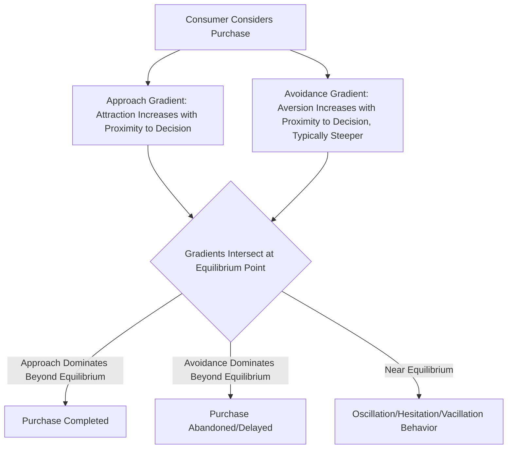

## Approach-Avoidance Conflict in Decisions

### Definition and Theoretical Foundation

Approach-avoidance conflict theory, rooted in Kurt Lewin's field theory and extensively developed by Neal Miller through experimental behavioral research, describes the psychological tension that arises when a single goal object or decision possesses both attractive (approach-inducing) and unattractive (avoidance-inducing) characteristics simultaneously. In consumer behavior, this framework explains the hesitation, ambivalence, and decision paralysis consumers often experience when a product or purchase offers genuine appeal alongside genuine drawbacks — a near-universal condition in real-world purchase decisions rather than an edge case.

Miller's experimental work identified that approach and avoidance tendencies both increase in strength as the individual gets psychologically or physically closer to the goal, but that **avoidance gradients are typically steeper than approach gradients** — meaning avoidance tendencies intensify more rapidly near the decision point than approach tendencies do, which has significant implications for understanding last-moment purchase hesitation and cart abandonment.

### The Three Classical Conflict Types

Lewin and Miller's broader conflict framework identifies three related conflict structures, all relevant to consumer decision-making:

1. **Approach-Approach Conflict**: Choosing between two equally attractive options (e.g., deciding between two appealing vacation destinations); generally the least psychologically distressing conflict type, often resolved relatively easily once either option is selected, since both outcomes are desirable
2. **Avoidance-Avoidance Conflict**: Choosing between two equally unattractive options (e.g., paying a high price or going without a needed repair); often experienced as highly stressful, sometimes resulting in decision avoidance or procrastination altogether
3. **Approach-Avoidance Conflict**: A single option or decision containing both attractive and unattractive elements simultaneously (e.g., a desirable product at an uncomfortably high price); the most psychologically complex and most extensively studied conflict type in consumer contexts, since nearly every meaningful purchase decision involves this structure to some degree

### The Approach-Avoidance Gradient Model

### Key Points

- **Avoidance Gradients Are Typically Steeper Than Approach Gradients**: Miller's foundational research found that as an individual gets closer to a conflicted goal, the aversive/avoidance component tends to intensify more sharply than the attractive/approach component — practically, this means consumers often feel *more* hesitant the closer they get to finalizing a purchase (e.g., at checkout) than the pull of the product's appeal alone would predict, explaining common late-stage purchase hesitation and cart abandonment
- **Oscillation Behavior Near the Equilibrium Point**: when approach and avoidance forces are roughly balanced, consumers often exhibit vacillation — approaching the decision, then retreating, then reconsidering — a pattern consistent with common consumer behaviors like repeatedly adding and removing items from a cart, or returning to compare a product multiple times before deciding
- **Reducing the Avoidance Gradient Is Often More Effective Than Increasing the Approach Gradient**: because avoidance forces tend to dominate near the decision point, marketing and purchase-flow interventions that specifically reduce perceived risk or discomfort close to the final decision (e.g., risk-reversal guarantees at checkout) can be more effective at converting hesitant consumers than further increasing the product's attractiveness alone [Inference: while this practical implication follows logically from the steeper-avoidance-gradient finding, its precise relative effectiveness compared to approach-strengthening tactics depends on the specific source and magnitude of the avoidance component in a given purchase context]
- **Common Sources of Approach Component**: desirable product benefits, emotional appeal, social validation, anticipated satisfaction, and hedonic/utilitarian value
- **Common Sources of Avoidance Component**: price/cost, perceived risk (financial, functional, social, or performance risk), effort/complexity, opportunity cost, post-purchase regret anticipation, and social disapproval concerns
- **Individual Differences in Conflict Sensitivity**: consumers vary in general risk aversion, loss sensitivity, and decision-making style, meaning the relative steepness of approach versus avoidance gradients is not uniform across all individuals or all product categories

### Practical Applications in Marketing

- **Risk-Reduction Strategies at the Decision Point**: Money-back guarantees, free trials, free returns, and transparent no-commitment policies are specifically designed to flatten the avoidance gradient near the final decision point, directly addressing the steeper-avoidance-near-the-goal dynamic identified in approach-avoidance research
- **Staged Commitment and Micro-Conversions**: Breaking a large, high-avoidance decision into smaller sequential commitments (e.g., free account creation before requesting payment details) reduces the perceived magnitude of avoidance at any single decision point, a technique connected to the foot-in-the-door persuasion principle
- **Social Proof and Testimonials Near Checkout**: Displaying reviews, trust badges, and social validation cues specifically at high-avoidance decision points (checkout pages, final confirmation screens) helps counteract intensifying avoidance forces at the moment they are strongest
- **Price Framing and Payment Structuring**: Techniques such as installment payment options, subscription models with low initial commitment, or reframing price as a smaller recurring cost rather than a single large upfront sum are designed to reduce the perceived magnitude of the price-driven avoidance component
- **Cart Abandonment Recovery**: Retargeting and cart-abandonment email campaigns often function specifically to re-strengthen the approach gradient (reminding the consumer of the product's appeal) after avoidance forces have caused the consumer to retreat from a near-complete purchase
- **Urgency and Scarcity as Approach-Strengthening Tools**: Limited-time offers and scarcity messaging are sometimes used to rapidly increase the approach gradient's slope near the decision point, intended to help the approach force overtake a competing avoidance force before the consumer fully retreats

### Example

A consumer is considering purchasing a premium ergonomic office chair. The chair's comfort, design, and long-term health benefits represent the approach component, growing more appealing as the consumer researches and imagines using it (approach gradient). However, as the consumer approaches the actual checkout page, the high price and the discomfort of a large one-time payment (avoidance component) intensify sharply, causing the consumer to abandon the cart despite genuine interest (avoidance gradient dominating near the decision point, consistent with the steeper-avoidance-gradient pattern). The retailer's cart-abandonment email later offers a 3-month interest-free payment plan (reducing the avoidance gradient's steepness) alongside a testimonial video reinforcing the chair's comfort benefits (reinforcing the approach gradient), successfully converting the consumer on a return visit.

### Related Conflict Structures in Consumer Contexts

- **Multiple Approach-Avoidance Conflict**: A more complex real-world variant in which a consumer must choose between two or more options, each possessing its own mixed set of attractive and unattractive features (e.g., choosing between several vacation packages, each with different combinations of desirable amenities and undesirable drawbacks), often producing more prolonged and effortful decision-making than a single approach-avoidance conflict
- **Post-Decisional Dissonance as a Related Downstream Phenomenon**: even after a decision is made and the approach-avoidance conflict is behaviorally resolved, consumers may continue to experience residual psychological tension related to the abandoned alternative's attractive features or the chosen option's drawbacks, connecting this framework to post-purchase cognitive dissonance theory

### Critiques and Boundary Conditions

- **Originally Derived from Animal and Simplified Laboratory Behavioral Research**: Miller's foundational gradient research was conducted using relatively simple experimental paradigms (including animal approach/avoidance behavior toward physical goal objects); the direct quantitative translatability of specific gradient steepness findings to complex, multi-attribute human consumer decisions is an extrapolation rather than a directly replicated finding in identical form [Inference: the qualitative pattern of steeper avoidance near the goal is widely cited and considered broadly applicable in consumer psychology, but precise quantitative gradient parameters from the original research do not directly transfer to modern purchase contexts]
- **Difficult to Precisely Measure in Applied Marketing Contexts**: while the conceptual framework is intuitive and widely used to explain phenomena like cart abandonment and purchase hesitation, precisely isolating and measuring the relative strength of approach versus avoidance components in a real consumer's decision process is methodologically challenging outside controlled experimental settings
- **Individual and Category Variation Limits Universal Application**: the relative steepness of approach and avoidance gradients, and the specific factors driving each, vary substantially by individual risk tolerance, product category, and purchase context, meaning generic risk-reduction tactics do not uniformly produce the same conversion improvement across all situations

### Related Topics

- Cart abandonment psychology and recovery strategies
- Perceived risk theory in consumer decision-making
- Post-purchase dissonance and cognitive dissonance theory
- Foot-in-the-door and staged commitment techniques
- Loss aversion and prospect theory
- Hedonic versus utilitarian motivation
- Scarcity and urgency in persuasion tactics
- Decision paralysis and choice overload