## Involvement Theory: High and Low Involvement

### Definition and Theoretical Foundation

Involvement theory describes the degree of personal relevance, perceived importance, and psychological engagement a consumer experiences toward a product, purchase decision, or communication message. Originally developed within advertising and consumer research (notably by Krugman in early work on media involvement, and later extensively elaborated by Petty and Cacioppo's Elaboration Likelihood Model and Zaichkowsky's Personal Involvement Inventory), involvement functions as a key moderating variable that determines how much cognitive effort a consumer invests in processing information, evaluating alternatives, and making a decision.

Involvement is generally understood not as a fixed trait but as a **situational and product-dependent state**, influenced by the interaction of the individual (personal relevance, needs, values), the object (product category risk, price, complexity), and the situation (purchase context, time pressure, social visibility of the decision).

### The Involvement Continuum

```mermaid
flowchart LR
    A[Low Involvement] --> B[Minimal Information Search]
    A --> C[Habitual/Routine Decision-Making]
    A --> D[Peripheral-Route Processing]
    E[High Involvement] --> F[Extensive Information Search]
    E --> G[Deliberate, Comparative Decision-Making]
    E --> H[Central-Route Processing]
    B --> I[Example: Routine Grocery Staple Purchase]
    F --> J[Example: Home, Vehicle, or Major Financial Purchase]
```

### Key Constructs

- **Involvement**: The perceived personal relevance of an object or decision based on inherent needs, values, and interests of the consumer relative to that object
- **Low Involvement**: A state of minimal perceived personal relevance or risk, typically associated with routine, low-cost, low-risk, or habitual purchases requiring little deliberate cognitive effort
- **High Involvement**: A state of significant perceived personal relevance or risk, typically associated with complex, high-cost, high-risk, or identity-relevant purchases requiring substantial deliberate cognitive effort
- **Enduring Involvement**: A relatively stable, long-term interest or engagement with a product category, independent of a specific purchase occasion (e.g., a car enthusiast's ongoing interest in automotive content, regardless of current purchase intent)
- **Situational Involvement**: Temporary, purchase-occasion-specific involvement, often triggered by an immediate need or decision context (e.g., heightened involvement when a current appliance breaks down and must be urgently replaced)

### Determinants of Involvement Level

- **Perceived Risk**: Financial, functional, social, physical, and psychological risk associated with the decision (higher perceived risk across any of these dimensions generally increases involvement)
- **Price and Cost**: Higher-cost purchases generally correlate with higher involvement, though this relationship is moderated by the consumer's financial situation and the perceived importance of the category
- **Product Complexity**: Products with more technical features, longer usage lifespans, or more complex comparison criteria tend to elicit higher involvement
- **Social Visibility**: Products that are publicly visible or symbolically expressive of identity/status tend to elicit higher involvement due to social risk considerations
- **Personal Relevance to Values and Self-Concept**: Products closely tied to a consumer's self-identity, values, or important life goals elicit higher involvement regardless of price (e.g., ethically-sourced products for a values-driven consumer)
- **Time Pressure and Purchase Frequency**: Frequently repurchased, low-deliberation-window products tend to remain low involvement through habit formation, even if the category could theoretically warrant more consideration

### Key Points

- **Involvement Determines the Cognitive Processing Route**: this is the central link to the Elaboration Likelihood Model — high involvement is associated with central-route processing (careful evaluation of message arguments and product attributes), while low involvement is associated with peripheral-route processing (reliance on simple heuristic cues like source attractiveness, brand familiarity, or emotional tone)
- **High Involvement Decisions Follow More Extended Decision-Making Processes**: high-involvement purchases typically proceed through more extensive stages of the classic consumer decision-making process (extended problem recognition, thorough information search, careful alternative evaluation), whereas low-involvement purchases often proceed through abbreviated or habitual decision processes with minimal deliberate search or evaluation
- **Low Involvement Does Not Mean No Influence, Only Different Influence Mechanisms**: low-involvement purchases remain highly susceptible to marketing influence, but through different mechanisms than high-involvement purchases — repetition (mere exposure effect), simple heuristic cues, in-store/shelf-level stimuli, and habit-reinforcing loyalty mechanics tend to dominate over detailed argument-based persuasion in low-involvement contexts
- **Involvement Can Shift Within a Single Purchase Journey**: a consumer's involvement level is not necessarily fixed throughout a decision process — situational triggers (e.g., a negative product experience, new information, social discussion) can temporarily elevate involvement in an otherwise typically low-involvement category, and vice versa
- **The Four-Quadrant Involvement/Think-Feel Framework (FCB Grid)**: A widely used applied model (developed by Vaughn at Foote, Cone & Belding) crosses the involvement dimension with a "think" (cognitive) versus "feel" (affective) dimension, producing four strategic quadrants — informative (high involvement/think), affective (high involvement/feel), habitual (low involvement/think), and self-satisfaction (low involvement/feel) — used to guide advertising strategy design by category type

### Practical Applications in Marketing

- **High-Involvement Category Strategy**: Advertising and content for high-involvement categories (real estate, automobiles, financial services, major appliances, healthcare decisions) typically emphasizes detailed information, comparative specifications, expert reviews, and substantive argumentation to support central-route deliberation, often supplemented by longer-form content (detailed websites, consultations, comparison tools)
- **Low-Involvement Category Strategy**: Advertising and content for low-involvement categories (many packaged goods, routine household items, impulse-purchase snacks) typically emphasizes simple, repeatable, attention-capturing execution — strong sensory branding, emotional tone, humor, and high-frequency repetition — since detailed argumentation is less likely to be deliberately processed
- **Point-of-Sale and Shelf Strategy for Low-Involvement Products**: Because low-involvement purchase decisions are often made quickly and habitually at the shelf, packaging distinctiveness, shelf placement, and promotional signage carry disproportionate influence compared to prior advertising exposure alone
- **Involvement-Elevation Tactics**: Marketers sometimes deliberately attempt to increase situational involvement in an otherwise low-involvement category (e.g., through emotionally compelling storytelling, cause-related marketing, or highlighting previously unconsidered risk factors) to justify premium positioning or encourage more deliberate brand consideration
- **Content Format Matching**: Involvement level informs appropriate content length and format — high-involvement decisions support long-form content (detailed guides, webinars, in-depth reviews), while low-involvement decisions favor short-form, easily processed content (short video, simple visual messaging)
- **Sales and Service Model Design**: High-involvement categories often justify higher-touch sales models (personal consultation, financing discussions, detailed needs assessment), while low-involvement categories typically rely on self-service or minimal-assistance retail models

### Example

A consumer purchasing laundry detergent (typically low involvement) makes the decision quickly at the shelf, relying primarily on brand familiarity built through repeated prior exposure and a simple positive association with the packaging, without extensively comparing ingredient lists or reading reviews — the marketing that most influenced this decision was likely prior repetitive advertising exposure and consistent shelf presence (peripheral-route influence). The same consumer purchasing a home mortgage (high involvement, given the financial magnitude and long-term commitment) instead engages in extensive research, compares interest rates and terms across multiple lenders, reads detailed reviews, and consults with a financial advisor before deciding — reflecting deliberate, central-route processing driven by the high perceived financial risk and personal significance of the decision.

### Measurement Approaches

- **Zaichkowsky's Personal Involvement Inventory (PII)**: A widely used, validated multi-item survey scale measuring perceived personal relevance of a product or decision, commonly applied in academic and applied consumer research to empirically classify involvement level for a given category or individual
- **Behavioral Proxies**: Information search duration, number of alternatives considered, time spent in the decision process, and price sensitivity are sometimes used as behavioral indicators of relative involvement level in applied market research [Inference: the reliability of specific behavioral proxies as precise measures of underlying psychological involvement can vary by product category and research context]

### Critiques and Boundary Conditions

- **Involvement Is Multidimensional, Not Strictly Unidimensional**: some researchers argue that treating involvement as a single low-to-high continuum oversimplifies what may be a multidimensional construct (e.g., cognitive involvement, affective involvement, and behavioral involvement may not always move in lockstep for a given decision)
- **Category-Level Generalizations Have Exceptions**: while broad category-level involvement classifications (e.g., "groceries are low involvement, cars are high involvement") are useful heuristics, individual consumer variation (enduring involvement, personal values, situational triggers) means these generalizations do not apply uniformly to every consumer or every purchase occasion within a category
- **Digital and Social Context May Be Shifting Traditional Involvement Patterns**: some researchers suggest that increased access to information, reviews, and social discussion for even traditionally low-involvement categories may be gradually elevating baseline involvement levels for some product types compared to earlier pre-digital consumer research [Speculation: this represents a plausible but not definitively established shift, and the magnitude and consistency of any such trend across categories has not been comprehensively established in the literature]

### Related Topics

- Elaboration Likelihood Model (central vs. peripheral persuasion routes)
- Consumer decision-making process stages
- Perceived risk theory in consumer decision-making
- Hedonic versus utilitarian motivation
- FCB Grid (think/feel and involvement strategic framework)
- Habitual purchase behavior and low-involvement heuristics
- Mere exposure effect and repetition
- Enduring versus situational involvement in product categories