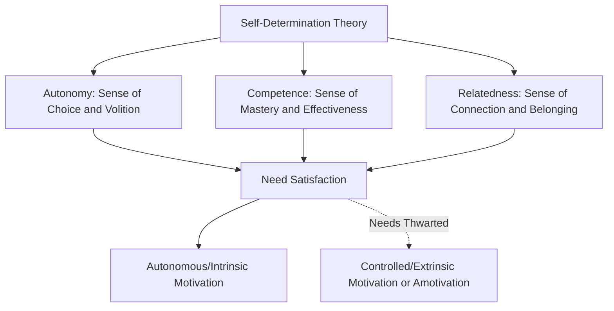

## Self-Determination Theory and Intrinsic Motivation

### Definition and Theoretical Foundation

Self-Determination Theory (SDT), developed primarily by Edward Deci and Richard Ryan beginning in the 1970s-1980s, is a macro-theory of human motivation proposing that individuals have three innate, universal psychological needs — **autonomy**, **competence**, and **relatedness** — whose satisfaction determines whether motivation is experienced as autonomous (self-directed, intrinsic) or controlled (externally pressured, extrinsic), with significant downstream effects on engagement quality, persistence, wellbeing, and satisfaction. In consumer behavior, SDT offers a robust, empirically grounded framework for understanding why some purchases and brand relationships produce deep, sustained loyalty and satisfaction, while others produce only shallow, extrinsically-driven compliance that is highly vulnerable to competitive switching.

### The Three Basic Psychological Needs

**Autonomy**: The need to experience one's actions as self-endorsed, volitional, and freely chosen, rather than coerced or externally pressured — even when performing a required or externally suggested action, autonomy is preserved when the individual experiences genuine personal endorsement of the behavior.

**Competence**: The need to feel effective, capable, and able to achieve desired outcomes when interacting with one's environment — the need to experience mastery and growth in one's capabilities.

**Relatedness**: The need to feel connected to, cared for by, and belonging with others — the need for meaningful interpersonal bonds and a sense of community.

### The Motivation Continuum: Intrinsic to Extrinsic to Amotivation

SDT distinguishes motivation not simply as present or absent, but along a continuum of increasing **self-determination** (autonomy):

| Motivation Type | Regulatory Style | Description | Marketing/Consumer Example |
| --- | --- | --- | --- |
| Amotivation | None | No perceived value or intention to act | Complete disengagement from a category or brand |
| External Regulation | Controlled | Behavior driven purely by external rewards/punishments | Purchasing only due to a discount or coupon |
| Introjected Regulation | Controlled | Behavior driven by internal pressure, guilt, or ego-involvement | Buying a gift out of obligation or fear of social judgment |
| Identified Regulation | Autonomous | Behavior valued as personally important, even if not inherently enjoyable | Buying vitamins because health is personally valued |
| Integrated Regulation | Autonomous | Behavior fully aligned with one's core values and identity | Choosing sustainable products because it reflects core personal values |
| Intrinsic Motivation | Autonomous | Behavior performed purely for inherent enjoyment/satisfaction | Engaging with a hobby-related product purely for the pleasure of the activity itself |

### Key Points

- **Intrinsic Motivation Is Distinct From, and Generally More Durable Than, Extrinsic Motivation**: intrinsically motivated engagement (pursued for its own inherent satisfaction) tends to produce deeper, more persistent engagement and satisfaction compared to purely extrinsically motivated engagement (pursued for separable external outcomes like discounts or rewards), which tends to be more fragile and contingent on the continued presence of the external incentive
- **The Overjustification Effect**: a well-documented SDT-related finding is that introducing strong external rewards for a behavior that was previously intrinsically motivated can, in some cases, undermine the original intrinsic motivation — once the external reward is removed, engagement can drop below its original pre-reward baseline, since the individual's self-perceived reason for engaging shifts from internal enjoyment to external reward-seeking [Inference: while the overjustification effect is well-documented in foundational psychological research, its magnitude and consistency in applied, real-world commercial loyalty and rewards contexts varies by study and program design]
- **Need Satisfaction Predicts Wellbeing and Persistence, Not Just Behavior**: SDT's distinctive contribution is linking motivation quality not just to whether a behavior occurs, but to the quality of engagement, psychological wellbeing, and long-term persistence associated with it — autonomously motivated consumption is associated with greater satisfaction and lower regret than purely controlled/extrinsically motivated consumption
- **All Three Needs Operate Simultaneously and Are Considered Universal**: SDT proposes that autonomy, competence, and relatedness needs apply across individuals and cultures (though the specific behavioral expression of need satisfaction may vary culturally), distinguishing SDT from more culturally-specific or individually-variable trait models
- **Controlling Marketing Tactics Can Backfire**: marketing or loyalty tactics that consumers perceive as manipulative, pressuring, or overly controlling (e.g., aggressive urgency tactics, guilt-based messaging) can undermine autonomy satisfaction, potentially producing reactance or reduced genuine engagement even if they succeed in driving a short-term transaction

### Practical Applications in Marketing

- **Autonomy-Supportive Marketing**: Providing genuine choice, transparent information, and non-coercive framing (rather than high-pressure tactics or manipulative urgency) supports autonomy satisfaction, associated with more durable, positive brand relationships; examples include customizable products, opt-in (rather than opt-out) structures, and clear, non-manipulative communication
- **Competence-Supportive Product and Brand Design**: Products and services that help consumers feel effective, skilled, and capable — through clear onboarding, achievable milestones, constructive feedback, and well-designed usability — support competence satisfaction; examples include software with well-designed learning curves, fitness apps with achievable progressive goals, and educational products with clear mastery pathways
- **Relatedness-Supportive Brand Community Building**: Brand communities, user forums, social features, and brand engagement that foster genuine connection (whether to the brand itself or to fellow consumers) support relatedness satisfaction; examples include user communities, co-creation initiatives, and brand events fostering shared identity
- **Loyalty Program Design Considerations**: SDT suggests loyalty programs relying purely on extrinsic financial rewards risk cultivating only controlled, discount-contingent loyalty (vulnerable to competitive switching whenever a better deal appears), whereas programs incorporating elements supporting autonomy (member choice/customization), competence (status progression, skill-building content), and relatedness (community features) may cultivate more durable, autonomously-motivated brand loyalty [Inference: this application of SDT to loyalty program design is a widely discussed strategic implication in applied marketing literature, though direct comparative empirical validation of specific program design choices against pure discount-based programs is more limited than SDT's foundational psychological research base]
- **Content Marketing and Branded Experience Design**: Branded content, tutorials, and experiences that genuinely help consumers build skill or understanding (competence) rather than purely pushing transactional messaging can support more autonomous, intrinsically-satisfying brand relationships
- **Avoiding Manipulative Persuasion Tactics**: Because perceived coercion undermines autonomy satisfaction, SDT provides a psychological rationale for favoring transparent, non-manipulative marketing practices over high-pressure or dark-pattern tactics, which risk generating reactance and long-term brand resentment even when they produce short-term conversion gains

### Example

A fitness subscription app can be designed in two contrasting ways reflecting SDT principles. One version relies primarily on extrinsic mechanics: streak-based guilt messaging ("Don't break your streak!"), aggressive push notifications, and discount-based renewal incentives — producing engagement that is largely controlled and contingent on continued external pressure, with high churn once the pressure eases or a competitor offers a better deal. An alternative version supports all three basic needs: offering flexible, self-directed workout choices (autonomy), a well-designed progressive skill and achievement system with constructive feedback (competence), and an active community feature connecting users with similar goals (relatedness) — producing more autonomously motivated engagement, generally associated with greater satisfaction, persistence, and resistance to competitive switching, consistent with SDT's core predictions.

### SDT in Relation to Other Motivation Frameworks

- **Maslow's Hierarchy of Needs (complementary but distinct)**: while both frameworks propose universal underlying needs, Maslow's hierarchy is structured sequentially by need tier and dominance, whereas SDT's three needs are proposed to operate simultaneously and continuously across all activities, offering a more process-oriented (how motivation quality forms) rather than purely content-oriented (which need category is active) framework
- **McClelland's Acquired Needs Theory (complementary but distinct)**: McClelland's needs (achievement, affiliation, power) describe individually varying learned motivational dispositions, whereas SDT's three needs are proposed as universal psychological requirements for wellbeing regardless of individual disposition — competence in SDT is related to, but conceptually distinct from, McClelland's achievement motivation
- **Gamification and Behavioral Design**: SDT is one of the most frequently cited psychological frameworks underlying contemporary gamification design principles, given its direct, actionable mapping to product features (choice/customization for autonomy, progression/mastery systems for competence, social features for relatedness)

### Critiques and Boundary Conditions

- **Overjustification Effect Findings Are Not Universally Consistent**: while foundational, the overjustification effect has produced mixed results across different experimental conditions and reward structures in subsequent research, and its applicability to specific commercial loyalty and rewards program contexts (as opposed to controlled laboratory tasks) requires caution in direct extrapolation [Unverified: precise conditions under which extrinsic marketing rewards meaningfully undermine intrinsic brand engagement, versus simply adding complementary extrinsic value without undermining existing intrinsic motivation, remain debated and context-dependent in applied marketing research]
- **Difficult to Fully Isolate in Applied Commercial Contexts**: most real consumer behavior involves complex, blended motivational profiles that are difficult to cleanly categorize along the SDT continuum using standard commercial market research tools, unlike the more controlled conditions of foundational SDT laboratory research
- **Cultural Universality Claims Are Debated**: while SDT proposes the three basic needs are universal, the specific behaviors and contexts through which autonomy, competence, and relatedness are satisfied can vary meaningfully across cultures, and some cross-cultural researchers have questioned whether autonomy in particular carries equivalent motivational weight across more individualist versus collectivist cultural contexts [Unverified: this remains a genuinely contested question in cross-cultural psychological research, with findings varying across specific studies and cultural comparisons]

### Related Topics

- Maslow's hierarchy applied to consumption
- McClelland's needs and consumer goal-setting
- Gamification mechanics and achievement-based product design
- Operant conditioning and reinforcement schedules
- Loyalty program design and reward structure
- Reactance theory and resistance to persuasion
- Brand community and relatedness-driven engagement
- Overjustification effect and extrinsic reward risks