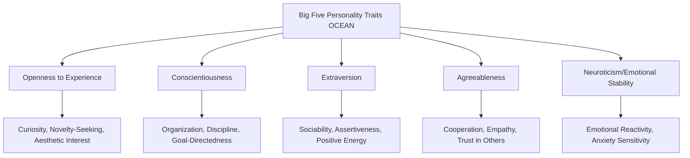

## Trait Theories of Personality in Consumer Research

### Definition and Theoretical Foundation

Trait theories of personality propose that individuals possess relatively stable, enduring psychological characteristics (traits) that predispose them to consistent patterns of thought, feeling, and behavior across situations and over time. In consumer research, trait theory provides a foundational framework for understanding and predicting individual differences in brand preference, purchase behavior, media consumption, and responsiveness to different marketing appeals, based on the premise that personality traits — measurable, relatively stable dispositions — meaningfully correlate with consumption patterns.

Unlike psychoanalytic or motivational approaches that emphasize unconscious drives, trait theory takes a **nomothetic**, quantitative approach, seeking to identify a limited set of core dimensions along which all individuals can be measured and compared, typically through structured, validated psychometric instruments.

### The Big Five (Five-Factor Model) — The Dominant Contemporary Trait Framework

**Openness to Experience**: Reflects curiosity, imagination, aesthetic sensitivity, and preference for novelty and variety over convention and routine.

- *Consumer Relevance*: High-openness consumers tend to show greater interest in innovative products, artistic/creative brands, experiential purchases, and early adoption of new technologies or trends

**Conscientiousness**: Reflects self-discipline, organization, goal-directed behavior, and preference for planned, structured approaches over spontaneity.

- *Consumer Relevance*: High-conscientiousness consumers tend to engage in more deliberate pre-purchase research, respond well to organizational and productivity-oriented products, and show stronger brand loyalty once a trusted choice is established

**Extraversion**: Reflects sociability, assertiveness, positive emotional expressiveness, and preference for social stimulation over solitude.

- *Consumer Relevance*: High-extraversion consumers tend to respond well to socially-oriented products, group experiences, and status-visible purchases, and are more likely to be influenced by social proof and peer recommendation

**Agreeableness**: Reflects cooperativeness, empathy, trust, and a tendency toward warmth and consideration for others over competitiveness or skepticism.

- *Consumer Relevance*: High-agreeableness consumers tend to respond well to cause-related marketing, community-oriented brands, and ethically/socially positioned products, and are generally more receptive to relationship-based sales approaches

**Neuroticism (Emotional Stability, inversely)**: Reflects emotional reactivity, anxiety sensitivity, and vulnerability to stress versus calm emotional stability.

- *Consumer Relevance*: High-neuroticism consumers tend to be more responsive to risk-reduction messaging (guarantees, safety assurances), more sensitive to fear-based appeals, and may show more variable, mood-dependent purchase behavior

### Key Points

- **Traits Predict General Tendencies, Not Deterministic Behavior**: trait-behavior correlations in consumer research are typically modest to moderate in strength rather than strongly deterministic, reflecting the broader psychological understanding that personality is one of many interacting influences (situational, social, economic) on any specific purchase decision
- **The Big Five Has Largely Superseded Earlier Trait Models in Contemporary Research**: while earlier consumer personality research (mid-20th century) often drew on other trait frameworks (e.g., Cattell's 16 Personality Factors, Eysenck's three-factor model), the Big Five/Five-Factor Model has become the dominant, most empirically validated framework in both general psychology and contemporary consumer research due to its robust cross-cultural replication and psychometric strength
- **Brand Personality as a Parallel, Related Construct**: trait theory's influence extends beyond describing consumers to describing brands themselves — Jennifer Aaker's **Brand Personality Framework** (Sincerity, Excitement, Competence, Sophistication, Ruggedness) applies trait-like dimensions to brands, and research on **self-congruity theory** examines how consumers prefer brands whose perceived personality aligns with their own actual or ideal self-concept
- **Trait-Based Segmentation Has Practical Limitations**: while conceptually appealing, using broad personality traits alone for market segmentation has historically shown only modest predictive power for specific purchase behavior compared to behavioral, demographic, or more narrowly-defined psychographic variables, a long-standing critique in applied consumer personality research
- **State-Trait Distinction Matters**: traits are theorized as relatively stable dispositions, but actual consumer behavior in any given moment is also influenced by transient situational states (mood, context, time pressure) that can override or moderate trait-based tendencies

### Historical Trait Frameworks in Consumer Research (Pre-Big Five Era)

- **Cattell's 16 Personality Factor Model (16PF)**: An earlier, more granular trait framework used in some mid-20th-century consumer personality studies, now largely superseded by the more parsimonious and better-validated Big Five model in contemporary research
- **Eysenck's PEN Model**: A three-factor model (Psychoticism, Extraversion, Neuroticism) that influenced early consumer personality research, particularly regarding extraversion's relationship to social and risk-related consumption behavior
- **Trait Theory's Early Critique in Marketing (Kassarjian and others)**: Foundational reviews in marketing academic literature during the 1970s-1980s (notably associated with researcher Harold Kassarjian) raised early concerns about weak and inconsistent trait-behavior correlations in applied consumer research, prompting a shift toward more context-specific, product-relevant personality measures rather than broad general traits alone

### Practical Applications in Marketing

- **Personality-Congruent Brand Positioning**: Brands often craft brand personalities and communication styles that appeal to specific trait profiles of their target segment (e.g., adventure and outdoor brands emphasizing appeals resonant with high-openness, high-extraversion consumers; financial services brands emphasizing appeals resonant with high-conscientiousness consumers)
- **Message Framing by Trait Profile**: Advertising appeals can be tailored to different dominant traits within a target audience — novelty and creative appeals for high-openness segments, social and status-oriented appeals for high-extraversion segments, risk-reduction and reassurance appeals for high-neuroticism segments
- **Product Design and Feature Prioritization**: Understanding the dominant trait profile of a target segment can inform product design decisions (e.g., highly customizable, exploratory features for high-openness users versus simplified, highly structured features for high-conscientiousness users)
- **Digital Advertising and Psychographic Targeting**: Contemporary digital advertising platforms sometimes incorporate personality-inferred targeting (based on behavioral and engagement data proxies for trait dimensions) to customize creative and messaging at scale, though the precision and ethical implications of such inference-based targeting remain actively debated
- **Sales and Service Interaction Style**: Personality trait understanding can inform customer service and sales interaction approaches (e.g., more relationship-focused, warm interaction styles for high-agreeableness customers versus more efficient, fact-focused interactions for lower-agreeableness, higher-conscientiousness customers)

### Example

An outdoor adventure gear brand analyzes its customer base and finds a disproportionate concentration of high-openness, high-extraversion trait profiles among its most engaged customers. The brand's marketing strategy correspondingly emphasizes novel, exploratory experiences (openness appeal) and social, shared-adventure imagery (extraversion appeal) rather than purely functional product specifications. In contrast, a home security company serving a customer base skewing higher in conscientiousness and neuroticism emphasizes reliability, thorough planning, and comprehensive risk reduction in its messaging, reflecting the different trait-relevant appeals likely to resonate with each distinct target audience.

### Measurement Approaches

- **Big Five Inventory (BFI) and NEO Personality Inventory (NEO-PI)**: Validated, widely used psychometric instruments for measuring the five core trait dimensions, used in both academic consumer research and, in adapted/shortened forms, in some applied market research contexts
- **Product-Specific Personality Scales**: Given the historical critique of weak general-trait-to-behavior correlations, some researchers advocate for developing or using more narrowly product- or category-specific personality measures (e.g., innovativeness scales, materialism scales) that show stronger predictive validity for specific consumption domains than broad general trait measures alone
- **Brand Personality Scale (Aaker, 1997)**: A validated instrument measuring the five brand personality dimensions (Sincerity, Excitement, Competence, Sophistication, Ruggedness), widely used in brand positioning and self-congruity research

### Critiques and Boundary Conditions

- **Modest Predictive Power for Specific Purchase Behavior**: a long-standing and well-documented critique in consumer research literature is that broad personality traits typically show only modest correlations with specific product choice or brand preference, compared to more direct behavioral, attitudinal, or narrowly-defined psychographic measures — general traits are often better predictors of broad lifestyle patterns than of specific transactional decisions
- **Situational and State Factors Can Override Trait Tendencies**: because actual purchase behavior is also shaped by immediate context, mood, and situational constraints, trait-based predictions represent probabilistic tendencies rather than reliable individual-level behavioral forecasts
- **Ethical Considerations in Psychographic Targeting**: the use of inferred personality trait data for algorithmic advertising targeting (particularly when inferred from behavioral data without explicit consumer awareness or consent) has raised significant privacy and ethical concerns, prominently highlighted by prior controversies involving unauthorized psychographic data use in political and commercial advertising contexts
- **Cross-Cultural Trait Structure Questions**: while the Big Five model has shown substantial cross-cultural replication, some researchers note residual questions about the universality of exact trait structure and relative importance across all cultural contexts, warranting some caution in directly exporting trait-based marketing strategies without local validation [Unverified: while cross-cultural replication of the Big Five is relatively well-supported compared to earlier trait models, the precise consistency of trait-behavior relationships specifically in consumer contexts across all cultures is less thoroughly established]

### Related Topics

- Brand personality and self-congruity theory
- Psychographic segmentation and lifestyle marketing
- Self-concept theory (actual vs. ideal self)
- Involvement theory: high and low involvement
- Materialism and consumer values research
- Innovativeness and early adopter behavior
- Ethical considerations in data-driven psychographic targeting
- Hedonic versus utilitarian motivation